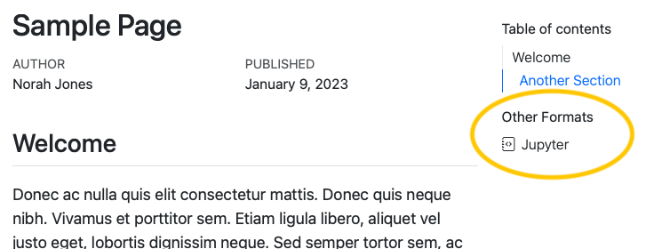

> **Quarto 1.3 Feature**
>
> This post is part of a series highlighting new features in the 1.3 release of Quarto. Get the latest release the [download page](https://quarto.org/docs/download/)

Starting in Quarto 1.3, HTML pages (either standalone or in a website) can automatically include links to other formats specified in the document front matter. For example, the following document front matter:

``` yaml
title: Sample Page
author: Norah Jones
date: last-modified
toc: true
format: 
  html: default
  ipynb: default
```

Results in an HTML page that includes a link to the additional notebook format in the right margin below the table of contents:



If a table of contents is enabled for the page, the additional formats will be automatically placed within the table of contents as a new section. If no table of contents is displayed, the additional formats will be displayed in the right margin at the top of the document.

Links to additional formats are displayed by default, but you can control whether they are shown or even which specific formats are included with the `format-links` YAML option.

Read more about this feature on the [Multi-format page](https://quarto.org/docs/output-formats/html-multi-format.html) of the pre-release highlights.
