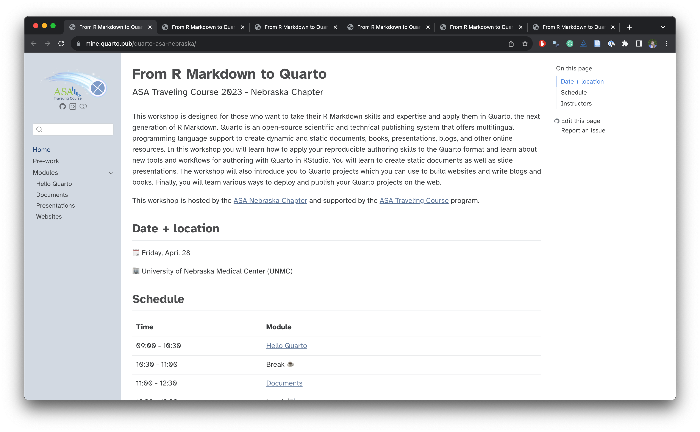
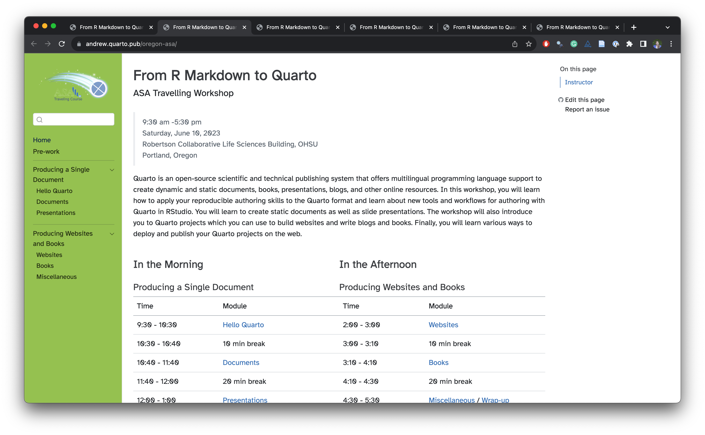
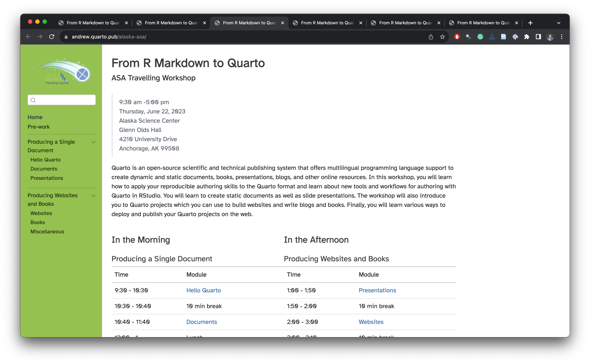
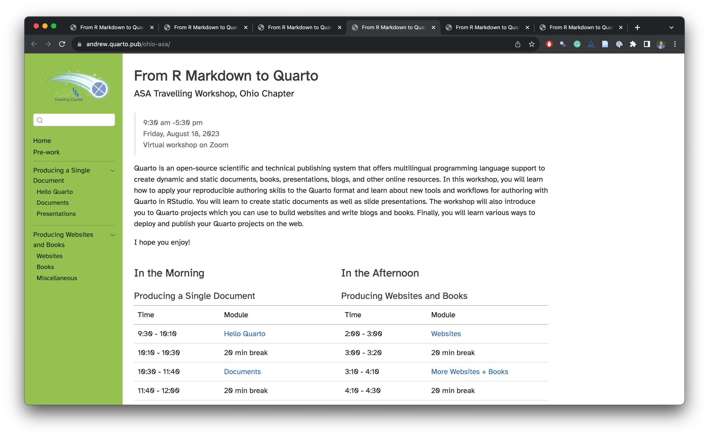
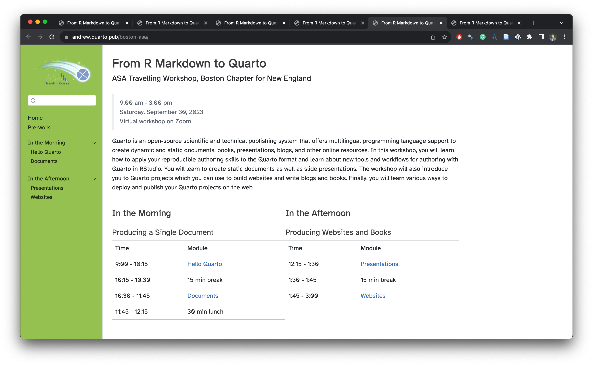
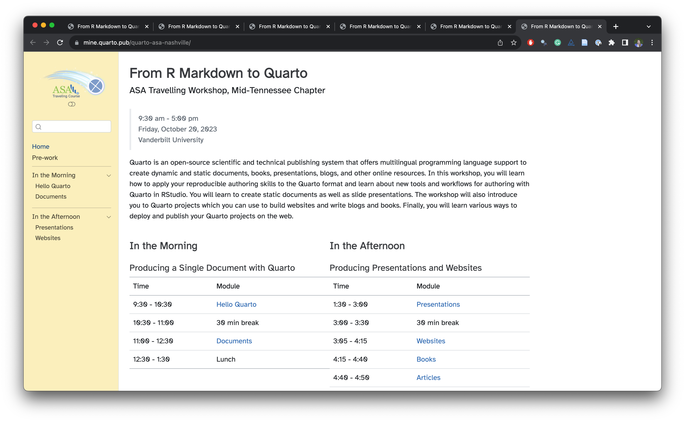

In 2023, [Dr. Andrew Bray](https://andrewpbray.github.io/) and I gave a series of six workshops on Quarto as part of the [Traveling Courses](https://community.amstat.org/coc/chapterresources/travelingcourse) program sponsored by the [American Statistical Association](https://www.amstat.org/).

The workshop was designed for those who want to take their R Markdown skills and expertise and apply them in Quarto, the next generation of R Markdown. Participants learned how to apply their reproducible authoring skills to the Quarto format and about new tools and workflows for authoring with Quarto in RStudio. The workshop covered creating static documents and presentations, building websites, and writing blogs and books. Finally, participants learned various ways to deploy and publish their Quarto projects on the web.

Home pages and links to source code for each of the six workshops are listed below:

<table>
<colgroup>
<col style="width: 50%" />
<col style="width: 50%" />
</colgroup>
<tbody>
<tr>
<td>Nebraska Chapter 
Omaha, Nebraska 
April 28, 2023 
<a href="https://mine.quarto.pub/quarto-asa-nebraska/">mine.quarto.pub/quarto-asa-nebraska</a> 
<a href="https://github.com/asa-quarto/website-nebraska/tree/nebraska-workshop">Source</a> 
</td>
<td></td>
</tr>
<tr>
<td>Oregon Chapter 
Portland, Oregon 
June 10, 2023 
<a href="https://andrew.quarto.pub/oregon-asa/">andrew.quarto.pub/oregon-asa</a> 
<a href="https://github.com/andrewpbray/quarto-asa/tree/oregon-chapter">Source</a> 
</td>
<td></td>
</tr>
<tr>
<td>Alaska Chapter 
Anchorage, Alaska 
June 20, 2023 
<a href="https://andrew.quarto.pub/alaska-asa/">andrew.quarto.pub/alaska-asa/</a> 
<a href="https://github.com/asa-quarto/website/tree/alaska-workshop">Source</a> 
</td>
<td></td>
</tr>
<tr>
<td>Ohio Chapter 
Virtual Workshop on Zoom 
August 18, 2023 
<a href="https://andrew.quarto.pub/ohio-asa/">andrew.quarto.pub/ohio-as</a> 
<a href="https://github.com/asa-quarto/website/tree/ohio-workshop">Source</a> 
</td>
<td></td>
</tr>
<tr>
<td>Boston Chapter 
Virtual Workshop on Zoom 
September 20, 2023 
<a href="https://andrew.quarto.pub/boston-asa/">andrew.quarto.pub/boston-asa</a> 
<a href="https://github.com/asa-quarto/website/tree/boston-workshop">Source</a> 
</td>
<td></td>
</tr>
<tr>
<td>Mid-Tennessee Chapter 
Nashville, Tennessee 
October 20, 2023 
<a href="https://github.com/asa-quarto/website/tree/nashville-workshop">mine.quarto.pub/quarto-asa-nashville</a> 
<a href="https://github.com/asa-quarto/website/releases/tag/nashville-workshop">Source</a> 
</td>
<td></td>
</tr>
</tbody>
</table>

One of the Quarto features we leveraged in organizing these materials is that you can publish to different QuartoPub URLs from the same repository with `quarto publish`. After each workshop, we created a release on GitHub to take a snapshot of the materials for that workshop, and for the subsequent workshop, we made edits to the materials on the `main` branch and published them to a new URL.

The source code for everything can be found at [github.com/asa-quarto/website](https://github.com/asa-quarto/website). Also in the GitHub organization is a repo containing the "your turn" exercises for the workshops: [github.com/asa-quarto/exercises](https://github.com/asa-quarto/exercises).

All materials are released with Creative Commons Attribution-ShareAlike 4.0 International license. If you are teaching a Quarto workshop, feel free to reuse any and all of these materials. And if you're learning Quarto, you might find it helpful to follow along with any of the workshops listed above.

Happy learning and happy teaching!
