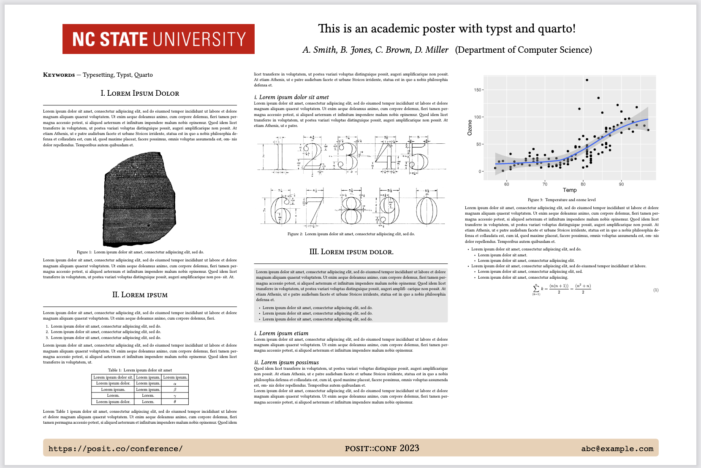
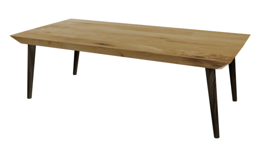
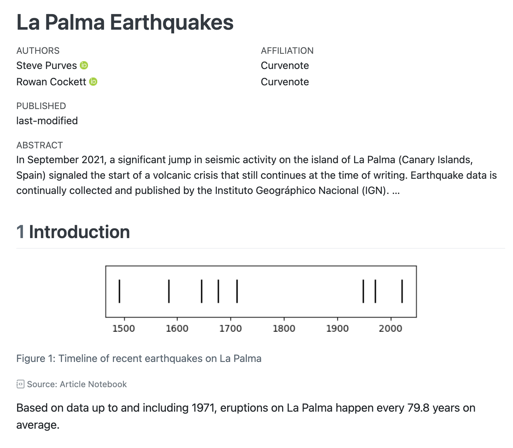
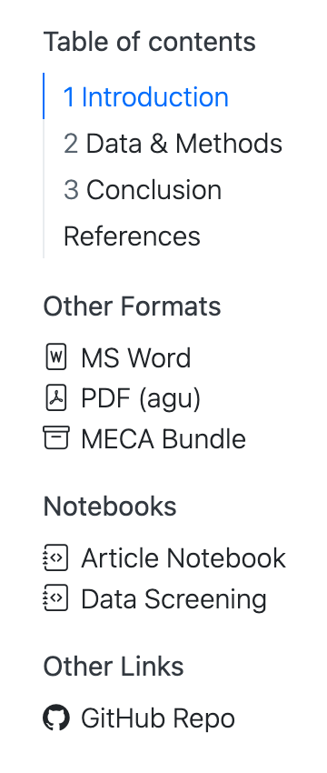

Quarto 1.4 has been officially released! You can get the current release from the [download page](../docs/download/index.qmd)

This release has tons of new features. Some of the big ones we want to spotlight are: Dashboards, Typst, Inline Code Syntax, Cross-References and Manuscripts.

## Dashboards

Quarto Dashboards streamline the creation of interactive dashboards, giving you an effortless way to lay out interactive components, visualizations, tabular data, and annotations. Here are some examples (click on the image to visit the live version):

<table style="width:100%;">
<colgroup>
<col style="width: 33%" />
<col style="width: 33%" />
<col style="width: 33%" />
</colgroup>
<tbody>
<tr>
<td style="text-align: center;"><div width="33.3%" data-layout-align="center">
<p><a href="https://jjallaire.github.io/stock-explorer-dashboard/"></a></p>
</div></td>
<td style="text-align: center;"><div width="33.3%" data-layout-align="center">
<p><a href="https://jjallaire.github.io/customer-churn-dashboard/"></a></p>
</div></td>
<td style="text-align: center;"><div width="33.3%" data-layout-align="center">
<p><a href="https://jjallaire.shinyapps.io/penguins-dashboard/"></a></p>
</div></td>
</tr>
</tbody>
</table>

For the source code of these dashboards and additional examples see the [examples gallery](../docs/gallery/index.qmd#dashboards). When you are ready to build your own Quarto dashboard head to our guide on [Dashboards](../docs/dashboards/index.qmd).

## Typst

<a href="https://github.com/typst/typst" class="external">Typst</a> is a new open-source markup-based typesetting system that is designed to be as powerful as LaTeX while being much easier to learn and use. Typst creates beautiful PDF output with blazing fast render times.

Quarto 1.4 includes the Typst CLI, so all you need to get started creating PDFs via Typst is to use `format: typst`:

**hello-typst.qmd**

``` markdown
---
title: "Hello Typst!"
format: typst
---

My first Typst document
```

We are particularly excited about how easy it is to make templates for journal articles, conference posters, newsletters and more with Typst. Here are some examples you can use in Quarto as [custom formats](../docs/output-formats/typst-custom.qmd):

<table>
<colgroup>
<col style="width: 25%" />
<col style="width: 25%" />
<col style="width: 25%" />
<col style="width: 25%" />
</colgroup>
<tbody>
<tr>
<td style="text-align: left;"><div width="25.0%" data-layout-align="left">
<figure>

<figcaption aria-hidden="true">IEEE</figcaption>
</figure>
</div></td>
<td style="text-align: left;"><div width="25.0%" data-layout-align="left">
<figure>

<figcaption aria-hidden="true">Poster</figcaption>
</figure>
</div></td>
<td style="text-align: left;"><div width="25.0%" data-layout-align="left">
<figure>

<figcaption aria-hidden="true">Letter</figcaption>
</figure>
</div></td>
<td style="text-align: left;"><div width="25.0%" data-layout-align="left">
<figure>

<figcaption aria-hidden="true">Dept News</figcaption>
</figure>
</div></td>
</tr>
</tbody>
</table>

Start your Typst journey with Quarto in our guide on [Typst Basics](../docs/output-formats/typst.qmd).

## Inline Code Syntax

Quarto 1.4 introduces a unified syntax for including computed values inline. The syntax for inline code is similar to code blocks, except you use a single tick (`` ` ``) rather than triple ticks (```` ``` ````), and you can use it in the middle of markdown:

<table style="width:100%;">
<colgroup>
<col style="width: 33%" />
<col style="width: 33%" />
<col style="width: 33%" />
</colgroup>
<tbody>
<tr>
<td style="text-align: left;"><div width="33.3%" data-layout-align="left">
<h3 id="jupyter">Jupyter</h3>
<div class="sourceCode" id="cb1"><pre class="sourceCode markdown"><code class="sourceCode markdown"><span id="cb1-1"><a href="#cb1-1" aria-hidden="true" tabindex="-1"></a><span class="in">```{python}</span></span>
<span id="cb1-2"><a href="#cb1-2" aria-hidden="true" tabindex="-1"></a>radius <span class="op">=</span> <span class="dv">5</span></span>
<span id="cb1-3"><a href="#cb1-3" aria-hidden="true" tabindex="-1"></a><span class="in">```</span></span>
<span id="cb1-4"><a href="#cb1-4" aria-hidden="true" tabindex="-1"></a></span>
<span id="cb1-5"><a href="#cb1-5" aria-hidden="true" tabindex="-1"></a>The radius of the circle is <span class="in">`{python} radius`</span></span></code></pre></div>
<p>This syntax works for any Jupyter kernel—so for Julia you would write an inline expression as <code>`{julia} radius`</code>).</p>
</div></td>
<td style="text-align: left;"><div width="33.3%" data-layout-align="left">
<h3 id="knitr">Knitr</h3>
<div class="sourceCode" id="cb2"><pre class="sourceCode markdown"><code class="sourceCode markdown"><span id="cb2-1"><a href="#cb2-1" aria-hidden="true" tabindex="-1"></a><span class="in">```{r}</span></span>
<span id="cb2-2"><a href="#cb2-2" aria-hidden="true" tabindex="-1"></a>radius <span class="ot">&lt;-</span> <span class="dv">5</span></span>
<span id="cb2-3"><a href="#cb2-3" aria-hidden="true" tabindex="-1"></a><span class="in">```</span></span>
<span id="cb2-4"><a href="#cb2-4" aria-hidden="true" tabindex="-1"></a></span>
<span id="cb2-5"><a href="#cb2-5" aria-hidden="true" tabindex="-1"></a>The radius of the circle is <span class="in">`{r} radius`</span></span></code></pre></div>
</div></td>
<td style="text-align: left;"><div width="33.3%" data-layout-align="left">
<h3 id="ojs">OJS</h3>
<div class="sourceCode" id="cb3"><pre class="sourceCode markdown"><code class="sourceCode markdown"><span id="cb3-1"><a href="#cb3-1" aria-hidden="true" tabindex="-1"></a><span class="in">```{ojs}</span></span>
<span id="cb3-2"><a href="#cb3-2" aria-hidden="true" tabindex="-1"></a>radius <span class="op">=</span> <span class="dv">5</span></span>
<span id="cb3-3"><a href="#cb3-3" aria-hidden="true" tabindex="-1"></a><span class="in">```</span></span>
<span id="cb3-4"><a href="#cb3-4" aria-hidden="true" tabindex="-1"></a></span>
<span id="cb3-5"><a href="#cb3-5" aria-hidden="true" tabindex="-1"></a>The radius of the circle is <span class="in">`{ojs} radius`</span></span></code></pre></div>
</div></td>
</tr>
</tbody>
</table>

And don't worry if you are used to using `` `r ` `` that syntax remains fully supported. Read more at [Inline Code](../docs/computations/inline-code.qmd).

## Cross-References

Cross-references have been overhauled in Quarto 1.4, enabling you to do things like:

- Flexibly define the content of float cross-references (e.g. figures, tables and code listings) with the new [Cross-Reference Div Syntax](../docs/authoring/cross-references-divs.qmd). For example, <a href="#tbl-table" class="quarto-xref">Table 1</a> is an image treated like a table:

  <table>
  <colgroup>
  <col style="width: 50%" />
  <col style="width: 50%" />
  </colgroup>
  <tbody>
  <tr>
  <td style="text-align: left;"><div width="50.0%" data-layout-align="left">
  <div class="sourceCode" id="cb1"><pre class="sourceCode markdown"><code class="sourceCode markdown"><span id="cb1-1"><a href="#cb1-1" aria-hidden="true" tabindex="-1"></a>::: {#tbl-table}</span>
  <span id="cb1-2"><a href="#cb1-2" aria-hidden="true" tabindex="-1"></a></span>
  <span id="cb1-3"><a href="#cb1-3" aria-hidden="true" tabindex="-1"></a><span class="al"></span></span>
  <span id="cb1-4"><a href="#cb1-4" aria-hidden="true" tabindex="-1"></a></span>
  <span id="cb1-5"><a href="#cb1-5" aria-hidden="true" tabindex="-1"></a>An image treated like a table</span>
  <span id="cb1-6"><a href="#cb1-6" aria-hidden="true" tabindex="-1"></a></span>
  <span id="cb1-7"><a href="#cb1-7" aria-hidden="true" tabindex="-1"></a>:::</span></code></pre></div>
  </div></td>
  <td style="text-align: left;"><div width="50.0%" data-layout-align="left">
  
  &#10;</div></td>
  </tr>
  </tbody>
  </table>

  And notice if you hover over the reference as it appears in the text, e.g. hover over this link to <a href="#tbl-table" class="quarto-xref">Table 1</a>, you'll get a floating preview of the content---that's new too.

- Define [custom types of float cross-reference](../docs/authoring/cross-references-custom.qmd), which you could use to create cross-references to Videos, Diagrams or [Supplemental Figures](../docs/authoring/cross-references-custom.qmd#example-supplemental-figures).

- Cross-reference [executable code cells](../docs/authoring/cross-references.qmd#code-listings), [callouts](../docs/authoring/cross-references.qmd#callouts) and [remarks and solutions](../docs/authoring/cross-references.qmd#theorems-and-proofs).

## Manuscripts

Quarto manuscript projects provide a framework for writing and publishing scholarly articles. You can use notebooks (`.qmd` or `.ipynb`) as the source of content and computations, and then publish these computations alongside the manuscript, allowing readers to dive into your code.

The output of a manuscript project is a website containing the article in multiple formats (e.g. LaTeX, MS Word) along with rendered versions of the notebooks in the project:

<table>
<colgroup>
<col style="width: 75%" />
<col style="width: 25%" />
</colgroup>
<tbody>
<tr>
<td style="text-align: left;"><div width="75.0%" data-layout-align="left">
<figure>

<figcaption aria-hidden="true">Article Content</figcaption>
</figure>
</div></td>
<td style="text-align: left;"><div width="25.0%" data-layout-align="left">
<figure>

<figcaption aria-hidden="true">Navigation</figcaption>
</figure>
</div></td>
</tr>
</tbody>
</table>

Read more about manuscripts and how to get started in our guide to [Manuscripts](../docs/manuscripts/index.qmd).

## Other Highlights

Some other highlights include:

- [Shiny for Python](../docs/dashboards/interactivity/shiny-python/index.qmd)---Support for using Shiny for Python within Quarto documents.

- [Script Rendering](../docs/computations/render-scripts.qmd)---Render specially formatted `.py`, `.jl` and `.r` script files.

- [Easy Binder Configuration for Quarto Projects](../docs/projects/binder.qmd)---Support for generating files required to deploy a Quarto project to <a href="https://mybinder.org/" class="external">Binder</a>.

- <a href="https://docs.posit.co/connect/user/quarto/#email-customization" class="external">Connect Email Generation</a>---Extends the `html` output format so that HTML/text emails can be created and selectively delivered through Posit Connect.

- [Publish to Posit Cloud](../docs/publishing/posit-cloud.qmd)---Adds `posit-cloud` as a venue for `quarto publish`.

- [Lightbox Treatment for Images and Figures](../docs/output-formats/html-lightbox-figures.qmd)---Support for zooming into images and figures as well as grouping multiple images into a gallery.

If you build Quarto extensions, you should also be aware of some developer-facing changes:

- [Lua changes](../docs/prerelease/1.4/lua_changes.qmd)---New Support for crossreferenceable elements in filters, extensible renderers of quarto AST nodes such as `FloatRefTarget` and `Callout`, the use of relative paths in `require()` calls, and more precise specification of where a filter will be inserted.

- [AST processing changes](../docs/prerelease/1.4/ast.qmd)---Improvements to the HTML table processing added in v1.3 and a way for LaTeX raw blocks to include Quarto-compatible markdown for processing.

You can find all the other changes in 1.4 in the [Release Notes](../docs/download/#download-section-news).

## Acknowledgements

We'd like to say a huge thank you to everyone who contributed to this release by opening issues and pull requests:

[AaronGullickson](https://github.com/AaronGullickson), [abichat](https://github.com/abichat), [abigailhaddad](https://github.com/abigailhaddad), [aborruso](https://github.com/aborruso), [abraver](https://github.com/abraver), [acebulsk](https://github.com/acebulsk), [aghaynes](https://github.com/aghaynes), [ajay333a](https://github.com/ajay333a), [ajsmit](https://github.com/ajsmit), [ALanguillaume](https://github.com/ALanguillaume), [AlbertRapp](https://github.com/AlbertRapp), [aletroux](https://github.com/aletroux), [alex-vinogradov](https://github.com/alex-vinogradov), [alexCardazzi](https://github.com/alexCardazzi), [allefeld](https://github.com/allefeld), [am-lh](https://github.com/am-lh), [andlekbra](https://github.com/andlekbra), [andrefmello91](https://github.com/andrefmello91), [AndreiBiziuk](https://github.com/AndreiBiziuk), [andrewheiss](https://github.com/andrewheiss), [anielsen001](https://github.com/anielsen001), [apsteinmetz](https://github.com/apsteinmetz), [AQLT](https://github.com/AQLT), [arnaudgallou](https://github.com/arnaudgallou), [aronatkins](https://github.com/aronatkins), [atsyplenkov](https://github.com/atsyplenkov), [b-rodrigues](https://github.com/b-rodrigues), [Balaika](https://github.com/Balaika), [baptiste](https://github.com/baptiste), [barryrowlingson](https://github.com/barryrowlingson), [batpigandme](https://github.com/batpigandme), [bcongelio](https://github.com/bcongelio), [benabel](https://github.com/benabel), [benjaminschlegel](https://github.com/benjaminschlegel), [bfordAIMS](https://github.com/bfordAIMS), [blacksqr](https://github.com/blacksqr), [boshek](https://github.com/boshek), [BradyAJohnston](https://github.com/BradyAJohnston), [brtarran](https://github.com/brtarran), [bryanhanson](https://github.com/bryanhanson), [bweatherson](https://github.com/bweatherson), [c-zippel](https://github.com/c-zippel), [cadojo](https://github.com/cadojo), [camilogarciabotero](https://github.com/camilogarciabotero), [cbrnr](https://github.com/cbrnr), [ccamara](https://github.com/ccamara), [cermak-consulting](https://github.com/cermak-consulting), [chendaniely](https://github.com/chendaniely), [ChrisJefferson](https://github.com/ChrisJefferson), [ChristopherBarrington](https://github.com/ChristopherBarrington), [christopherkenny](https://github.com/christopherkenny), [chrisvoncsefalvay](https://github.com/chrisvoncsefalvay), [chuxinyuan](https://github.com/chuxinyuan), [cjber](https://github.com/cjber), [coatless](https://github.com/coatless), [coltongearhart](https://github.com/coltongearhart), [CorradoLanera](https://github.com/CorradoLanera), [csgroen](https://github.com/csgroen), [dalejbarr](https://github.com/dalejbarr), [DamonCharlesRoberts](https://github.com/DamonCharlesRoberts), [Damonsoul](https://github.com/Damonsoul), [daniel-smit-haw](https://github.com/daniel-smit-haw), [danieltomasz](https://github.com/danieltomasz), [danmackinlay](https://github.com/danmackinlay), [daranzolin](https://github.com/daranzolin), [darthlite](https://github.com/darthlite), [das-g](https://github.com/das-g), [davidfoxcroft](https://github.com/davidfoxcroft), [davidpomerenke](https://github.com/davidpomerenke), [ddotta](https://github.com/ddotta), [declann](https://github.com/declann), [dense-set](https://github.com/dense-set), [dfolio](https://github.com/dfolio), [dgkf](https://github.com/dgkf), [dkapitan](https://github.com/dkapitan), [dlakelan](https://github.com/dlakelan), [dloss](https://github.com/dloss), [dmkaplan2000](https://github.com/dmkaplan2000), [DOSull](https://github.com/DOSull), [dpabon](https://github.com/dpabon), [dpprdan](https://github.com/dpprdan), [DriesSchaumont](https://github.com/DriesSchaumont), [drscotthawley](https://github.com/drscotthawley), [dschief001](https://github.com/dschief001), [dweng0](https://github.com/dweng0), [e-miz](https://github.com/e-miz), [EconomiCurtis](https://github.com/EconomiCurtis), [edavidaja](https://github.com/edavidaja), [edibotopic](https://github.com/edibotopic), [eeenilsson](https://github.com/eeenilsson), [ehudkr](https://github.com/ehudkr), [eitsupi](https://github.com/eitsupi), [EllaKaye](https://github.com/EllaKaye), [emdelponte](https://github.com/emdelponte), [emilBeBri](https://github.com/emilBeBri), [EmilHvitfeldt](https://github.com/EmilHvitfeldt), [emitanaka](https://github.com/emitanaka), [epruesse](https://github.com/epruesse), [ercbk](https://github.com/ercbk), [EricJC24](https://github.com/EricJC24), [ericvmai](https://github.com/ericvmai), [erikerhardt](https://github.com/erikerhardt), [espinielli](https://github.com/espinielli), [Eugloh](https://github.com/Eugloh), [fecet](https://github.com/fecet), [Felixmil](https://github.com/Felixmil), [FeralFlora](https://github.com/FeralFlora), [finkelshtein](https://github.com/finkelshtein), [fkohrt](https://github.com/fkohrt), [fradav](https://github.com/fradav), [fuhrmanator](https://github.com/fuhrmanator), [fulem](https://github.com/fulem), [gadenbuie](https://github.com/gadenbuie), [garrettgman](https://github.com/garrettgman), [GegznaV](https://github.com/GegznaV), [Gewerd-Strauss](https://github.com/Gewerd-Strauss), [gimmiereddy](https://github.com/gimmiereddy), [gl-eb](https://github.com/gl-eb), [grantmcdermott](https://github.com/grantmcdermott), [gregmacfarlane](https://github.com/gregmacfarlane), [gregoireurvoy](https://github.com/gregoireurvoy), [gregswinehart](https://github.com/gregswinehart), [gshotwell](https://github.com/gshotwell), [GuillaumeDehaene](https://github.com/GuillaumeDehaene), [gvelasq](https://github.com/gvelasq), [gyansinha](https://github.com/gyansinha), [hamelsmu](https://github.com/hamelsmu), [harrelfe](https://github.com/harrelfe), [harrylojames](https://github.com/harrylojames), [harrysw1729](https://github.com/harrysw1729), [HelenaLC](https://github.com/HelenaLC), [helmingstay](https://github.com/helmingstay), [HenrikBengtsson](https://github.com/HenrikBengtsson), [homerhanumat](https://github.com/homerhanumat), [icarusz](https://github.com/icarusz), [ig0101](https://github.com/ig0101), [ijlyttle](https://github.com/ijlyttle), [ijmitch](https://github.com/ijmitch), [irmoodie](https://github.com/irmoodie), [isabelizimm](https://github.com/isabelizimm), [IULibScholComm](https://github.com/IULibScholComm), [ivelasq](https://github.com/ivelasq), [jack-davison](https://github.com/jack-davison), [Janidai](https://github.com/Janidai), [jarbet](https://github.com/jarbet), [jasonaris](https://github.com/jasonaris), [jatalah](https://github.com/jatalah), [JauntyJJS](https://github.com/JauntyJJS), [jb-leger](https://github.com/jb-leger), [jcheng5](https://github.com/jcheng5), [jdonland](https://github.com/jdonland), [jdutant](https://github.com/jdutant), [jeremy9959](https://github.com/jeremy9959), [jeroenjanssens](https://github.com/jeroenjanssens), [jfb-h](https://github.com/jfb-h), [jfunction](https://github.com/jfunction), [JGobeil](https://github.com/JGobeil), [jgomezdans](https://github.com/jgomezdans), [jgostick](https://github.com/jgostick), [jhchou](https://github.com/jhchou), [jhk0530](https://github.com/jhk0530), [jhunter-aof](https://github.com/jhunter-aof), [jimgar](https://github.com/jimgar), [jimjam-slam](https://github.com/jimjam-slam), [jmbuhr](https://github.com/jmbuhr), [jmcvw](https://github.com/jmcvw), [Joda66](https://github.com/Joda66), [joelostblom](https://github.com/joelostblom), [joelvonrotz](https://github.com/joelvonrotz), [johngoldin](https://github.com/johngoldin), [jonassmedegaard](https://github.com/jonassmedegaard), [jpatteet](https://github.com/jpatteet), [jrowen](https://github.com/jrowen), [jthomasmock](https://github.com/jthomasmock), [jtr13](https://github.com/jtr13), [juba](https://github.com/juba), [juliantao](https://github.com/juliantao), [jurjoroa](https://github.com/jurjoroa), [justanothergithubber](https://github.com/justanothergithubber), [jzelner](https://github.com/jzelner), [KaiWaldrant](https://github.com/KaiWaldrant), [kbvernon](https://github.com/kbvernon), [kcarnold](https://github.com/kcarnold), [kdheepak](https://github.com/kdheepak), [kdzhang](https://github.com/kdzhang), [kejaed](https://github.com/kejaed), [kendonB](https://github.com/kendonB), [knuesel](https://github.com/knuesel), [Kodiologist](https://github.com/Kodiologist), [kompre](https://github.com/kompre), [koushikkhan](https://github.com/koushikkhan), [krishaamer](https://github.com/krishaamer), [ksreyes](https://github.com/ksreyes), [kwangkim](https://github.com/kwangkim), [kyleGrealis](https://github.com/kyleGrealis), [lcnbr](https://github.com/lcnbr), [leeroyaus](https://github.com/leeroyaus), [leonardblaschek](https://github.com/leonardblaschek), [Lextuga007](https://github.com/Lextuga007), [lidavidm](https://github.com/lidavidm), [lillemets](https://github.com/lillemets), [lnnrtwttkhn](https://github.com/lnnrtwttkhn), [luifrancgom](https://github.com/luifrancgom), [Lulliter](https://github.com/Lulliter), [lyndondrake](https://github.com/lyndondrake), [m-clark](https://github.com/m-clark), [m-guggenmos](https://github.com/m-guggenmos), [machow](https://github.com/machow), [maelle](https://github.com/maelle), [magnusnosnes](https://github.com/magnusnosnes), [MarieEtienne](https://github.com/MarieEtienne), [marklhc](https://github.com/marklhc), [martinfleis](https://github.com/martinfleis), [Martinomagnifico](https://github.com/Martinomagnifico), [masud90](https://github.com/masud90), [matanhakim](https://github.com/matanhakim), [Matoyatapika](https://github.com/Matoyatapika), [matthew-brett](https://github.com/matthew-brett), [matthewfinkbeiner](https://github.com/matthewfinkbeiner), [maxdrohde](https://github.com/maxdrohde), [mfenner](https://github.com/mfenner), [mfisher87](https://github.com/mfisher87), [MichaelPascale](https://github.com/MichaelPascale), [mikabr](https://github.com/mikabr), [milanmlft](https://github.com/milanmlft), [mine-cetinkaya-rundel](https://github.com/mine-cetinkaya-rundel), [Minh-AnhHuynh](https://github.com/Minh-AnhHuynh), [miwojc](https://github.com/miwojc), [mloubout](https://github.com/mloubout), [msarahan](https://github.com/msarahan), [msh855](https://github.com/msh855), [mslynch](https://github.com/mslynch), [murattasdemir](https://github.com/murattasdemir), [mvanaman](https://github.com/mvanaman), [nanxstats](https://github.com/nanxstats), [netique](https://github.com/netique), [netw0rkf10w](https://github.com/netw0rkf10w), [nickriches](https://github.com/nickriches), [njbart](https://github.com/njbart), [noahmf](https://github.com/noahmf), [nqt2022](https://github.com/nqt2022), [nwisn](https://github.com/nwisn), [nwvhb](https://github.com/nwvhb), [OlexiyPukhov](https://github.com/OlexiyPukhov), [olivroy](https://github.com/olivroy), [ollyhensby](https://github.com/ollyhensby), [pastorn](https://github.com/pastorn), [pat-s](https://github.com/pat-s), [patgd](https://github.com/patgd), [petrbouchal](https://github.com/petrbouchal), [petzi53](https://github.com/petzi53), [phongphuhanam](https://github.com/phongphuhanam), [pieterprovoost](https://github.com/pieterprovoost), [piotr-kaczmarski](https://github.com/piotr-kaczmarski), [pjastr](https://github.com/pjastr), [pommevilla](https://github.com/pommevilla), [prosoitos](https://github.com/prosoitos), [ptram](https://github.com/ptram), [qiushiyan](https://github.com/qiushiyan), [ratnanil](https://github.com/ratnanil), [ravicodelabs](https://github.com/ravicodelabs), [rcannood](https://github.com/rcannood), [rchaput](https://github.com/rchaput), [regob](https://github.com/regob), [remlapmot](https://github.com/remlapmot), [resmartiZH](https://github.com/resmartiZH), [rgaiacs](https://github.com/rgaiacs), [rmcd1024](https://github.com/rmcd1024), [rmflight](https://github.com/rmflight), [rnd195](https://github.com/rnd195), [robolyst](https://github.com/robolyst), [rogerbramon](https://github.com/rogerbramon), [ronblum](https://github.com/ronblum), [ropeladder](https://github.com/ropeladder), [rowanc1](https://github.com/rowanc1), [RoyiAvital](https://github.com/RoyiAvital), [rsenft1](https://github.com/rsenft1), [salim-b](https://github.com/salim-b), [samcarter](https://github.com/samcarter), [sceptri](https://github.com/sceptri), [sda030](https://github.com/sda030), [sebacea](https://github.com/sebacea), [sebastian-c](https://github.com/sebastian-c), [sebastianrowan](https://github.com/sebastianrowan), [sebffischer](https://github.com/sebffischer), [seeM](https://github.com/seeM), [Serenade600](https://github.com/Serenade600), [Servinjesus1](https://github.com/Servinjesus1), [shafayetShafee](https://github.com/shafayetShafee), [sharon-wang](https://github.com/sharon-wang), [shirdekel](https://github.com/shirdekel), [simonjackman](https://github.com/simonjackman), [sje30](https://github.com/sje30), [sjspielman](https://github.com/sjspielman), [skaltman](https://github.com/skaltman), [smithbn](https://github.com/smithbn), [snhansen](https://github.com/snhansen), [Sparrow0hawk](https://github.com/Sparrow0hawk), [sswam](https://github.com/sswam), [stefanbringuier](https://github.com/stefanbringuier), [stephan-koenig](https://github.com/stephan-koenig), [steveguil](https://github.com/steveguil), [Sumidu](https://github.com/Sumidu), [sun123zxy](https://github.com/sun123zxy), [tegorman13](https://github.com/tegorman13), [tflexs](https://github.com/tflexs), [th0ger](https://github.com/th0ger), [the-solipsist](https://github.com/the-solipsist), [TheGoodCartman](https://github.com/TheGoodCartman), [TheisFerre](https://github.com/TheisFerre), [thomascwells](https://github.com/thomascwells), [TLouf](https://github.com/TLouf), [tobydriscoll](https://github.com/tobydriscoll), [tom67](https://github.com/tom67), [tonyaseverson](https://github.com/tonyaseverson), [topepo](https://github.com/topepo), [tpoisot](https://github.com/tpoisot), [TrainedMusician](https://github.com/TrainedMusician), [TS-CUBED](https://github.com/TS-CUBED), [ttalVlatt](https://github.com/ttalVlatt), [Tutuchan](https://github.com/Tutuchan), [tylermorganwall](https://github.com/tylermorganwall), [ulyngs](https://github.com/ulyngs), [ute](https://github.com/ute), [vfacta](https://github.com/vfacta), [vitpetrik](https://github.com/vitpetrik), [VivaldoMendes](https://github.com/VivaldoMendes), [VladimirAlexiev](https://github.com/VladimirAlexiev), [Walser52](https://github.com/Walser52), [warrickball](https://github.com/warrickball), [wch](https://github.com/wch), [weihuangwong](https://github.com/weihuangwong), [wilcar](https://github.com/wilcar), [willingc](https://github.com/willingc), [wjdenny](https://github.com/wjdenny), [wklimowicz](https://github.com/wklimowicz), [XiangyunHuang](https://github.com/XiangyunHuang), [xtimbeau](https://github.com/xtimbeau), [yoyo25](https://github.com/yoyo25), [YuanchenZhu2020](https://github.com/YuanchenZhu2020), [yuxi-liu-wired](https://github.com/yuxi-liu-wired), [yyzeng](https://github.com/yyzeng), [zenggyu](https://github.com/zenggyu), [Zeno-of-Elea](https://github.com/Zeno-of-Elea), [zief0002](https://github.com/zief0002), [Zuline](https://github.com/Zuline)

The party popper emoji in the [listing and social card image](images/thumbnail.png) for this post comes from <a href="https://openmoji.org/" class="external">OpenMoji</a>-- the open-source emoji and icon project. License: <a href="https://creativecommons.org/licenses/by-sa/4.0/#" class="external">CC BY-SA 4.0</a>
