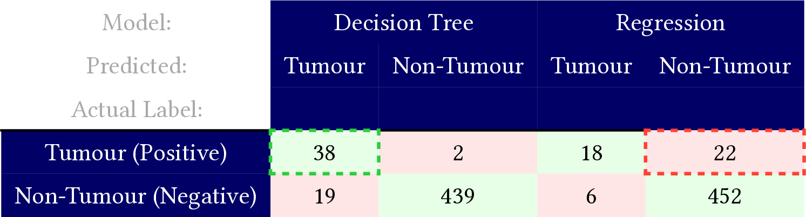
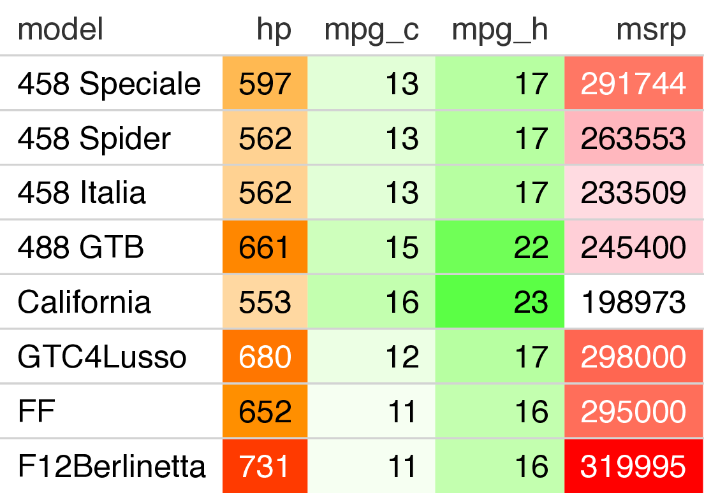
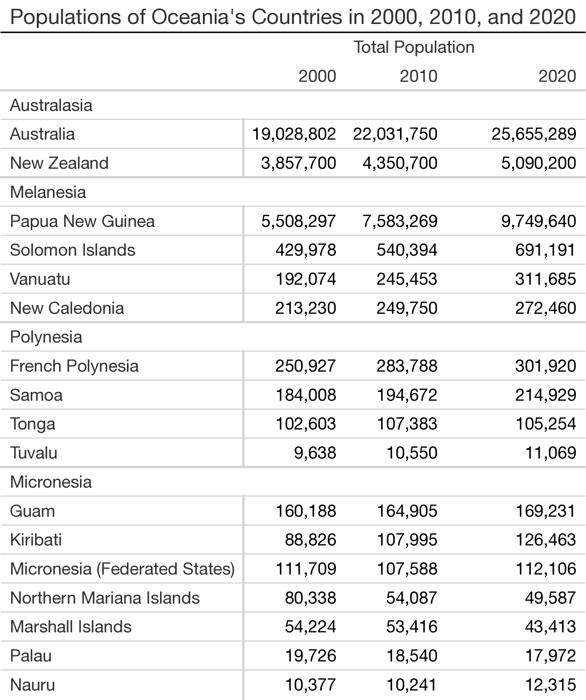
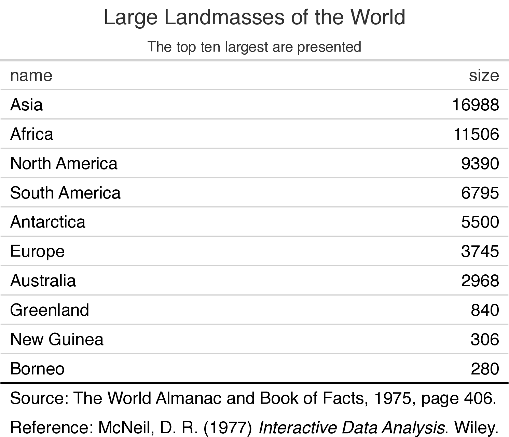
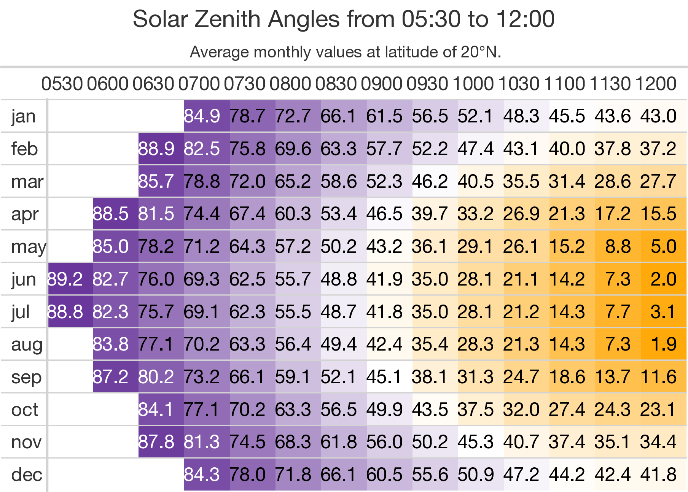
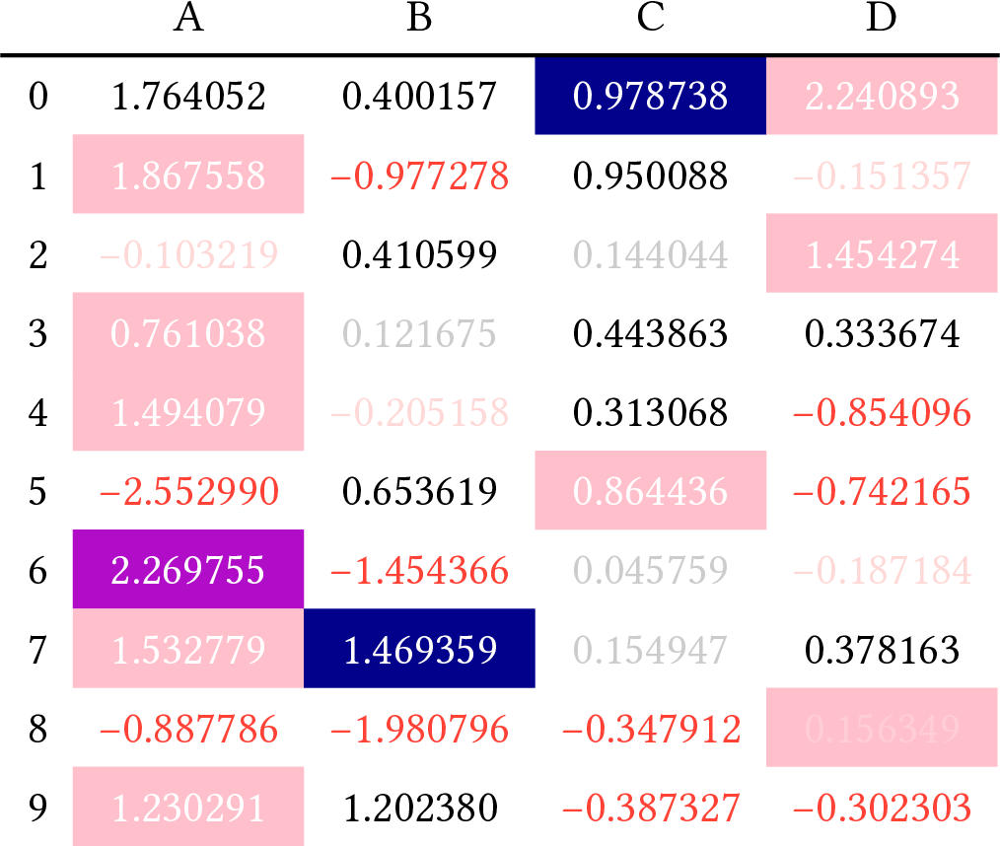

Quarto now allows HTML Tables with CSS styling to be output in Typst.

It does this by translating CSS properties into Typst properties. You can read about the feature [in the Guide](https://quarto.org/docs/output-formats/typst.html#typst-css).technical details [in the Advanced Docs](https://quarto.org/docs/advanced/typst/typst-css.html)

Let's look at 6 HTML tables using a variety of CSS properties also supported by Typst in Quarto.

You can click on the links below the examples to see the full documents, with source code.

## Confusion Matrix (Pandas / Python)

This example uses a dashed border to draw attention to two cells.

 <a href="examples/pandas-confusion-matrix.pdf" target="_blank">Typst</a>

<iframe class="html-demo" src="demo/pandas-confusion-matrix.html" width=700 height=250 scrolling="no"></iframe>

<a href="examples/pandas-confusion-matrix.HTML" target="_blank">HTML</a>

## Cars heatmap (gt / R)

This example uses cell background colors to encode ranges of values.

<a href="examples/gt-cars.pdf" target="_blank">Typst</a>

<iframe class="html-demo" src="demo/gt-cars.html" width=430 height=375 scrolling="no"></iframe>

<a href="examples/gt-cars.HTML" target="_blank">HTML</a>

## Oceania (Great Tables / Python)

Borders can show the structure of grouped rows.

<a href="examples/great-tables-oceania.pdf" target="_blank">Typst</a>

<iframe class="html-demo" src="demo/great-tables-oceania.html" width=600 height=907 scrolling="no"></iframe>

<a href="examples/great-tables-oceania.HTML" target="_blank">HTML</a>

## Islands (gt / R)

Font sizes and minimal borders make this table stand out.

<a href="examples/gt-islands.pdf" target="_blank">Typst</a>

<iframe class="html-demo" src="demo/gt-islands.html" width=400 height=580 scrolling="no"></iframe>

<a href="examples/gt-islands.HTML" target="_blank">HTML</a>

## Solar Zenith (Great Tables / Python)

Another cool heatmap.

<a href="examples/great-tables-solar-zenith.pdf" target="_blank">Typst</a>

<iframe class="html-demo" src="demo/great-tables-solar-zenith.html" width=850 height=565 scrolling="no"></iframe>

<a href="examples/great-tables-solar-zenith.HTML" target="_blank">HTML</a>

## Acting on Data (Pandas / Python)

Applying colors and transparency based on data.

<a href="examples/pandas-acting-on-data.pdf" target="_blank">Typst</a>

<iframe class="html-demo" src="demo/pandas-acting-on-data.html" width=600 height=505 scrolling="no"></iframe>

<a href="examples/pandas-acting-on-data.HTML" target="_blank">HTML</a>

We can't wait to see what you do with this new feature!
