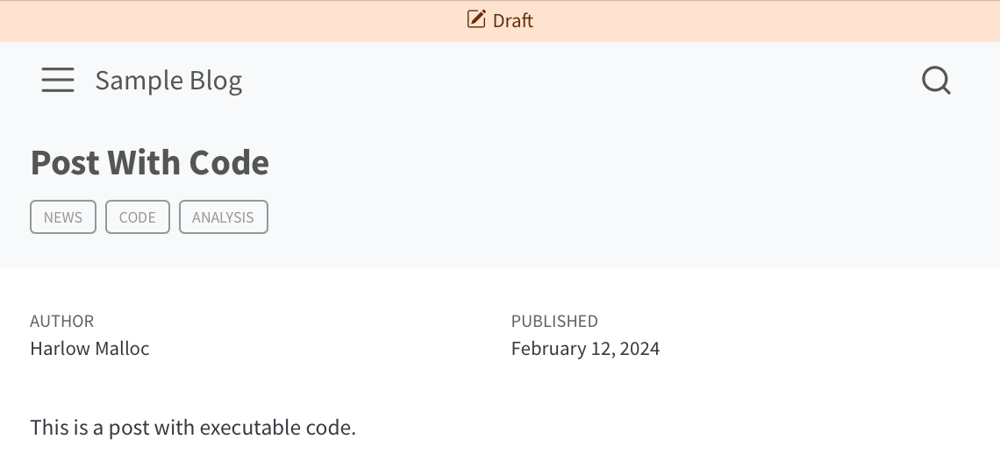

Quarto 1.5 is out! You can find the current release on the [download page](https://quarto.org/docs/download/index.html).

Below, we'll highlight the improved Typst support, website enhancements like draft handling and announcement bars, the native Julia engine, and a couple of shortcodes for generating placeholder content. You can see all the changes in the [Release Notes](https://quarto.org/docs/download/changelog/1.5/).

## Typst CSS

We've already blogged about one feature that is now available in 1.5: [Beautiful Tables in Typst](https://quarto.org/docs/blog/posts/2024-07-02-beautiful-tables-in-typst/). The CSS properties from HTML tables produced in your code are translated to Typst properties, so the tables you lovingly craft for HTML should look just as good in PDFs produced using `format: typst`.

Beyond tables, CSS properties on divs and spans are also translated to Typst properties. So, for example, you could get text with a green background like this:

``` markdown
Here is a [span with a green background]{style="background-color:green"}.
```

You can read more about using CSS in Typst at [Typst Basics: Typst CSS](https://quarto.org/docs/output-formats/typst.html#typst-css).

## Improved Website Draft Support

<figure>

<figcaption aria-hidden="true">A <code>draft</code> post with the new draft banner</figcaption>
</figure>

Quarto 1.5 brings improved support for workflows involving draft posts and pages:

- Adds the `drafts` option to the `website` key offering new ways to specify drafts: directly in `_quarto.yml`, and via metadata includes and profiles.

- Introduces the `draft-mode` option to the `website` key to control how drafts are rendered. Drafts can be `gone`, `unlinked` or `visible`.

- Adds a draft banner to draft pages that are rendered.

- Improves the linking behavior of draft documents. Now, in addition to being excluded from search results, listings, and the sitemap, drafts will not appear in navigation, or be linked from in-text hyperlinks when `draft-mode` is `gone` or `unlinked`.

- Changes the behavior of `quarto preview` for drafts. Drafts will be `visible` in previews regardless of the `draft-mode` setting. In particular, this allows an easier way to preview the appearance of draft content in navigation and listings.

Read more at [Website Drafts](https://quarto.org/docs/websites/website-drafts.html).

## Website Announcements

You can now use an `announcement` option to add a customizable banner at the top of your website. You can set an icon, make it dismissable, and include markdown formatted content like bold text:

<figure>

<figcaption aria-hidden="true">An example announcement bar</figcaption>
</figure>

Read about your options at [Website Tools: Announcement Bar](https://quarto.org/docs/websites/website-tools.html#announcement-bar).

## Native Julia Engine

Prior to 1.5, Julia code cells were executed through the Jupyter engine. Now you can opt-in to a native Julia engine:

``` yaml
---
title: Julia without Jupyter
engine: julia
---
```

Read about the details in [Using the `julia` engine](https://quarto.org/docs/computations/julia.html#using-the-julia-engine).

Part of the reason we are excited about this feature is that it was an external contribution. Thank you [@jkrumbiegel](https://github.com/jkrumbiegel)!

## Placeholder Shortcodes

We've also added a couple of shortcodes that add placeholder content: `lipsum` for text, and `placeholder` for images:

``` markdown


```

This example produces a 400px x 200px SVG image, and one paragraph of [Lorem Ipsum](https://en.wikipedia.org/wiki/Lorem_ipsum) text:


Lorem ipsum dolor sit amet, consectetur adipiscing elit. Duis sagittis posuere ligula sit amet lacinia. Duis dignissim pellentesque magna, rhoncus congue sapien finibus mollis. Ut eu sem laoreet, vehicula ipsum in, convallis erat. Vestibulum magna sem, blandit pulvinar augue sit amet, auctor malesuada sapien. Nullam faucibus leo eget eros hendrerit, non laoreet ipsum lacinia. Curabitur cursus diam elit, non tempus ante volutpat a. Quisque hendrerit blandit purus non fringilla. Integer sit amet elit viverra ante dapibus semper. Vestibulum viverra rutrum enim, at luctus enim posuere eu. Orci varius natoque penatibus et magnis dis parturient montes, nascetur ridiculus mus.

Read more about their options at [Placeholder Images](https://quarto.org/docs/authoring/placeholder.html) and [Placeholder Text](https://quarto.org/docs/authoring/lipsum.html).

## Acknowledgements

Finally, we'd like to give a huge high five to everyone who contributed to this release by opening issues and pull requests:

[AaronGullickson](https://github.com/AaronGullickson), [abduazizR](https://github.com/abduazizR), [aborruso](https://github.com/aborruso), [AdaemmerP](https://github.com/AdaemmerP), [adamalfredsson](https://github.com/adamalfredsson), [adamulrich](https://github.com/adamulrich), [aghaynes](https://github.com/aghaynes), [ALanguillaume](https://github.com/ALanguillaume), [AlbertRapp](https://github.com/AlbertRapp), [allefeld](https://github.com/allefeld), [AndreiBiziuk](https://github.com/AndreiBiziuk), [andrie](https://github.com/andrie), [anhi](https://github.com/anhi), [aravezskinteeth](https://github.com/aravezskinteeth), [arnaudgallou](https://github.com/arnaudgallou), [aronatkins](https://github.com/aronatkins), [ArthurAndrews](https://github.com/ArthurAndrews), [arvindvenkatadri](https://github.com/arvindvenkatadri), [AshleyHenry15](https://github.com/AshleyHenry15), [averms](https://github.com/averms), [awhol1](https://github.com/awhol1), [batpigandme](https://github.com/batpigandme), [bcdavasconcelos](https://github.com/bcdavasconcelos), [bhattmaulik](https://github.com/bhattmaulik), [bhogan-mitre](https://github.com/bhogan-mitre), [billgeo](https://github.com/billgeo), [BradyAJohnston](https://github.com/BradyAJohnston), [cameronraysmith](https://github.com/cameronraysmith), [CeresBarros](https://github.com/CeresBarros), [christian-million](https://github.com/christian-million), [cpcloud](https://github.com/cpcloud), [daslu](https://github.com/daslu), [davidkane9](https://github.com/davidkane9), [debdagybra](https://github.com/debdagybra), [dfolio](https://github.com/dfolio), [dhodge180](https://github.com/dhodge180), [dmbates](https://github.com/dmbates), [drtingtp](https://github.com/drtingtp), [eitsupi](https://github.com/eitsupi), [eyayaw](https://github.com/eyayaw), [FabienSe](https://github.com/FabienSe), [fernandortdias](https://github.com/fernandortdias), [fkgruber](https://github.com/fkgruber), [ForceBru](https://github.com/ForceBru), [gcgbarbosa](https://github.com/gcgbarbosa), [gimmiereddy](https://github.com/gimmiereddy), [gl-eb](https://github.com/gl-eb), [gregswinehart](https://github.com/gregswinehart), [guilhermegarcia](https://github.com/guilhermegarcia), [GuillaumeDehaene](https://github.com/GuillaumeDehaene), [hadley](https://github.com/hadley), [has2k1](https://github.com/has2k1), [Hemken](https://github.com/Hemken), [hervyqa](https://github.com/hervyqa), [hewag1975](https://github.com/hewag1975), [hughjonesd](https://github.com/hughjonesd), [iandol](https://github.com/iandol), [IULibScholComm](https://github.com/IULibScholComm), [j-horak](https://github.com/j-horak), [jackgerrits](https://github.com/jackgerrits), [jasonpott](https://github.com/jasonpott), [jcheng5](https://github.com/jcheng5), [jdossgollin](https://github.com/jdossgollin), [jebyrnes](https://github.com/jebyrnes), [jimgar](https://github.com/jimgar), [jimjam-slam](https://github.com/jimjam-slam), [jkrumbiegel](https://github.com/jkrumbiegel), [jobrachem](https://github.com/jobrachem), [jolars](https://github.com/jolars), [jonpeake](https://github.com/jonpeake), [jrob95](https://github.com/jrob95), [jrtheobald](https://github.com/jrtheobald), [juliantao](https://github.com/juliantao), [JulienGAMartin](https://github.com/JulienGAMartin), [justinaskav](https://github.com/justinaskav), [kadykov](https://github.com/kadykov), [KaiWaldrant](https://github.com/KaiWaldrant), [kdheepak](https://github.com/kdheepak), [kkaja123](https://github.com/kkaja123), [kletts](https://github.com/kletts), [kompre](https://github.com/kompre), [krishaamer](https://github.com/krishaamer), [lamurian](https://github.com/lamurian), [Lextuga007](https://github.com/Lextuga007), [li-yq](https://github.com/li-yq), [libjohn](https://github.com/libjohn), [liyongg](https://github.com/liyongg), [loreabad6](https://github.com/loreabad6), [Luc-UMass](https://github.com/Luc-UMass), [lwjohnst86](https://github.com/lwjohnst86), [m-clark](https://github.com/m-clark), [m-delem](https://github.com/m-delem), [MarcoPortmann](https://github.com/MarcoPortmann), [marklhc](https://github.com/marklhc), [martinscripts](https://github.com/martinscripts), [memeplex](https://github.com/memeplex), [MHellmund](https://github.com/MHellmund), [mhollanders](https://github.com/mhollanders), [mine-cetinkaya-rundel](https://github.com/mine-cetinkaya-rundel), [MKDJr](https://github.com/MKDJr), [mroberts1](https://github.com/mroberts1), [mvuorre](https://github.com/mvuorre), [mwouts](https://github.com/mwouts), [ncclementi](https://github.com/ncclementi), [ncworstell](https://github.com/ncworstell), [nealrichardson](https://github.com/nealrichardson), [Nesper94](https://github.com/Nesper94), [nickvigilante](https://github.com/nickvigilante), [nmalkin](https://github.com/nmalkin), [NMarkgraf](https://github.com/NMarkgraf), [nrichers](https://github.com/nrichers), [olivroy](https://github.com/olivroy), [ozanozbeker](https://github.com/ozanozbeker), [pagiraud](https://github.com/pagiraud), [pastorn](https://github.com/pastorn), [pbousquets](https://github.com/pbousquets), [pem725](https://github.com/pem725), [petrbouchal](https://github.com/petrbouchal), [pgseye](https://github.com/pgseye), [pingumops](https://github.com/pingumops), [pmoris](https://github.com/pmoris), [pschloss](https://github.com/pschloss), [rafaelorozco](https://github.com/rafaelorozco), [rastrau](https://github.com/rastrau), [RegalPlatypus](https://github.com/RegalPlatypus), [rgaiacs](https://github.com/rgaiacs), [Robinlovelace](https://github.com/Robinlovelace), [robolyst](https://github.com/robolyst), [royfrancis](https://github.com/royfrancis), [rpchastain](https://github.com/rpchastain), [sapphire008](https://github.com/sapphire008), [schrammelj](https://github.com/schrammelj), [sinamoghimi73](https://github.com/sinamoghimi73), [statik](https://github.com/statik), [stevengogogo](https://github.com/stevengogogo), [sun123zxy](https://github.com/sun123zxy), [szsctt](https://github.com/szsctt), [teecrow](https://github.com/teecrow), [the-solipsist](https://github.com/the-solipsist), [TomBener](https://github.com/TomBener), [ttalVlatt](https://github.com/ttalVlatt), [tvroylandt](https://github.com/tvroylandt), [tylermorganwall](https://github.com/tylermorganwall), [Unco3892](https://github.com/Unco3892), [Vinnie-Palazeti](https://github.com/Vinnie-Palazeti), [WardBrian](https://github.com/WardBrian), [wjschne](https://github.com/wjschne), [wklimowicz](https://github.com/wklimowicz), [xiaoxl](https://github.com/xiaoxl), [ycrouin](https://github.com/ycrouin)

The balloon emoji in the [listing and social card image](images/thumbnail.png) for this post comes from <a href="https://openmoji.org/" class="external">OpenMoji</a>-- the open-source emoji and icon project. License: <a href="https://creativecommons.org/licenses/by-sa/4.0/#" class="external">CC BY-SA 4.0</a>
