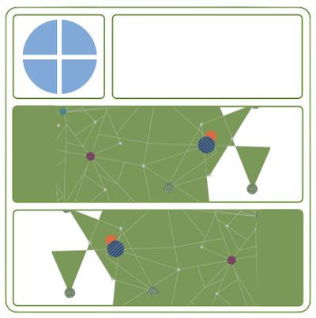
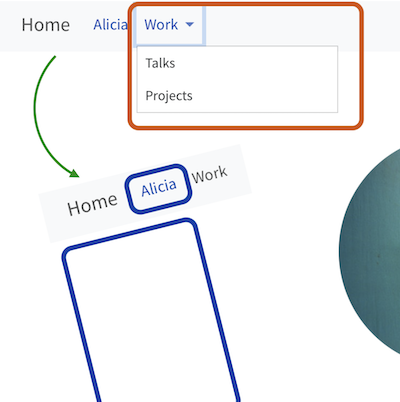

This year at posit::conf(2024) we had three day-long Quarto workshops. The materials from those workshops are available for all to learn from. Additionally, you're welcomed to use them in full or part when talking or teaching about Quarto; they are all released with a [CC BY-SA 4.0](https://creativecommons.org/licenses/by-sa/4.0/) license.

<table>
<colgroup>
<col style="width: 70%" />
<col style="width: 30%" />
</colgroup>
<tbody>
<tr>
<td style="text-align: left;">

<a href="https://posit-conf-2024.github.io/quarto-intro/" data-heading="Introduction to Quarto"><strong>Introduction to Quarto</strong></a>

<a href="https://posit-conf-2024.github.io/quarto-intro" class="uri">https://posit-conf-2024.github.io/quarto-intro</a>

 

<ul>
<li>
Led by <a href="https://bids.berkeley.edu/people/andrew-bray">Andrew Bray</a>, UC Berkeley
</li>
<li>
Ideal for beginners looking to create rich documents
</li>
</ul>

</td>
<td style="text-align: center;">

</td>
</tr>
</tbody>
</table>

<table>
<colgroup>
<col style="width: 70%" />
<col style="width: 30%" />
</colgroup>
<tbody>
<tr>
<td style="text-align: left;">

<a href="https://posit-conf-2024.github.io/quarto-dashboards/"><strong>Build-a-Dashboard Workshop (with Quarto, R, and/or Python)</strong></a>

<a href="https://posit-conf-2024.github.io/quarto-dashboards/">https://posit-conf-2024.github.io/quarto-dashboards</a>

 

<ul>
<li>
Led by <a href="https://mine-cr.com/">Mine Çetinkaya-Rundel</a>, Posit, PBC, Duke University
</li>
<li>
Perfect for those familiar with computational notebooks in R and/or Python who want to create eye-catching dashboards
</li>
</ul>

</td>
<td style="text-align: center;">

</td>
</tr>
</tbody>
</table>

<table>
<colgroup>
<col style="width: 70%" />
<col style="width: 30%" />
</colgroup>
<tbody>
<tr>
<td style="text-align: left;">

<a href="https://posit-conf-2024.github.io/quarto-websites/" data-heading="Quarto Websites"><strong>Quarto Websites</strong></a>

<a href="https://posit-conf-2024.github.io/quarto-websites/">https://posit-conf-2024.github.io/quarto-websites</a>

 

<ul>
<li>
Led by <a href="https://www.cwick.co.nz/">Charlotte Wickham</a> and <a href="https://emilhvitfeldt.com/">Emil Hvitfeldt</a>, Posit, PBC
</li>
<li>
Great choice for those wanting to build a website from scratch with Quarto
</li>
</ul>

</td>
<td style="text-align: center;">

</td>
</tr>
</tbody>
</table>
