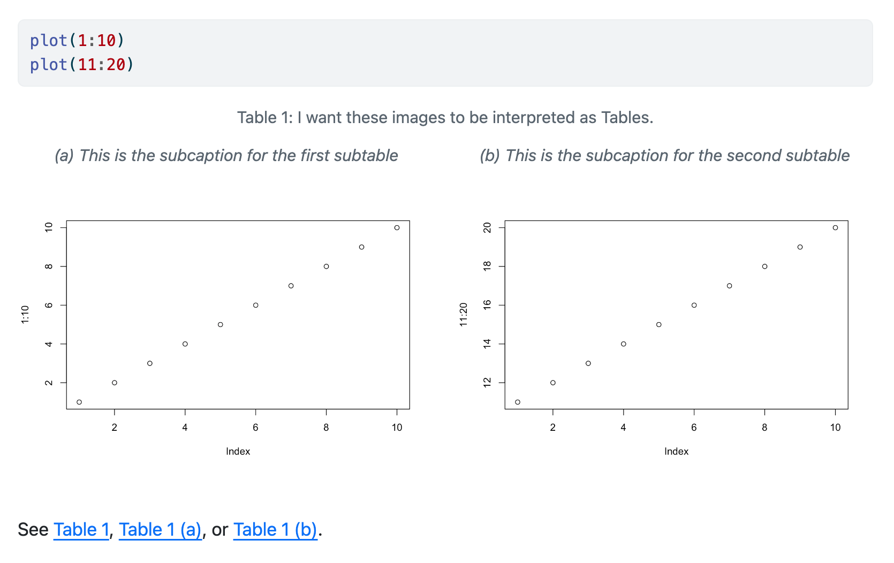

Quarto 1.6 has been officially released! You can get the current release from the [download page](https://quarto.org/docs/download/index.html).

We are particularly excited about:

- Support for **brand.yml**---a single file that defines your organization's branding and style preferences across formats.

- RevealJS updates, including the new navigation features: scroll mode and jump to slide.

- The `contents` shortcode for reordering your content.

- `landscape` blocks for placing content on a landscape page.

- Improvements in how you can specify subpanels of cross-references from code blocks.

You can read about these new features and a couple of breaking changes in the sections below. You can find all the changes in this version in the [Release Notes](https://quarto.org/docs/download/changelog/1.6/).

## Cross-format theming with **brand.yml**

[**brand.yml**](https://posit-dev.github.io/brand-yml/) is a Posit project outside Quarto that defines brand information using a simple YAML file. Quarto is a flagship adopter of **brand.yml** and supports brand-themed output for `html`, `dashboard`, `typst` and `revealjs` formats.

As an example, consider the following `_brand.yml` file:

**\_brand.yml**

``` yaml
color:
  palette:
    dark-grey: "#222222"
    blue: "#ddeaf1"
  background: blue
  foreground: dark-grey
  primary: black

logo: 
  medium: logo.png

typography:
  fonts:
    - family: Jura
      source: google
  base: Jura
  headings: Jura
```

When this `_brand.yml` is placed in a project, webpages, presentations, PDF reports, and dashboards will share a common appearance:

<table>
<colgroup>
<col style="width: 25%" />
<col style="width: 25%" />
<col style="width: 25%" />
<col style="width: 25%" />
</colgroup>
<tbody>
<tr>
<td style="text-align: left;"><div width="25.0%" data-layout-align="left">
<figure>

<figcaption aria-hidden="true">Webpage: <code>html</code></figcaption>
</figure>
</div></td>
<td style="text-align: left;"><div width="25.0%" data-layout-align="left">
<figure>

<figcaption aria-hidden="true">Dashboard <code>dashboard</code></figcaption>
</figure>
</div></td>
<td style="text-align: left;"><div width="25.0%" data-layout-align="left">
<figure>

<figcaption aria-hidden="true">Presentation: <code>revealjs</code></figcaption>
</figure>
</div></td>
<td style="text-align: left;"><div width="25.0%" data-layout-align="left">
<figure>

<figcaption aria-hidden="true">PDF: <code>typst</code></figcaption>
</figure>
</div></td>
</tr>
</tbody>
</table>

View the example: [Source](https://github.com/quarto-dev/quarto-examples/tree/main/brand/brand-simple#brand-simple) \| [Live website](https://examples.quarto.pub/brand-simple)

Get started by reading the Quarto [Guide to Brand](https://quarto.org/docs/authoring/brand.html).

## RevealJS update

Quarto v1.6 updates RevealJS to v5.1.0. With the update comes two notable features:

[**Jump to Slide**](https://quarto.org/docs/presentations/revealjs/presenting.html#jump-to-slide): Quickly navigate to a slide. Press `G` to activate, type a slide number or ID, and hit Enter/Return.

[**Scroll Mode**](https://quarto.org/docs/presentations/revealjs/presenting.html#scroll-view): Scroll rather than click to advance slides. Press `R`, add `?view=scroll` to your URL, or use the Navigation menu to activate. Automatically activated on small screens.

## Contents shortcode

The `contents` shortcode lets you compose content in one location in your document and then display it in another. For example, you might use a code cell to generate a plot:

```` markdown
```{python}
#| echo: false
#| label: a-cell
import matplotlib.pyplot as plt
plt.plot([1,2,3])
```
````

Then use the `contents` shortcode to display that plot in a callout by referencing its label, `a-cell`:

``` markdown
::: callout-note
## Note the following plot



:::
```

Find all the details on our guide page on the [contents shortcode](https://quarto.org/docs/authoring/contents.html).

## Landscape mode

In `pdf`, `docx,` and `typst` formats, you can now put content on a landscape page by placing it inside a [`landscape` block](https://quarto.org/docs/authoring/article-layout.html#landscape-mode):

``` markdown
::: {.landscape}

This will appear in landscape.

:::
```

## Cross-reference improvements

It should now be easier to get Quarto to recognize subfloats (subtables, subfigures, etc) when they're emitted by code cells. If the `subcap` attribute of a code cell has as many entries as the number of outputs from your code cell, Quarto knows to accept those as subfloats. See <a href="https://github.com/quarto-dev/quarto-cli/issues/10328" class="external">#10328</a> for details.

Minimal example:

```` markdown
```{{r}}
#| label: tbl-example
#| tbl-cap: I want these images to be interpreted as Tables.
#| tbl-subcap:
#|   - This is the subcaption for the first subtable
#|   - This is the subcaption for the second subtable
plot(1:10)
plot(11:20)
```
````

<figure>

<figcaption aria-hidden="true">The result of executing the above code cell in HTML format</figcaption>
</figure>

## Breaking Changes

We try very hard to keep Quarto backward compatible. However, in this release, there are a couple of breaking changes due to upstream dependencies. You may be affected if:

- **You have TypeScript files (`*.ts`) that you use either with pre- or post-render scripts, or with `quarto run`, that import Deno standard libraries.**

  The import syntax has changed. Please see [Deno Scripts](https://quarto.org/docs/projects/scripts.html#deno-scripts) for the necessary changes.

- **You override the LaTeX `graphics.tex` partial, or you have a completely custom LaTeX template that doesn't use the `graphics.tex` partial.**

  A Pandoc change means some images are now wrapped in `\pandocbounded`. Consequently, your `graphics.tex` partial, or your template, needs to define `\pandocbounded`. You can look at our <a href="https://github.com/quarto-dev/quarto-cli/blob/main/src/resources/formats/pdf/pandoc/graphics.tex" class="external">source code for <code>graphics.tex</code></a> to see the necessary changes and read more about the upstream change in <a href="https://github.com/jgm/pandoc/commit/26b25a4428815b04c255e33e95ee86ca7b6ee30e" class="external">Pandoc commit 26b25a4</a>.

## Acknowledgments

We want to say a huge thank you to everyone who contributed to this release by opening issues and pull requests:

[ArthurData](https://github.com/ArthurData),
[Blake-Madden](https://github.com/Blake-Madden),
[Coding4Sec](https://github.com/Coding4Sec),
[EricMarcon](https://github.com/EricMarcon),
[Fgazzelloni](https://github.com/Fgazzelloni),
[GeorgRamer](https://github.com/GeorgRamer),
[Gewerd-Strauss](https://github.com/Gewerd-Strauss),
[GuillaumeDehaene](https://github.com/GuillaumeDehaene),
[HarunCelikOtto](https://github.com/HarunCelikOtto),
[IULibScholComm](https://github.com/IULibScholComm),
[IndrajeetPatil](https://github.com/IndrajeetPatil),
[LeoLuongVuong](https://github.com/LeoLuongVuong),
[MarcellGranat](https://github.com/MarcellGranat),
[Mavoort](https://github.com/Mavoort),
[Nenuial](https://github.com/Nenuial),
[PeteArm](https://github.com/PeteArm),
[ShixiangWang](https://github.com/ShixiangWang),
[Steinthal](https://github.com/Steinthal),
[Walser52](https://github.com/Walser52),
[Xinenomine](https://github.com/Xinenomine),
[abbyruthe](https://github.com/abbyruthe),
[aborruso](https://github.com/aborruso),
[adamblake](https://github.com/adamblake),
[albert-ying](https://github.com/albert-ying),
[alecloudenback](https://github.com/alecloudenback),
[allefeld](https://github.com/allefeld),
[aronatkins](https://github.com/aronatkins),
[arthur-shaw](https://github.com/arthur-shaw),
[astrowonk](https://github.com/astrowonk),
[avras](https://github.com/avras),
[baker-jr-john](https://github.com/baker-jr-john),
[bcm0](https://github.com/bcm0),
[blackerby](https://github.com/blackerby),
[boshek](https://github.com/boshek),
[brandonmontez](https://github.com/brandonmontez),
[brianmsm](https://github.com/brianmsm),
[bryanhanson](https://github.com/bryanhanson),
[carschandler](https://github.com/carschandler),
[castedo](https://github.com/castedo),
[chaz-clark](https://github.com/chaz-clark),
[christopherkenny](https://github.com/christopherkenny),
[coatless](https://github.com/coatless),
[d-morrison](https://github.com/d-morrison),
[danieltomasz](https://github.com/danieltomasz),
[daxkellie](https://github.com/daxkellie),
[ddlawton](https://github.com/ddlawton),
[debruine](https://github.com/debruine),
[dsbitor](https://github.com/dsbitor),
[e-miz](https://github.com/e-miz),
[eculler](https://github.com/eculler),
[edavidaja](https://github.com/edavidaja),
[edvinsyk](https://github.com/edvinsyk),
[eitsupi](https://github.com/eitsupi),
[ethanwhite](https://github.com/ethanwhite),
[fermarsan](https://github.com/fermarsan),
[floesche](https://github.com/floesche),
[fradav](https://github.com/fradav),
[fredguth](https://github.com/fredguth),
[gadenbuie](https://github.com/gadenbuie),
[georgestagg](https://github.com/georgestagg),
[github-actions\[bot\]](https://github.com/apps/github-actions),
[halleysfifthinc](https://github.com/halleysfifthinc),
[hamelsmu](https://github.com/hamelsmu),
[hansfn](https://github.com/hansfn),
[harrylojames](https://github.com/harrylojames),
[hodgesmr](https://github.com/hodgesmr),
[holtzy](https://github.com/holtzy),
[hugetim](https://github.com/hugetim),
[hurak](https://github.com/hurak),
[iagopinal](https://github.com/iagopinal),
[isabelizimm](https://github.com/isabelizimm),
[itsmevictor](https://github.com/itsmevictor),
[jameslairdsmith](https://github.com/jameslairdsmith),
[javajon](https://github.com/javajon),
[jchiquet](https://github.com/jchiquet),
[jdfoote](https://github.com/jdfoote),
[jido](https://github.com/jido),
[jimjam-slam](https://github.com/jimjam-slam),
[jkrumbiegel](https://github.com/jkrumbiegel),
[jmgirard](https://github.com/jmgirard),
[jmhammond](https://github.com/jmhammond),
[joelostblom](https://github.com/joelostblom),
[johannes-menzel](https://github.com/johannes-menzel),
[juliantao](https://github.com/juliantao),
[jvcarli](https://github.com/jvcarli),
[kazuyanagimoto](https://github.com/kazuyanagimoto),
[kbvernon](https://github.com/kbvernon),
[kdheepak](https://github.com/kdheepak),
[kjohnsen](https://github.com/kjohnsen),
[lballabio](https://github.com/lballabio),
[leovan](https://github.com/leovan),
[loneguardian](https://github.com/loneguardian),
[longapalooza](https://github.com/longapalooza),
[lucacasonato](https://github.com/lucacasonato),
[lukmanaj](https://github.com/lukmanaj),
[lwjohnst86](https://github.com/lwjohnst86),
[machow](https://github.com/machow),
[maelle](https://github.com/maelle),
[masud90](https://github.com/masud90),
[melaniewalsh](https://github.com/melaniewalsh),
[mfisher87](https://github.com/mfisher87),
[mipmip](https://github.com/mipmip),
[mitzimorris](https://github.com/mitzimorris),
[mpr1255](https://github.com/mpr1255),
[nessan](https://github.com/nessan),
[neuwirthe](https://github.com/neuwirthe),
[nichtich](https://github.com/nichtich),
[njericha](https://github.com/njericha),
[nsarang](https://github.com/nsarang),
[olivroy](https://github.com/olivroy),
[ozanozbeker](https://github.com/ozanozbeker),
[paciorek](https://github.com/paciorek),
[pagiraud](https://github.com/pagiraud),
[parmsam](https://github.com/parmsam),
[pedrohbraga](https://github.com/pedrohbraga),
[peteole](https://github.com/peteole),
[produnis](https://github.com/produnis),
[raffaem](https://github.com/raffaem),
[ryarazi](https://github.com/ryarazi),
[ryjohnson09](https://github.com/ryjohnson09),
[s2t2](https://github.com/s2t2),
[salim-b](https://github.com/salim-b),
[samlalwani](https://github.com/samlalwani),
[sgelzenleuchter](https://github.com/sgelzenleuchter),
[skriptum](https://github.com/skriptum),
[snhansen](https://github.com/snhansen),
[stragu](https://github.com/stragu),
[sun123zxy](https://github.com/sun123zxy),
[sverrirarnors](https://github.com/sverrirarnors),
[topepo](https://github.com/topepo),
[truecluster](https://github.com/truecluster),
[tylere](https://github.com/tylere),
[winniehell](https://github.com/winniehell),
[xtimbeau](https://github.com/xtimbeau),
[yogabonito](https://github.com/yogabonito),
[yurivict](https://github.com/yurivict),
[yves-amevoin](https://github.com/yves-amevoin).

The palette emoji in the [listing and social card image](images/thumbnail.png) for this post comes from <a href="https://openmoji.org/" class="external">OpenMoji</a>-- the open-source emoji and icon project. License: <a href="https://creativecommons.org/licenses/by-sa/4.0/#" class="external">CC BY-SA 4.0</a>
