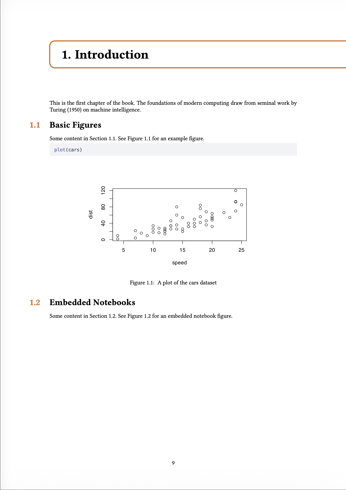
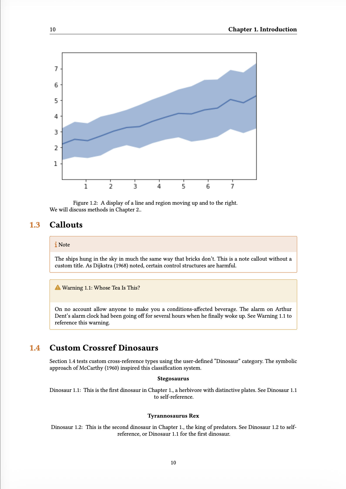
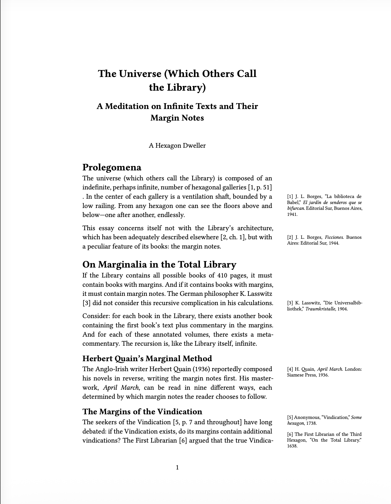

Typst is a lightning-fast typesetting system that provides a modern alternative to LaTeX.

The Typst ecosystem is thriving, and Quarto 1.9 brings Typst much closer to feature parity with LaTeX:

- Typst books
- Article layout in Typst
- Bundling of Typst packages for offline rendering

## Typst books

In Quarto 1.9, a project with type `book` and format `typst` is now rendered as a single document with multiple chapters and other book content.


``` yaml { filename="_quarto.yml" }
project:
  type: book

book:
  title: "My Book"
  author: "Jane Doe"
  chapters:
    - index.qmd
    - intro.qmd
    - summary.qmd

format: typst
```

<table>
<colgroup>
<col style="width: 25%" />
<col style="width: 25%" />
<col style="width: 25%" />
<col style="width: 25%" />
</colgroup>
<tbody>
<tr>
<td style="text-align: left;"><div width="25.0%" data-layout-align="left">
<figure>

<figcaption aria-hidden="true">Part page</figcaption>
</figure>
</div></td>
<td style="text-align: left;"><div width="25.0%" data-layout-align="left">
<figure>

<figcaption aria-hidden="true">Chapter page</figcaption>
</figure>
</div></td>
<td style="text-align: left;"><div width="25.0%" data-layout-align="left">
<figure>

<figcaption aria-hidden="true">Chapter content</figcaption>
</figure>
</div></td>
<td style="text-align: left;"><div width="25.0%" data-layout-align="left">
<figure>

<figcaption aria-hidden="true">Next chapter</figcaption>
</figure>
</div></td>
</tr>
</tbody>
</table>

All book features previously available in the LaTeX format are now available in Typst:

- Parts and Chapters
- Appendices
- Cross-references and chapter-based numbering
- Table of Contents

List-of-Figures and List-of-Tables support is [coming soon](https://github.com/quarto-dev/quarto-cli/issues/14081).

The default Typst book uses the bundled Quarto [quarto-orange-book](https://github.com/quarto-ext/orange-book) extension, which uses [`typst-gather`](#typst-gather) to bundle the Typst [orange-book](https://typst.app/universe/package/orange-book) package. Orange-book provides a textbook-style layout with colored chapter headers and sidebars.

The orange-book extension supports [brand.yml](https://quarto.org/docs/authoring/brand.html) customization --- it uses the `primary` color for chapter headers and sidebars, and the `medium` logo on the title page. The screenshots above were generated with this `_brand.yml`:


``` yaml { filename="_brand.yml" }
color:
  primary: "#F36619"
  secondary: "#2E86AB"

logo:
  images:
    test-logo:
      path: logo.svg
      alt: "Test Logo"
  medium: test-logo
```

Since Typst books are implemented as Quarto [Format Extensions](https://quarto.org/docs/extensions/formats.html), you can customize the appearance by creating your own extension. Typst partials define the overall book structure, while Lua filters handle the necessary AST transformations.

## Article layout in Typst

Also in Quarto 1.9, all [Article Layout](https://quarto.org/docs/authoring/article-layout.html) features now work in Typst, via the Typst [Marginalia](https://typst.app/universe/package/marginalia/) package.

Specifically:

- Figures, tables, code listings, and equations can be placed in the margin using the `.column-margin` class or the `column: margin` code cell option.
- You can also target specific output types with `fig-column: margin` or `tbl-column: margin`.
- Figure, table, and code listing captions can be placed in the margin with `cap-location: margin` (or `fig-cap-location: margin` and `tbl-cap-location: margin` for specific types).
- Footnotes and citations can be displayed in the margin with `reference-location: margin` and `citation-location: margin`. When margin citations are enabled, the bibliography is suppressed.
- Asides (`.aside` class) place content in the margin without a footnote number.

<table style="width:100%;">
<colgroup>
<col style="width: 33%" />
<col style="width: 33%" />
<col style="width: 33%" />
</colgroup>
<tbody>
<tr>
<td style="text-align: left;"><div width="33.3%" data-layout-align="left">
<figure>

<figcaption aria-hidden="true">Margin note and figure</figcaption>
</figure>
</div></td>
<td style="text-align: left;"><div width="33.3%" data-layout-align="left">
<figure>

<figcaption aria-hidden="true">Margin captions</figcaption>
</figure>
</div></td>
<td style="text-align: left;"><div width="33.3%" data-layout-align="left">
<figure>

<figcaption aria-hidden="true">Margin references</figcaption>
</figure>
</div></td>
</tr>
</tbody>
</table>

<div class="callout callout-warning" role="note" aria-label="Warning">
<div class="callout-header">
<span class="callout-title">Books with article layout are functional, but need work</span>
</div>
<div class="callout-body">

You can combine book and article layout, but there are some layout quirks when combining the two. We'll work with the orange-book author to integrate Marginalia into the book template.

</div>
</div>

## `typst-gather`

Quarto 1.9 automatically stages Typst packages --- from your extensions, from Quarto's bundled extensions, and from Quarto itself --- into the `.quarto/` cache directory before calling `typst compile`. This means Typst documents render offline without needing network access.

To make this work, extension authors use the new [`typst-gather`](https://quarto.org/docs/advanced/typst/typst-gather.html) tool, which scans their `.typ` files for `@preview` imports and downloads the packages into the extension directory. Authors run `quarto call typst-gather` and commit the results. Users of the extension will have the packages staged without any downloads.

This means [Custom Typst Formats](https://quarto.org/docs/output-formats/typst-custom.html#custom-formats) can depend on Typst packages without copying and pasting Typst code, making them simpler and easier to maintain.

Both Typst books and article layout are built on `typst-gather` --- orange-book depends on the Typst [orange-book](https://typst.app/universe/package/orange-book) package, and article layout depends on [Marginalia](https://typst.app/universe/package/marginalia/). As the Typst package ecosystem grows, we're excited to see what the community builds with Typst packages.
