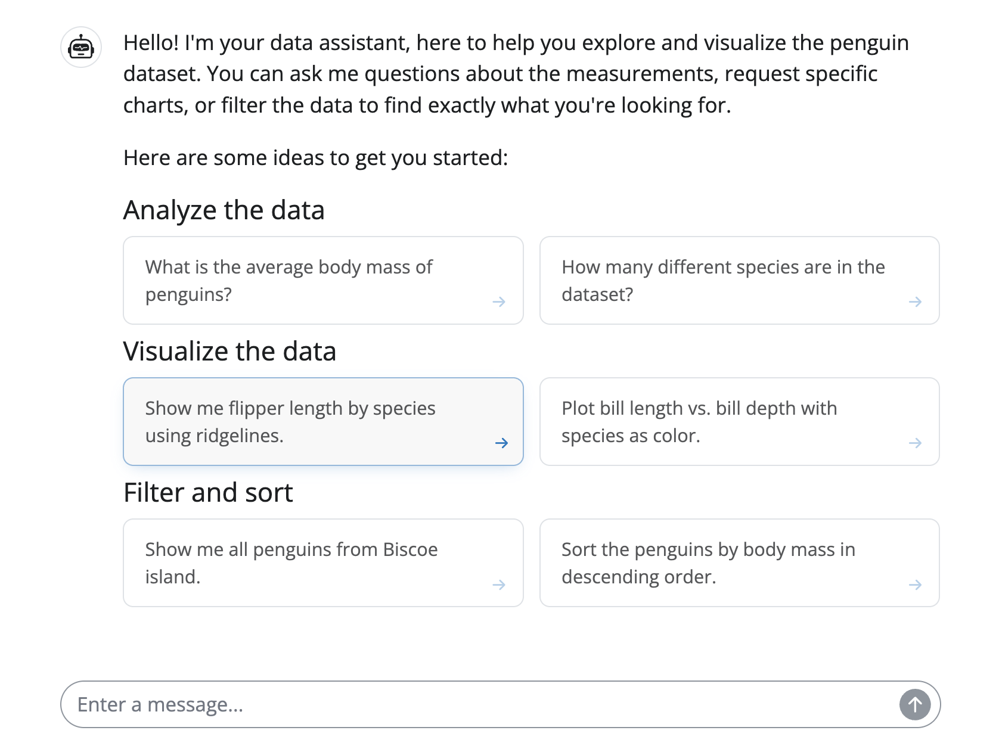
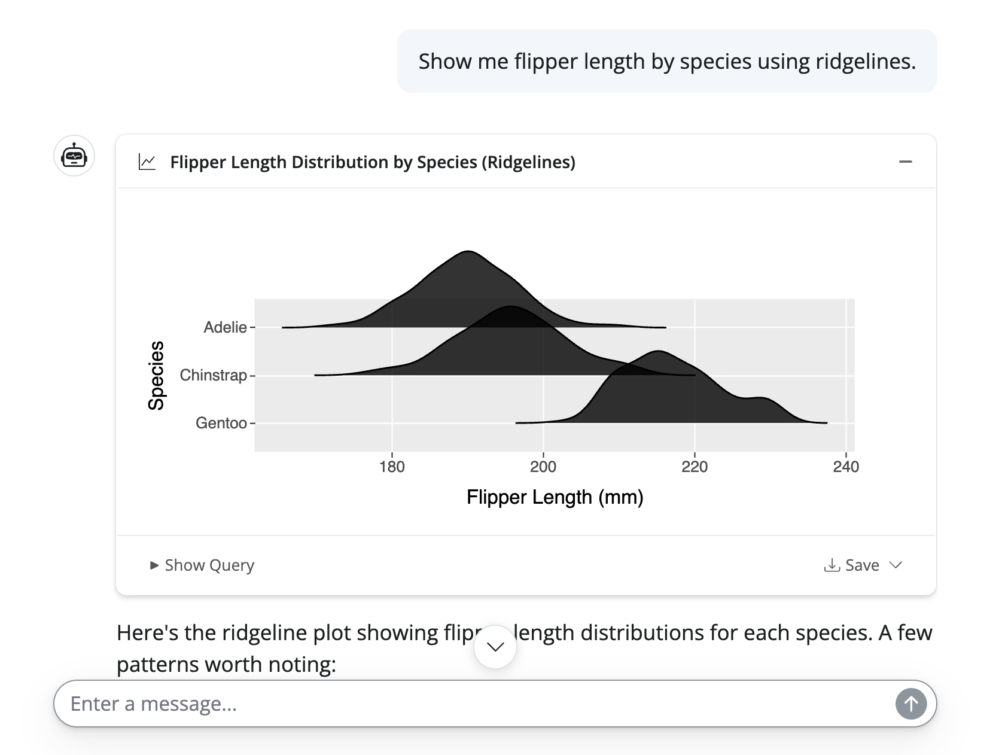
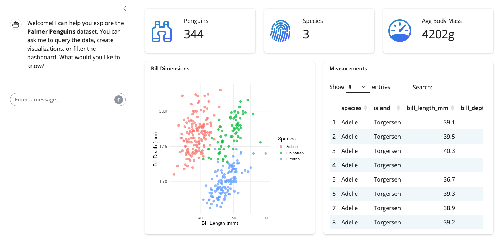

I'm super excited to announce that [querychat](https://posit-dev.github.io/querychat/) now supports [ggsql](../../blog/2026-04-20_ggsql_alpha_release/). As a result, querychat users can now go beyond predetermined dashboard views and ask the LLM for bespoke visualizations on the fly. With this addition, `querychat` now comes with three pre-built tools that LLMs can use in response to user questions:

1.  **Visualize:** execute `ggsql` queries, rendered as visualizations in the chat.
2.  **Query:** execute SQL queries, rendered as tables/text in the chat.
3.  **Filter:** execute filter SQL queries on predetermined views, allowing the LLM to reactively drill into the data in response to user questions.

Equipped with these tools, your dashboard can offer a balance between "curated insights" and "explorable data" --- surfacing interesting trends and summaries upfront, but also letting users ask follow-up questions that go beyond the predetermined views. The video below gives you a feel for this workflow in action.[^1] Note how the conversation starts off by filtering the predetermined views, but then progresses into more general exploration.



Crucially, every one of `querychat`'s tools works by executing SQL (or `ggsql`) --- never arbitrary code. Every query is also fully visible and reproducible: users can inspect the code behind any response, and copy it to run independently. In the next version of `querychat`, you can also expect to see a rich export capability, allowing you to save the insights you care about in a format you care about (e.g. a Quarto dashboard, Jupyter notebook, or R Markdown file).

Restricting `querychat`'s code execution capability to SQL (or `ggsql`) is an intentional design choice. SQL can be locked down so that the LLM literally cannot modify your data, making it viable for production environments where security and control aren't optional. As a result, `querychat` may not be as capable as a general coding assistant like [Posit Assistant](https://posit-dev.github.io/assistant), but you generally don't want production apps that let users execute arbitrary code anyway. By focusing on SQL execution, `querychat` can maintain a strong security posture while still enabling useful exploration of data via natural language.

## Get started

Getting started is as easy as pointing `QueryChat()` at your data source and getting set up with an LLM. Although we recommend frontier models for an ideal experience, open-weight models have recently become [quite capable](https://simonpcouch.com/blog/2026-04-16-local-agents-2/), and can be a great way to get started without needing API access or incurring costs.

For this article, I'm using [LMStudio](https://lmstudio.ai/) to run `google/gemma-4-26b-a4b` locally on my fairly standard MacBook Pro. If you prefer a different LLM or provider, refer to the [docs](https://posit-dev.github.io/querychat/py/models.html) ([R](https://posit-dev.github.io/querychat/r/articles/models.html)) to see how to configure.

Once you've picked an LLM, next step is ensuring both `querychat` and `ggsql` are installed. Here we'll also use the `palmerpenguins` data set to keep examples lightweight and self-contained, but you can point `querychat` at anything from a data frame to a [remote database connection](https://posit-dev.github.io/querychat/py/data-sources.html) ([R](https://posit-dev.github.io/querychat/r/articles/data-sources.html)).

<div class="panel-tabset" data-tabset-group="language">
<ul id="tabset-1" class="panel-tabset-tabby">
<li><a data-tabby-default href="#tabset-1-1">Python</a></li>
<li><a href="#tabset-1-2">R</a></li>
</ul>
<div id="tabset-1-1">

``` bash
pip install "querychat[viz]" palmerpenguins
```

</div>
<div id="tabset-1-2">

``` r
install.packages(c("querychat", "ggsql", "palmerpenguins"))
```

</div>
</div>

## Basic usage

Once installed, you can get a basic chat UI using the code below. We'll include just the `query` and `visualize` tools here since the `filter` tool is designed to work in the context of a larger dashboard, which we'll cover in the next section.

<div class="panel-tabset" data-tabset-group="language">
<ul id="tabset-2" class="panel-tabset-tabby">
<li><a data-tabby-default href="#tabset-2-1">Python</a></li>
<li><a href="#tabset-2-2">R</a></li>
</ul>
<div id="tabset-2-1">

``` python { filename="app.py" }
from shiny.express import ui
from querychat.express import QueryChat
from palmerpenguins import load_penguins

qc = QueryChat(
    load_penguins(), 
    "penguins", 
    client="lmstudio/google/gemma-4-26b-a4b",
    tools=("query", "visualize")
)

qc.ui()

ui.page_opts(fillable=True)
```

With `app.py` saved locally and your LLM running, start the app with:

``` bash
shiny run app.py
```

</div>
<div id="tabset-2-2">

``` r { filename="app.R" }
library(shiny)
library(querychat)
library(palmerpenguins)

qc <- QueryChat$new(
  penguins,
  client = "lmstudio/google/gemma-4-26b-a4b",
  tools = c("query", "visualize")
)

ui <- bslib::page_fillable(qc$ui())
server <- function(input, output, session) { qc$server() }
shinyApp(ui, server)
```

With `app.R` saved locally and your LLM running, start the app with:

``` r
shiny::runApp("app.R")
```

</div>
</div>

Upon opening the app, the LLM greets us with a welcome message tailored to the data source we've provided:



### Query tool

For questions addressable via numerical summaries, the LLM requests the `query` tool with relevant SQL. The LLM may also choose to collapse details of the tool call, especially when it decides to weave the results within its actual response. That said, full details can always be inspected by clicking on the "Query Data" tool call display:


### Visualize tool

For questions that are better suited to a visual response, the LLM requests the `visualize` tool with relevant ggsql. In addition to rendering the plot inline for the user to see, that same plot is also provided to the LLM so that it can interpret the result:



A couple noteworthy things about this experience:

- The footer includes options to view the underlying ggsql query, download the plot as an image, and expand the display to full screen.
- Plots are always shown by default, but can be collapsed by clicking the header.

This hopefully gives you a taste for how easy it is to get set up with a basic `querychat` UI and start asking questions of your data.
You may, however, be wondering how `querychat` is able to produce correct queries and how the code execution actually works. Let's dive into those details next.

## How does it work?

### Execution

One important thing to understand about `querychat` is that the LLM itself is not handling the SQL execution -- `querychat` is. Where that execution ultimately happens depends on what data source you're providing. If you're pointing `querychat` at an in-memory data frame, the execution happens in-process using DuckDB. If you're pointing it at a database connection, the execution happens against that database. In either case, the LLM is generating queries based on its understanding of the data schema and any additional context you've provided, not the actual data. This separation is what allows `querychat` to maintain a strong security posture, scale to large data, and deliver a good user experience.

### Schema discovery

To elaborate on what "understanding of the data schema" actually means: when you point `querychat` at a data source, it automatically extracts column names, types, numerical ranges, and categorical values. This information is included in the system prompt for the LLM, so it has a clear picture of what the data looks like and can generate accurate queries without needing to see the actual data. For many datasets, this is enough to get good results out of the box.

### Additional context

For more complex datasets or domain-specific questions, you can also provide additional context through a plain-text data description. `querychat` now also automatically picks up on [Snowflake Semantic Models](https://www.snowflake.com/en/developers/guides/snowflake-semantic-view/) when connected to a Snowflake database, giving the LLM access to authoritative definitions of business logic and metrics without any manual configuration. We hope to add more integrations to other semantic layer formats in the future.

To learn more, `querychat`'s website has more details on [data sources](https://posit-dev.github.io/querychat/py/data-sources.html) ([R](https://posit-dev.github.io/querychat/r/articles/data-sources.html)), [providing context](https://posit-dev.github.io/querychat/py/context.html) ([R](https://posit-dev.github.io/querychat/r/articles/context.html)), and [tool execution](https://posit-dev.github.io/querychat/py/tools.html) ([R](https://posit-dev.github.io/querychat/r/articles/tools.html)).

## Chat-driven dashboards

A chat interface alone likely isn't the experience you want to ship to end users --- the better pattern is to surface interesting findings first, then let users explore beyond them. This is where `querychat` begins to really shine: the chat interface we already covered can easily be embedded inside of a larger app that includes other outputs -- plots, tables, value boxes, etc. `querychat` comes with another tool designed for this use case -- the filter tool -- allowing the LLM to effectively drill down into relevant sections of the data in the dashboard in response to user questions.

The key integration point is `df()`, a reactive value that reflects the current state of the data after any filtering applied by the LLM. Use `df()` as the data source for your plots, tables, and value boxes, and they'll automatically update in response to user questions in the chat.

<style>
style + .panel-tabset .highlight .chroma {
  max-height: 500px;
  overflow-y: auto !important;
}
</style>
<div class="panel-tabset" data-tabset-group="language">
<ul id="tabset-3" class="panel-tabset-tabby">
<li><a data-tabby-default href="#tabset-3-1">Python</a></li>
<li><a href="#tabset-3-2">R</a></li>
</ul>
<div id="tabset-3-1">

``` python { filename="app.py" }
from shiny.express import render, ui
from querychat.express import QueryChat
from palmerpenguins import load_penguins
from faicons import icon_svg

qc = QueryChat(
    load_penguins(),
    "penguins",
    client="lmstudio/google/gemma-4-26b-a4b",
    tools=("filter", "query", "visualize")
)

qc.sidebar()

with ui.layout_columns(fill=False):
    with ui.value_box(showcase=icon_svg("binoculars")):
        "Penguins"
        @render.text
        def count():
            return len(qc.df())

    with ui.value_box(showcase=icon_svg("fingerprint")):
        "Species"
        @render.text
        def species():
            return qc.df()["species"].nunique()

    with ui.value_box(showcase=icon_svg("gauge-high")):
        "Avg Body Mass"
        @render.text
        def avg_mass():
            return f"{qc.df()['body_mass_g'].mean():.0f}g"

with ui.layout_columns():
    with ui.card():
        ui.card_header("Bill Dimensions")
        @render.plot
        def scatter():
            import plotnine as p9
            
            return (
                p9.ggplot(qc.df(), p9.aes("bill_length_mm", "bill_depth_mm", color="species"))
                + p9.geom_point()
            )

    with ui.card():
        ui.card_header("Measurements")
        @render.data_frame
        def table():
            return qc.df()

ui.page_opts(fillable=True)
```

</div>
<div id="tabset-3-2">

``` r { filename="app.R" }
library(shiny)
library(bslib)
library(querychat)
library(DT)
library(ggplot2)
library(palmerpenguins)

qc <- QueryChat$new(
  penguins,
  client = "lmstudio/google/gemma-4-26b-a4b",
  tools = c("filter", "query", "visualize")
)

ui <- page_sidebar(
  sidebar = qc$sidebar(),
  layout_columns(
    fill = FALSE,
    value_box("Penguins", textOutput("count"), showcase = bsicons::bs_icon("binoculars")),
    value_box("Species", textOutput("species"), showcase = bsicons::bs_icon("fingerprint")),
    value_box("Avg Body Mass", textOutput("avg_mass"), showcase = bsicons::bs_icon("speedometer"))
  ),
  layout_columns(
    card(card_header("Bill Dimensions"), plotOutput("scatter")),
    card(card_header("Measurements"), DTOutput("table"))
  )
)

server <- function(input, output, session) {
  qc_vals <- qc$server()
  df <- qc_vals$df
  output$count <- renderText(nrow(df()))
  output$species <- renderText(length(unique(df()$species)))
  output$avg_mass <- renderText(paste0(round(mean(df()$body_mass_g, na.rm = TRUE)), "g"))
  output$scatter <- renderPlot({
    ggplot(df(), aes(bill_length_mm, bill_depth_mm, color = species)) +
      geom_point()
  })
  output$table <- renderDT(df())
}

shinyApp(ui, server)
```

</div>
</div>



<div class="callout callout-note" role="note" aria-label="Note">
<div class="callout-header">
<span class="callout-title">Python users: Shiny v Streamlit/Dash/Gradio</span>
</div>
<div class="callout-body">

`querychat` also supports `streamlit`, `dash`, and `gradio`. That said, the reactive `df()` pattern shown above --- where the LLM's filter state automatically drives every view in the app --- is what Shiny's reactive programming model was designed for. In other frameworks, keeping the chat's state in sync with multiple outputs typically requires more manual wiring.

</div>
</div>

## Custom tools

`querychat` comes with three built-in tools, but you can also easily add your own custom tools. This is possible thanks to the extensible foundation provided by [chatlas](https://posit-dev.github.io/chatlas/) ([ellmer](https://ellmer.tidyverse.org)). These packages also make it quite easy to implement tools -- all you really need is a Python / R function that performs some operation. You can also fully customize the display shown, thanks to their rich support for [tool call displays](https://posit-dev.github.io/chatlas/tool-calling/displays.html) ([R](https://posit-dev.github.io/shinychat/r/articles/tool-ui.html)).

To give you a sense of what other capabilities are possible, you could start out as simple as querying [real-time weather information](https://posit-dev.github.io/chatlas/get-started/tools.html), but also get as sophisticated as a [RAG-like knowledge retrieval agent](https://posit-dev.github.io/chatlas/misc/RAG.html#dynamic-retrieval). For example, here's how you'd let users ask whether weather conditions might relate to trends in your data:

<div class="panel-tabset" data-tabset-group="language">
<ul id="tabset-4" class="panel-tabset-tabby">
<li><a data-tabby-default href="#tabset-4-1">Python</a></li>
<li><a href="#tabset-4-2">R</a></li>
</ul>
<div id="tabset-4-1">

``` python
import requests
from querychat.express import QueryChat
from chatlas import ChatLMStudio
from palmerpenguins import load_penguins

chat_client = ChatLMStudio(model="lmstudio/google/gemma-4-26b-a4b")

def get_current_weather(lat: float, lng: float):
    """Get the current weather for a location."""
    lat_lng = f"latitude={lat}&longitude={lng}"
    url = f"https://api.open-meteo.com/v1/forecast?{lat_lng}&current=temperature_2m,wind_speed_10m&hourly=temperature_2m,relative_humidity_2m,wind_speed_10m"
    response = requests.get(url)
    return response.json()["current"]

chat_client.register_tool(get_current_weather)

qc = QueryChat(
    load_penguins(),
    "penguins",
    client=chat_client
)
```

</div>
<div id="tabset-4-2">

``` r
library(querychat)
library(ellmer)

chat_client <- chat_lmstudio(model = "lmstudio/google/gemma-4-26b-a4b")

get_current_weather <- function(lat, lng) {
  lat_lng <- paste0("latitude=", lat, "&longitude=", lng)
  url <- paste0("https://api.open-meteo.com/v1/forecast?", lat_lng, "&current=temperature_2m,wind_speed_10m&hourly=temperature_2m,relative_humidity_2m,wind_speed_10m")
  response <- httr::GET(url)
  httr::content(response)$current
}

chat_client$register_tool(
  tool(
    get_current_weather,
    "Get the current weather for a location",
    lat = type_number("Latitude"),
    lng = type_number("Longitude")
  )
)

qc <- QueryChat$new(
  palmerpenguins::penguins,
  client = chat_client
)
```

</div>
</div>

Underneath the hood, `querychat`'s built-in tools use this same foundation. The "magic" of these tools really breaks down to three key insights:

1.  LLMs are very good at translating natural language into code.
2.  Tool call arguments can be executable code (like SQL or ggsql) rather than just simple values.
3.  Tool calls can [manage reactive state in a Shiny app](https://shiny.posit.co/py/docs/genai-tools.html#managing-state) --- for `querychat`, that state is the current filter query, but the same pattern could control input controls, tab selection, or other UI state.

## What's next?

This release is just the beginning of our vision for (responsibly) exploring data via natural language. We're excited to see what you build with it, and we're already thinking about the next set of features to add. Some things on our near-term roadmap:

- Multiple tables.
- Reproducible takeaway artifacts, like [Quarto dashboards](https://quarto.org/docs/dashboards/)
- Support for more semantic layer solutions beyond Snowflake, so more users can give the LLM authoritative definitions of their business logic.

## Learn more

- [querychat documentation](https://posit-dev.github.io/querychat/py/) ([R](https://posit-dev.github.io/querychat/r/)) --- full guides on data sources, context, tools, and deployment
- [ggsql](https://ggsql.org) --- the grammar of graphics for SQL that powers querychat's visualizations
- [chatlas](https://posit-dev.github.io/chatlas/) ([ellmer](https://ellmer.tidyverse.org)) --- the underlying LLM tool-calling libraries, useful for building custom tools
- [shinychat](https://posit-dev.github.io/shinychat/py/) ([R](https://posit-dev.github.io/shinychat/r/)) --- the chat UI component that querychat builds on
- [Shiny](https://shiny.posit.co/py/) ([R](https://shiny.posit.co/r/)) --- the web framework powering querychat apps
- [Source on GitHub](https://github.com/posit-dev/querychat) --- issues, discussions, and contributions welcome

[^1]: [Source code](https://gist.github.com/cpsievert/ca0d7e4637fdf994671c9d9fc90cd89f) is available for reference, though you'll need your own Snowflake account and credentials to run it.
