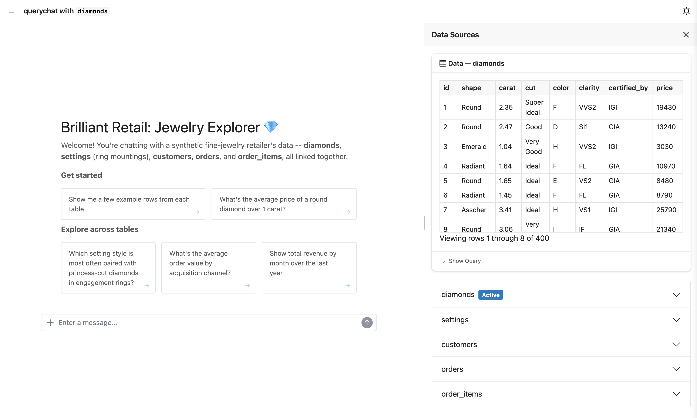
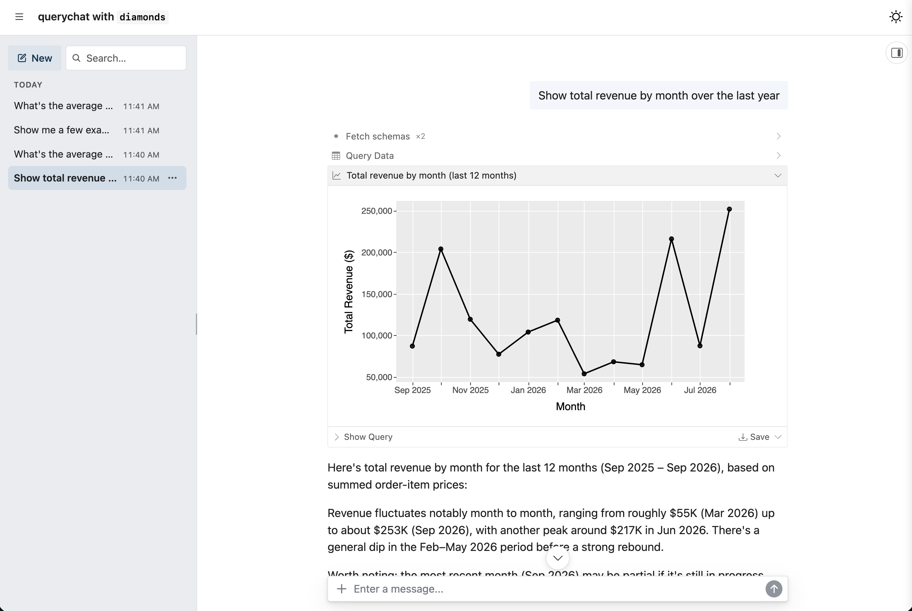
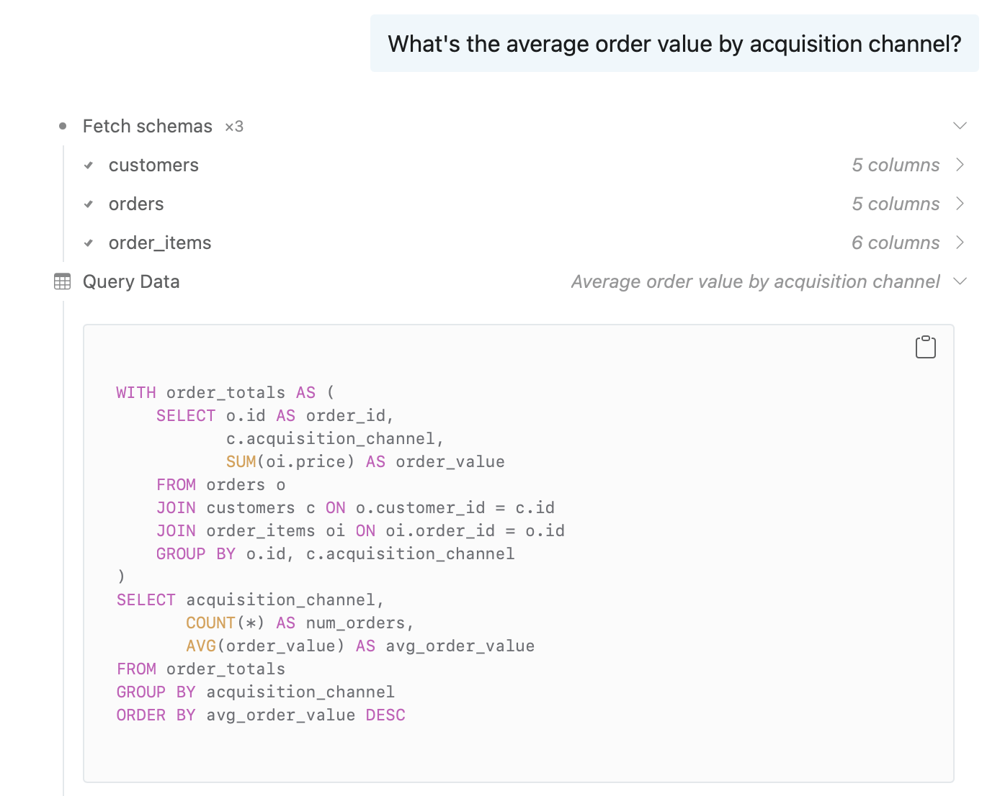
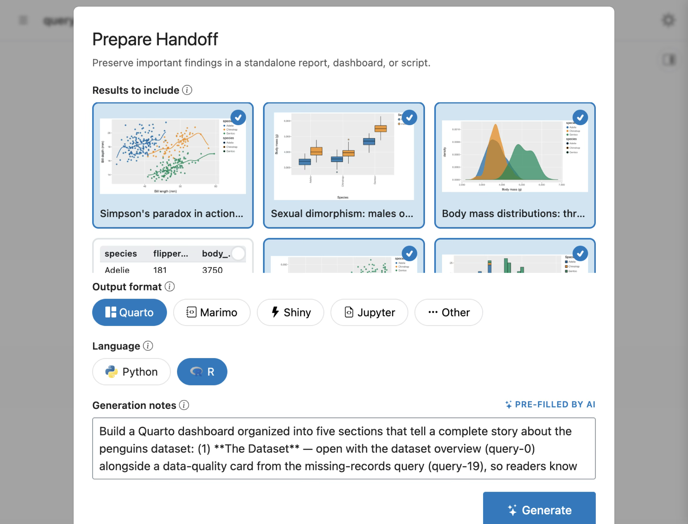
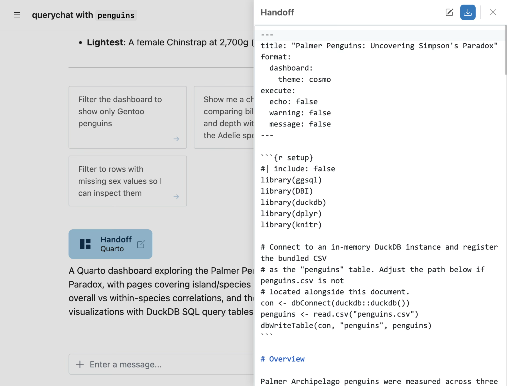

I'm thrilled to share the latest `querychat` release for both R (v0.4.0) and Python (v0.9.0). Grab the latest from CRAN or PyPI:

<div class="panel-tabset" data-tabset-group="language">
<ul id="tabset-1" class="panel-tabset-tabby">
<li><a data-tabby-default href="#tabset-1-1">R</a></li>
<li><a href="#tabset-1-2">Python</a></li>
</ul>
<div id="tabset-1-1">

``` r
install.packages("querychat")
```

</div>
<div id="tabset-1-2">

``` bash
pip install -U querychat
```

</div>
</div>

This release adds several headline features including support for multiple tables, `data-dict.yml`, a chat-first UI API, and support for pins. It also builds upon [shinychat's recent momentum](../shinychat-r-0.5.0-python-0.7.1/index.qmd); as a result, chat features like history, file attachments, etc., come basically for free to `querychat`. It also updates `querychat_app()` to be chat-first, leaning into it being a quick and useful way to start chatting with data and getting bespoke [`ggsql` visualizations](../querychat-ggsql/index.qmd) back.

See the [R release notes](https://github.com/posit-dev/querychat/blob/main/pkg-r/NEWS.md) and the [Python changelog](https://github.com/posit-dev/querychat/blob/main/pkg-py/CHANGELOG.md) for the complete list, including [a few changes for existing apps](#a-few-changes-for-existing-apps) if you're upgrading.

## New chat-first UI

`querychat_app()` / `QueryChat.app()` now put the chat front and center (built on shinychat's `page_chat()`), leaving more breathing room for things you create within the chat.

<div class="panel-tabset" data-tabset-group="language">
<ul id="tabset-2" class="panel-tabset-tabby">
<li><a data-tabby-default href="#tabset-2-1">R</a></li>
<li><a href="#tabset-2-2">Python</a></li>
</ul>
<div id="tabset-2-1">

``` r
library(palmerpenguins)

querychat_app(penguins)
```

</div>
<div id="tabset-2-2">

``` python
from querychat import QueryChat
from palmerpenguins import load_penguins

qc = QueryChat(load_penguins(), "penguins")
qc.app()
```

</div>
</div>
<script src="https://fast.wistia.com/player.js" async></script>
<script src="https://fast.wistia.com/embed/xe4aalo9yw.js" async type="module"></script>
<style>wistia-player[media-id='xe4aalo9yw']:not(:defined) { background: center / contain no-repeat url('https://fast.wistia.com/embed/medias/xe4aalo9yw/swatch'); display: block; filter: blur(5px); padding-top:75.21%; }</style>

<wistia-player media-id="xe4aalo9yw" aspect="1.3296296296296297"></wistia-player>

A view of the actual data is always accessible via the data source drawer on the right-hand side. In the case of [multiple tables](#multiple-tables), you'll see the "active" table, as well as other available tables below it.[^1]



The new `$page()` / `.page()` method on `QueryChat` make it possible to bring this same chat-first UI experience to your own custom apps. This way, you can deliver a "chat forward" experience that also contains other custom views on other `pages`, in the `drawer`, or in the `sidebar`.

Learn more about building custom apps in [R](https://posit-dev.github.io/querychat/r/articles/build.html) and [Python](https://posit-dev.github.io/querychat/py/build.html).

<div class="panel-tabset" data-tabset-group="language">
<ul id="tabset-3" class="panel-tabset-tabby">
<li><a data-tabby-default href="#tabset-3-1">R</a></li>
<li><a href="#tabset-3-2">Python</a></li>
</ul>
<div id="tabset-3-1">

``` r
qc <- QueryChat$new(penguins, "penguins")
ui <- qc$page("Penguins Explorer")
```

</div>
<div id="tabset-3-2">

``` python
from querychat.express import QueryChat
from palmerpenguins import load_penguins

qc = QueryChat(load_penguins(), "penguins")
qc.page("Penguins Explorer")
```

</div>
</div>

## Conversation history

Another major improvement is persistent conversation history (mostly thanks to `shinychat`). In addition to starting new chats, and returning to previous ones; conversation now also persists across page reloads, timeouts, etc. As a result, it is now much more difficult to lose your progress.



Also, now that `shinychat` now supports things like [editable messages](https://opensource.posit.co/blog/2026-09-15_shinychat-r-0.5.0-python-0.7.1/#edit-a-message-and-compare-answers), [canceling responses](https://opensource.posit.co/blog/2026-09-15_shinychat-r-0.5.0-python-0.7.1/#stream-responses-and-show-thinking), [file attachments](https://opensource.posit.co/blog/2026-09-15_shinychat-r-0.5.0-python-0.7.1/#stream-responses-and-show-thinking), etc. `querychat` now does as well.

## Multiple tables

`querychat` now supports multiple tables in a single chat instance. If those tables reside in a singular source (i.e., a database connection), add them all in one fell swoop via `$add_tables()` / `.add_tables()`.

<div class="panel-tabset" data-tabset-group="language">
<ul id="tabset-4" class="panel-tabset-tabby">
<li><a data-tabby-default href="#tabset-4-1">R</a></li>
<li><a href="#tabset-4-2">Python</a></li>
</ul>
<div id="tabset-4-1">

``` r
library(querychat)

qc <- QueryChat$new()
qc$add_tables(db, c("customers", "orders", "order_items"))
```

</div>
<div id="tabset-4-2">

``` python
from querychat import QueryChat

qc = QueryChat()
qc.add_tables(db, ["customers", "orders", "order_items"])
```

</div>
</div>

As shown below, if those tables are meaningfully related, it's query and visualize tools can also handle joins across those tables. In addition, to help with cost and scaling to many tables, `querychat` now has a "Fetch schema" tool to gather context on the data before doing anything with it.



If you're building a custom app ([R](https://posit-dev.github.io/querychat/r/articles/build.html)/[Py](https://posit-dev.github.io/querychat/py/build.html)), you can reactively read a particular table through a new `$table()` / `.table()` accessor in your server-side code. This allows the `querychat` agent to filter predetermined views if that happens to relate to the user's query.

<div class="panel-tabset" data-tabset-group="language">
<ul id="tabset-5" class="panel-tabset-tabby">
<li><a data-tabby-default href="#tabset-5-1">R</a></li>
<li><a href="#tabset-5-2">Python</a></li>
</ul>
<div id="tabset-5-1">

``` r
output$order_price <- renderPlot({
  orders_tbl <- qc$table("orders")
  # LLM can perform filter queries on $df()
  orders_df <- orders_tbl$df()
  hist(orders_df$price)
})
```

</div>
<div id="tabset-5-2">

``` python
@render.plot
def _():
  orders_tbl = qc.table("orders")
  # LLM can perform filter queries on .df()
  orders_df = orders_tbl.df()
  plt.hist(orders_df["price"])
```

</div>
</div>

## Provide context: `data-dict`

With more than one table in play, giving the LLM context matters more. A **data dictionary** --- a YAML file following the [data-dict](https://data-dict.tidyverse.org/) spec --- lets you annotate tables and columns with plain-English descriptions, and is now the preferred way to describe your data, especially across multiple tables:

``` yaml
tables:
  orders:
    description: One row per customer order.
    columns:
      customer_id:
        description: Foreign key to the customers table.
```

Pass it in as `data_dict = "dictionary.yml"` (R) / `data_dict="dictionary.yml"` (Python), and querychat only asks the LLM to look up schema details that the dictionary doesn't already cover.

## Extract insights: `/handoff`

At a certain point, you've likely generated a bunch of insights via `querychat` --- some of them useful, some of them maybe not so useful. Wouldn't it be nice if we could extract the useful stuff in a reproducible artifact independent of the query chat app?

This is the core idea behind the new **`/handoff`** slash command. Just type `/handoff` into the chat input, which will trigger a wizard where you can select the results that matter, the format of interest (e.g., Quarto, Marimo, Shiny, Jupyter), and additional presentation instructions for the LLM to follow when generating the handoff document.



Once you've completed the wizard, source code for the handoff document will start streaming into a code editor. Here you can further revise manually or with AI assistance. There is also a download button, which will yield a zip bundle with the handoff document, a README file, and data sources (if they're small enough).



## More data sources: `PinSource`

A new `PinSource` lets you chat with datasets pinned to a [pins](https://pins.rstudio.com/) board --- parquet, CSV, JSON, or RDS --- using the pin's title, description, and tags as a starting data description. Multiple pins, or pins mixed with ordinary data frames, now work together in one chat: everything is materialized into a shared DuckDB connection behind the scenes, so the LLM can join and filter across all of it.

Construction is also more flexible when the data source depends on the session: `table_name` is now optional when deferring construction (`QueryChat$new(NULL)` / `QueryChat(None, table_name=...)`), and `$server()` / `.server()` can name the table per session --- useful when the data source itself is only known once a user's Shiny session starts.

## A few changes for existing apps

This release also includes a handful of breaking changes, mostly around how querychat manages connections and bookmarking now that history is built in. If you're upgrading, skim the [R NEWS](https://github.com/posit-dev/querychat/blob/main/pkg-r/NEWS.md) or [Python CHANGELOG](https://github.com/posit-dev/querychat/blob/main/pkg-py/CHANGELOG.md) breaking-changes sections before you do.

## Learn more

- [querychat documentation](https://posit-dev.github.io/querychat/py/) ([R](https://posit-dev.github.io/querychat/r/)) --- full guides on data sources, context, tools, and deployment
- [data-dict](https://data-dict.tidyverse.org/) --- the data dictionary spec querychat now reads
- [ggsql](https://ggsql.org) --- the grammar of graphics for SQL that powers querychat's visualizations
- [shinychat](https://posit-dev.github.io/shinychat/py/) ([R](https://posit-dev.github.io/shinychat/r/)) --- the chat UI toolkit querychat builds on
- [chatlas](https://posit-dev.github.io/chatlas/) ([ellmer](https://ellmer.tidyverse.org)) --- the underlying LLM tool-calling libraries
- [Source on GitHub](https://github.com/posit-dev/querychat) --- issues, discussions, and contributions welcome

## Acknowledgements

We thank everyone who contributed to these releases, for opening issues, submitting pull requests, and providing feedback:
[@gadenbuie](https://github.com/gadenbuie),
[@hadley](https://github.com/hadley),
[@iainwallacebms](https://github.com/iainwallacebms),
[@iamYannC](https://github.com/iamYannC),
[@jnhyeon](https://github.com/jnhyeon),
[@kolabearafk](https://github.com/kolabearafk), and
[@thisisnic](https://github.com/thisisnic).

[^1]: By default, the active table is the first one supplied. However, if the LLM is prompted to show a filtered/sorted view of a table, then that table becomes active (and the drawer will automatically open).
