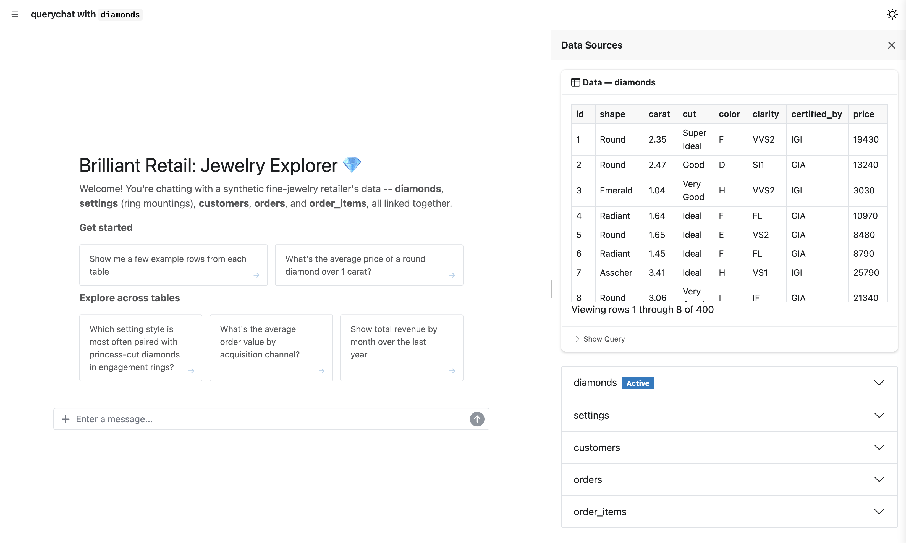
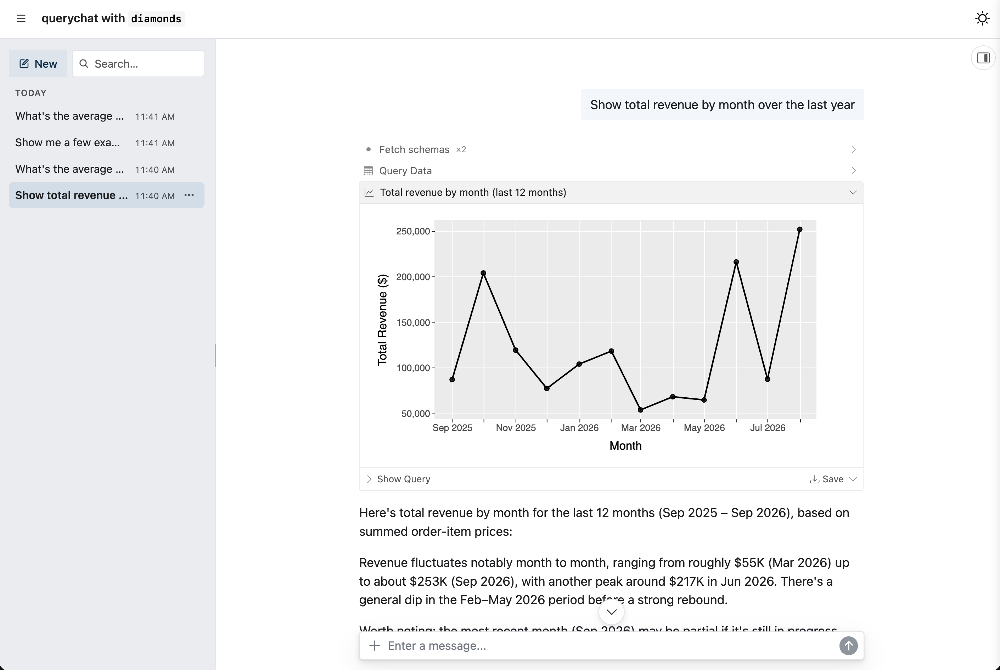
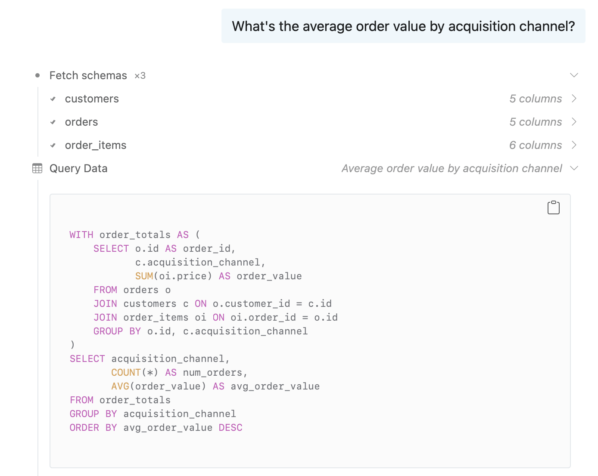
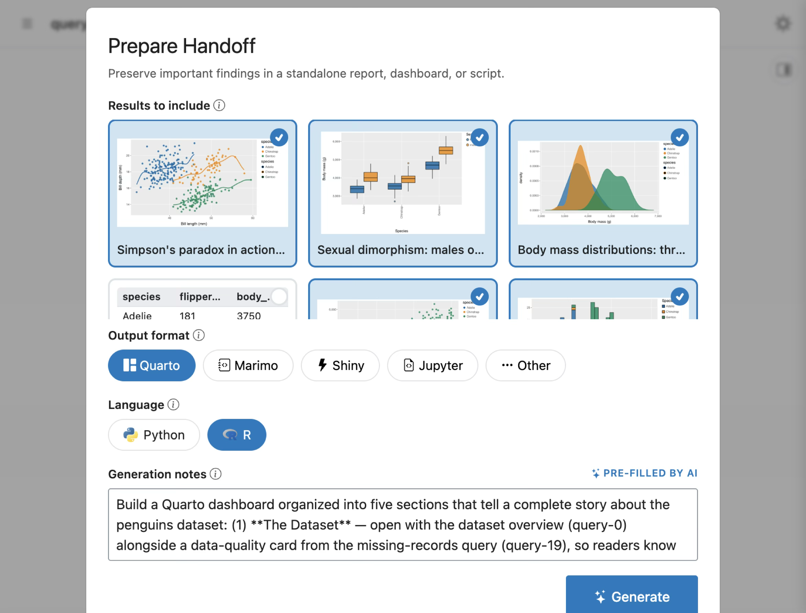
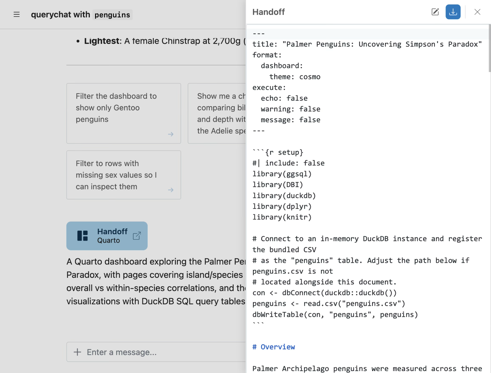

I'm thrilled to share the latest [querychat](https://posit-dev.github.io/querychat) release for both R (v0.4.0) and Python (v0.9.0).
Grab the latest from CRAN or PyPI:

::: {.panel-tabset group="language"}
### R

``` r
install.packages("querychat")
```

### Python

``` bash
pip install -U querychat
```
:::


This release adds several headline features, including support for multiple tables, `data-dict.yml`, a full-page chat layout, support for pins, and a new `/handoff` command.
It also builds on [shinychat's recent momentum](/blog/2026-09-15_shinychat-r-0.5.0-python-0.7.1/).
As a result, querychat gets chat features like history and file attachments basically for free.
`querychat_app()` provides a quick and useful way to start chatting with data and getting bespoke [ggsql visualizations](/blog/2026-06-17_querychat-ggsql/), and it now uses shinychat's `page_chat()` for a full chat app experience.

See the [R release notes](https://github.com/posit-dev/querychat/blob/main/pkg-r/NEWS.md) and the [Python changelog](https://github.com/posit-dev/querychat/blob/main/pkg-py/CHANGELOG.md) for the complete list, including [a few changes for existing apps](#a-few-changes-for-existing-apps) if you're upgrading.


## Full-page chat layout

`querychat_app()` / `QueryChat.app()` now put the chat front and center (built on shinychat's `page_chat()`), leaving more breathing room for things you create within the chat.

::: {.panel-tabset group="language"}
### R

``` r
library(palmerpenguins)

querychat_app(penguins)
```

### Python

``` python
from querychat import QueryChat
from palmerpenguins import load_penguins

qc = QueryChat(load_penguins(), "penguins")
qc.app()
```
:::

<script src="https://fast.wistia.com/player.js" async></script><script src="https://fast.wistia.com/embed/xe4aalo9yw.js" async type="module"></script><style>wistia-player[media-id='xe4aalo9yw']:not(:defined) { background: center / contain no-repeat url('https://fast.wistia.com/embed/medias/xe4aalo9yw/swatch'); display: block; filter: blur(5px); padding-top:75.21%; }</style> <wistia-player media-id="xe4aalo9yw" aspect="1.3296296296296297"></wistia-player>


A view of the actual data is always accessible via the data source drawer on the right-hand side.
In the case of [multiple tables](#multiple-tables), you'll see the active table[^1], as well as other available tables below it.

[^1]: By default, the active table is the first one supplied.
    However, if the LLM is prompted to show a filtered/sorted view of a table, then that table becomes active (and the drawer will automatically open).




The new `page()` method brings this same full-page chat layout to your own apps.
Your users get the chat front and center, and you can still add custom views on other `pages`, in the `drawer`, or in the `sidebar`.

Learn more about [building custom apps in R](https://posit-dev.github.io/querychat/r/articles/build.html) and [Python](https://posit-dev.github.io/querychat/py/build.html).

::: {.panel-tabset group="language"}
### R

``` r
qc <- QueryChat$new(penguins, "penguins")
ui <- qc$page("Penguins Explorer")
```

### Python

``` python
from querychat.express import QueryChat
from palmerpenguins import load_penguins

qc = QueryChat(load_penguins(), "penguins")
qc.page("Penguins Explorer")
```
:::

## Conversation history

Another major improvement is persistent conversation history ([mostly thanks to shinychat](/blog/2026-09-15_shinychat-r-0.5.0-python-0.7.1/#return-to-earlier-conversations)).
In addition to starting new chats and returning to previous ones, conversations now persist across page reloads and timeouts.
As a result, it is now much more difficult to lose your progress.



Also, now that shinychat supports [editable messages](/blog/2026-09-15_shinychat-r-0.5.0-python-0.7.1/#edit-a-message-and-compare-answers), [canceling responses](/blog/2026-09-15_shinychat-r-0.5.0-python-0.7.1/#stream-responses-and-show-thinking), [file attachments](/blog/2026-09-15_shinychat-r-0.5.0-python-0.7.1/#attach-files), and more, querychat does too.


## Multiple tables

querychat now supports multiple tables in a single chat instance.
If those tables reside in a singular source, like a database, you can add them all in one fell swoop with the `add_tables()` method.

::: {.panel-tabset group="language"}
### R

``` r
library(querychat)

qc <- QueryChat$new()
qc$add_tables(db, c("customers", "orders", "order_items"))
```

### Python

``` python
from querychat import QueryChat

qc = QueryChat()
qc.add_tables(db, ["customers", "orders", "order_items"])
```
:::

querychat's query and visualization tools handle joins across these tables, so a single question can span all of them.
To write a query like the one below, the LLM first needs to know what's in each table: column names, types, and value ranges.
So it starts by fetching the schema of each table it needs ("Fetch schemas"), then generates the query with that metadata in mind.



In a custom app, the new `table()` method gives your server code reactive access to any table, including whatever filters the LLM has applied to it.
That means you can keep building your own plots and views in Shiny, and your users can drive them just by chatting.

::: {.panel-tabset group="language"}
### R

``` r
output$order_price <- renderPlot({
  orders_tbl <- qc$table("orders")
  # LLM can perform filter queries on $df()
  orders_df <- orders_tbl$df()
  hist(orders_df$price)
})
```

### Python

``` python
@render.plot
def _():
  orders_tbl = qc.table("orders")
  # LLM can perform filter queries on .df()
  orders_df = orders_tbl.df()
  plt.hist(orders_df["price"])
```
:::

## Provide context: `data-dict`

querychat does its best to gather context from the data itself.
When the LLM fetches a table's schema, it gets whatever metadata querychat can compute from the data.
That's a good start, but in practice it often isn't enough.
Column names can be cryptic, coded values need decoding, and nothing in the data says what "active customer" means to your business or how tables relate.
In the [example above](#multiple-tables), the LLM had to infer from column names alone that `orders.customer_id` points to `customers.id`.

A **data dictionary** is how you fill in what the data can't say about itself.
It's a YAML file that follows the [data-dict](https://data-dict.tidyverse.org/) spec.
Alongside plain-English descriptions, it has its own fields for column types, allowed values, keys, and the relationships between tables.
This is now the preferred way to describe your data:

```yaml
tables:
  customers:
    description: One row per customer.
    columns:
      - name: acquisition_channel
        type: enum
        values: [organic, paid_search, social, referral]
        description: How the customer first found us.
  orders:
    description: One row per order.
    columns:
      - name: customer_id
        type: number(id)
        constraints: [foreign_key]
  order_items:
    description: One row per item in an order.
    columns:
      - name: price
        type: number(quantity)
        description: Item price in USD.

relationships:
  - description: Each order belongs to one customer.
    cardinality: many-to-one
    join: orders.customer_id = customers.id
  - description: Each order has one or more items.
    cardinality: many-to-one
    join: order_items.order_id = orders.id
```

Pass it in as `data_dict = "dictionary.yml"` (R) / `data_dict="dictionary.yml"` (Python).
When the LLM fetches a table's schema, any column you've documented comes straight from your dictionary, with nothing left to infer.
querychat only computes metadata from the data for the columns your dictionary doesn't cover.

## Extract insights: `/handoff`

Over the course of a conversation, querychat tends to produce a pile of results, some more useful than others.
The useful ones deserve to live on in a reproducible artifact that doesn't depend on the chat app.

That's the idea behind the new **`/handoff`** slash command.
It's available in every querychat app, with no setup required.
When a user types `/handoff` into the chat input, a wizard opens where they select the results that matter, choose an output format (e.g., Quarto, marimo, Shiny, Jupyter), and add any presentation instructions for the LLM to follow when it generates the handoff document.



When the user finishes the wizard, the handoff document's source code streams into a code editor, where they can revise it by hand or with AI assistance.
A download button then gives them a zip bundle with the handoff document, a README file, and the data sources (if they're small enough).




## Chat with pinned data

querychat can now chat with data pinned to a [pins](https://pins.rstudio.com/) board.
Pass the board and the pin name, and querychat reads the pin (parquet, CSV, JSON, RDS, and more) and uses its title, description, and tags as the starting data description:

::: {.panel-tabset group="language"}
### R

``` r
library(pins)
library(querychat)

board <- board_connect()

querychat_app(board, "my_pin")
```

### Python

``` bash
pip install "querychat[pins]"
```

``` python
import pins
from querychat import QueryChat

board = pins.board_connect()

qc = QueryChat(board, "my_pin")
qc.app()
```
:::

For more control, such as setting the table name used in SQL, use the new `PinSource` class directly.
Multiple pins, or pins mixed with ordinary data frames, also work together in one chat.
Everything is materialized into a shared DuckDB connection behind the scenes, so the LLM can join and filter across all of it.
See the [data sources guide for R](https://posit-dev.github.io/querychat/r/articles/data-sources.html) and [Python](https://posit-dev.github.io/querychat/py/data-sources.html) for details.

## A few changes for existing apps

This release also includes a handful of breaking changes, mostly around how querychat manages connections and bookmarking now that history is built in.
If you're upgrading, skim the [R NEWS](https://github.com/posit-dev/querychat/blob/main/pkg-r/NEWS.md) or [Python CHANGELOG](https://github.com/posit-dev/querychat/blob/main/pkg-py/CHANGELOG.md) breaking-changes sections before you do.

## Learn more

- [querychat documentation](https://posit-dev.github.io/querychat/py/) ([R](https://posit-dev.github.io/querychat/r/)) — full guides on data sources, context, tools, and deployment
- [data-dict](https://data-dict.tidyverse.org/) — the data dictionary spec querychat now reads
- [ggsql](https://ggsql.org) — the grammar of graphics for SQL that powers querychat's visualizations
- [shinychat](https://posit-dev.github.io/shinychat/py/) ([R](https://posit-dev.github.io/shinychat/r/)) — the chat UI toolkit querychat builds on
- [chatlas](https://posit-dev.github.io/chatlas/) ([ellmer](https://ellmer.tidyverse.org)) — the underlying LLM tool-calling libraries
- [Source on GitHub](https://github.com/posit-dev/querychat) — issues, discussions, and contributions welcome

## Acknowledgements

We thank everyone who contributed to these releases, for opening issues, submitting pull requests, and providing feedback:
[@gadenbuie](https://github.com/gadenbuie),
[@hadley](https://github.com/hadley),
[@iainwallacebms](https://github.com/iainwallacebms),
[@iamYannC](https://github.com/iamYannC),
[@jnhyeon](https://github.com/jnhyeon),
[@kolabearafk](https://github.com/kolabearafk), and
[@thisisnic](https://github.com/thisisnic).
