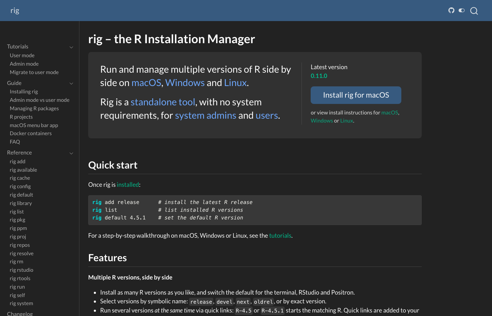

<!--
TODO:
- [x] Add image (1920×1080 PNG or JPG) and image-alt
- [x] Trim topics, software, and languages to only what applies
- [x] Open a PR against main for a Netlify preview
-->
<style>
.prose pre {
  font-size: 0.65em;
}
</style>

We are thrilled to announce rig 0.11.0 (and 0.10.0), with lots of new
functionalities: user mode R installations, R package and project management
and much more. This is the first of three blog posts about the new rig
release. This post is about managing R installations and the new user mode.
The second post will show how rig can help with [managing R packages](https://rig.r-lib.org/pkg-guide.html), and the third will focus on
[project management](https://rig.r-lib.org/proj-guide.html).

[Full changelog on the rig web site](https://rig.r-lib.org/news.html).

## New Web Site

rig has a new web site at <https://rig.r-lib.org>! See this web site for
installation instructions, including the new user mode install; reference
documentation (also in `rig help`!), guides about larger topics and
tutorials to get started.

<figure>
<a href="https://rig.r-lib.org"></a>
<figcaption>The home page of the new rig web site, with a sidebar listing tutorials, guides and reference pages, and a quick start section.</figcaption>
</figure>

## User Mode R Installations

rig can now install and manage R installations without
requiring administrative privileges. rig calls this *user mode*. In user
mode, R installations are installed in the user's home directory rather
than system-wide. System-wide installations are still the default currently,
and they are called *admin mode*.

You may have both user mode and admin mode installations on one computer,
but each rig command runs in either user mode or admin mode. The default is
admin mode. See below for how to change it. Use `--admin` or `--user` to
pick the mode for a single command, e.g. `rig ls --admin` always lists
admin mode installations, and `rig ls --user` always lists user mode ones.

Advantages of using user mode:
- **No admin**: no need for administrative privileges.
- **All Linux**: works on all glibc (from glibc 2.34) and musl (from musl
1.2) based Linux systems.
- **Multiple patch versions**: on macOS you can install multiple patch
versions side by side.
- **Convenience**: no need to use `sudo` or an admin account to install and
manage R.

User mode is quite new, though. It is much less tested than admin mode,
and you may encounter bugs or unexpected behavior more frequently. On Linux,
the generic distro-agnostic builds may be slower for numerical work than
builds specifically compiled for the distribution.

User mode (admin mode as well, actually) is slightly different on each
operating system. Here is a table about where rig stores its files on each
OS in both modes.

| Platform | Mode | R install root | Binary directory (`R`, `Rscript`, `R-*`) |
|---------|------|--------------------------|-------------------------------|
| macOS | admin | `/Library/Frameworks/R.framework` | `/usr/local/bin` |
| macOS | user | `~/.local/share/rig/r` | `~/.local/bin` |
| Linux | admin | `/opt/R` | `/usr/local/bin` |
| Linux | user | `~/.local/share/rig/r` | `~/.local/bin` |
| Windows | admin | `C:\Program Files\R` | `C:\Program Files\R\bin` |
| Windows | user | `%APPDATA%\rig\data\r` | `%USERPROFILE%\.local\bin` |

You can call the new `rig system dirs` command to see where rig stores its
various files:

``` text
❯ rig system dirs
Mode                  user
Architecture          arm64
R root                /Users/gaborcsardi/.local/share/rig/r
Binary dir            /Users/gaborcsardi/.local/bin
Config file           /Users/gaborcsardi/Library/Application Support/com.gaborcsardi.rig/config.json
Data dir              /Users/gaborcsardi/Library/Application Support/com.gaborcsardi.rig
Cache dir             /Users/gaborcsardi/Library/Caches/com.gaborcsardi.rig
Download dir          /var/folders/h9/6ct_py4s319fxt88dxn506l00000gp/T/rig-502
Logs dir              /Users/gaborcsardi/Library/Logs/com.gaborcsardi.rig
Project library root  (in-project, .rvenv/lib)
```

The same in admin mode:

``` text
❯ rig system dirs --admin
Mode                  admin
Architecture          arm64
R root                /Library/Frameworks/R.framework/Versions
Binary dir            /usr/local/bin
Config file           /Users/gaborcsardi/Library/Application Support/com.gaborcsardi.rig/config.json
Data dir              /Users/gaborcsardi/Library/Application Support/com.gaborcsardi.rig
Cache dir             /Users/gaborcsardi/Library/Caches/com.gaborcsardi.rig
Download dir          /var/folders/h9/6ct_py4s319fxt88dxn506l00000gp/T/rig-502
Logs dir              /Users/gaborcsardi/Library/Logs/com.gaborcsardi.rig
Project library root  (in-project, .rvenv/lib)
```

### macOS

On arm64 macOS rig can install both arm64 and x86_64 builds of R. The latter
ones need Rosetta to run. User mode has a different, simpler naming scheme
than admin mode on macOS, matching Linux and Windows. This is an example
list of user mode R installations:

``` text
❯ rig ls
* name          version    aliases
------------------------------------------
  3.6.3-x86_64  (R 3.6.3)
  4.0.5-x86_64  (R 4.0.5)
  4.1.3
  4.1.3-x86_64  (R 4.1.3)
  4.2.3
  4.3.3
  4.4.3
  4.5.3                    oldrel
  4.5.3-x86_64  (R 4.5.3)  oldrel-x86_64
  4.6.0
* 4.6.1                    release
  4.6.1-x86_64  (R 4.6.1)  release-x86_64
  devel         (R 4.7.0)
  devel-x86_64  (R 4.7.0)
  next          (R 4.6.1)
  next-x86_64   (R 4.6.1)
```

- The native (arm64) builds are named simply with the version number.
- R-devel is simply named `devel` and the next version of R (R-patched,
  R-alpha, etc.) is named `next`.
- The x86_64 builds are suffixed with `-x86_64`.
- You can use the `release` alias for the most recent version of R and
  the `oldrel` alias for the previous minor release branch. E.g. the
  `R-release` quick link starts the latest version of R.

### Windows

On Windows rig installs CRAN's R builds as a regular user in user mode.
This installation writes the user's registry settings instead of the
system-wide registry settings.

The names of the R installations are the same as for admin mode. rig now
supports installing x86_64 and aarch64 R builds on aarch64 Windows, and
similarly to macOS, the non-native builds get a `-x86_64` suffix:

``` text
PS C:\Users\Gabor Csardi> rig ls
* name          version    aliases
------------------------------------------
  4.4.3
  4.4.3-x86_64  (R 4.4.3)
  4.5.3
* 4.6.1                    release
  devel         (R 4.7.0)
  next          (R 4.6.1)
```

The new `rig rtools` command lets you manage Rtools installations. In user
mode they are installed into the user's roaming profile directory, and rig
configures R and Rtools to work together correctly. On aarch64 Windows,
you can install both x86_64 and aarch64 versions of Rtools.

``` text
PS C:\Users\Gabor Csardi> rig rtools ls
name  version  full-version   arch     path
------------------------------------------------------
40    4.0      4.0.3.0        x86_64   C:\Users\Gabor Csardi\AppData\Roaming\rig\data\rtools\40-x86_64
44    4.4      4.4.6459.6401  aarch64  C:\Users\Gabor Csardi\AppData\Roaming\rig\data\rtools\44
45    4.5      4.5.6768.6492  aarch64  C:\Users\Gabor Csardi\AppData\Roaming\rig\data\rtools\45
```

### Linux

On Linux rig installs a [portable (manylinux) R build](https://github.com/rstudio/r-builds#portable-builds-experimental) in user
mode. These builds are self-contained, generic glibc (or musl) builds of R.
These builds are intended to work on a wide range of Linux distributions.
However, they are not as battle-tested as the builds rig uses in admin mode.

On glibc systems rig also configures the [manylinux repository](https://posit.co/blog/introducing-portable-linux-r-binary-packages)
for CRAN, that pairs very well with the portable R builds. These packages
are self-contained and compatible with most glibc-based Linux distributions:

``` r
> getOption("repos")
                                                         P3M-manylinux
"https://packagemanager.posit.co/cran/__linux__/manylinux_2_28/latest"
                                                                  CRAN
                                         "https://cloud.r-project.org"
```

### Positron and RStudio configuration

rig automatically configures RStudio (when running `rig add` and
`rig default`), so that the rig-default R version is also the default in
RStudio. On macOS and Windows this is automatic. On Linux rig puts the rig
binary directory (see the table above) on the PATH in user mode, and it
is generally on the PATH in admin mode. This is enough to ensure that the
rig-default R version is also the default in RStudio on Linux.

Positron does not have a generic default R version like RStudio does, but
you can choose a default for each workspace. rig (in `rig add`
and `rig default`) updates your Positron configuration (the current user's
config file) to make sure that Positron finds all user-mode R installations.

### Switching to user mode

Call `rig system user-mode` to switch a previous setup from admin mode to
user mode. This will reinstall your current R installations in user mode,
and remove the admin mode installation. (But see its options to adjust this!)

See more about the migration at the [rig homepage](https://rig.r-lib.org/tutorial-migrate.html).

## Portable Linux

Above you have seen how rig installs portable manylinux builds in user mode.
It is also possible to install them in admin mode. This can be useful for
Linux systems that rig does not have native builds for. To install a
portable Linux build use `--platform portable`:

``` sh
rig add --platform portable 4.6
```

Moreover, if rig does not support a Linux distribution natively, it will
install the manylinux (or musllinux) builds instead, assuming that they
are supported, even in admin mode. With this, most Linux distributions
work automatically, in both admin and user modes.

## Repository management

The rig release improved the `rig repos` subcommand substantially. These
are the biggest changes.

### P3M by default

rig now configures Posit Public Package Manager (P3M) as a default
repository, on all platforms except aarch64 Windows. (Because P3M would
serve incompatible x86_64 binaries here.) This is because we found
P3M more reliable and because P3M includes older package versions and has
more extensive metadata.

Nevertheless you can opt out with `rig add --without-repos=p3m ...` at
installation time, or with `rig repos setup --without-repos=p3m` at any
time.

### Custom repositories

You can now add custom repositories to your rig configuration using
`rig repos add <name> <url>`. For example:

``` sh
rig repos add myrepo https://myrepo.example.com
```

You can then turn these (and also the built-in) repositories on or off
using `rig repos enable` and `rig repos disable`.

### Improved repository list

The output of `rig repos available` is now more informative and easier to
read. Type `rig repos available <reponame>` to get more information about a
repository.

``` text
❯ rig repos available
8 repositories

Name              Default   Type       Title
-----------------------------------------------------------------------------
P3M               depends   built-in   Posit Public Package Manager
P3M-manylinux     depends   built-in   Posit Package Manager manylinux portable packages
RHUB              no        built-in   R-Hub repositories
r-universe/cran   depends   built-in   R-universe CRAN mirror
r-universe/bioc   no        built-in   R-universe Bioconductor mirror
CRAN              yes       built-in   The Comprehensive R Archive Network
CRAN-archive      depends   built-in   CRAN archive
Bioconductor      no        built-in   Open source software for Bioinformatics

Use `rig repos available <name>` to see a repository's URLs.
`depends`: a default only on some platforms, architectures or R versions.
```

``` text
❯ rig repos available r-universe/cran
r-universe/cran (1 URL)
R-universe CRAN mirror

R-universe's mirror of CRAN. The only repository serving arm64 Windows binary
packages.

Default      only on platforms matching aarch64-*-mingw32

URL          https://cran.r-universe.dev
Platforms    windows, *-mingw32
Archs        aarch64
```

### Repository status

Use `rig repos status` to check the status of all enabled repositories.

``` text
❯ rig repos status
6 repositories of R 4.6.1, index bin/macosx/sonoma-arm64/contrib/4.6

name              ping   status        types              updated            url
-----------------------------------------------------------------------------
P3M             601 ms   ok            source, win, mac   -                  https://packagemanager.posit.co/cran/latest
BioCsoft        233 ms   ok            source, win, mac   2026-10-01 17:08   https://bioconductor.org/packages/3.23/bioc
BioCann         120 ms   source only   source, win, mac   2026-08-01 16:49   https://bioconductor.org/packages/3.23/data/annotation
BioCexp         111 ms   source only   source, win, mac   2026-09-15 20:32   https://bioconductor.org/packages/3.23/data/experiment
BioCworkflows   111 ms   source only   source, win, mac   2026-08-01 16:39   https://bioconductor.org/packages/3.23/workflows
BioCbooks       120 ms   source only   source, win, mac   2026-08-01 16:25   https://bioconductor.org/packages/3.23/books

`ping` is the time the repository took to answer for the index above.
`types` is what the R installation's `repositories` file declares.
`source only`: this repository has no index for this platform and R version.
```

<div class="callout callout-note" role="note" aria-label="Note">
<div class="callout-header">
<span class="callout-title">Note</span>
</div>
<div class="callout-body">

rig does not manage repositories in Positron and RStudio sessions. Use
the built-in Positron and RStudio tools instead.

</div>
</div>

## Other improvements

### Avoid unneeded reinstalls

`rig add` now does not reinstall an R version if it is already installed.
Use `--reinstall` to force a reinstall.

### `.exe` quick links on Windows

On Windows rig now uses `.exe` quick links instead of `.bat` files.
`.bat` files have a lot of issues with passing arguments, `.exe` files
work much better.

### Run R with `R` on Windows

The new `rig system fix-r-alias` subcommand deletes the `R` alias from
PowerShell, so you can now use `R` to start R.

### rig is now signed on Windows

Thanks to the [SignPath Foundation](https://signpath.org), the rig
executables and the rig installer are all signed now.

### `rig system blas`

The new `rig system blas` command lets you manage the BLAS/LAPACK library
used by R on macOS.

### Update and uninstall

Use `rig self update` to update rig itself, and `rig self uninstall` to
uninstall it. These commands only work if you installed rig using the
install script. If you installed it with a package manager or ran the
installer manually, you have to use the same package manager or
uninstall it manually.

## Your feedback is welcome!

We would love to hear your thoughts, suggestions, and any issues you
encounter while using rig. Please use the [issue tracker](https://github.com/r-lib/rig/issues) for bug reports and feature
requests, and the [discussion forum](https://github.com/r-lib/rig/discussions) or [Posit community](https://forum.posit.co/) for general questions and discussions.

## Acknowledgments

Huge thanks to everyone who contributed to rig 0.10.0 and 0.11.0:
[@achubaty](https://github.com/achubaty),
[@AdaemmerP](https://github.com/AdaemmerP),
[@AdrienLeGuillou](https://github.com/AdrienLeGuillou),
[@Adrilihan](https://github.com/Adrilihan),
[@Andryas](https://github.com/Andryas),
[@bashirhamidi](https://github.com/bashirhamidi),
[@benyamins](https://github.com/benyamins),
[@biocyberman](https://github.com/biocyberman),
[@Bisaloo](https://github.com/Bisaloo),
[@cderv](https://github.com/cderv),
[@CGMossa](https://github.com/CGMossa),
[@danielloader](https://github.com/danielloader),
[@dkczk](https://github.com/dkczk),
[@eitsupi](https://github.com/eitsupi),
[@elendil95](https://github.com/elendil95),
[@eliocamp](https://github.com/eliocamp),
[@EllaKaye](https://github.com/EllaKaye),
[@etiennebacher](https://github.com/etiennebacher),
[@frosforever](https://github.com/frosforever),
[@gdevenyi](https://github.com/gdevenyi),
[@ggrothendieck](https://github.com/ggrothendieck),
[@grantmcdermott](https://github.com/grantmcdermott),
[@gvelasq](https://github.com/gvelasq),
[@hadley](https://github.com/hadley),
[@jabenninghoff](https://github.com/jabenninghoff),
[@jameslairdsmith](https://github.com/jameslairdsmith),
[@jennybc](https://github.com/jennybc),
[@jeroen](https://github.com/jeroen),
[@jfin4](https://github.com/jfin4),
[@John15321](https://github.com/John15321),
[@jonbry](https://github.com/jonbry),
[@JosiahParry](https://github.com/JosiahParry),
[@kalenkovich](https://github.com/kalenkovich),
[@kenahoo](https://github.com/kenahoo),
[@kieran-mace](https://github.com/kieran-mace),
[@klmr](https://github.com/klmr),
[@krlmlr](https://github.com/krlmlr),
[@lotum-david-j](https://github.com/lotum-david-j),
[@malcolmbarrett](https://github.com/malcolmbarrett),
[@mcanouil](https://github.com/mcanouil),
[@mhurtado13](https://github.com/mhurtado13),
[@MilesMcBain](https://github.com/MilesMcBain),
[@mitsuki5284](https://github.com/mitsuki5284),
[@mns-nordicals](https://github.com/mns-nordicals),
[@morphatic](https://github.com/morphatic),
[@Nerwosolek](https://github.com/Nerwosolek),
[@noamross](https://github.com/noamross),
[@paluigi](https://github.com/paluigi),
[@robjhyndman](https://github.com/robjhyndman),
[@rumichaska](https://github.com/rumichaska),
[@SaintRod](https://github.com/SaintRod),
[@sammieephung](https://github.com/sammieephung),
[@sda030](https://github.com/sda030),
[@ShixiangWang](https://github.com/ShixiangWang),
[@t-kalinowski](https://github.com/t-kalinowski),
[@tylermorganwall](https://github.com/tylermorganwall),
[@venpopov](https://github.com/venpopov),
[@vikasrawal](https://github.com/vikasrawal),
[@wzbillings](https://github.com/wzbillings), and
[@zivankaraman](https://github.com/zivankaraman).
