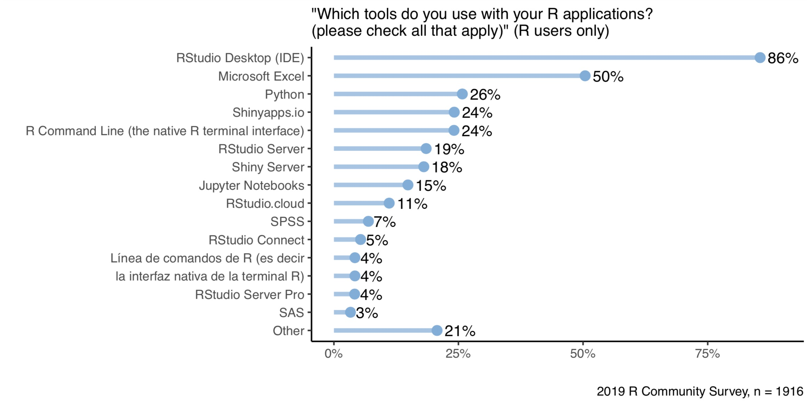

 
<i>Photo by <a style="color: #000000;" href="https://unsplash.com/@danieljerez">Daniel Jerez</a> on <a style="color: #000000;" href="https://unsplash.com/photos/CD4WHrWio6Q">Unsplash</a></i>
 

Data science can feel like an endless tunnel, with tremendous investment at the beginning and little visibility into where or when your results will emerge. Data science teams wrestle with many challenges, such as rapid iteration of new ideas, business alignment, productivity, transparency, and delivering durable value. 

As we’ve discussed in <a href="https://blog.rstudio.com/2020/06/24/delivering-durable-value/" target="_blank" rel="noopener noreferrer">recent blog posts</a>, there are many advantages to using code for your data science work. However, to make your data science teams as productive as possible, they need the best environment in which to efficiently write that code. In this post, I explain why serious data science requires a world-class IDE.

 

## 1. Data Science by Its Nature Is Iterative

There is no better way to shine a light on a solution than the back-and-forth testing of new ideas with code and a fail-fast attitude. You ultimately need to try an idea, search for new functions, review the syntax, visualize the results, make updates, and repeat. 

The RStudio IDE lets you run statistical commands just this way, with the option to visualize results early on as you are building. This engaging means of executing code continuously from the console and directly inline from saved scripts lends itself to increased experimentation and ultimately faster results. With one environment, you can view, debug, and track the history of results, making it substantially easier to build off existing work. 

Rich features, such as automated code validation, syntax highlighting, and smart indentation, make coding and iterating new work even faster. Don’t remember the format of a function? Just type a question mark before it, and the full syntax opens up in a separate pane. Check out our latest addition to these features with spell-check and guidance for conventional data science terms in the newest RStudio 1.3 release <a href="https://blog.rstudio.com/2020/05/27/rstudio-1-3-release/" target="_blank" rel="noopener noreferrer">here</a>.

 

## 2. Your Business Has Unique Challenges

Software on its own is useless for the specific questions and answers that your business will uniquely demand. With the high rate of failure in data science projects (learn more <a href="https://blog.rstudio.com/2020/05/19/driving-real-lasting-value-with-serious-data-science/" target="_blank" rel="noopener noreferrer">here</a> in our recent post), success will ultimately rely on data scientists understanding the business and its data and using code to extract insights from that data. While most development environments design around programming tasks, the RStudio IDE is built for authoring particular questions and answers.
  
<blockquote>
While most development environments design around programming tasks, the RStudio IDE is built for authoring particular questions and answers.
</blockquote>
 

Dedicated panes in the IDE connecting to a database, defining variables, and pre-viewing and managing data give you the control needed to reach a final solution.

 

## 3. Multiple Tools and Technologies Leads to Inefficiency

For the data scientist, the sheer number of environments and technologies when trying to find solutions is continually a challenge. Every time you have to switch between tools, windows, or import from one to another means lost time and mental energy. 

While the RStudio IDE integrates the R console, source code, output plots, database connections, and code execution environment all in one place, interoperability with other tools and technologies make it even more potent for development. You might need to grab some data in a SQL database, query, open Python to analyze, visualize in D3, and model in a language like Stan. With the RStudio IDE, all of this is possible in one place, as we recently demonstrated in <a href="https://blog.rstudio.com/2020/07/07/interoperability-july/" target="_blank" rel="noopener noreferrer">this blog post</a>. You can also very fluidly and naturally author Python inside R Markdown, allowing for a language-agnostic approach with your team. Learn more about this with <a href="https://rstudio.com/solutions/r-and-python/" target="_blank" rel="noopener noreferrer">“R & Python: A Love Story.”</a>

 

## 4. Teams Require Accountability and Transparency

Git support inside the RStudio IDE makes sharing code and collaborating over a versioned environment possible and easy. When your team inspects how a problem was first solved, they need to see how the solution evolved. Using tools like R Markdown from within the IDE allows you to create a rich variety of content: PDFs, word documents, slides, and HTML files. Integration with <a href="https://rstudio.com/products/connect/" target="_blank" rel="noopener noreferrer">RStudio Connect</a> then allows visually appealing and digestible results from the RStudio IDE to be made available to shareholders across the organization with secure publishing of code and scheduled reports. 

All of these content types are reproducible because they are generated from code, allowing your team to peer-review your work and make your work auditable by third parties.

 

## 5. Solutions Must Last

Vendors often lock developers into proprietary products that incur rising costs and discourage reuse. Building with an IDE based on community and open source has tremendous potential for avoiding these pitfalls and making your data science work more durable. The RStudio IDE can import over 16,000 open source packages from the R community that avoid this type of lock-in. When we ask R users in our annual survey what tools they use for their applications, 86% say they use the RStudio Desktop IDE (see the chart below). With this large community of IDE users and RStudio’s commitment to open source, data scientists can worry less about being locked into license fees and focus on solving problems.

<figure>

<figcaption>Figure 1: 86% of respondents interested in R use the RStudio IDE.</figcaption>
</figure>

To learn more about the RStudio IDE, and explore how you can use it in your environment, <a href="https://rstudio.com/products/rstudio/" target="_blank" rel="noopener noreferrer">download</a> a free copy from the RStudio web site today.

