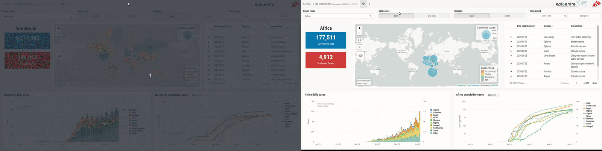
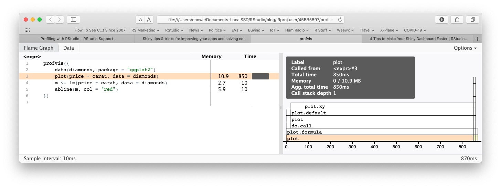

<figure>
  
<figcaption>A slow-running Shiny application (left) and an optimized one (right)</figcaption>
</figure>

*This is a guest post from RStudio's partner, <a href="https://appsilon.com/" target="_blank" rel="noopener noreferrer">Appsilon Data Science</a>*

When developing Shiny applications, we at Appsilon strive to implement functionality, enhance appearance, and optimize the user's experience. However, we often forget about one of the most important elements of UX: the speed of the application. Nobody wants to use a slow application that takes seconds (or minutes) to load or navigate. In this article, I will share four tips and best practices that will help your Shiny applications run much faster. Those tips are: 

1. Figure out why your Shiny app is running slowly
2. Use faster functions
3. Pay attention to scoping rules for Shiny apps
4. Use caching operations

The theme underlying these tips can be summed up by this quote:

<blockquote><p>
    "The reason for Shiny's slow action [is] usually not Shiny." - Winston Chang
</p></blockquote>

### 1. Measure Where Your Shiny App Is Spending Its Time

With R, we can find some very useful solutions for verifying which parts of our code are less effective. One of my favorite tools is the _profvis_ package, whose output is shown below:

<figure>

<br />
A timing measurement created by the <em>profvis</em> package
</figure>


Profvis allows you to measure the execution time and R memory consumption of R code. The package itself can generate a readable report that helps us identify inefficient parts of the code, and it can be used to test Shiny applications. You can see profvis in action <a href="https://rstudio.com/resources/shiny-dev-con/profiling/" target="_blank" rel="noopener noreferrer">here</a>.

If we are only interested in measuring a code fragment rather than a complete application, we may want to consider simpler tools such as the _tictoc_ package, which measures the time elapsed to run a particular code fragment. 

### 2. Use Faster Functions

Once you've profiled your application, take a hard look at the functions consuming the most time. You may achieve significant performance gains by replacing the functions you routinely use with faster alternatives.

For example, a Shiny app might search a large vector of strings for ones starting with the characters "an". Most R programmers would use a function such as `grepl` as shown below:

```
  grepl("^an", cnames),
```

However, we don't need the regular expression capabilities of grepl to find strings starting with a fixed pattern. We can tell grepl not to bother with regular expressions by adding the parameter `fixed = TRUE`. Even better, though, is to use the base R function `startsWith`. As you can see from the benchmarks below, both options are faster than the original grepl, but the simpler startsWith function performs the search more than 30 times faster.

```
microbenchmark::microbenchmark(
  grepl("an", cnames),
  grepl("an", cnames, fixed = TRUE)
  startsWith(cnames, "an")
)

Unit: microseconds
                              expr      min        lq       mean   median       uq      max neval
 grepl("an", cnames)               2046.846 2057.7725 2082.44583 2067.474 2089.499 2449.035   100
 grepl("an", cnames, fixed = TRUE) 1127.246 1130.7440 1146.35229 1132.597 1136.032 1474.634   100
 startsWith(cnames, "an")            62.982   63.2485   64.47847   63.548   64.155   79.528   100
```

Similarly, consider the following expressions:

```
sum_value <- 0
for (i in 1:100) {
  sum_value <- sum_value + i ^ 2
}
```
versus

```
sum_value <- sum((1:100) ^ 2)
```

Even a novice R programmer would likely use the second version because it takes advantage of the vectorized function `sum`. 

When we create more complex functions for our Shiny apps, we should similarly look for vectorized operations to use instead of loops whenever possible. For example, the following code does a simple computation on two columns in a long data frame:

```
frame <- data.frame (col1 = runif (10000, 0, 2),
                     col2 = rnorm (10000, 0, 2))

  for (i in 1:nrow(frame)) {
    if (frame[i, 'col1'] + frame[i, 'col2'] > 1) {
      output[i] <- "big"
    } else {
      output[i] <- "small"
    }
  }

```
However, an equivalent output can be obtained much faster by using `ifelse` which is a vectorized function:

```
  output <- ifelse(frame$col1 + frame$col2 > 1, "big", "small")
```
This vectorized version is easier to read and computes the same result about 100 times faster.

### 3. Pay Attention to Object Scoping Rules in Shiny Apps

1. **Global**: Objects in global.R are loaded into R's global environment. They persist even after an app stops. This matters in a normal R session, but not when the app is deployed to Shiny Server or Connect. To learn more about how to scale Shiny applications to thousands of users on RStudio Connect, <a href="https://support.rstudio.com/hc/en-us/articles/231874748-Scaling-and-Performance-Tuning-in-RStudio-Connect" target="_blank" rel="noopener noreferrer">this recent article</a> has some excellent tips.
2. **Application-level:** Objects defined in app.R outside of the `server` function are similar to global objects, except that their lifetime is the same as the app; when the app stops, they go away. These objects can be shared across all Shiny sessions served by a single R process and may serve multiple users.
3. **Session-level:** Objects defined within the `server` function are accessible only to one user session.

In general, the best practice is:

*   Create objects that you wish to be shared among all users of the Shiny application in the global or app-level scopes (e.g., loading data that users will share).
*   Create objects that you wish to be private to each user as session-level objects (e.g., generating a user avatar or displaying session settings).

### 4. Use Caching Operations

If you've used all of the previous tips and your application still runs slowly, it's worth considering implementing caching operations. In 2018, RStudio introduced the ability to <a href="https://blog.rstudio.com/2018/11/13/shiny-1-2-0/" target="_blank" rel="noopener noreferrer">cache charts</a> in the Shiny package. However, if you want to speed up repeated  operations other than generating graphs, it is worth using a custom caching solution.

One of my favorite packages that I use for this case is <a href="https://cran.r-project.org/web/packages/memoise/" target="_blank" rel="noopener noreferrer">memoise</a>. Memoise saves the results of new invocations of functions while reusing the answers from previous invocations of those functions.

The `memoise` package currently offers 3 methods for storing cached objects:

1. `cache_mem` - storing cache in RAM (default)
2. `cache_filesystem(path)` - storing cache on the local disk
3. `cache_s3(s3_bucket)` - storage in the AWS S3 file database

The selected caching type is defined by the `cache` parameter in the `memoise` function.

If our Shiny application is served by a single R process and its RAM consumption is low, the simplest method is to use the first option, cache_mem, where the target function is defined and its answers cached in the global environment in RAM. All users will then use shared cache results, and the actions of one user will speed up the calculations of others. You can see a simple example below:

```
library(memoise)

# Define an example expensive to calculate function
expensive_function <- function(x) {
    sum((1:x) ^ 2)
    Sys.sleep(5)    # make it seem to take even longer
  }

system.time(expensive_function(1000)) # Takes at least 5 seconds
    user  system elapsed 
  0.013   0.016   5.002 
system.time(expensive_function(1000)) # Still takes at least 5 seconds
   user  system elapsed 
  0.016   0.015   5.005 

# Now, let's cache results using memoise and its default cache_memory

memoised_expensive_function <- memoise(expensive_function)
system.time(memoised_expensive_function(1000)) # Takes at least 5 seconds
   user  system elapsed 
  0.016   0.015   5.001 
system.time(memoised_expensive_function(1000)) # Returns much faster
   user  system elapsed 
  0.015   0.000   0.015 
```
The danger associated with using in-memory caching, however, is that if you don't manage the cached results, it will grow without bound and your Shiny application will eventually run out of memory. You can manage the cached results using the `timeout` and `forget` functions.

If the application is served by many processes running on one server, the best option to ensure cache sharing among all users is to use `cache_filesystem` and store objects locally on the disk. Again, you will want to manage the cache, but you will be limited only by your available disk space.

In the case of an extensive infrastructure using many servers, the easiest method will be to use `cache_s3` which will store its cached values on a shared external file system – in this case, AWS S3. 

---

**About Appsilon Data Science:**


<a href="https://appsilon.com/" target="_blank" rel="noopener noreferrer"></a>
One of the winners of the <a href="https://blog.rstudio.com/2020/07/13/winners-of-the-2nd-shiny-contest/" target="_blank" rel="noopener noreferrer">2020 Shiny Contest</a>  and a <a href="https://rstudio.com/certified-partners/" target="_blank" rel="noopener noreferrer">Full Service RStudio Partner</a>, <a href="https://appsilon.com/" target="_blank" rel="noopener noreferrer">Appsilon</a> delivers enterprise Shiny apps, data science and machine learning consulting, and support with R and Python for customers all around the world.

