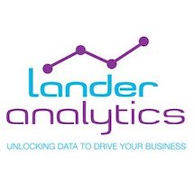

<i>Photo by <a style="color: #000000;" href="https://unsplash.com/@vladhilitanu">Vlad Hilitanu</a> on <a style="color: #000000;" href="https://unsplash.com/photos/1FI2QAYPa-Y">Unsplash</a></i>

*This is a guest post from RStudio's partner, <a href="https://www.landeranalytics.com/" target="_blank" rel="noopener noreferrer">Lander Analytics</a>*

R and Python are two of the more prominent data science languages. These languages didn't become popular by accident, they grew by making their tools easier and more productive. Python's Pandas allowed Python to create heterogeneous <a href="https://twitter.com/chendaniely/status/1279142678656155654" target="_blank" rel="noopener noreferrer">panel data</a> inspired by R's `data.frame` object. R's *caret* and *tidymodels* libraries unified the machine learning API just like Python's *scikit-learn*.

Look under the hood of most applications and libraries and you'll eventually find a different language from the one you're using. This isn't a new concept; each language has their own strengths. Generally, though, the more interoperable languages are, the easier an end-user can pick the tool best suited for their work.

This is why language wars never made sense and many core developers never participate in the "mine is better" debate. Groups such as <a href="https://ursalabs.org/" target="_blank" rel="noopener noreferrer">Ursa Labs</a>, using projects such as <a href="https://arrow.apache.org/" target="_blank" rel="noopener noreferrer">Apache Arrow</a>, are even trying to expand interoperability across more languages. 

As the RStudio team discussed in a <a href="https://blog.rstudio.com/2020/07/15/interoperability-maximize-analytic-investments/" target="_blank" rel="noopener noreferrer">recent blog post</a>, the more interoperable these languages become, the better for us as data scientists to pick the tool we know for the task at hand. The next question for newcomers naturally becomes: which language should I learn?

I've talked about this in the <a href="https://chendaniely.github.io/2019/08/28/r-or-python-which-one-to-learn-first/" target="_blank" rel="noopener noreferrer">past</a>. Essentially, it does not matter. But the language that is being used in the place you want to work in, friends that know a language and you can potentially ask for help, or even the first tutorial that you read online that resonated the best with you, are all subjective ways to help you pick the "first" language. The data skills around manipulating data into tidy format are transferable across languages. Learning how to think sequentially and breaking down problems are all skills you learn by doing; You will rarely meet another data scientist or programmer who doesn't know how to at least "read" another language. 

In general, I recommend that you should choose your language based on its support of:
 
* Tidy data principles
* Interactive interfaces
* Powerful Libraries
* Interoperability with everything else you use 

From a data science perspective, I recommend using <a href="https://r4ds.had.co.nz/tidy-data.html" target="_blank" rel="noopener noreferrer">tidy data principles</a> as the central point to learn a new language. Over time, you'll certainly find something "on the other side," that you will want to try out. For example, I love how I can <a href="https://speakerdeck.com/chendaniely/using-python-with-r" target="_blank" rel="noopener noreferrer">program microcontrollers with Python using MicroPython and CircuitPython</a>, and how easy the R ecosystem has made communicating results and findings.

This means I can work on a Python analysis (or Python-using team) and easily deploy Shiny applications around it using *reticulate*. Conversely, we could convert R output into a plumber REST API for our Python Django, Flask, or Pyramid application, or even directly run R using *rpy2*. These interfacing layers allow maintainers to only maintain a wrapper and not a full re-implementation of a library. As an R user, this also means R libraries can be created around Python libraries so the R community does not need to re-implement Python tools. The R Keras package is a great example of taking a fully maintained Python package and wrapping it for R users using *reticulate*. With tools like *reticulate*, you have a simple way to call Python natively within R.

The most common Python data types are also seamlessly accessible as R objects, which means you can incorporate Python into all of the R publication and communication tools like Shiny and RMarkdown. The converse is also true from the Python perspective. R code can be run within Python using *rpy2*, which means popular Python web frameworks can also benefit from R pipelines. If the language itself does not matter, why not learn both and leverage the best of both worlds simultaneously?

Data science teams should be multilingual and the need for dual Python and R training is evident in data science programs (e.g., <a href="https://ubc-mds.github.io/2020-02-03-teach-python-and-r/" target="_blank" rel="noopener noreferrer">University of British Columbia</a>) that aim to teach both simultaneously. This isn't without its challenges, but it is acknowledging and addressing the need for eventually knowing both Python and R. New data science tools inspired by another language benefits us all as data scientists. The ease of interoperability gives the user the flexibility to fill in any tool gaps for their own needs. Instead of "what language should I use",
you now think about the whole team and consider which programming interface best resonates with the users, or which infrastructure stack so the SysAdmins feel most comfortable in deploying and maintaining.

---

**About Lander Analytics:**

An RStudio <a href="https://rstudio.com/certified-partners/" target="_blank" rel="noopener noreferrer">Full Service Partner</a>, Lander Analytics is a New York-based data science firm, whose staff specializes in statistical consulting and infrastructure, running the full gamut of RStudio product assistance from procurement, implementation and installation to ongoing maintenance and support. They also provides open source training services for R, Python, Stan, Deep Learning, SQL and numerous other languages. 

