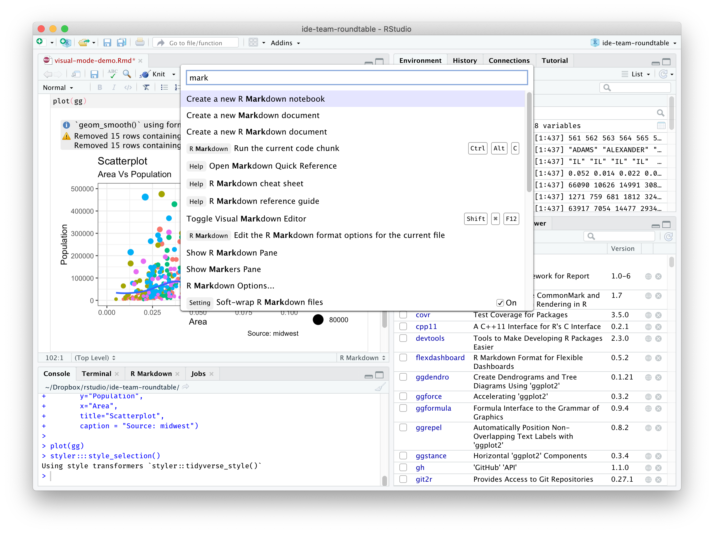
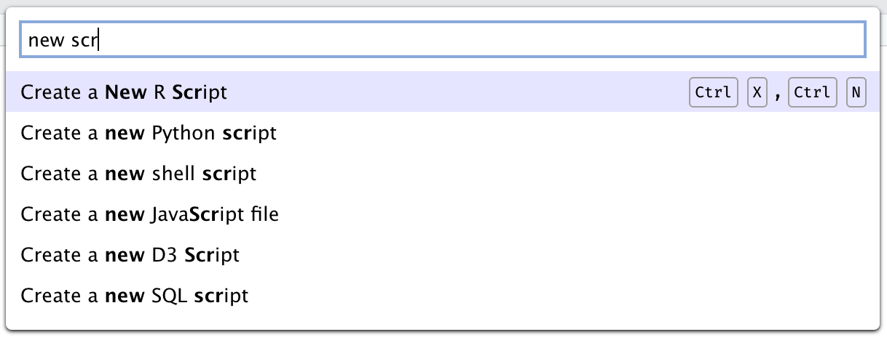
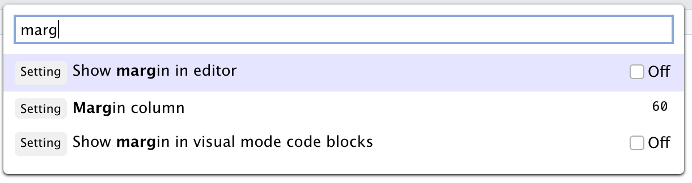
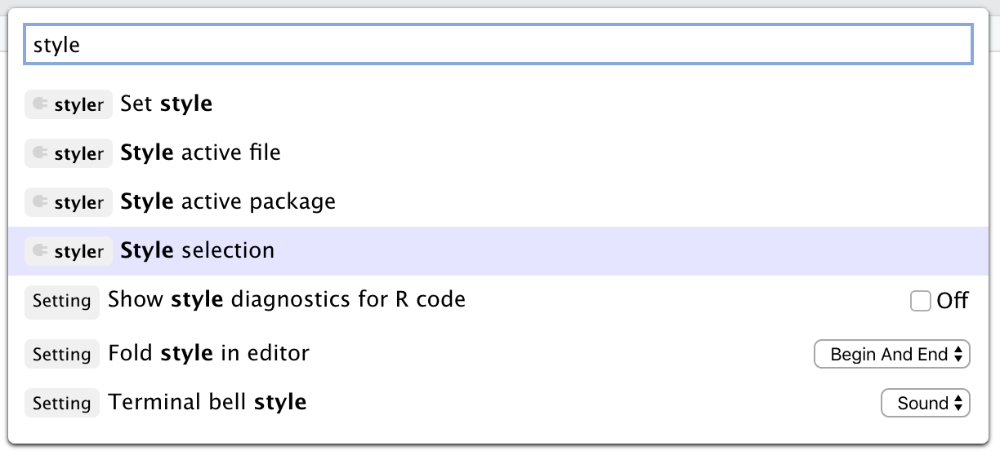

*This post is part of a series on new features in RStudio 1.4, currently available as a [preview release](https://www.rstudio.com/products/rstudio/download/preview/).*

## What's a Command Palette?

Just as a paint palette gives the artist instant access to all their colors, a command palette is a software affordance that gives instant, searchable access to all of a program's commands. RStudio 1.4 introduces this very popular tool to our workbench.

Command palettes have become a fixture of modern IDEs, and with good reason. They improve:

- **Keyboard accessibility**; even commands that do not have keyboard shortcuts are easily invoked from the palette. 
- **Speed**; it is often much faster to invoke a command from the palette with a few quick keystrokes than to reach for the mouse or drill into a menu.
- **Discoverability**; since the palette lists all the commands, it can be browsed to find a command for a task by name without trying to figure out which menu or toolbar might contain it.

## Invoking the Palette

The palette can be invoked with the keyboard shortcut <kbd>Ctrl</kbd> + <kbd>Shift</kbd> + <kbd>P</kbd> (<kbd>Cmd</kbd> + <kbd>Shift</kbd> + <kbd>P</kbd> on macOS).

It's also available on the _Tools_ menu (_Tools_ -> _Show Command Palette_).

## Content

RStudio's command palette has three main types of content:

### Commands

First and foremost, the command palette serves as a way to search for and invoke RStudio commands quickly with just a few keystrokes. Every RStudio command is in the palette, unless it's been explicitly hidden in the current mode. 

To find a command, enter a word or short sequence of characters from the command. For example, to create a new script, start typing `new scr`. 

You can keep typing to filter the list, or press <kbd>Up</kbd>/<kbd>Down</kbd> to choose a command from the list and then <kbd>Enter</kbd> to execute the chosen command. Commands are displayed with their bound keyboard shortcuts, if any, so that you know how to invoke the command directly with the keyboard next time. 

If your command doesn't have a shortcut, you can [use the *Modify Keyboard Shortcuts* command](https://support.rstudio.com/hc/en-us/articles/206382178-Customizing-Keyboard-Shortcuts) to add one.

### Settings

In addition to all of RStudio's commands, the command palette provides easy access to most of its settings. You'll see the word `Setting` in front of settings, along with a small control that allows you to change the setting. 

For example, you can turn RStudio's code margin indicator off and on or move it to a different column. If you have a code editor open, you'll see these changes reflected in real time as you make them.

Note that the settings displayed are your personal (user-level) settings. Just like the settings in Global Options, they can be overridden by project-level settings, and some settings don't take effect until after a restart.

### RStudio Addins

Finally, the command palette shows all of the commands exposed by any installed RStudio add-ins. You can find these by typing any part of the add-in name and/or part of the command. For example, to use a command from the excellent [styler addin](https://github.com/r-lib/styler):

This makes the palette user-extensible; if you want to add your own commands to the palette, you can [create an RStudio Addin](https://rstudio.github.io/rstudioaddins/) to do so with just a few lines of code, or use the [shrtcts addin](https://www.garrickadenbuie.com/blog/shrtcts/) to do so in even fewer lines of code!

## Search Syntax

The command palette's search syntax is simple; it looks for complete matches for each space-separated term you enter. So, for example, a query for `new proj` will find all of the entries that contain the term `new` AND the term `proj`.

In the future, we hope to improve the matching heuristics by prioritizing complete matches and recently or frequently used commands.

You can try out the new Command Palette by installing the [RStudio 1.4 Preview Release](https://www.rstudio.com/products/rstudio/download/preview/). If you do, please let us know how we can make it better on the [community forum](https://community.rstudio.com/c/rstudio-ide)!

