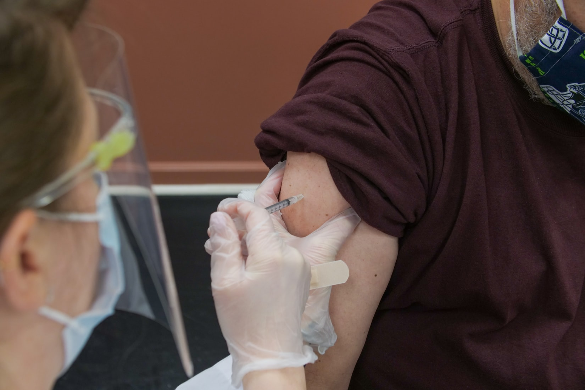

*Photo by [Steven Cornfield](https://unsplash.com/photos/jWPNYZdGz78){target="_blank"} on [Unsplash](https://unsplash.com/){target="_blank"}*

In the United States, [approximately 2.2 million doses of COVID vaccines are being delivered each day](https://www.nytimes.com/interactive/2020/us/covid-19-vaccine-doses.html){target="_blank"}, and how these doses go from the manufacturer to a shot in someone’s arm varies by state, often with mixed results. But early in the vaccine distribution process, one state led the pack in terms of using the majority of vaccine doses it had been allotted. That state? [West Virginia](https://www.npr.org/sections/coronavirus-live-updates/2021/02/22/968829227/west-virginias-vaccination-rate-ranks-among-highest-in-world){target="_blank"}.

Behind West Virginia success has been [Data Driven West Virginia’s](https://business.wvu.edu/research-outreach/data-driven-wv){target="_blank"} creation of an inventory management system using [Shiny](https://shiny.rstudio.com/){target="_blank"}, an open source framework for building interactive web applications. Using Shiny has provided visibility into each component of the vaccine supply chain, leading to the creation of distribution plans that are able to quickly and efficiently match supply with demand, getting vaccines to the right people in the right location at the right time.

  <iframe width="560" height="315" align="middle" src="https://www.youtube.com/embed/CYilc-rEgjg" title="YouTube video player" frameborder="0" allow="accelerometer; autoplay; clipboard-write; encrypted-media; gyroscope; picture-in-picture" allowfullscreen></iframe>

*Watch the story of how Data Driven West Virginia collaborated with the West Virginia Army National Guard to build a COVID vaccine inventory management system using Shiny.*

# COVID vaccine lifecycle in West Virginia

To understand just how hard it is to get vaccines to the population, it helps to understand where it can go wrong. This starts with [how vaccines are packed into containers](https://www.usatoday.com/in-depth/graphics/2020/12/21/how-covid-19-vaccines-will-be-shipped-and-distributed-using-cold-chain-technologies/3941343001/){target="_blank"}. To fill up a container, Pfizer places 195 vials into a tray, and up to 5 trays into a single container. Moderna puts 10 vials into a small box, and then combines a minimum of 10 small boxes into a single container.

In most states Pfizer and Moderna ship directly to the organization that will be administering the vaccine to the population. This could be a hospital, a pharmacy, or any place where trained professionals will be putting shots into arms. But what happens when a pharmacy receives a full container from Pfizer, 975 vials, but only needs 600?

West Virginia has removed this complication by shipping directly to five hubs strategically located throughout the state. Within each of these hubs, containers of vaccine vials are broken down into smaller components and then either picked up or shipped directly to the hospital, pharmacy, or organization that will be administering the vaccine.

These hubs are managed by the [Joint Interagency Task Force](https://www.weirtondailytimes.com/news/local-news/2020/12/w-va-rehearses-for-vaccine-rollout/){target="_blank"} (JIATF), a team of teams composed of public, private, and governmental organizations as well as the National Guard. The Joint Interagency Task Force is responsible for drawing up a weekly distribution plan for each hub, in alignment with CDC allocations, and matching vaccine supply with demand.

<iframe width="560" height="315" src="https://www.youtube.com/embed/T2DzDs0ksZY" title="YouTube video player" frameborder="0" allow="accelerometer; autoplay; clipboard-write; encrypted-media; gyroscope; picture-in-picture" allowfullscreen></iframe>

*Watch Katherine Kopp, Director of Data Driven West Virginia, walk through one of the Shiny apps built to manage vaccine distribution.*

By using a statewide system managed by a central organization, there’s a level of agility and fluidity that allows each hub to adjust to a variety of changes in order to maximize the number of vaccines that are being administered to the population each week.

# Benefits of open source software

Data Driven West Virginia and the West Virginia Army National Guard have given the state of West Virginia an invaluable gift – the gift of time. By reducing the time to create a distribution report from days to an hour, the National Guard can deal with unexpected weather emergencies while still managing vaccine delivery.

By using Shiny, the team at Data Driven West Virginia was able to leverage their existing R skills while avoiding lengthy procurement processes and instead focus on helping the citizens of West Virginia. What’s more, using a code-first approach allowed the creation of Shiny apps that could be iterated upon, thereby meeting user needs along with updates and changes as the project developed.

The team has continued to build out a series of interconnected apps to further assist with vaccine delivery in West Virginia, because in addition to matching up vaccine supply with demand, the Joint Interagency Task Force is also responsible for getting Ancillary Supply Kits – all of the related supplies needed to deliver vaccines, such as syringes, alcohol wipes, gauze pads – out to each organization responsible for getting shots in arms.

You can check out our videos on this story, as well as learn more about Shiny, by visiting our YouTube channel: [www.youtube.com/rstudiopbc](http://www.youtube.com/rstudiopbc){target="_blank"}. Be sure to subscribe to keep up to date with new stories, product updates, and releases!
