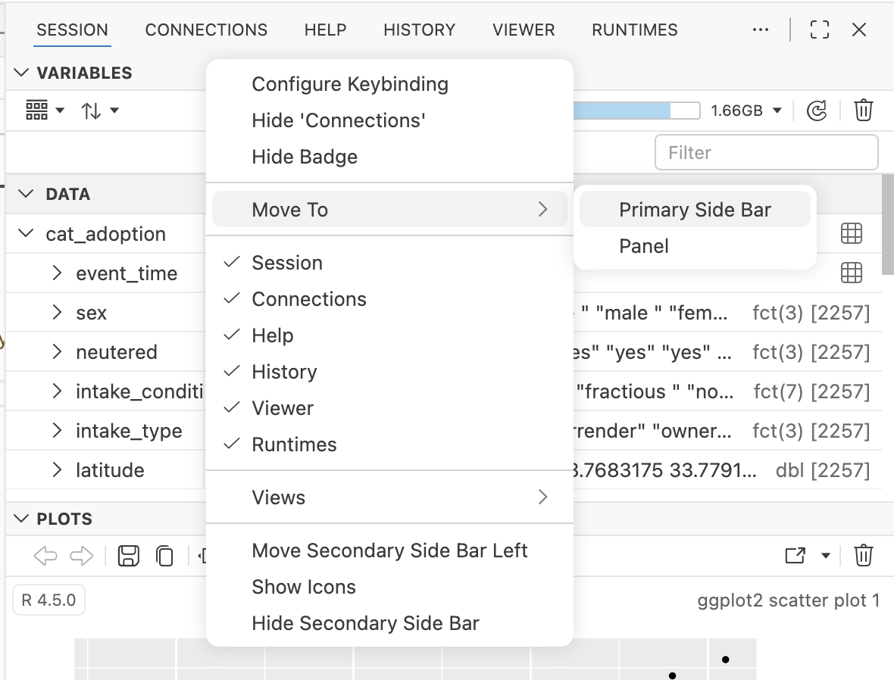
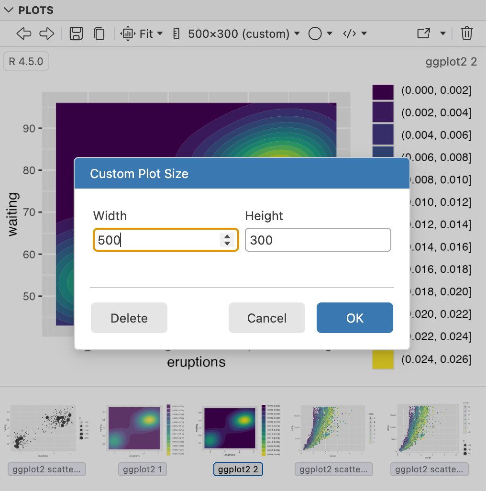
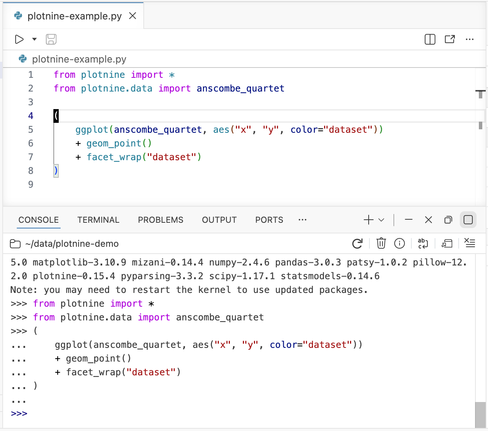
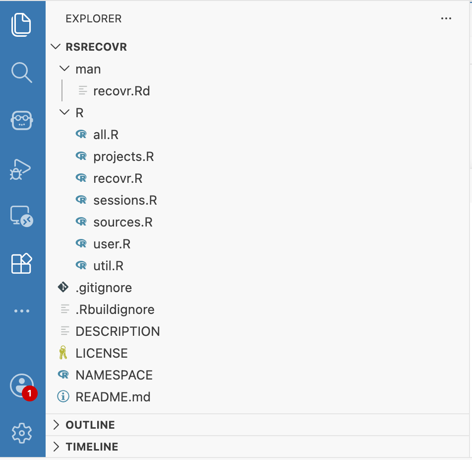
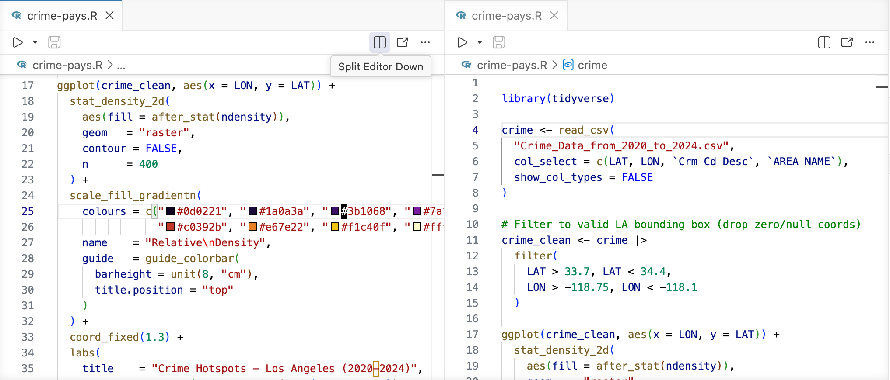
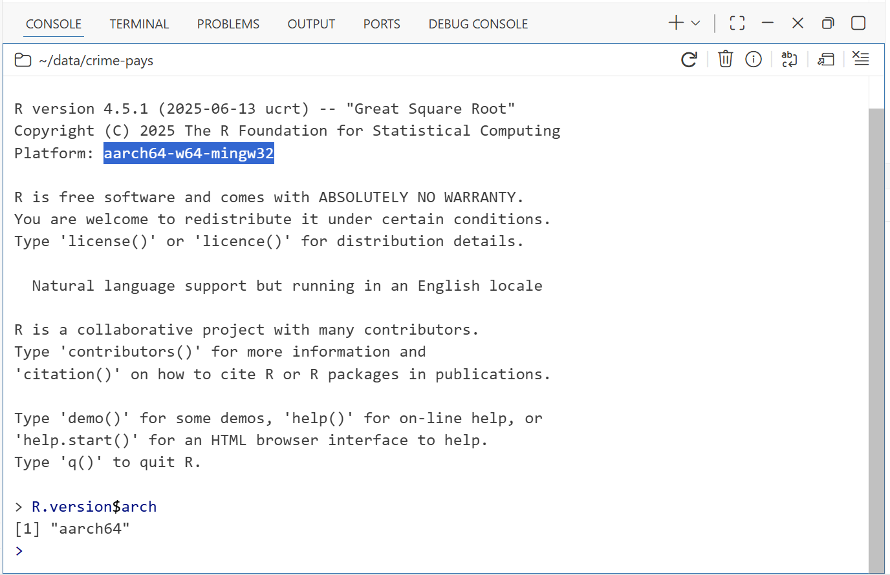
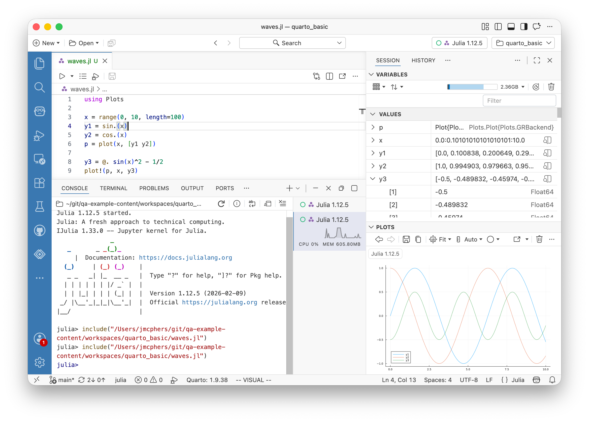
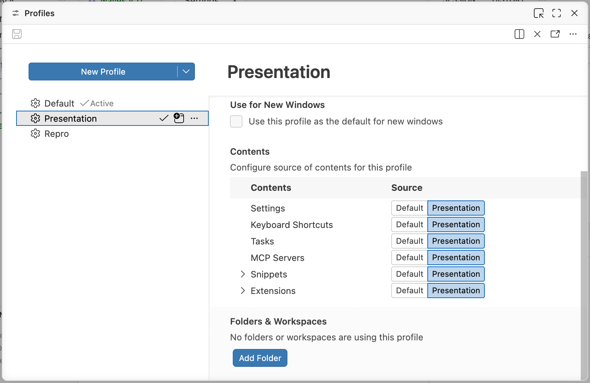
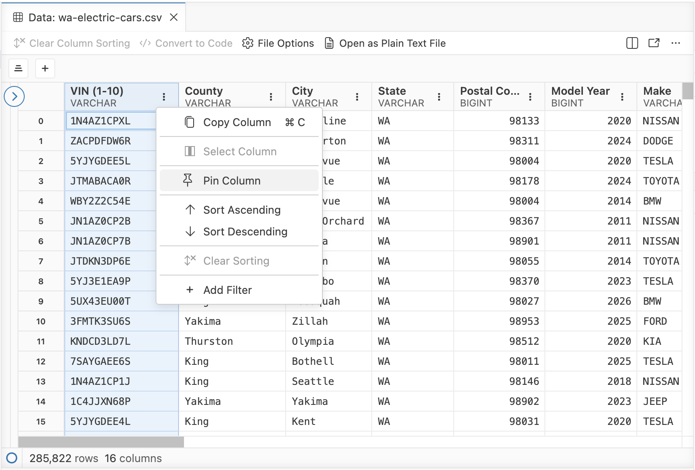
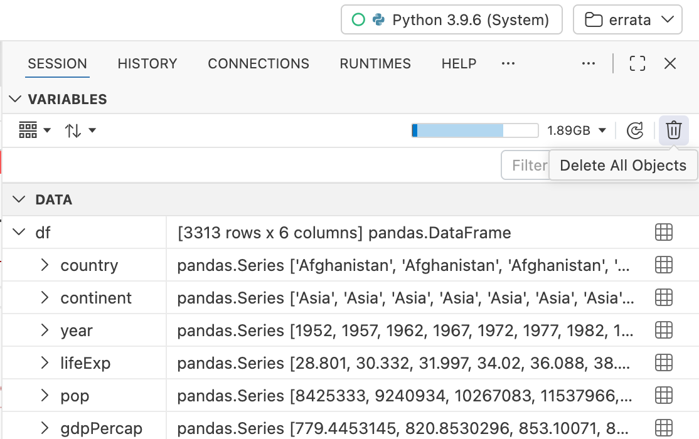

One of the most fun aspects of developing software in the open is that you don't have to guess what your users want; you can just let them tell you. For over a decade, [RStudio's issue tracker](https://github.com/rstudio/rstudio/issues) has been public, available for anyone to report problems or request enhancements. And you, the community, have delivered, collectively filing thousands of bug reports and feature ideas. 

One of the _least_ fun aspects, though, is that you never have time to do most (or even _half_) of the great ideas that bubble up through the community. RStudio's issue tracker is full of worthy requests that have been unimplemented for years, often because they would require outsized changes to the core system's architecture or behavior.

When we set out to make Positron, RStudio's issue tracker became a gold mine of possibilities. Because Positron has a new architecture and is built on a different platform, many of the things that we'd never been able to do in RStudio suddenly became possible.

Today, we take a look at 10 of the most upvoted RStudio feature requests of all time and how those features have been incorporated into Positron. Every one of these 10 requests is on the [front page of the most-upvoted RStudio issues](https://github.com/rstudio/rstudio/issues?q=is%3Aissue%20state%3Aopen%20sort%3Areactions-%2B1-desc) as of this writing.

## #1: Fully configurable pane layouts 

> Most IDEs have a somewhat more flexible system which allows for arbitrary tab arrangement, often using mouse gestures to edit configuration on the fly.

-- #[2879](https://github.com/rstudio/rstudio/issues/2879)

This has been one of RStudio's most-upvoted requests for years. In Positron, this feature is largely inherited from upstream Code OSS (the open source core of VS Code). It has a very flexible layout system which allows tabs to be rearranged, split, hidden, and more with natural dragging and mouse gestures, or via context menus. Try right-clicking on any tab or divider to show places you can move it:
 

Read more about it here: 

[VS Code Layout Configuration](https://code.visualstudio.com/docs/configure/custom-layout)

Positron also ships with a variety of layout presets customized for specific tasks. Try the _View: Stacked Layout_ command to make it look more like RStudio, or _View: Notebook Layout_ to focus on a Quarto document or Jupyter Notebook.

## #2: Fixed size graphics device

> It would be excellent if one could set the RStudio graphics device to generate plots as they would be generated by a non-interactive device with fixed dimensions, so that one could do iterative plot-making within the IDE rather than call `png()`, look at the outputs in another program, and then fiddle with font scaling, etc. and repeat.

-- #[4422](https://github.com/rstudio/rstudio/issues/4422)

RStudio always draws plots to fit the exact dimensions of its Plots pane, which can make it difficult to iterate on a plot you're preparing for publication.

When we added a Plots pane to Positron, we included a new tool that lets you indicate the dimensions at which you'd like the plot to draw. You can have it fit to some common aspect ratios or -- as in the RStudio feature request -- specify the exact size at which you'd like the plot to be drawn.

Positron's Plots pane also features a visual history browser, and it remembers the code used to create the plot so you can jump to it or re-run it.

## #3: Multi-line statement support for Python code

> It would be really great to have RStudio support of multi-line statements extended to Python code as well.

-- #[9014](https://github.com/rstudio/rstudio/issues/9014)

One of RStudio's key R features is multi-line statement detection. When you tell RStudio to execute R code at your cursor location, it doesn't just send the current line of code; it gathers all the lines that are part of the statement and sends them together. RStudio doesn't know how to do this for Python, however.

In Positron, Python and R are peers, and we've implemented multi-line statement detection for Python, too. Placing your cursor anywhere in a Python statement and invoking Run will execute the whole statement.

## #4: Tree view for browsing files and directories

> Hi, is there any plan for browsing files and directories in tree view mode?

-- #[2552](https://github.com/rstudio/rstudio/issues/2552)

RStudio's file browser lists only one directory at a time. Positron inherits Code OSS's tree-based explorer, which not only shows files and directories in context but even has [customizeable icons](https://code.visualstudio.com/docs/configure/themes#_file-icon-themes)! 

## #5: View different parts of a source file at the same time

> In TexShop there’s an option to split source which allows you to see (and edit) multiple areas in a document in one window so that you don’t need to keep scrolling up and down. It would be wonderful to have this as a functionality in the RStudio IDE editor

-- #[2129](https://github.com/rstudio/rstudio/issues/2129)

In Positron, you can have several editors open at once against the same file. With a file open, try using the _Split Right_ or _Split Down_ commands, which will create a second tab for the file that can be scrolled independently. You can access this via the Command Palette, or via the editor action toolbar:

## #6: Add builds for Windows on ARM

> RStudio is built for Windows only for Intel (x86) processors. However, there is now a version of Windows 11 available for ARM based processors. 

-- #[11977](https://github.com/rstudio/rstudio/issues/11977)

Microsoft has taken a page from Apple's playbook and started producing its own ARM-based hardware, such as the [ARM-based Surface devices](https://learn.microsoft.com/en-us/surface/surface-arm-faq), and ARM-based Windows PCs are also now available from third-party manufacturers. 

When we built Positron, we designed its native components to be easy to recompile against different CPU architectures. On Windows, Positron includes both x64 and arm64 R computation engines (kernels), so it can run natively with both x64 and arm64 versions of R. Its Python support, likewise, works great on ARM-based PCs.

## #7: Persistent Julia engine

> It would be useful if we can use Julia in RStudio seamlessly as well as Python.

-- #[1798](https://github.com/rstudio/rstudio/issues/1798)

One of the main architectural goals of Positron was to make it adaptable to any language. It is a data science platform that supports "language extensions". Positron's Python and R support subsystems are included in your Positron download, but are implemented as extensions.

While Posit doesn't currently have the expertise to develop well-rounded support for Julia, that hasn't stopped the community from creating a Positron extension that you can install to add Julia support. When installed, Julia becomes a peer of R and Python in Positron, and connects to Positron's Console, Variables, History, Packages, and Plots panes.

Find it here: [Julia for Positron](https://open-vsx.org/extension/ntluong95/positron-julia)

One of the questions we get a lot is why Positron itself isn't a VS Code extension. This is one of the reasons why: Positron isn't an extension; it _has_ extensions.

## #8: Teaching/presentation mode

> Quite a lot of people use RStudio hooked up to a projector to teach others. It would be great if those people had a key combo that could toggle between their current theme settings and some good defaults suitable for teaching/demos. ... Perhaps the ultimate goal would be to have the teaching mode itself configurable.

-- #[4276](https://github.com/rstudio/rstudio/issues/4276)

In Positron, it is possible to define different "profiles" that have different themes, font sizes, and other settings, and switch between them from the Command Palette, so it is possible set up a "Presentation" profile with a high-contrast theme and large text.

Profiles go beyond just layouts and themes. More documentation here:

https://code.visualstudio.com/docs/configure/profiles

## #9: Fix columns or rows when scrolling data

> The data viewer is one of the most used tool of data analysis in RStudio. However, a very useful feature is missing. In horizontal scrolling a big table with lots of column (it's very common to have more columns than one screen can fit), it will be very helpful to fix the row name column so that it's always visible(i.e. always keep it within screen with scrolling). ... More generally, sometimes we also want to fix certain columns so that it remains visible when scrolled horizontally. The row name column is just a special case of this request.

-- #[3463](https://github.com/rstudio/rstudio/issues/3463)

It's pretty common to have a column of data that represents a key value or name for the observation, or a value to which you wish to compare other values. In Positron, you can pin _any_ column to fix it to the left, so that it is always visible as you scroll the other columns horizontally. Click on the column's action menu (vertical ellipsis) and choose _Pin Column_.

You can also pin rows! Right-click on the row and choose _Pin Row_.

## #10: Remove all objects in the Python environment

> Normally, we can do it easily in R environment by just 1 click but Python doesn't support it.

-- #[8750](https://github.com/rstudio/rstudio/issues/8750)

It's supported in Positron! With a Python session open in the Console, you can use the trash icon to clear all the objects from the session -- in one click.

## ... And a lot more.

Some of our other favorite Positron-only features that don't have a top-upvoted RStudio issue attached:

- **Multiple R sessions**: RStudio runs only one primary R session at a time; any concurrent work needs to be done in a non-interactive background job. Positron supports multiple concurrent interactive R sessions.
- **Multiple R versions**: RStudio can only work with one R version at a time, and you need to switch externally using a tool like [rig](https://github.com/r-lib/rig). Positron will let you choose from any R installation on your system and can even associate specific R versions with specific projects.
- **Crash recovery**: RStudio crashes when R does, but in Positron all you'll lose is the R session itself, which just gets safely restarted.
- **Remote sessions**: Connect remotely to another computer over SSH and run R sessions inside it, or work with reproducible projects inside [devcontainers](https://containers.dev/).

See [Comparing RStudio and Positron Features](https://positron.posit.co/migrate-rstudio-compare.html) for more.

## What about RStudio?

While Positron's design has made it more practical to make many of these advancements, the point of this post isn't that you should switch to Positron if you're happy in RStudio. In fact, features are also flowing in the other direction; many of Positron's features are making their way back into RStudio. For example, the latest release of RStudio has:

- a redesigned data viewer inspired by Positron's data viewer;
- code formatting optionally [powered by air](https://posit-dev.github.io/air/editor-rstudio.html), Positron's R formatter;
- warning/error styling in the R console inspired by Positron's Console; and, of course
- [Posit Assistant](https://posit-dev.github.io/assistant/), a platform-agnostic data analysis assistant that works in both IDEs.

If you use RStudio and are interested in trying Positron, a good place to start is our [Migrating from RStudio guide](https://positron.posit.co/migrate-rstudio.html). 

Thank you for the creativity, ideas, and support you've shown our IDEs over the years. Keep it coming!

