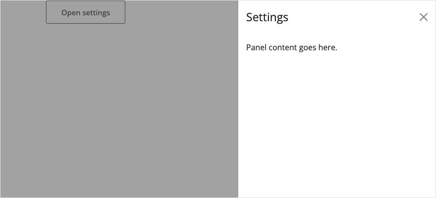

We're happy to announce a trio of releases: [Shiny for R v1.14](https://cran.r-project.org/package=shiny) and [bslib v0.12](https://cran.r-project.org/package=bslib) are now on CRAN, and [Shiny for Python v1.7](https://pypi.org/project/shiny/) is now on PyPI!

::: {.panel-tabset group="language"}
## R

```r
install.packages(c("shiny", "bslib"))
```

## Python

```bash
pip install -U shiny
```
:::

The highlights: [offcanvas panels](#offcanvas-panels) that slide in from the edge of the viewport, [`destroy()`](#module-cleanup) for cleaning up dynamic modules, [`startApp()`](#non-blocking-apps) for running R apps without blocking your console, and [bundled agent skills](#agent-skills) that teach coding agents how to write Shiny for Python apps.

Full details are in the [Shiny for R release notes](https://shiny.posit.co/r/reference/shiny/1.14.0/upgrade.html), the [bslib release notes](https://rstudio.github.io/bslib/news/index.html#bslib-0120), and the [Shiny for Python changelog](https://github.com/posit-dev/py-shiny/blob/main/CHANGELOG.md).


## Offcanvas panels

An offcanvas is a panel that slides in from an edge of the viewport — perfect for settings, filters, details-on-demand, or anything else that doesn't need to be on screen all the time. It's built on [Bootstrap 5's offcanvas component](https://getbootstrap.com/docs/5.3/components/offcanvas/) and comes with the full set of server verbs: `show_offcanvas()`, `hide_offcanvas()`, and `toggle_offcanvas()`.

The simplest way to use one is with a `trigger` element — no server code required:

{fig-alt="A Shiny app with an open offcanvas panel titled Settings sliding in from the right, dimming the page behind it" fig-align="center"}

::: {.panel-tabset group="language"}
## R

```r
library(shiny)
library(bslib)

ui <- page_fluid(
  offcanvas(
    "Panel content goes here.",
    title = "Settings",
    trigger = actionButton("open", "Open settings")
  )
)
```

## Python

```python
from shiny.express import ui

ui.offcanvas(
    "Panel content goes here.",
    title="Settings",
    trigger=ui.input_action_button("open", "Open settings"),
)
```
:::

Give the panel an `id` and it becomes fully programmable: control it from the server and reactively respond to whether it's open.

::: {.panel-tabset group="language"}
## R

```r
library(shiny)
library(bslib)

ui <- page_fluid(
  actionButton("toggle", "Toggle details"),
  offcanvas("Panel content", title = "Details", id = "details")
)

server <- function(input, output, session) {
  observeEvent(input$toggle, toggle_offcanvas("details"))

  observeEvent(input$details, {
    message("Panel is open: ", input$details)
  })
}

shinyApp(ui, server)
```

## Python

```python
from shiny import reactive
from shiny.express import input, render, ui

ui.input_action_button("toggle", "Toggle details")

ui.offcanvas("Panel content", title="Details", id="details")


@reactive.effect
@reactive.event(input.toggle)
def _():
    ui.toggle_offcanvas("details")


@render.text
def state():
    return f"Panel is {'open' if input.details() else 'closed'}"
```
:::

Panels can slide in from the `left`, `right`, `top`, or `bottom`, and you can even build one entirely in the server and reveal it with `show_offcanvas()` — no UI placement needed.

Offcanvas panels are available now in Shiny for Python v1.7 and in [bslib](https://rstudio.github.io/bslib/) v0.12 for R. See the `offcanvas()` ([R](https://rstudio.github.io/bslib/reference/offcanvas.html), [Python](https://shiny.posit.co/py/api/express/express.ui.offcanvas.html)) reference for the panel itself, and `show_offcanvas()`, `hide_offcanvas()`, and `toggle_offcanvas()` ([R](https://rstudio.github.io/bslib/reference/show_offcanvas.html), [Python](https://shiny.posit.co/py/api/express/express.ui.show_offcanvas.html)) for controlling it from the server.


## Module cleanup

Modules make it easy to *add* UI and server logic dynamically. Removing them has always been the awkward part: [`removeUI()`](https://shiny.posit.co/r/reference/shiny/1.14.0/insertUI.html) takes the HTML away, but the module's observers, reactive values, and outputs keep running behind the scenes — leaving behind "dangling reactivity".

The session's new `destroy()` method ([R](https://shiny.posit.co/r/reference/shiny/1.14.0/session.html), [Python](https://shiny.posit.co/py/api/core/Session.html)) closes that gap. The parent that inserted a module can now clean it up by the same id it used to insert it — no cleanup handles to pass around:

::: {.panel-tabset group="language"}
## R

```r
# In the parent server
observeEvent(input$add, {
  insertUI("#container", ui = myModuleUI("editor"))
  myModuleServer("editor")
})

observeEvent(input$remove, {
  removeUI(selector = "#editor")
  session$destroy("editor")
})
```

## Python

```python
@reactive.effect
@reactive.event(input.add)
def _():
    ui.insert_ui(my_module_ui("editor"), selector="#container")
    my_module_server("editor")


@reactive.effect
@reactive.event(input.remove)
async def _():
    ui.remove_ui(selector="#editor")
    await session.destroy("editor")
```
:::

Destroying a scope invokes all of its registered [`onDestroy()`](https://shiny.posit.co/r/reference/shiny/1.14.0/session.html) (R) / [`on_destroy()`](https://shiny.posit.co/py/api/core/Session.html) (Python) callbacks, cleaning up reactive values, expressions, observers, inputs, and outputs for that module *and* its descendant modules. Everything is scoped, so the parent session and sibling modules are untouched. And a module can call `destroy()` on its own session (no id) to clean up after itself.

If your app inserts and removes modules over a long-lived session, `destroy()` keeps those removed modules from accumulating as memory and reactivity leaks.


## Non-blocking apps

*Shiny for R only.*

[`runApp()`](https://shiny.posit.co/r/reference/shiny/1.14.0/runApp.html) blocks your R console until the app stops. New in Shiny v1.14, [`startApp()`](https://shiny.posit.co/r/reference/shiny/1.14.0/startApp.html) runs the app in the background and hands control right back to you:

```r
# Start app in the background
handle <- startApp("myapp")

# The console remains available
handle$status()
#> [1] "running"
handle$url()
#> [1] "http://127.0.0.1:7365"

# Stop the app
handle$stop()
```

The returned `ShinyAppHandle` has `stop()`, `status()`, `url()`, and `result()` methods. Starting a new app automatically stops the previous one, so iterating is as simple as calling `startApp()` again.

This is handy for interactive development, but it really shines for anything that needs to drive an app *and* keep working: testing tools, coding agents, or scripts that launch an app, interact with it, and shut it down.


## Agent skills

*Shiny for Python only.*

Coding agents are writing more and more Shiny apps — so we're teaching them how to do it well. Shiny for Python v1.7 ships with bundled [Agent Skills](https://agentskills.io): a `shiny-for-python` skill whose `SKILL.md` routes agents to focused reference files covering each area of Shiny's public API — reactivity, Express mode, modules, layouts, plots, data frames, chat and streaming, extended tasks, testing, debugging, OpenTelemetry, and more.

To install the bundled skills into your coding agent, use [library-skills](https://library-skills.io):

```bash
uvx library-skills --claude
```

Because the skills ship inside the package, they always match the version of Shiny you have installed — and `shiny skills list` shows what's bundled.

Now your agent stops hand-rolling HTML tables and fake tabs, and starts using the framework the way you would.

And R users: expect bundled agent skills for Shiny for R in its next release.


## Test mode

*Shiny for Python only.*

Skills teach agents how to *write* your app; test mode lets them (and your tests) *see inside* it while it runs. Enable it with the `SHINY_TESTMODE=1` environment variable (or `App(test_mode=True)`), and each session serves a live JSON snapshot of its `input`, `output`, and exported values.

The snapshot is only served when test mode is enabled, and by default it includes only inputs and outputs. To surface an internal reactive — a `reactive.calc` or `reactive.value` that never reaches the UI — export it with [`export_test_values()`](https://shiny.posit.co/py/api/core/testmode.export_test_values.html):

```python
from shiny import reactive, render
from shiny.express import input, ui
from shiny.testmode import export_test_values

ui.input_slider("n", "N", min=0, max=100, value=20)


@reactive.calc
def doubled() -> int:
    return input.n() * 2


@render.text
def txt() -> str:
    return f"n * 2 = {doubled()}"


# Surface the internal reactive in the test-mode snapshot. This is a no-op
# unless test mode is enabled, so it's safe to leave in production code.
export_test_values(doubled=doubled)
```

The pytest app fixtures (`local_app`, `create_app_fixture`) enable test mode automatically, and the new [`shiny.playwright.controller.AppTestValues`](https://shiny.posit.co/py/api/testing/playwright.controller.AppTestValues.html) controller reads the snapshot in end-to-end tests. Expectations accept exact values or predicates:

```python
def is_even(value):
    return value % 2 == 0

app_values = controller.AppTestValues(page)
app_values.expect_export("doubled", 40)
app_values.expect_export("doubled", is_even)
```

Need to scrub timestamps or temp paths before they are written to the snapshot? Register a preprocessor with [`input.set_snapshot_preprocess()`](https://shiny.posit.co/py/api/core/testmode.snapshot_preprocess_input.html) or `my_output.snapshot_preprocess()`. This mirrors R's long-standing [`exportTestValues()`](https://shiny.posit.co/r/reference/shiny/1.14.0/exportTestValues.html) — and it gives coding agents a structured way to debug a running app directly from the server instead of inferring information from the UI.


## Other improvements

A few more changes worth a quick mention — the full lists are in the release notes for [Shiny for R v1.14.0](https://shiny.posit.co/r/reference/shiny/1.14.0/upgrade.html), [bslib v0.12.0](https://rstudio.github.io/bslib/news/index.html#bslib-0120), and [Shiny for Python v1.7.0](https://github.com/posit-dev/py-shiny/blob/main/CHANGELOG.md):

### R

- [`downloadButton()`](https://shiny.posit.co/r/reference/shiny/1.14.0/downloadButton.html) and [`downloadLink()`](https://shiny.posit.co/r/reference/shiny/1.14.0/downloadButton.html) gain an `enabled` argument. The default, `"auto"`, automatically enables the button once the download is ready.
- Output resize and visibility detection now uses native browser observers (`ResizeObserver`, `IntersectionObserver`), so plot sizing and hidden-state tracking work in any layout — including CSS-only show/hide and non-Bootstrap frameworks.
- [`conditionalPanel()`](https://shiny.posit.co/r/reference/shiny/1.14.0/conditionalPanel.html) no longer briefly flashes its contents on app start when the condition is initially `FALSE`.
- bslib v0.12 also lets you grab the sidebar handle directly to resize a sidebar, and fixes the resize handle indicator for `position = "right"` sidebars.

### Python

- [`@render.download_button`](https://shiny.posit.co/py/api/express/express.render.download_button.html) and [`@render.download_link`](https://shiny.posit.co/py/api/express/express.render.download_link.html) pair 1:1 with `ui.download_button()` and `ui.download_link()`, replacing the now-deprecated `@render.download`.
- The `shiny[otel]` extra now sets up OpenTelemetry zero-code auto-instrumentation out of the box: `opentelemetry-instrument shiny run app.py`.


## In closing

We're excited to see what you build (and clean up) with these releases. As always, if you have questions or feedback, [join us on Discord](https://discord.gg/yMGCamUMnS) or open an issue on [rstudio/shiny](https://github.com/rstudio/shiny/issues/new) or [posit-dev/py-shiny](https://github.com/posit-dev/py-shiny/issues/new). Happy Shiny-ing!


## Acknowledgements

A big thank you to all the folks who helped make these releases happen:

#### Shiny for R [v1.14.0](https://shiny.posit.co/r/reference/shiny/1.14.0/upgrade.html)

[&#x0040;adit-0132](https://github.com/adit-0132), [&#x0040;ahnungslos-git](https://github.com/ahnungslos-git), [&#x0040;byronvickers](https://github.com/byronvickers), [&#x0040;cpsievert](https://github.com/cpsievert), [&#x0040;cuckooland](https://github.com/cuckooland), [&#x0040;djacob65](https://github.com/djacob65), [&#x0040;dmurdoch](https://github.com/dmurdoch), [&#x0040;elnelson575](https://github.com/elnelson575), [&#x0040;FBrockmeyer](https://github.com/FBrockmeyer), [&#x0040;gadenbuie](https://github.com/gadenbuie), [&#x0040;HenrikBengtsson](https://github.com/HenrikBengtsson), [&#x0040;IvanM26](https://github.com/IvanM26), [&#x0040;jcheng5](https://github.com/jcheng5), [&#x0040;jeffkeller-einc](https://github.com/jeffkeller-einc), [&#x0040;jeis4wpi](https://github.com/jeis4wpi), [&#x0040;JohnCoene](https://github.com/JohnCoene), [&#x0040;JosiahParry](https://github.com/JosiahParry), [&#x0040;karangattu](https://github.com/karangattu), [&#x0040;klin333](https://github.com/klin333), [&#x0040;lachlansimpson](https://github.com/lachlansimpson), [&#x0040;lionel-](https://github.com/lionel-), [&#x0040;marcosnav](https://github.com/marcosnav), [&#x0040;mconflitti-pbc](https://github.com/mconflitti-pbc), [&#x0040;ml-ebs-ext](https://github.com/ml-ebs-ext), [&#x0040;nbenn](https://github.com/nbenn), [&#x0040;Noskario](https://github.com/Noskario), [&#x0040;prinjos](https://github.com/prinjos), [&#x0040;pyltime](https://github.com/pyltime), [&#x0040;rikivillalba](https://github.com/rikivillalba), [&#x0040;roberson4627-cpu](https://github.com/roberson4627-cpu), [&#x0040;samuelbharti](https://github.com/samuelbharti), [&#x0040;schloerke](https://github.com/schloerke), [&#x0040;shikokuchuo](https://github.com/shikokuchuo), [&#x0040;simon-smart88](https://github.com/simon-smart88), [&#x0040;toph-allen](https://github.com/toph-allen), and [&#x0040;Upipa](https://github.com/Upipa).

#### bslib [v0.12.0](https://rstudio.github.io/bslib/news/index.html#bslib-0120)

[&#x0040;AleKoure](https://github.com/AleKoure), [&#x0040;ArthurAndrews](https://github.com/ArthurAndrews), [&#x0040;averissimo](https://github.com/averissimo), [&#x0040;elnelson575](https://github.com/elnelson575), [&#x0040;etiennebacher](https://github.com/etiennebacher), [&#x0040;gadenbuie](https://github.com/gadenbuie), [&#x0040;jeis4wpi](https://github.com/jeis4wpi), [&#x0040;LeonidasZhak](https://github.com/LeonidasZhak), [&#x0040;lgaborini](https://github.com/lgaborini), [&#x0040;lgschuck](https://github.com/lgschuck), [&#x0040;sawelch-NIVA](https://github.com/sawelch-NIVA), [&#x0040;sims1253](https://github.com/sims1253), and [&#x0040;willgearty](https://github.com/willgearty).

#### Shiny for Python [v1.7.0](https://github.com/posit-dev/py-shiny/blob/main/CHANGELOG.md)

[&#x0040;chernojagne](https://github.com/chernojagne), [&#x0040;cpsievert](https://github.com/cpsievert), [&#x0040;eeshsaxena](https://github.com/eeshsaxena), [&#x0040;elnelson575](https://github.com/elnelson575), [&#x0040;EltonChang1](https://github.com/EltonChang1), [&#x0040;FBruzzesi](https://github.com/FBruzzesi), [&#x0040;gadenbuie](https://github.com/gadenbuie), [&#x0040;hutch3232](https://github.com/hutch3232), [&#x0040;JosiahParry](https://github.com/JosiahParry), [&#x0040;karangattu](https://github.com/karangattu), [&#x0040;kb071216](https://github.com/kb071216), [&#x0040;kbzsl](https://github.com/kbzsl), [&#x0040;marcosnav](https://github.com/marcosnav), [&#x0040;mariameraz](https://github.com/mariameraz), [&#x0040;MukundaKatta](https://github.com/MukundaKatta), [&#x0040;mvanhorn](https://github.com/mvanhorn), [&#x0040;nightcityblade](https://github.com/nightcityblade), [&#x0040;pevolution-ahmed](https://github.com/pevolution-ahmed), [&#x0040;QuintonBaker-USDA](https://github.com/QuintonBaker-USDA), [&#x0040;saisharan0103](https://github.com/saisharan0103), [&#x0040;SamEdwardes](https://github.com/SamEdwardes), [&#x0040;schloerke](https://github.com/schloerke), [&#x0040;slupczynskim](https://github.com/slupczynskim), [&#x0040;Steven314](https://github.com/Steven314), and [&#x0040;tomaioo](https://github.com/tomaioo).
