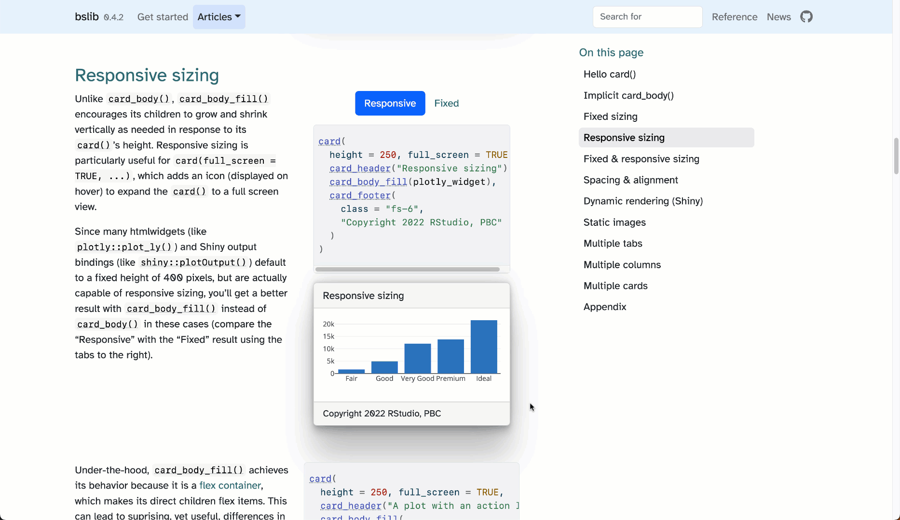
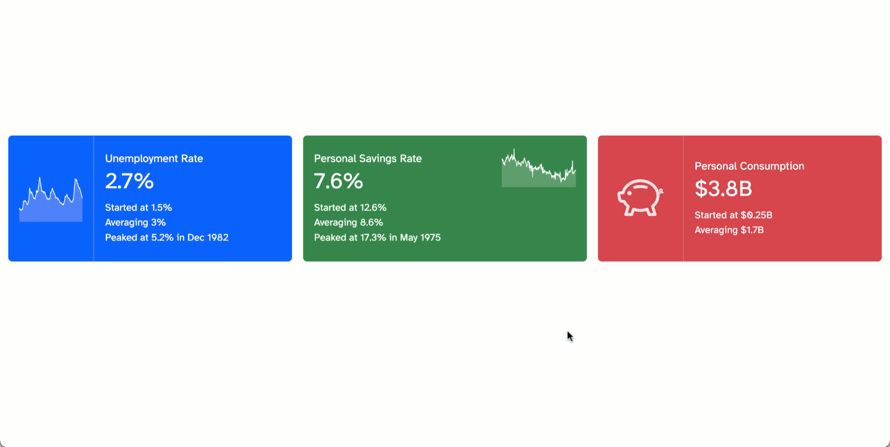
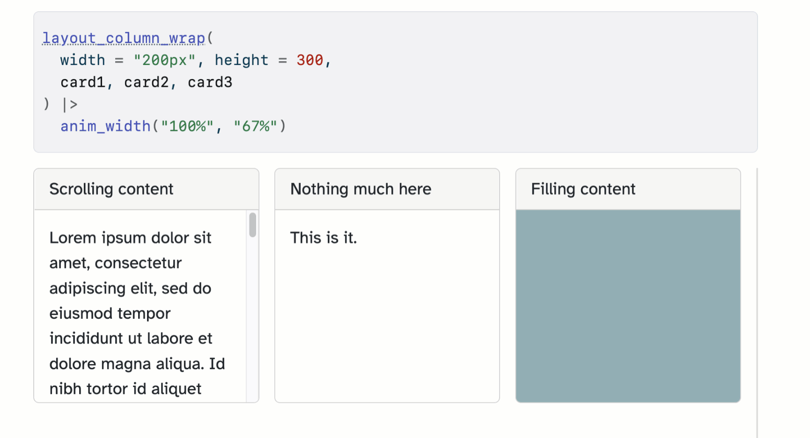
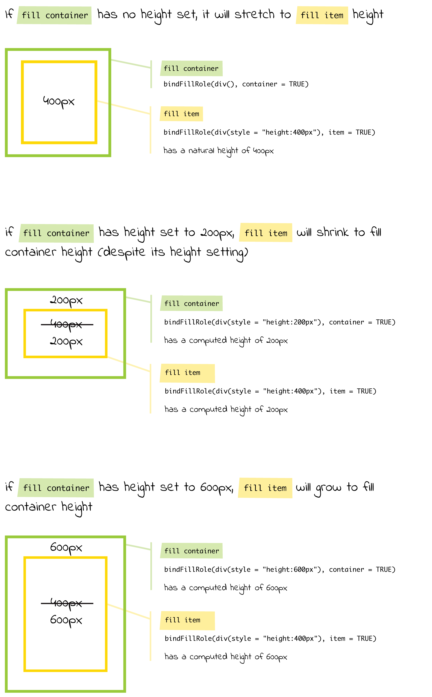

I'm thrilled to share that the latest release of the [`{bslib}` R package](https://rstudio.github.io/bslib) introduces new a [Card](#cards) API, [Value boxes](#value-boxes), and a [responsive grid-like layout](#layout). These new UI components work in Shiny, R Markdown, Quarto (or really any R-based HTML project) and work best alongside the new [`{bsicons}` package](https://github.com/rstudio/bsicons) (an R interface to [Bootstrap icons](https://icons.getbootstrap.com/)) as well as the latest versions of [`{htmlwidgets}`](http://www.htmlwidgets.org/) and [`{shiny}`](https://shiny.posit.co/):

``` r
install.packages("bslib")
install.packages("bsicons")
install.packages("htmlwidgets")
install.packages("shiny")
```

In the video below, I walk-through a Shiny app which quickly illustrates what's possible with these components. Note the [responsive full screen behavior](https://rstudio.github.io/bslib/articles/cards.html#responsive-sizing) of the cards and the "sidebar" layout made possible by the new `layout_column_wrap()`. It also makes use of the new [`{histoslider}` package](https://github.com/cpsievert/histoslider) for the histogram sliders in the sidebar. See [here](https://testing-apps.shinyapps.io/flights) for the live app and [here](https://github.com/rstudio/bslib/tree/main/inst/examples/flights) for the source code.

<script src="https://fast.wistia.com/embed/medias/mriliaufhx.jsonp" async></script>
<script src="https://fast.wistia.com/assets/external/E-v1.js" async></script>
<div class="wistia_responsive_padding" style="padding:57.5% 0 0 0;position:relative;"><div class="wistia_responsive_wrapper" style="height:100%;left:0;position:absolute;top:0;width:100%;"><div class="wistia_embed wistia_async_mriliaufhx seo=false videoFoam=true" style="height:100%;position:relative;width:100%"><div class="wistia_swatch" style="height:100%;left:0;opacity:0;overflow:hidden;position:absolute;top:0;transition:opacity 200ms;width:100%;"></div></div></div></div>

## Cards

<p>
At their most basic level, cards simply provide borders and padding around content, but <code>{bslib}</code> adds on some additional functionality like expanding to full screen, integration with <a href="https://rstudio.github.io/bslib/articles/cards.html#multiple-tabs">tab panels</a>, <a href="https://rstudio.github.io/bslib/articles/cards.html#static-images">static images</a>, and more.
</p>

<a  href="https://rstudio.github.io/bslib/articles/cards.html" target="_blank">
Learn more about cards <i  role="presentation" aria-label="up-right-from-square icon" style="margin-left:.5rem"></i>
</a>



### Value boxes

<p>
At their most basic level, value boxes provide a simple way to highlight single value with a caption. Optionally, value boxes can <code>showcase</code> some HTML content like an <a href="https://github.com/rstudio/bsicons">icon</a> or even a <a href="https://github.com/plotly/plotly.R">plotly</a> graph. In addition, value boxes can also be expanded to full screen which, with some clever usage, can be leveraged to implement <a href="https://rstudio.github.io/bslib/articles/value-boxes.html#expandable-sparklines">"expandable spark lines"</a>, like shown below.
</p>

<a  href="https://rstudio.github.io/bslib/articles/value-boxes.html" target="_blank">
Learn more about value boxes <i  role="presentation" aria-label="up-right-from-square icon" style="margin-left:.5rem"></i>
</a>



### Responsive grid-like layout

<p>
The new <code>layout_column_wrap()</code> function is designed for wrapping a 1d sequence of UI elements into a responsive 2d grid (powered by <a href="https://css-tricks.com/snippets/css/complete-guide-grid/">CSS Grid</a>).
</p>
<p>
Its defaults are optimized for a grid that has equal column widths and row heights, but it's also fairly straightforward to vary <a href="https://rstudio.github.io/bslib/articles/column-layout.html?q=varying%20#varying-heights">heights</a> and <a href="https://rstudio.github.io/bslib/articles/column-layout.html?q=varying%20#varying-widths">widths</a>. In addition, <code>layout_column_wrap()</code> can be <a href="https://rstudio.github.io/bslib/articles/layouts.html#nested-layouts">nested inside</a> another <code>layout_column_wrap()</code>, which is helpful for more sophisticated layouts, like the motivating example (the one with a "sidebar" at the top of this post). That example also leverages <a href="https://rstudio.github.io/bslib/articles/cards.html#responsive-sizing">responsive sizing</a> and a <a href="https://github.com/rstudio/bslib/blob/1a07d5e/inst/examples/flights/app.R#L127-L131">clever bit of CSS on the outermost <code>layout_column_wrap()</code></a> to effectively fit contents to the viewport (minus some space for the navbar height). By the way, without that specified <code>height</code>, the contents would just use their natural height (thanks to the <a href="#fill-roles">underlying <code>bindFillRole()</code> mechanics</a> there's no need for tedious setting of <code>height="100%"</code> everywhere to get children to fill their parent height).
</p>

<a  href="https://rstudio.github.io/bslib/articles/layouts.html" target="_blank">
Learn more about layouts
</a>



### Fill items and containers

<p>
Underneath the hood, cards, value boxes, and <code>layout_column_wrap()</code> all make use of the new <code>bindFillRole()</code> function from <code>{htmltools}</code> (in fact, the newest <code>shiny::plotOutput()</code> and <code>htmlwidgets::shinyWidgetOutput()</code> do as well) to achieve their intelligent <a href="https://rstudio.github.io/bslib/articles/cards.html#responsive-sizing">responsive fill sizing</a> behavior. We decided to expose the mechanism behind this fill behavior in <code>{htmltools}</code> since it isn't specific to <a href="https://getbootstrap.com">Bootstrap</a> (it's based on <a href="https://css-tricks.com/snippets/css/a-guide-to-flexbox/">CSS flexbox</a>), and as a result, could be leveraged in any Shiny (or RMarkdown/Quarto) project.
</p>
<p>
<code>bindFillRole()</code> works by marking a UI element (i.e., a <code>htmltools::tag</code>) as either a fill container or a fill item (or both). When a fill item appears as a direct child of a fill container with an opinionated height, it grows and/or shrinks to fit the containers height. For a concrete example and more explanation, visit the <a href="https://rstudio.github.io/htmltools/reference/bindFillRole.html">reference page for <code>bindFillRole()</code></a>.
</p>



### More to come

Keep an eye out for more UI components coming in future releases of [`{bslib}`](https://github.com/rstudio/bslib). We're hoping `{bslib}` can eventually be a "one-stop shop" of tools for building custom and modern looking Shiny UI. Obviously, to meet that goal, we need to at least match the set of functionality that projects like `{shinydashboard}` provide, so be on the look out for things a new sidebar layout, [accordions](https://getbootstrap.com/docs/5.2/components/accordion/), and more.

<style>
    .img-shadow {
    border: 1px solid #ddd;
    box-shadow: 1px 2px 20px -5px rgb(0 0 0 / 25%);
}
</style>
