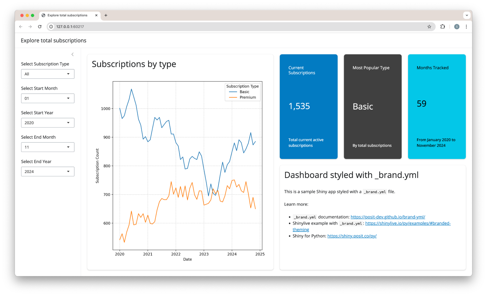
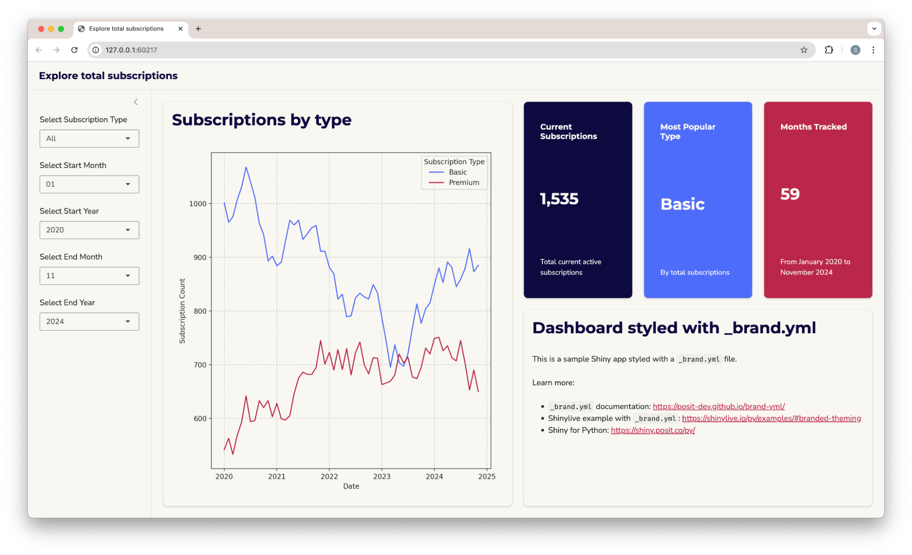

We are excited to share that with [bslib](https://rstudio.github.io/bslib) v0.9.0, Shiny for R now supports [brand.yml](https://posit-dev.github.io/brand-yml), providing a simple and unified theming experience through a single YAML file!

## What is brand.yml?

[brand.yml](https://posit-dev.github.io/brand-yml) simplifies brand management by consolidating your visual identity---colors, typography, and styling---into a single, easy-to-maintain YAML file.
Last year, we launched brand.yml with initial support in [Quarto](https://quarto.org/docs/authoring/brand.html) and [Shiny for Python](../shiny-python-1.2-brand-yml/index.qmd), and we're happy to be bringing brand.yml to R as well.

If you haven't seen [brand.yml](https://posit-dev.github.io/brand-yml) in action yet, here's an example `_brand.yml` file that includes metadata about the company, its logos, color palette, theme, and the fonts and typographic settings used by the brand.

**\_brand.yml**

``` yaml
meta:
  name: brand.yml
  link: https://posit-dev.github.io/brand-yml

logo: 
  small: brand-yml-icon.svg
  medium: brand-yml-tall.svg
  large: brand-yml-wide.svg

color:
  palette:
    orange: "#FF6F20"
    pink: "#FF3D7F"
  primary: orange
  danger: pink

typography:
  fonts:
    - family: Open Sans
      source: google
  base: Open Sans
```

This one file can be used to maintain consistent branding across your Shiny apps, Quarto projects, and now any R-based project that uses [bslib for theming](https://rstudio.github.io/bslib/articles/theming/index.html), including [shiny](https://shiny.posit.co), [R Markdown](https://rmarkdown.rstudio.com), [pkgdown](https://pkgdown.r-lib.org/), [flexdashboard](https://pkgs.rstudio.com/flexdashboard/), and more!

## Getting Started

bslib is a package maintained by the Shiny team to provide \[Bootstrap\] styles and components for the R ecosystem.
With bslib, using brand.yml to theme your Shiny app is straightforward.
To get started, make sure you've installed the latest version of bslib:

``` r
install.packages("bslib")
```

Then, create a `_brand.yml` file in your project directory, either alongside your `app.R` or in a parent folder of the project containing your app.

If your app uses any of the [page functions from bslib](https://rstudio.github.io/bslib/reference/index.html#page-layouts) like `page_sidebar()` or `page_navbar()`, then you're all set!
bslib will automatically find the `_brand.yml` file and apply it to the app's theme.
For page functions from Shiny---like `fluidPage()` or `navbarPage()`---set `theme = bs_theme()` in the page function.

If you want to use another file name, like `acme-brand.yml`, or you want to be explicit, you can call `bs_theme()` and provide the path to the brand.yml file to the `brand` argument:

``` r
ui <- page_sidebar(
  title = "Acme Sales Dashboard",
  theme = bs_theme(brand = "acme-brand.yml"),
  # ... the rest of your app ...
)
```

<figure>

<figcaption aria-hidden="true"><span class="text-white">Shiny without branding</span></figcaption>
</figure>

<figure>

<figcaption aria-hidden="true"><span class="text-white">Brand-themed Shiny</span></figcaption>
</figure>

## Try brand.yml in Shiny now!

Try brand.yml now with the [brand.yml Demo App](https://bslib.shinyapps.io/brand-yml/).
You can create and preview your own brand.yml files with this app, and it's included with bslib so that you can try it locally, too.

``` r
# requires shiny v1.8.1 or later
shiny::runExample("brand.yml", package = "bslib")
```

This app can also be used as a template; see [Unified theming with brand.yml](https://rstudio.github.io/bslib/articles/brand-yml/index.html#try-brand-yml) on the bslib website for instructions.

## brand.yml in R Markdown

The R Markdown ecosystem widely [use bslib for theming](https://rstudio.github.io/bslib/articles/any-project/index.html#r-markdown).
Anywhere that `theme` is passed to bslib, you can use brand.yml, either by placing a file named `_brand.yml` in the project or by passing a path to your brand.yml file to `brand`.
Note that brand.yml works best with Bootstrap version 5.

For R Markdown, use `brand` under `output.html_document.theme`:

**report.Rmd**

``` yaml
output:
  html_document:
    theme:
      version: 5
      brand: acme-brand.yml
```

Similarly, in pkgdown, you can use `brand` under `template.bslib`:

**\_pkgdown.yml**

``` yaml
template:
  bslib:
    version: 5
    brand: acme-brand.yml
```

Note that `brand` isn't strictly necessary: if you name your brand.yml file `_brand.yml`, bslib will automatically find it in your project[^1].

## Looking Forward

We look forward to seeing how the community uses this feature and welcome your feedback!
You can learn more about brand.yml and its features at the [official brand.yml website](https://posit-dev.github.io/brand-yml).
Find more specific information about [branded and custom theming with bslib](https://rstudio.github.io/bslib/articles/brand-yml/index.html) at the bslib website, or learn about [unified branding across Posit tools with brand.yml](https://posit.co/blog/unified-branding-across-posit-tools-with-brand-yml/) on the Posit blog.

As a final tip,
we know that writing YAML isn't everyone's cup of tea!
If you want to enlist the help of a friendly large language model (LLM), we've written up [a guide to using LLMs to write brand.yml](https://posit-dev.github.io/brand-yml/articles/llm-brand-yml-prompt/).

## Thank you 💙

This post doesn't cover all of the changes and updates that happened in bslib in this release.
To learn more about specific changes in each package, dive into the release notes linked below!

**A huge thank you** to everyone who contributed pull requests, bug reports and feature requests.

#### bslib [v0.9.0](https://rstudio.github.io/bslib/news/index.html#bslib-090)

[@al-obrien](https://github.com/al-obrien), [@AlbertRapp](https://github.com/AlbertRapp), [@CharlesBordet](https://github.com/CharlesBordet), [@cpsievert](https://github.com/cpsievert), [@cscheid](https://github.com/cscheid), [@daattali](https://github.com/daattali), [@danielloader](https://github.com/danielloader), [@DavZim](https://github.com/DavZim), [@DeepanshKhurana](https://github.com/DeepanshKhurana), [@dsen6644](https://github.com/dsen6644), [@dvg-p4](https://github.com/dvg-p4), [@eheinzen](https://github.com/eheinzen), [@furrrpanda](https://github.com/furrrpanda), [@gadenbuie](https://github.com/gadenbuie), [@grcatlin](https://github.com/grcatlin), [@ismirsehregal](https://github.com/ismirsehregal), [@jack-davison](https://github.com/jack-davison), [@LDSamson](https://github.com/LDSamson), [@lmullany](https://github.com/lmullany), [@luisDVA](https://github.com/luisDVA), [@lukebandy](https://github.com/lukebandy), [@matt-dray](https://github.com/matt-dray), [@meztez](https://github.com/meztez), [@natashanath](https://github.com/natashanath), [@olivroy](https://github.com/olivroy), [@RealKai42](https://github.com/RealKai42), [@royfrancis](https://github.com/royfrancis), [@see24](https://github.com/see24), [@SokolovAnatoliy](https://github.com/SokolovAnatoliy), [@Teebusch](https://github.com/Teebusch), [@udurraniAtPresage](https://github.com/udurraniAtPresage), and [@wulj5](https://github.com/wulj5).

[^1]: If you don't want bslib to use a project-level `_brand.yml` file, you can use `brand: false` to disable automatic discovery. Or you can use `brand: true` to ensure that a project `_brand.yml` is found. Finally, you could also use `brand` to provide an entire brand.yml definition in-line!
