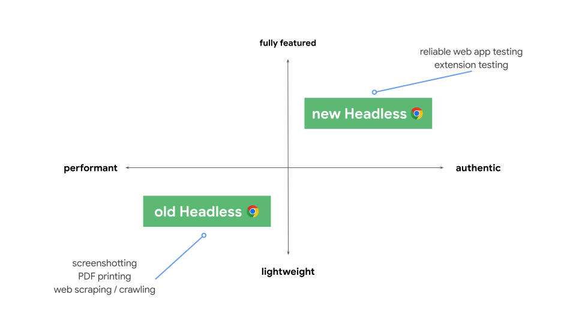
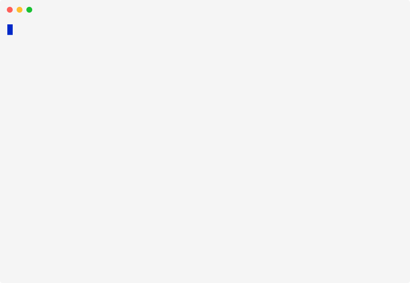

[chromote]: https://rstudio.github.io/chromote

::: lead
We are excited to announce the latest release of [chromote] v0.5.0, which brings new functions that make it much easier to download and use any version of Chrome.
:::

## Getting Started

[chromote] lets you drive and access the Chrome web browser[^1] programmatically from R using [Chrome's headless mode](#what-is-headless-mode), making it useful for tasks ranging from screenshots and web scraping to full automated browser testing.
chromote is a powerful, but low-level, package that powers other easier-to-use packages:

[^1]: Or any browser based on [Chrome](https://www.google.com/chrome/index.html) or [chromium](https://www.chromium.org/chromium-projects/), of which [there are many](https://en.wikipedia.org/wiki/Chromium_(web_browser)#Browsers_based_on_Chromium).

-   Take screenshots of web pages with [webshot2](https://rstudio.github.io/webshot2)
-   Test Shiny apps with [shinytest2](https://rstudio.github.io/shinytest2)
-   Scrape otherwise hard-to-access content from websites with `rvest::read_html_live()`

To get started, make sure you've installed the latest version of [chromote]:

``` r
install.packages("chromote")
```

## What is headless mode? {#what-is-headless-mode}

Chrome's headless mode is a special browsing mode without a visible interface, which is ideal for automated testing and server environments.
In headless mode, developers can run and drive Chrome remotely[^chromote], without the overhead of having to click, type, and interact with the browser manually.

[^chromote]: Run chrome remotely: _chromote_.

You could think of headless mode as using Chrome on a computer without a monitor.
This analogy is now mostly correct, but it wasn't always this way.

Initially, headless mode wasn't just Chrome without a UI; it was a entirely separate browser designed for programmatic use, independent of the standard Chrome browser.
Although differences between headless and regular Chrome were small, they mattered for situations in which consistency with the user experience is crucial.

## A year of big changes

::: column-body-outset
```{mermaid}
%%| label: timeline
%%| fig-alt: |
%%|   A timeline representing the key events in recent Chrome and chromote releases,
%%|   as described in the post text that follows.
%% Custom CSS to style the chart
%%{init: {
    'themeVariables': {
        'gridLineColor': '#e0e0e0',
        'todayLineColor': '#00000000'
    }
}}%%

gantt
    title Chrome Headless Mode Timeline
    dateFormat YYYY-MM
    axisFormat %b %Y
    
    section Chrome
    v112 (New headless introduced)    :milestone, m1, 2023-04, 0d
    v128 (New headless default)       :milestone, m2, 2024-08, 0d
    v132 (Old headless removed)       :milestone, m3, 2025-01, 0d
    
    section Headless Modes
    Old Headless Default    :active, h1, 2023-03, 2024-08
    New Headless Optional   :done, h2, 2023-03, 2024-08
    Old Headless Optional   :done, h4, 2024-08, 2025-01
    New Headless Default    :active, h3, 2024-08, 2025-01
    New Headless Only      :active, h5, 2025-01, 2025-03
    
    section chromote
    v0.3.1        :milestone, c1, 2024-08, 0d
    v0.4.0        :milestone, c2, 2025-01, 0d

```
:::

```{=html}
<style>
#timeline .grid .tick {
  stroke: lightgrey;
  opacity: 0.3;
  shape-rendering: crispEdges;
}
#timeline .grid path {
  stroke-width: 0;
}
</style>
```

When Chrome released version 112 in early 2023, they announced a [new, unified headless mode](https://developer.chrome.com/docs/chromium/headless) that uses the same browser engine as regular, headful Chrome, ensuring consistency in automated testing.
chromote automatically launches Chrome for you, activating headless mode by including the `--headless` flag in the process.
Old headless mode remained the default `--headless` mode, but you'd have to opt into this mode by using `--headless=new` when launching Chrome, which wasn't possible at the time with chromote.

Then, with Chrome v128 (August 2024), the meaning of `--headless` changed from `old` to `new`, making _new headless mode_ the default headless version.
To minimize disruption to chromote users, we quickly [patched chromote and released v0.3.1](https://rstudio.github.io/chromote/news/index.html#chromote-031), to continue to use the old headless mode with `--headless=old`, while offering adventurous users a way to try the new headless mode via an R option.

Finally, in [Chrome v132 (January 2025)](https://developer.chrome.com/blog/removing-headless-old-from-chrome?hl=en), old headless mode was completely removed from Chrome and made available as a new, separate binary, [chrome-headless-shell](https://developer.chrome.com/blog/chrome-headless-shell).
Again, we [patched chromote and released v0.4.0](https://rstudio.github.io/chromote/news/index.html#chromote-040) to use `--headless` instead of `--headless=old`, which will now cause an error when used with Chrome v132 and later.

## Which version of chrome is best for chromote users?

The Chrome developers helpfully shared this diagram comparing old and new headless modes.

{alt="A chart comparing Old Headless and New Headless Chrome features. The horizontal axis ranges from \"performant\" to \"authentic,\" while the vertical axis ranges from \"lightweight\" to \"fully featured.\" Old Headless is positioned in the lower left quadrant, labeled with \"screenshotting, PDF printing, and web scraping/crawling.\" In contrast, New Headless is in the upper right quadrant, labeled with \"reliable web app testing and extension testing.\""}

Practically speaking, most chromote users will be happiest using `chrome-headless-shell`, i.e. the specialized binary that continues the functionality of the old headless mode.
As highlighted by the Chrome team, `chrome-headless-shell` starts up faster and is well-suited to screenshots, printing to PDF and for web scraping---all common use cases for chromote.

## Keeping chromote up-to-date

One of chromote's greatest design strengths is that it works with practically _any_ version of Chrome.
Rather than implement static bindings to specific versions of Chrome in a way that requires manual updates with each new version of Chrome, chromote asks Chrome for the schema of the Chrome DevTools Protocol --- the commands supported by headless Chrome --- and then it uses this schema to hydrate the package with the exact methods matching the version of Chrome you're using.

Most Chrome updates work seamlessly with chromote, but the major shift from old to new headless mode --- a huge undertaking on a very large codebase --- created some inevitable complications for users.

Modern browsers, like Chrome, operate with rolling updates on a regular schedule.
This is great for users and internet browsers, but not great for the reproducibility of automated scripts that use chromote.
It's a frustrating experience to have a script break from one day to the next because Chrome updated overnight.

Fortunately, chromote v0.5. includes new features that make it easier to use the exact version of Chrome that you want.

## Managing Chrome versions with chromote v0.5.0

chromote v0.5.0 includes new features that let you download any version of Chrome or `chrome-headless-shell` from the [Google Chrome for Testing service](https://googlechromelabs.github.io/chrome-for-testing), drawing inspiration from similar features available in the JavaScript and Python browser-testing package [playwright](https://playwright.dev/docs/browsers#managing-browser-binaries).

{alt="An animation showing local_chrome_version() in use in the R console. The code in the animation is described in the post text."}

To get started, call [`local_chrome_version()`](https://rstudio.github.io/chromote/reference/with_chrome_version.html) with a specific `version` and `binary` choice at the start of your script, before you create a new `ChromoteSession` or use another package that relies on chromote.

```r
library(chromote)

local_chrome_version("latest-stable", binary = "chrome")
#> ℹ Downloading `chrome` version 134.0.6998.88 for mac-arm64
#> trying URL 'https://storage.googleapis.com/chrome-for-testing-public/134.0.6998.88/mac-arm64/chrome-mac-arm64.zip'
#> Content type 'application/zip' length 158060459 bytes (150.7 MB)
#> ==================================================
#> downloaded 150.7 MB
#> 
#> ✔ Downloading `chrome` version 134.0.6998.88 for mac-arm64 [5.3s]
#> chromote will now use version 134.0.6998.88 of `chrome` for mac-arm64.

b <- ChromoteSession$new()
```

By default, `local_chrome_version()` uses the latest stable version of Chrome, matching the arguments shown in the code example above.

For scripts with a longer life span and to ensure reproducibility, you can choose a specific version of Chrome or `chrome-headless-shell`:

```r
local_chrome_version("134.0.6998.88", binary = "chrome-headless-shell")
#> chromote will now use version 134.0.6998.88 of `chrome-headless-shell` for mac-arm64.
```

If you don't already have a copy of the requested version of the binary, `local_chrome_version()` will download it for you so you'll only need to download the binary once.
You can list all of the versions and binaries you've installed with `chrome_versions_list()`, or all available versions and binaries with `chrome_versions_list("all")`.

```r
chrome_versions_list()
#> # A tibble: 2 × 6
#>   version       revision binary                platform  url                        path 
#>   <chr>         <chr>    <chr>                 <chr>     <chr>                      <chr>
#> 1 134.0.6998.88 1415337  chrome                mac-arm64 https://storage.googleapi… /Use…
#> 2 134.0.6998.88 1415337  chrome-headless-shell mac-arm64 https://storage.googleapi… /Use…
```

`local_chrome_version()` sets the version of Chrome for the current session or within the context of a function.
For small tasks where you want to use a specific version of Chrome for a few lines of code, chromote provides a `with_chrome_version()` variant:

```r
with_chrome_version("132", {
  # Take a screenshot with Chrome v132
  webshot2::webshot("https://r-project.org")
})
```

Finally, you can manage Chrome binaries directly with three additional helper functions:

1. `chrome_versions_add()` can be used to add a new Chrome version to the cache, without explicitly configuring chromote to use that version.

   ```r
   chrome_versions_add(135, "chrome-headless-shell")
   #> ℹ Downloading `chrome-headless-shell` version 135.0.7049.17 for mac-arm64
   #> trying URL 'https://storage.googleapis.com/chrome-for-testing-public/135.0.7049.17/mac-arm64/chrome-headless-shell-mac-arm64.zip'
   #> Content type 'application/zip' length 90601586 bytes (86.4 MB)
   #> ==================================================
   #> downloaded 86.4 MB
   #> 
   #> ✔ Downloading `chrome-headless-shell` version 135.0.7049.17 for mac-arm64 [3.2s]
   #> [1] "/Users/garrick/Library/Caches/org.R-project.R/R/chromote/chrome/135.0.7049.17/chrome-headless-shell-mac-arm64/chrome-headless-shell"
   ```

2. `chrome_versions_path()` returns the path to the Chrome binary for a given version and binary type.

   ```r
   chrome_versions_path(135, "chrome-headless-shell")
   #> [1] "/Users/garrick/Library/Caches/org.R-project.R/R/chromote/chrome/135.0.7049.17/chrome-headless-shell-mac-arm64/chrome-headless-shell"
   ```

3. `chrome_versions_remove()` can be used to delete copies of Chrome from the local cache.

   ```r
   chrome_versions_remove(135, "chrome-headless-shell")
   #> Will remove 1 cached version of chrome:
   #> /Users/garrick/Library/Caches/org.R-project.R/R/chromote/chrome/135.0.7049.17/chrome-headless-shell-mac-arm64
   #> Delete from cache?
   #> 
   #> 1: Yes
   #> 2: No
   #> 3: Cancel
   #> 
   #> Selection: 1
   ```

## Other new features in chromote v0.5.0

{.float-sm-end .m-auto .m-sm-3 .d-block style="max-width: min(33%, 180px)" alt="The chromote logo, featuring a minimalist design inspired by the Chrome browser logo. The text 'chromote' appears in white lowercase letters above a white circular ring reminiscent of Chrome's central element. The entire design is set within a hexagonal shape composed of geometric sections in varying shades of blue, from deep navy to lighter blue."}

chromote now has a hex sticker!
Sorry for burying the lede, we know this is probably the most exciting update in this release.
Thank you to [David Díaz Rodríguez](https://github.com/davidrsch) for proposing a design that inspired the final hex sticker.

One more interesting feature from this release is a new `$set_viewport_size()` method that makes it easier to adjust the virtual window size of a chromote tab:

```r
b <- ChromoteSession$new()

# Common laptop resolution
b$set_viewport_size(width = 1366, height = 768)

# iPhone 13, with mobile device emulation
b$set_viewport_size(width = 390, height = 844, mobile = TRUE)
```

You can learn more in the [`$set_viewport_size()` method documentation](https://rstudio.github.io/chromote/reference/ChromoteSession.html#method-set-viewport-size-).

:::: {.column-screen .bg-light .mt-4}
::: column-body
## Thank you 💙 {#release-notes}

This post covered the biggest changes to chromote in this release, but there's even more
in the [chromote v0.5.0 release notes](https://rstudio.github.io/chromote/news/index.html#chromote-050)!

**A huge thank you** to everyone who contributed pull requests, bug reports and feature requests.

```{r}
#| echo: false
#| eval: false
usethis::use_tidy_thanks("rstudio/chromote", from = "v0.2.0")
```

[&#x0040;aaelony-fb](https://github.com/aaelony-fb), [&#x0040;amurtha80](https://github.com/amurtha80), [&#x0040;ashbythorpe](https://github.com/ashbythorpe), [&#x0040;bradvf](https://github.com/bradvf), [&#x0040;braverock](https://github.com/braverock), [&#x0040;cellocgw](https://github.com/cellocgw), [&#x0040;chlebowa](https://github.com/chlebowa), [&#x0040;daryabusen](https://github.com/daryabusen), [&#x0040;davidrsch](https://github.com/davidrsch), [&#x0040;DivadNojnarg](https://github.com/DivadNojnarg), [&#x0040;fh-mthomson](https://github.com/fh-mthomson), [&#x0040;gadenbuie](https://github.com/gadenbuie), [&#x0040;ISumaneev](https://github.com/ISumaneev), [&#x0040;maelle](https://github.com/maelle), [&#x0040;Manestricker](https://github.com/Manestricker), [&#x0040;marvin3FF](https://github.com/marvin3FF), [&#x0040;nclsbarreto](https://github.com/nclsbarreto), [&#x0040;oozbeker-onemagnify](https://github.com/oozbeker-onemagnify), [&#x0040;PaulC91](https://github.com/PaulC91), [&#x0040;r2evans](https://github.com/r2evans), [&#x0040;rcepka](https://github.com/rcepka), [&#x0040;sale4cast](https://github.com/sale4cast), [&#x0040;saleforecast1](https://github.com/saleforecast1), [&#x0040;schloerke](https://github.com/schloerke), [&#x0040;simon-smart88](https://github.com/simon-smart88), [&#x0040;skyeturriff](https://github.com/skyeturriff), [&#x0040;stadbern](https://github.com/stadbern), [&#x0040;sybrohee](https://github.com/sybrohee), and [&#x0040;zeloff](https://github.com/zeloff).
:::
::::