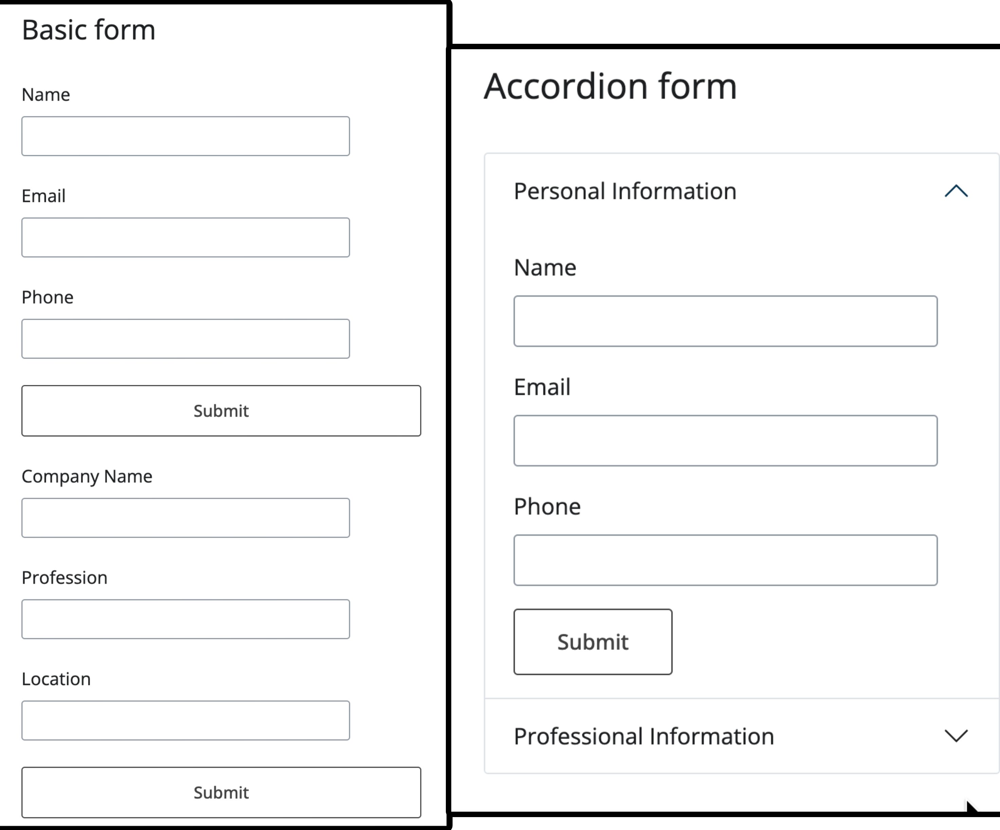

Shiny for Python makes building web apps easy. This framework simplifies creating interactive applications with Python---no need for JavaScript or HTML. Its secret lies in reactive programming, which keeps your UI dynamic with minimal effort. Just focus on your Python code, and let Shiny take care of the rest!

> **Install Shiny for Python**
>
> To install the Shiny for Python package, users can use the following command in their terminal or command prompt:
>
> ``` sh
> pip install "shiny>=1.0"
> ```

Basic Shiny forms can feel... well, basic. But what if you've got a form with a lot of info? Accordion panels to the rescue! They organize things nicely, but we can make them even cooler with dynamic updates.

### Accordions: Form Organization made easy

Instead of one long form, think sections! Accordions let you group related inputs and collapse them. Cleaner, right?

**Why Accordions are Awesome:**

- **Neat & Tidy:** Sections keep things organized.
- **Less Overwhelming:** Users focus on one part at a time.
- **Easy Navigation:** Clear section titles guide the way.

#### **Forms without and with the use of Accordions**

``` python
# Basic form
ui.h2("Basic form")

ui.input_text("name", "Name")
ui.input_text("email", "Email")
ui.input_text("phone", "Phone")
ui.input_action_button("submit_personal", "Submit")
```

``` python
# Accordion form
with ui.accordion(id="info_accordion", multiple=False):
    with ui.accordion_panel("Personal Information", value="personal"):
        ui.input_text("name", "Name")
        ui.input_text("email", "Email")
        ui.input_text("phone", "Phone")
        ui.input_action_button("submit_personal", "Submit")
```



### Making Accordions dynamic

The video below demonstrates a powerful technique to further enhance accordion forms through **dynamic updates**. This involves programmatically modifying the appearance of accordion panels in response to user actions, creating a more interactive and informative interface.

``` python
@reactive.effect
@reactive.event(input.submit_personal)
def update_accordion_1():
    # Get input values, defaulting to "N/A" if empty
    name = input.name() or "N/A"
    email = input.email() or "N/A"
    phone = input.phone() or "N/A"

    # Create new title string with user input values
    new_title = f"Name: {name}, Email: {email}, Phone: {phone}"

    # Updates the appearance and state of an accordion panel dynamically
    ui.update_accordion_panel(
        "info_accordion",
        "personal",
        title=new_title,     # Set new title with user info
        show=False,          # Collapse this panel
        icon=icon_svg("check", fill="green"),  # Show green checkmark icon
    )
    # Open the next panel automatically
    ui.update_accordion_panel("info_accordion", "professional", show=True)
```



Specifically, the video showcases how to:

1.  **Dynamically Change Panel Titles:** Upon completing a section of the form and clicking a *"Submit"* button, the accordion panel title is updated to reflect the entered information. This provides immediate visual confirmation and a clear summary of the data provided within each section.

2.  **Incorporate Dynamic Icons for Status Indication:** Beyond textual updates, the example effectively uses icons to visually communicate the status of each accordion panel. Initially, an exclamation icon in red may indicate sections requiring user attention. Upon successful submission of a section, this icon can be dynamically updated to a green checkmark. This visual cue provides instant feedback, allowing users to easily identify completed sections and those still requiring input.

The implementation leverages the [ui.update_accordion_panel](https://shiny.posit.co/py/api/express/express.ui.update_accordion_panel.html) function (in the context of Shiny for Python's Express mode), which allows developers to programmatically modify various aspects of an existing accordion panel, including its title and icon.

Moving beyond basic form structures is crucial for creating sophisticated and user-centric Shiny applications. **Accordion panels** offer a significant step forward in form organization and user experience. By incorporating dynamic updates, as demonstrated in the video, developers can further elevate their Shiny forms, creating interfaces that are not only functional but also visually informative and engaging. This approach contributes to a more polished and professional application, ultimately enhancing user satisfaction and data interaction efficiency.
