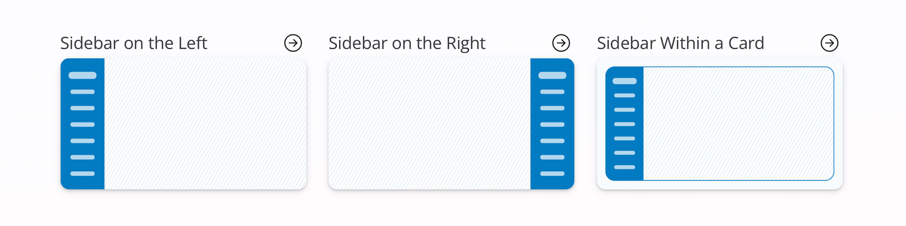

Reference documents are great if you know what you're looking for, but they make it hard to discover new components. For that reason, we've created Shiny for Python's [components gallery](https://shiny.posit.co/py/components/)
and [layouts gallery](https://shiny.posit.co/py/layouts/).

The goal of these galleries is to provide:

1.  An overview of Shiny options for new users, and
2.  A cheatsheet-like reference for current users that will accelerate how you build Shiny apps

## Shiny Components

The [<span style="border-bottom: 1px solid; padding-bottom:2px;">Shiny Components gallery<span>](https://shiny.posit.co/py/components/) features a list of 33 Shiny Components ready for your apps. Many of them are live examples (buttons, checkboxes, sliders, etc.) to get the feel for how they work. Once you've chosen from this list of inputs, outputs, and display components, you'll arive at a detailed page with:

- A Shinylive preview
- Copy/Paste-able code
- Relevant functions used, their signature, and a link to their reference pages
- Details of how to use the component
- Live example variations (if applicable)

The code highlights reveal the most important lines for creating the component.
You can run the example code in
[Shinylive](https://shinylive.io/py/)
and edit it---right in the browser,
without the need to create or host your own Shiny app.
This makes it easy to experiment and see the results!

Here is an example of the Value Box preview and code. Use the tabs to switch between the new [Shiny Express syntax](../../../blog/shiny/shiny-express/) and the original Shiny Core syntax.

<iframe style="height:165px;" class="w-100" src="https://shinylive.io/py/app/#h=0&amp;code=NobwRAdghgtgpmAXGKAHVA6VBPMAaMAYwHsIAXOcpMAMwCdiYACAZwAsBLCbJjmVYnTJMAgujxMArhwA6EOQGImAMQbM2ZMqhaIA9Lo4kILDAHM4ZAEbFiZFmTpoMJGAaMtdqDqdPYAtJZQEADWunJePtgA+oEhTAC8UhwYABIAKgCyADIAFHJMBUwA5AA8LABupkwAHjAANsbxMmAaWnq6AO5dGB0AzBiCproATAAM47oVps1M5RxwHQBCxNVNYKNMGwCMAGxMuzOEdVAsLGuWHEwXfhG+AUHBTDP22HVwazQcdXWIhJJ0dEoZAAwsQ6oIANxsODeDSILbjACkEJmUDoHCgfk4ABNsZQ1g5JHAZgw3ms+NMwEwAHwlVBQMhsJjYtYZACsTB2GGGbKgGAA7GyBRztvs-FsMCKmMLhZs5Vt9pLNgAvGASra9AAc4owABYAJw7ERcnYazkYU29OWi-kYQ26pi6yWEC07PbbDC9Ub9Ub6-mKzX6-rDfm9PlCqUbDbczU7Px2tmakS2najYZMFNp61y232pj9NmEeOhh2jHW63Xq71+YYYBG14b64bhpWi6MhrmG4bK5q0zwMtjUmRyOkDpifb5+OiSMnNODlSjEXEzFnNDK5nYOiVskNF2t+-1liP8hUS-mjXV+Lm9dNOrY8tjxtlskSn7PRrYKrma4a6urctktz1HYoG3RVI3lPV+U1RVf16NhuR2XoXQLDULU1TU7WgxUtl1DkJS1YY6mLRsmFrXV+X5FsIOjXVMM3LY2GbSVW2zKCtnjXob3-Ojhh1Xo2S2F0kKFLZQ0VXoJWGHZ-VrUZP0Q21z0PCSMPjX0OTk4ZtW5fkiMlXUrQIvTqPfaVdR2IVJJ2JjTKjOUoJ0zc2WIgVTRrSVRh2YE0M1BV9QwQN8KdDlMOffV9hCjMMC8-VCDLOs8PU0Z+XjRt1L4vVJMQji623UYdOkrlzzZeMKydSSrK8wKtiq79arKsSHOGYZeifblWrK9yYukvl9SFfqzJi-U0ufAUBXfNK03jZzJTCmD7IS5T1P1TDQyFdbJs9QVJR2YYix6p04Jin89Uwm8LUAqBa0-dMbvvbNcp5ALauQp9ekvWs3UvYNNUvEL+qvPVdT4gG2WVDJa0EvYuWkl08NKuS3TI11Uv6UMrSFCttXRrj80S90mAjXo9nuh1ib2EKQcgnlLwtX8UcrHUZPx39NTs61412YmXNdFGxLZR87U1FynxGiU6KoliaJm9KY01A63SktqCICgSRputlbXVqAuWfGC9cTR6PNq1LPTZAKIy2kTPQvVyd3w9ihb9fV-yQtrNY5qMubNtkPsdC0DQDzcIvsjipL+nVAO3VjveBuNdMFp8QOl429SbRq-1Gy8JZsu0uK9hy6J03og1Ve96dykWpbZSzdog3LfUw4YzwvAULzTi86bTQsuYslaua1n3SrrHc0tavlWthknHulT8zbE5CYoNDLbQKjL1TQ+TmLGBsszD6UvLvfV9R7MA+3pRk+ymakijkABKOQ5DQVAomkBIkiwKBzCiGg6mkbEeQICFE-scbAxBJBkCiCQf+MBjBAJASA6QGByhQH-nAGIKwEGIJwc0AA0gABQAJJMDSBwMgbxmh4HyDgxBzQAAkCpFhfDqBwUgTAAAiYJjh0BYFQmhtDCjNAAKqoHzKMRETAABqABlJgBCABKABRKRRCADywi5Fek4SIAAmjI-hwDBGFHYMQDohATjvFuNEWIwRqFGOMUwRkcB4DnFMH4UwjhsTzHIH4Lg3jTDEBuP8VAlD8ACMQffexICokPyftAdAH8xCoByC-N+HAJAsDgHQBcdB4gADlSBwEfhAMAABfAAukAA" title="Shiny Value Box">
</iframe>
<div class="panel-tabset">
<ul id="tabset-1" class="panel-tabset-tabby">
<li><a data-tabby-default href="#tabset-1-1">Express</a></li>
<li><a href="#tabset-1-2">Core</a></li>
</ul>
<div id="tabset-1-1">

``` python
from shiny.express import ui
from faicons import icon_svg

piggy_bank = icon_svg("piggy-bank")

with ui.layout_columns():
    with ui.value_box(showcase=piggy_bank, theme="bg-gradient-indigo-purple"):
        "KPI Title"
        "$1 Billion Dollars"
        "Up 30% VS PREVIOUS 30 DAYS"
```

<p class="me-2">
<a  href="https://shinylive.io/py/editor/#code=NobwRAdghgtgpmAXGKAHVA6VBPMAaMAYwHsIAXOcpMAMwCdiYACAZwAsBLCbDOAD1R04LFkw4xUxOmSYBXDgB0I9RkxpQOJCKPGTpYrQH0WANwDmSpag5mz2QwCMoEANZMAvAdLHzACgVg1rbYALROrgEAlJYQAO4cZGxyHBgANlDYxLJkhiSpsjDavpGISkzlTPGJyRgmUPlwjsR8vuzEsYRQLHDuQXaOzi54TIlw8O4BDmYhZnRQACYclGQhXItmxCGosnSoqXBRpRAVJ0wBANIACgCSTAAqCfsBZaflAQAkAIxMAEIcqakOKQmAARYgAqB0FjPY6vM5gACqqCYAGYAAwAUiYADUAMpMS4AJQAotjrgB5BH49GggCCAE1cQEwABfAC6QA"><i class="me-1"></i> Edit in Shinylive</a>
</p>
</div>
<div id="tabset-1-2">

``` python
from shiny import App, ui
from faicons import icon_svg

piggy_bank = icon_svg("piggy-bank")

app_ui = ui.page_fluid(
    ui.layout_columns(
        ui.value_box(
            "KPI Title",
            "$1 Billion Dollars",
            "Up 30% VS PREVIOUS 30 DAYS",
            showcase=piggy_bank,
            theme="bg-gradient-indigo-purple",
        ),
    ),
)

app = App(app_ui, server=None)
```

<p class="me-2">
<a  href="https://shinylive.io/py/editor/#code=NobwRAdghgtgpmAXGKAHVA6VBPMAaMAYwHsIAXOcpMAMwCdiYACAZwAsBLCbJjmVYnTJMAgujxMArhwA6EeoyY0oHEhBa9+g4atIB9FgDcA5nLmoOx49j0AjKBADWTALy81BkwAoZYC1ewAWnsnXwBKM2h0PWlXKQ4sKGM4PRoAG2kAEx8IJjz4jDSobGJJMj0SDJh1HPy6gsMoDJTbYgAPWvqu3wBpAAUASSYAFQ4yNLhfPDku7rAAEgBGJgAhDjS0jlImABFiDag6FimZ2brfAFVUJgBmAAYAUiYANQBlJj6AJQBRZ4GAeQu73uuxEAE1Xidcmd8uxiAB3QhQFhwFz+ax2ByOabQmFMMhsODwFy+WzGQLGOhQTIcShkQJcGnGYiBVCSOioCZQs5hHF1XlyCIQORoa5uMSoLyimIcCQouiGOB0FwAOVIcDCYAAvgBdIA"><i class="me-1"></i> Edit in Shinylive</a>
</p>
</div>
</div>

#### Variations

Some of the more complex components also have a Variations section.
Here you will find code templates for commonly used configurations of the component.
Like all of the examples in the gallery,
these templates can be edited and run right in the browser, thanks to Shinylive. Here is an example of the Value Box Theme and Layout Variation:

<style>
  .variations-iframe {
    height: 260px;
  }
@media only screen and (max-width:993px) {
  .variations-iframe {
    height: 310px;
  }
}
@media only screen and (max-width:723px) {
  .variations-iframe {
    height: 510px;
  }
}
@media only screen and (max-width:643px) {
  .variations-iframe {
    height: 670px;
  }
}
</style>
<iframe class="w-100 variations-iframe" src="https://shinylive.io/py/app/#h=0&amp;code=NobwRAdghgtgpmAXGKAHVA6VBPMAaMAYwHsIAXOcpMASxlWICcyACAMyhpIgGcAdCG0bEYLHgAsaEbCzoNmLAILo8LAK40BAtKgD6GlgF51NLFADmcXWwA2GgCYAKAS1cmMNqNmJqyuknYwELoA7oxozhBu0e4AblB2VgBGxAAekTGZLHxgANIACgCSLAAqNGQ2cDl4LlnROQAkAIwsAEI0NjY0pCwAIsSdUIz8+LV1rjkAqqgsAMwADACkLABqAMos+QBKAKIrhQDykxsLfYoAmmvVY+MSxCGEUDxwhhxcpDwY78E8sebOYFQNHM5mwAFoklAIABrHIAShqUXGrjI4jg8EMOSS5jB5nC9holDIYKkBPMxDBqDUjFQlWqEyRmQRN2iGgw8USuhS6RZWRyBWKZQqVVGjPGjRa7U63Si-UGw2uYrqUxmC2W602u32RxO8zOl0VyNcdweTxeb24n2+ul+-xyQJB4MhMPhiKNLFR6JeOQoqWJeLglHp2SVWRNj2euk83l8mLAZGIM0YwPEZGDvNczNDrjZHLUyTSGSN-KKpXKdNF7olbQ6XR6cs8CsrxbA0zmS1WG22e0Ox3b+quzeR4bNr04lq+3BtfwBDtBEKhsLAWfdnox9uptJFqhD7pHkejPjIcZSZATMHT2ZYK7ccIEd+g6CMSnQjh0+hoqmejFicEYhgAOVIOA4TAABfABdIA" title="Theme and Layout Variations">
</iframe>
<div class="panel-tabset">
<ul id="tabset-2" class="panel-tabset-tabby">
<li><a data-tabby-default href="#tabset-2-1">Express</a></li>
<li><a href="#tabset-2-2">Core</a></li>
</ul>
<div id="tabset-2-1">

``` python
import faicons
from shiny.express import ui

with ui.layout_column_wrap():
    with ui.value_box(
        showcase=faicons.icon_svg("piggy-bank"),
        theme="bg-gradient-indigo-purple",  # <<
    ):
        "KPI Title"
        "$1 Billion Dollars"
        "Up 30% VS PREVIOUS 30 DAYS"

    with ui.value_box(
        showcase=faicons.icon_svg("piggy-bank"),
        theme="text-green",  # <<
        showcase_layout="top right",  # <<
    ):
        "KPI Title"
        "$1 Billion Dollars"
        "Up 30% VS PREVIOUS 30 DAYS"

    with ui.value_box(
        showcase=faicons.icon_svg("piggy-bank"),
        theme="purple",  # <<
        showcase_layout="bottom",  # <<
    ):
        "KPI Title"
        "$1 Billion Dollars"
        "Up 30% VS PREVIOUS 30 DAYS"
```

<p class="me-2">
<a  href="https://shinylive.io/py/editor/#code=NobwRAdghgtgpmAXGKAHVA6VBPMAaMAYwHsIAXOcpMASxlWICcyACAMyhpIgGcAdCG0bEYLHgAsaEbBjgAPVIzg8eLOg2YsArjQECA7jTLjtNDABso2YlrIB9Eua0wId-YzQAKAJSIBLAJZDY1MMADcoJzg7ACNiOU9-QOSJYn1CKB44AF4OLlIeDHzXHjCAc0SwVBoysuwAWhioCABrPjBvPCTkgOM4eGz2mLL6so8AExpKMnqpSbLietQtRlRzOHa8AO6WXx3k9oBpAAUASRYAFSN19v3A9oASAEYWACEac3MaUhYAEWJPlBGPwwHdtmAAKqoFgAZgADABSFgANQAyixjgAlACiyNOAHkIej4X8AIIATVRtwgO2CJh04UiWmicQSYLE4jSGSyuU43EKxTspQq7WqtQaTVa7U67L6A3aFDkMzGcEom22EB6gVS6Uy0Us1lsgzAZGI0MYNXEZHVLB2e01WttYBO5yuZBuoIdWseL3en2+mv+gOB1MdTqhsMRKPRWNxBKJkbJlOptKM9LMESisXiiS9PR13JyeX5RW4QvKlTFdUazTaHS6eeScpyopWaw2+A1YYLersBpsZGNcTIppgNrtfkb92dZ0u1w77J9bw+Xx+QcsIc9YfaEfhSLRGJxeMJxLhSapYDAAF8ALpAA"><i class="me-1"></i> Edit in Shinylive</a>
</p>
</div>
<div id="tabset-2-2">

``` python
import faicons
from shiny import App, ui

app_ui = ui.page_fluid(
    ui.layout_column_wrap(
        ui.value_box(
            "KPI Title",
            "$1 Billion Dollars",
            "Up 30% VS PREVIOUS 30 DAYS",
            showcase=faicons.icon_svg("piggy-bank"),
            theme="bg-gradient-indigo-purple",  # <<
        ),
        ui.value_box(
            "KPI Title",
            "$1 Billion Dollars",
            "Up 30% VS PREVIOUS 30 DAYS",
            showcase=faicons.icon_svg("piggy-bank"),
            theme="text-green",  # <<
            showcase_layout="top right",  # <<
        ),
        ui.value_box(
            "KPI Title",
            "$1 Billion Dollars",
            "Up 30% VS PREVIOUS 30 DAYS",
            showcase=faicons.icon_svg("piggy-bank"),
            theme="purple",  # <<
            showcase_layout="bottom",  # <<
        ),
    )
)
app = App(app_ui, server=None)
```

<p class="me-2">
<a  href="https://shinylive.io/py/editor/#code=NobwRAdghgtgpmAXGKAHVA6VBPMAaMAYwHsIAXOcpMASxlWICcyACAMyhpIgGcAdCG0bEYLHgAsaEbCzoNmLAILo8LAK40BAtKgD6GlgF51NLFADmcXWwA2GgCYAKAS1cmMNqNmJqyuknYwELoA7oxozhBu0e4AblB2VgBGxAAekTGZLHxgANIACgCSLAAqNGQ2cDl4LlnROQAkAIwsAEI0NjY0pCwAIsSdUIz8+LV1rjkAqqgsAMwADACkLABqAMos+QBKAKIrhQDykxsLfYoAmmvVY+MSxCGEUDxwhhxcpDwY78E8sebOYFQNHM5mwAFoklAIABrHIAShqUXGrjI4jg8EMOSS5jB5nC9holDIYKkBPMxDBqDUjFQlWqEyRmQRN2iGgw8USuhS6RZWRyBWKZQqVVGjPGjRa7U63Si-UGw2uYrqUxmC2W602u32RxO8zOl0VyNcdweTxeb24n2+ul+-xyQJB4MhMPhiKNLFR6JeOQoqWJeLglHp2SVWRNj2euk83l8mLAZGIM0YwPEZGDvNczNDrjZHLUyTSGSN-KKpXKdNF7olbQ6XR6cs8CsrxbA0zmS1WG22e0Ox3b+quzeR4bNr04lq+3BtfwBDtBEKhsLAWfdnox9uptJFqhD7pHkejPjIcZSZATMHT2ZYK7ccIEd+g6CMSnQjh0+hoqmejFicEYhgAOVIOA4TAABfABdIA"><i class="me-1"></i> Edit in Shinylive</a>
</p>
</div>
</div>

## Shiny Layouts

The [<span style="border-bottom: 1px solid; padding-bottom:2px;">Shiny Layouts gallery<span>](https://shiny.posit.co/py/components/) follows the same display pattern as the components gallery to showcase the different ways you can approach your app's user interface (UI) layout.
The main page lists out a variety of layouts (navbars, sidebars, tabs, etc.)
to give you a quick overview of different ways to arrange your app.
We hope it sparks some inspiration to create a very intuitive experience for your users.



Once you know the overall type of style you like,
you get the same set of relevant functions,
in-browser preview,
example code,
and detailed instructions, just like the components gallery.

<style>
  .navbar-iframe {
    height: 150px;
  }
@media only screen and (max-width:956px) {
  .navbar-iframe {
    height: 230px;
  }
}
</style>
<iframe class="w-100 iframe-border navbar-iframe" src="https://shinylive.io/py/app/#h=0&amp;code=NobwRAdghgtgpmAXGKAHVA6VBPMAaMAYwHsIAXOcpMAMwCdiYACAZwAsBLCbJjmVYnTJMAgujxMArhwA6EOWlQB9aUwC8UjligBzOEugA3AEZQ6ACiZymNzRiNLUUCHAA25mWBGeJngAq6cKJMJOSUZJ4AlL4QtnYOTi7ungBCPlZgAXpMKSGkFORRMXHS9lCGjs5uHmAAwun+gUy1eWGFYNFWsbZkHGSucGqeYqhMAO59bExGpnQN3TYcACZDkOWznl2RXXJLcDSscHSGR+ZcqJJkEsSXF1eHLCwcpJGI1rZOj3IK6Oqi6OZFCoOBIWEcTnRImAAL4AXSAA" title="Navbar at top">
</iframe>
<div class="panel-tabset">
<ul id="tabset-3" class="panel-tabset-tabby">
<li><a data-tabby-default href="#tabset-3-1">Express</a></li>
<li><a href="#tabset-3-2">Core</a></li>
</ul>
<div id="tabset-3-1">

``` python
from shiny.express import ui

ui.page_opts(
    title="App with navbar",  # <<
)

with ui.nav_panel("A"):  # <<
    "Page A content"

with ui.nav_panel("B"):  # <<
    "Page B content"

with ui.nav_panel("C"):  # <<
    "Page C content"
```

<p class="me-2">
<a  href="https://shinylive.io/py/editor/#code=NobwRAdghgtgpmAXGKAHVA6VBPMAaMAYwHsIAXOcpMAMwCdiYACAZwAsBLCbDOAD1R04LFkw4xUxOmSYBXDgB0I9Rq07cM8sRKkzUUAOZwA+tABuAIyh0lS+VkMniqMiwAUSpl6ZkOZADZwALwKYACC6EwA7n5sTOZWNvheAMRMADzpSgCUthAxZHH25sb6EHD+HuGh2YipGVkQ3kyhAAqOTGFMJOSUZKF5BUUcGCVlFVUAQjV1TGmZnt5tHZPdpBTkAxBKQ3IjY1DllaEAwjP1C01LYO1GTCdrvZtgYAC+ALpAA"><i class="me-1"></i> Edit in Shinylive</a>
</p>
</div>
<div id="tabset-3-2">

``` python
from shiny import App, ui

app_ui = ui.page_navbar(  # <<
    ui.nav_panel("A", "Page A content"),  # <<
    ui.nav_panel("B", "Page B content"),  # <<
    ui.nav_panel("C", "Page C content"),  # <<
    title="App with navbar",  # <<
    id="page",  # <<
)  # <<


def server(input, output, session):
    pass


app = App(app_ui, server)
```

<p class="me-2">
<a  href="https://shinylive.io/py/editor/#code=NobwRAdghgtgpmAXGKAHVA6VBPMAaMAYwHsIAXOcpMAMwCdiYACAZwAsBLCbJjmVYnTJMAgujxMArhwA6EOWlQB9aUwC8UjligBzOEugA3AEZQ6ACiZMAxEwA8duVavSMRpaigQ4AG3MywEQCJAIAFXThRJhJySjIAgEoJG3tHCGdNNyhDDy9ffzAAIWCmMIimQujSCnJE5NsHJ2dXd09vPwCAYRKyvSZOqtjasCSrBrSMsg4yHzg1ALFUJgB3abYmI1M6EpTG9OcOABN5sE89HfG5BLHUuTuIQ7gaVjg6Q1fzLlRJMgliH++vxeLBYHFICUQTSsnhB9wU6HUonQ5kUKg4EhYr3edASYAAvgBdIA"><i class="me-1"></i> Edit in Shinylive</a>
</p>
</div>
</div>

You can see the layout in action directly on the page,
or jump into [Shinylive](https://shinylive.io/py) to modify the code as needed and see the results without leaving your browser.

## Check It Out!

We've made these pages for both brand new users and long-time app builders. We hope they are helpful for everyone!

<a href="https://shiny.posit.co/py/components/" class="me-4">Shiny Components</a>
<a href="https://shiny.posit.co/py/layouts/" class="me-4">Shiny Layouts</a>
