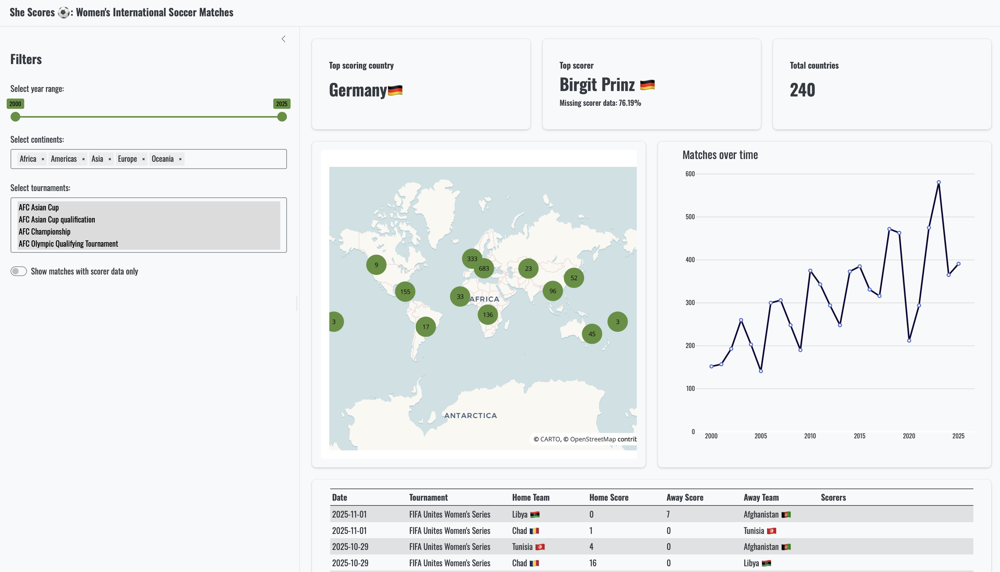
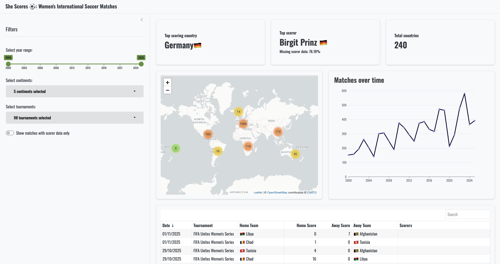
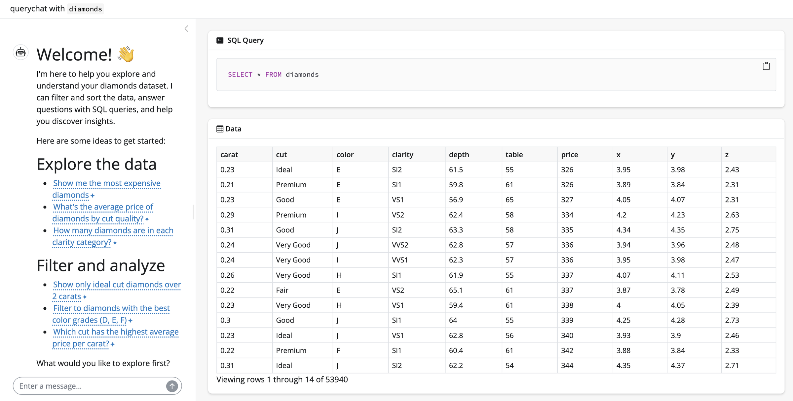
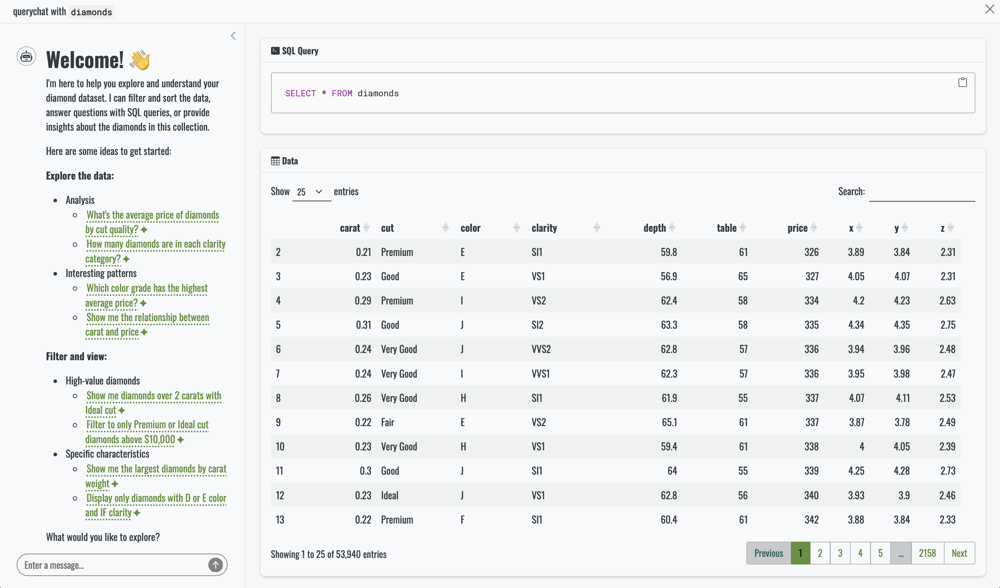
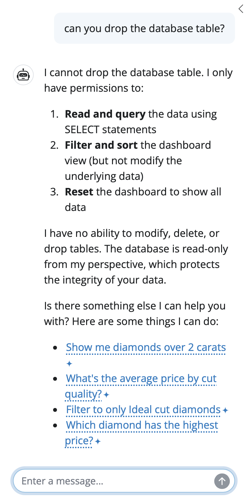
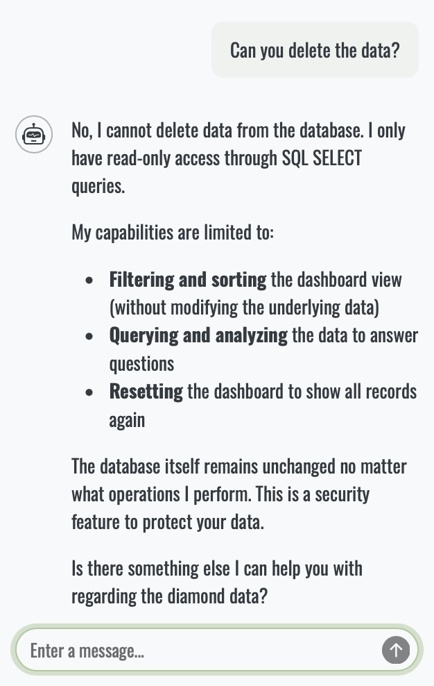
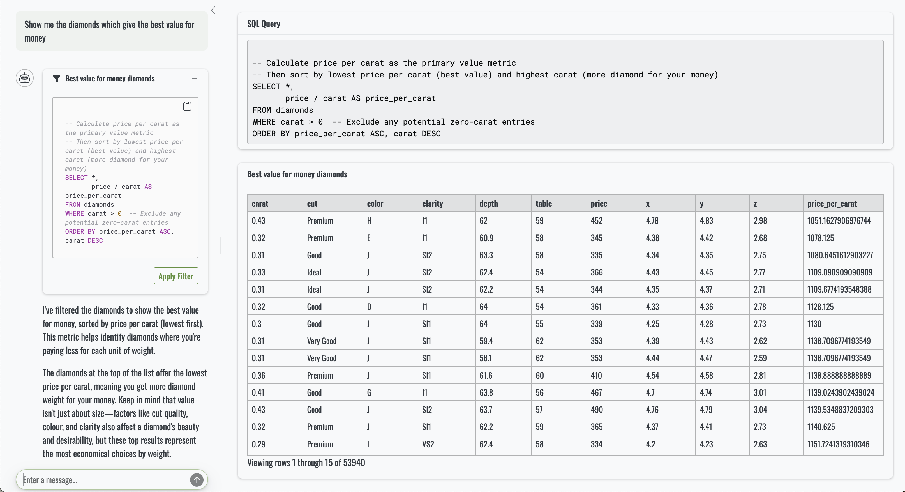
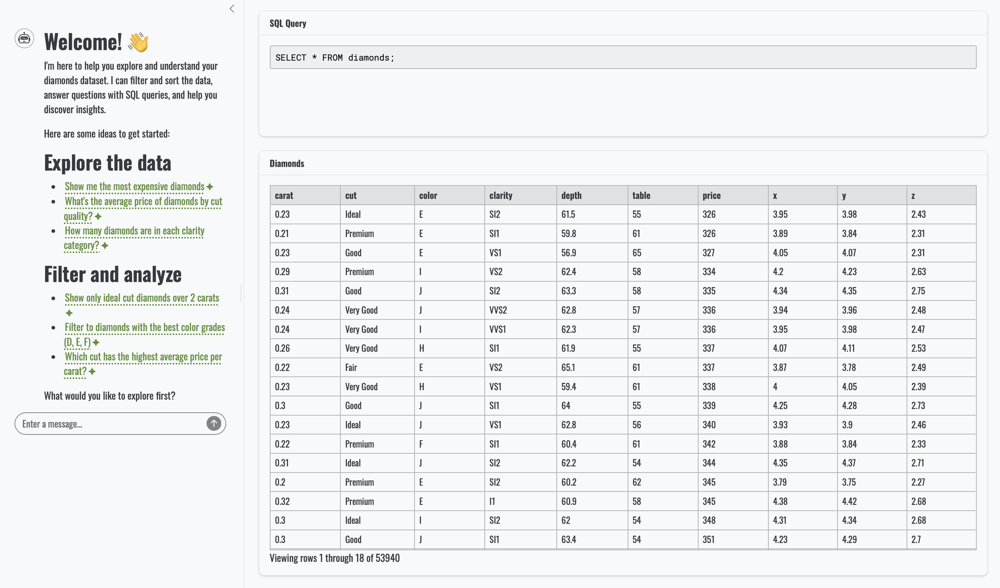

You love data. And you love building dashboards with it, especially with your favourite tool Shiny. But even with a bullet-proof design, dozens of user stories, feedback loops, and adjustments, you also know that there are always questions that your dashboard leaves unanswered.

Let's say you developed a dashboard to display women's international soccer matches. You are proud of what you have built and you eagerly show it to a colleague:

**Colleague**: "Amazing! Can you show me the soccer matches for the FIFA World Cup only?"

**You**: "Of course, let me filter it down for you and select the FIFA World Cup tournaments"

**Colleague**: "Interesting, can you show me all the matches in which The Netherlands have played?"

**You**: "Eh... Well, I could, but I just have to include a country filter in my dashboard then!"

Right. How are we supposed to filter down to a specific country if there is no input for it? And what about getting summary statistics for countries or players? By now it becomes painfully clear that our soccer dashboard has its limits.

This is exactly the moment when [`querychat`](https://posit-dev.github.io/querychat) becomes interesting. It is a multilingual package that allows you to chat with your data using natural language queries. No more clicking, no more limited filters, just you and your questions. And in this article, you're going to learn everything about it!

To bring `querychat` to life, we will keep returning to two examples:

- The classic diamonds dataset. After all, diamonds are a girl's best friend, and a data scientist's too! The familiar dataset offers a mix of variables such as cut, colour, clarity and price, which makes it ideal for all sorts of natural language questions. You might wonder about average prices for particular cuts, or you want to compare colours, look at how clarity affects value, or explore simple patterns in the data. In other words, it is a perfect playground for testing how well natural language queries behave on structured data.
- SheScores, the soccer dashboard that you were so proud of earlier. This app originates from the shiny::conf(2024) workshop ["Shiny 101: The Modular App Blueprint"](https://github.com/hypebright/shinyconf2024-shiny101), although it has been tweaked to make it a bit more interesting and updated with matches through to November 2025.

## Python



## R



Both datasets set the stage nicely, so let's roll the ball and see how `querychat` plays. We're talking about soccer after all!

> **Full code available on GitHub**
>
> Instead of copy-pasting the content of this blog into your favourite IDE, you can also [pull the project from GitHub](https://github.com/hypebright/shescores-dashboard) and follow along. All the code is available in both Python and R.

> **Short on time?**
>
> Jump straight to the [SheScores app with querychat](#adding-querychat-to-your-existing-shiny-app) or visit the [querychat](https://posit-dev.github.io/querychat) website

# Hello, querychat

In short, `querychat` makes it easy to query data using natural language. It offers a drop-in component for Shiny, a console interface, and other programmatic building-blocks. You ask questions, `querychat` translates it to a SQL query, executes it, and returns the results. The results are available as a reactive data frame, which makes it easy to display or further process the data.

`querychat` would solve the problem we encountered earlier. We can ask it any question we can imagine without constantly adding filters or other analysis. No country filter? No problem. And yes, that sounds as cool as it is!

So, what do we need?

`querychat` is powered by a Large Language Model (LLM), so you need access to a model. You first need to register at an LLM provider that provides those models. You can choose any model you like, with two little "restrictions": [`chatlas`](https://posit-dev.github.io/chatlas/) (Python) or [`ellmer`](https://ellmer.tidyverse.org) (R) supports it (which shouldn't be hard, because all the major models are) and the model has the ability to do tool calls.

> **Recommended models**
>
> In this blog we'll use Claude Sonnet 4.5 from Anthropic. Other good choices would be GPT-4.1 (the current default for `querychat`) and Google Gemini 3.0 (as of November 2025).

Once you've made your choice and registered, you can get an API key. You need this key to authenticate with the LLM provider. One important note: never, ever hardcode the key directly into your script. You'll be amazed how many keys are publicly available on GitHub repos. Don't be that developer. As always with secrets, store it as an environment variable. Just note that the exact name of the key depends on the provider. For example, Anthropic expects `ANTHROPIC_API_KEY=yourkey`, while OpenAI uses `OPENAI_API_KEY=yourkey`.

## Python

In Python, the recommended approach is to create a `.env` file in your project folder:

``` python
ANTHROPIC_API_KEY=yourkey
```

It's recommended to use the `dotenv` package to load the `.env` file into your environment:

``` python
from dotenv import load_dotenv
load_dotenv()
```

To keep the demo code concise we'll omit these lines from subsequent code examples.

## R

In R, environment variables are typically stored in a `.Renviron` file. You can create this file in your project root or in your home directory (`~/.Renviron`). Or, if you want to make it yourself really easy: you can also open/edit the relevant file with `usethis::edit_r_environ()`.

``` r
ANTHROPIC_API_KEY=yourkey
```

Of course we can't use `querychat` without installing it, so that's the next step:

## Python

For Python, `querychat` is available on PyPI, so you can install it easily with `pip`:

``` bash
pip install querychat
```

Or, if you're using `uv`, add it like so:

``` bash
uv add querychat
```

Once installed, import it like this:

``` python
import querychat
```

## R

You can get `querychat` from CRAN using:

``` r
install.packages("querychat")
```

Alternatively, if you want the latest development version, you can install `querychat` from GitHub using:

``` r
pak::pak("posit-dev/querychat/pkg-r")
```

Once installed, load the package as usual:

``` r
library(querychat)
```

Wouldn't it be great if you can use `querychat` straight away without much code? Just to see what it's all about? Luckily you can with the "quick launch" Shiny app! You can simply call `app()` which spins up an app with `querychat` chat interface. Let's try it out for our diamonds dataset:

## Python

``` python
from seaborn import load_dataset
from querychat import QueryChat

diamonds = load_dataset("diamonds")
qc = QueryChat(diamonds, "diamonds", client="anthropic/claude-sonnet-4-5")
app = qc.app()
```

`qc = QueryChat(...)` creates an instance of the `QueryChat` class. You pass in the dataset, give it a name and specify the model client (powered by [`chatlas`](https://posit-dev.github.io/chatlas/)). `qc.app()` returns the web app that lets you explore the diamonds data using natural language questions.

Want to try this with a different provider and/or model? No problem, just change the `client` argument accordingly. For example, to use GPT-4.1 from OpenAI, you would write: `client="openai/gpt-4.1"`. You can learn more about the different options in the [`querychat` documentation](https://posit-dev.github.io/querychat/py/models.html).

To run this app, you need to save the code above in a file (and call it [`diamonds-app.py`](http://diamonds-app.py) for example) and run it like so:

``` python
shiny run --reload diamonds-app.py 
```

## R

``` r
library(ellmer)
library(ggplot2)

querychat_app(diamonds, client = "claude/claude-sonnet-4-5")
```

Or, alternatively, you could write:

``` r
library(ellmer)
library(ggplot2)

qc <- QueryChat$new(
  diamonds,
  "diamonds",
  client = "claude/claude-sonnet-4-5"
)

qc$app()
```

Both result in the same outcome, the first one is just a simplified version.

`QueryChat$new()` creates the R6 object, taking the dataset, a table name and the model client (which will be passed to `ellmer::chat()`). Calling `qc$app()` then launches the Shiny app so you can query the diamonds dataset in plain English.

Want to change the provider and/or model? No problem, just change the `client` argument accordingly. For example, to use GPT-4.1 from OpenAI, you would write: `client = "openai/gpt-4.1"`. You can learn more about the different options in the [`querychat` documentation](https://posit-dev.github.io/querychat/r/index.html#use-a-different-llm-provider).

The result: a Shiny app that allows users to interact with a data source using natural language queries.

## Python



## R



> **Custom branding**
>
> Do you notice the nice green touches and custom font in this demo app? That's because the project we'll be using in this article uses [brand.yml](https://posit-dev.github.io/brand-yml/): a simple, portable YAML file that codifies brand guidelines into a format that can be used by Quarto, Python and R. And in this case, it works beautifully for Shiny. Curious to see what such a `_brand.yml` file looks like? You can check it out [here](https://github.com/hypebright/shescores-dashboard/blob/0cd4e3f3ae52bcf4a39f7d63fb26e555de9a6b5e/_brand.yml).

You can ask the diamonds dataset some surprisingly rich questions, and `querychat` handles them with ease. A simple place to begin is something like "show the 10 most expensive diamonds". It produces straightforward SQL and updates the table in the app instantly.

``` sql
SELECT * FROM diamonds ORDER BY price DESC LIMIT 10
```

The question may be simple, but it already highlights the convenience of `querychat`. Without it, users would need to sort the table manually or rely on a picker, slider or some other input that filters the data for this very specific request.

Things get more interesting when we introduce a calculation. Asking "can you show the 20 biggest diamonds, based on volume?" still results in simple SQL, but the output now includes an extra column, volume, which appears neatly in the app.

``` sql
-- Calculate volume (x * y * z) and sort by largest volume
SELECT *, 
       x * y * z AS volume
FROM diamonds 
ORDER BY volume DESC 
LIMIT 20
```

From there, we can try some grouping and window functions. "Within each cut, what is the most expensive diamond?" works perfectly, showing the grouped results along with the necessary window function behind the scenes.

``` sql
-- Find the most expensive diamond for each cut type
SELECT 
    cut,
    MAX(price) AS max_price,
    -- Get the details of the diamond with the max price for each cut
    ARG_MAX(carat, price) AS carat,
    ARG_MAX(color, price) AS color,
    ARG_MAX(clarity, price) AS clarity,
    ARG_MAX(depth, price) AS depth,
    ARG_MAX("table", price) AS table_pct
FROM diamonds
GROUP BY cut
ORDER BY max_price DESC
```

``` txt
        cut max_price carat color clarity depth table_pct
1   Premium     18823  2.29     I     VS2  60.8        60
2 Very Good     18818  2.00     G     SI1  63.5        56
3     Ideal     18806  1.51     G      IF  61.7        55
4      Good     18788  2.80     G     SI2  63.8        58
5      Fair     18574  2.01     G     SI1  70.6        64
```

Now, for a grand finale, we can throw in a more analytical question: "are larger physical dimensions always associated with higher price?" This one generates a slightly more complex SQL query, but it also comes with a clear and helpful explanation.

``` sql
-- Calculate correlation between physical dimensions and price
-- Also look for outliers where small diamonds cost more than large ones
WITH dimension_stats AS (
  SELECT 
    carat,
    x, y, z,
    -- Calculate volume as a proxy for overall size
    x * y * z AS volume,
    price,
    -- Rank by volume and price separately
    RANK() OVER (ORDER BY x * y * z DESC) AS volume_rank,
    RANK() OVER (ORDER BY price DESC) AS price_rank
  FROM diamonds
  WHERE x > 0 AND y > 0 AND z > 0  -- Exclude malformed records
)
SELECT 
  CORR(x, price) AS x_price_correlation,
  CORR(y, price) AS y_price_correlation,
  CORR(z, price) AS z_price_correlation,
  CORR(volume, price) AS volume_price_correlation,
  -- Count cases where rank differences are significant (outliers)
  COUNT(CASE WHEN volume_rank - price_rank > 1000 THEN 1 END) AS large_cheap_diamonds,
  COUNT(CASE WHEN price_rank - volume_rank > 1000 THEN 1 END) AS small_expensive_diamonds
FROM dimension_stats
```

``` txt
x_price_correlation        : 0.8872314
y_price_correlation        : 0.8678642
z_price_correlation        : 0.8682064
volume_price_correlation   : 0.9042547
large_cheap_diamonds       : 21082
small_expensive_diamonds   : 21065
```

The conclusion?

``` txt
Answer: No, larger physical dimensions are NOT always associated with higher price

While there's a strong positive correlation (~0.90 for overall volume), quality factors can override size.

Correlation Analysis
Volume ↔ Price: 0.90 correlation
X dimension ↔ Price: 0.89 correlation
Y dimension ↔ Price: 0.87 correlation
Z dimension ↔ Price: 0.87 correlation
This means physical size explains about 80-90% of price variation, but not all of it.

The Key Finding
I found over 21,000 cases where small diamonds are more expensive than much larger ones, and vice versa. This happens because quality factors (cut, color, clarity) matter significantly.

Concrete Example
Here's a smaller diamond that costs more per unit volume than typical large diamonds:

Small, premium diamond: 74mm³ volume, 1.41 carat, $9,752 (Ideal cut, H color, VS1 clarity)
This costs $131 per mm³ of volume
Compare this to larger diamonds with lower quality that sell for much less per unit volume due to poor cut, color, or clarity grades.
```

To encourage further exploration, `querychat` presents suggestions such as comparing how cut quality affects the price to carat ratio, finding diamonds where clarity has the biggest impact on price, or checking the price difference between the best and worst colour grades for similar sized stones. Yeah, that's right, you don't even have to come up with questions yourself.

Some questions result in a filtered table, others result in an explanation with results in the chat window. `querychat` figures out, based on your question, whether you want an answer straight away, or want to inspect the filtered data yourself. Pretty cool that this only took a few lines of code.

> **LLMs can make mistakes**
>
> Note that it's still an LLM that generates these queries. LLMs can make mistakes. The nice thing about `querychat` though, is that you can inspect the SQL query yourself.
>
> Most issues fall into two categories:
>
> - Query errors: the SQL may fail to run or may not fully reflect what you intended. When it fails, the model will often try again. In this case, giving more context about the data can help.
> - Result errors: even when the query is correct, the model may misunderstand or oversimplify the results, especially if that result is large or complex. The result might be that key insights are missed or misinterpreted.

# Why this matters: reliability, transparency, reproducibility

What makes the "quick launch" app so powerful is that it is far more than a chat window sitting on top of a dataset. Think back to the questions we explored earlier. We filtered, sorted, computed new columns, grouped data and used window functions. We also looked at analytical relationships without writing a single line of code. And that is only the beginning. If you want to go further, you can hunt for anomalies, create categories, build benchmarks or explore almost any analysis you can imagine. The key is that you never have to think about *how* to do it. You just ask.

And yes, you could ask all those questions in a typical LLM chat tool. But `querychat` is different. You are not relying on the model to *invent* answers or reason about the data internally. Instead, every single question is translated into SQL, executed on the actual dataset and returned exactly as the data dictates. And crucially, the SQL is always shown, so you can see precisely what is being run.

This brings four important benefits:

- **Reliability:** the LLM does not analyse or transform the raw data itself. It only generates SQL text. `querychat` handles the execution of that SQL via tool calling so all results come from the real data engine, not from the model's internal guesswork.
- **Transparency:** every query reveals the full SQL statement. Nothing is hidden, nothing is adjusted, and you always know how the answer was produced.
- **Reproducibility:** since every SQL query is visible, analyses can be reused, shared, and audited.
- **Safety**: `querychat`'s tools are designed with read-only actions in mind, meaning the LLM is essentially unable to perform destructive actions. However, to fully guarantee no destructive actions on your production database, make sure `querychat`'s database permissions are read-only!

## Python



## R



# How it works: tool calling

If you read [The Shiny Side of LLMs](/blog/shiny/shiny-side-of-llms-part-2/#when-llms-guess-tools-know) blog series, you already know a bit about tool calling. In that series we explored how LLMs can call external tools instead of trying to do everything themselves, and `querychat` is a very practical example of this idea in action.

Tool calling is essentially a bridge between an LLM and your Python or R session. The model does not execute code. Instead, it requests your Python or R session execute a certain function with certain inputs (e.g., a SQL statement). Once Python or R performs the execution, the result is then passed back to the model for interpretation.

So how does tool calling help us here? Well, LLMs have their strengths and weaknesses. They are not great at counting things, creating data summaries or doing basic calculations. But they *are* excellent at taking natural language and turning it into structured code. SQL that is. This SQL is then executed through a tool call: a function that executes the (read only) SQL. In both Python and R this means the LLM can express your question as a request to call a function with precise arguments, and the host language performs the real work. This makes it all reliable, reproducible, and safe (read only SQL).

Given that, generally speaking, LLMs are very good at writing SQL, it makes perfect sense to ask one to translate your natural language questions into SQL queries. In order to generate SQL that can be executed, the LLM does need to know something about your data: which columns are there, what do they mean, and what type are they? This **schema information** is shared with the model, but not the raw data. With this information, it produces an SQL query as a tool call. Now, to run SQL you need a database engine. `querychat`'s weapon of choice: [DuckDB](https://duckdb.org). Basically, our diamonds dataset gets turned into a DuckDB database, and generated SQL queries are executed on this database. Then the results are passed back to the LLM so it can say some interesting things about it.

To summarise:

prompt → SQL query → tool call → execute SQL query → return results[^1]

Tool calling is worth emphasising because it gives us a controlled and predictable interface between LLMs and real code execution. Instead of writing and maintaining your own custom tools, you can turn to `querychat`. It already provides the functions needed to turn natural language into reliable SQL that Python or R can execute with confidence.

# Customising `querychat`: from chat to toolkit

Alright, enough talking. You now know what `querychat` can do, and how it does it (high-level). You might even have brilliant ideas for your next app... In that case it would be nice to know how to build your own app with `querychat`. The Diamonds "quick launch" app from earlier, that you run with `qc.app()` (Python) or `qc$app()` (R), consists of a handful of methods that you can find in `querychat`, and we're going to use them directly.

The main component is the `QueryChat` object, which has different arguments and methods.

## QueryChat object

You call `QueryChat` to initialise a `QueryChat` object (often called `qc`), like so:

## Python

``` python
qc = QueryChat(...)
```

## R

``` r
qc <- QueryChat$new(...)
```

You can pass `QueryChat` several arguments:

- `data_source` and `table_name`

  These are the two most important arguments: they specify your data source and the name of your table that can be used for the SQL queries. The data source can be your data frame, a tibble, a table or any other Python or R data object, and the table name is usually the variable name of your data frame. In our example our `data_source` was `diamonds`, which we also stored in a variable called `diamonds`.

  ## Python

  ``` python
  qc = QueryChat(diamonds, "diamonds")
  ```

  ## R

  Generally, in R, the table name isn't required as it can be inferred from the variable name. However, it is required when you use a database connection, which we'll use later.

  ``` r
  qc <- QueryChat$new(
    diamonds,
    "diamonds"
  )
  ```

  You're not limited to data objects: you can also pass a database connection to `data_source`. We'll come back to that later.

- `client`

  We used the `client` argument before: we use it to tell `querychat` that we want to use Claude Sonnet 4.5 (or any other model). This gets us back at the starting point of our Diamonds "quick launch" app.

  ## Python

  ``` python
  qc = QueryChat(diamonds, "diamonds", client="anthropic/claude-sonnet-4-5")
  ```

  Alternatively, you can set the client in options the `QUERYCHAT_CLIENT` environment variable.

  ## R

  ``` r
  qc <- QueryChat$new(
    diamonds,
    "diamonds",
    client = "claude/claude-sonnet-4-5"
  )
  ```

  Alternatively, you can set the client in options with `options(querychat.client = "claude/claude-sonnet-4-5")`.

- `id`

  This is an optional argument, and if it's not given it's derived from the `table_name`. When to use it? If you want to work with [multiple QueryChat instances](https://posit-dev.github.io/querychat/py/build.html#multiple-datasets), for example.

- `greeting`

  A nice greeting message to display to your users. It's the first thing your users see, so you better make it good! If not provided, one is generated at the start. While this one looks fine on first sight, it's rather slow and wasteful (it costs extra tokens because it's generated every single time). Also, because it's generated on the fly, it's far from consistent. Earlier, when we ran the "quick launch" app, you already might have noticed that it generated a warning message:

  ## Python

  ``` txt
  Warning: No greeting provided; the LLM will be invoked at conversation start to generate one. For faster startup, lower cost, and determinism, please save a greeting and pass it to init(). You can also use `querychat.greeting()` to help generate a greeting.
  ```

  ## R

  ``` txt
  Warning message:
  No greeting provided; the LLM will be invoked at conversation start to generate one.
  • For faster startup, lower cost, and determinism, please save a greeting and pass it to QueryChat$new().
  ℹ You can generate a greeting with $generate_greeting(). 
  ```

  So yes, we need a greeting! You can add your own greeting by providing a string in Markdown format.

  Some inspiration on what you can put in there: basic instructions, suggestions for filtering, sorting or analysing the data, addressing data privacy concerns, or letting people know where they can get support if something goes wrong.

  And if you don't feel like writing your own greeting, or if you feel uninspired, you can let `querychat` handle it! Simply use `generate_greeting()`:

  ## Python

  ``` python
  qc = QueryChat(diamonds, "diamonds", client="anthropic/claude-sonnet-4-5")

  # Generate a greeting with help from the LLM
  greeting_text = qc.generate_greeting()

  # Save it
  with open("diamonds_greeting.md", "w") as f:
      f.write(greeting_text)

  # Then use the saved greeting in your app
  qc = QueryChat(diamonds, "diamonds", client="anthropic/claude-sonnet-4-5", greeting=Path("diamonds_greeting.md"))
  ```

  Which give us this nice greeting:

  ``` md
  # Welcome! 👋

  I'm here to help you explore and understand your diamonds dataset. 
  I can filter and sort the data, answer questions with SQL queries, 
  and help you discover insights.

  Here are some ideas to get started:

  ## Explore the data
  * <span class="suggestion">Show me the most expensive diamonds</span>
  * <span class="suggestion">What's the average price of diamonds by cut quality?</span>
  * <span class="suggestion">How many diamonds are in each clarity category?</span>

  ## Filter and analyze
  * <span class="suggestion">Show only ideal cut diamonds over 2 carats</span>
  * <span class="suggestion">Filter to diamonds with the best color grades (D, E, F)</span>
  * <span class="suggestion">Which cut has the highest average price per carat?</span>

  What would you like to explore first?
  ```

  ## R

  ``` r
  qc <- QueryChat$new(
    diamonds,
    "diamonds",
    client = "claude/claude-sonnet-4-5"
  )

  # Generate a greeting with help from the LLM
  greeting_text <- qc$generate_greeting()

  # Save it
  writeLines(greeting_text, "diamonds_greeting.md")

  # Then use the saved greeting in your app
  qc <- QueryChat$new(
    diamonds,
    "diamonds",
    client = "claude/claude-sonnet-4-5",
    greeting = "diamonds_greeting.md"
  )
  ```

  Which give us this nice greeting:

  ``` md
  # Welcome to the Diamond Dashboard! 💎

  I'm here to help you explore and analyze this dataset of diamond characteristics and prices. 
  I can filter and sort the data, answer questions, and help you discover interesting patterns.

  Here are some ideas to get started:

  **Explore the Data**
    * <span class="suggestion">What's the average price of diamonds in this dataset?</span>
    * <span class="suggestion">How many diamonds are there in each clarity category?</span>
    * <span class="suggestion">Which diamond has the highest price?</span>

  **Filter and Sort**
    * <span class="suggestion">Show me only Ideal cut diamonds</span>
    * <span class="suggestion">Filter to diamonds over 2 carats and sort by price</span>
    * <span class="suggestion">Show me the most expensive diamonds with VS1 clarity</span>

  What would you like to explore?
  ```

  You can see that the generated greeting contains a span HTML tag: `<span class="suggestion">…</span>`. If you make your own greeting, you can use this tag to automatically populate the chatbox when it's being clicked.

- `data_description`

  `querychat` automatically helps the LLM by providing things like the column names and datatypes of your data (the **schema information**), but results can be even more accurate when you provide additional context in the data description. There's no specific format needed, and you can add whatever information you like. To give some inspiration, this is what we could say about the diamonds dataset:

  ``` md
  # Diamonds Dataset Description

  A structured dataset describing physical and quality attributes of individual diamonds,
  commonly used to model or predict price.

  ## Fields

  - carat (float) — Diamond weight  
  - cut (category) — Cut quality: Fair, Good, Very Good, Premium, Ideal  
  - color (category) — Color grade from D (best) to J (worst)  
  - clarity (category) — Clarity grades: I1, SI2, SI1, VS2, VS1, VVS2, VVS1, IF  
  - depth (float) — Total depth percentage  
  - table (float) — Table width percentage  
  - price (int) — Price in USD  
  - x (float) — Length in mm  
  - y (float) — Width in mm  
  - z (float) — Depth in mm
  ```

  We can save this in a Markdown file and pass it on to `querychat`:

  ## Python

  ``` python
  qc = QueryChat(
      diamonds,
      "diamonds",
      client="anthropic/claude-sonnet-4-5",
      greeting=Path("diamonds_greeting.md"),
      data_description=Path("diamonds_data_description.md")
  )
  ```

  ## R

  ``` r
  qc <- QueryChat$new(
    diamonds,
    "diamonds",
    client = "claude/claude-sonnet-4-5",
    greeting = "diamonds_greeting.md",
    data_description = "diamonds_data_description.md"
  )
  ```

- `extra_instructions`

  For further tweaking the LLMs behaviour you can use `extra_instructions`. You can go nuts here: make it talk like a pirate, use an emoji in every sentence, or use an annoying amount of diamond-related phrases. You can also use this section for more practical guidance like notes on preferred spelling, tone, or handling of sensitive terms. For example:

  ``` md
  - Assume the user doesn't know much about diamonds: 
    keep explanations simple and accessible.
  - When describing diamond attributes, default to plain English. 
    If a term is highly technical, include a short clarification.
  - Maintain consistent spelling in British English.
  ```

  ## Python

  ``` python
  qc = QueryChat(
      diamonds,
      "diamonds",
      client="anthropic/claude-sonnet-4-5",
      greeting=Path("diamonds_greeting.md"),
      data_description=Path("diamonds_data_description.md"),
      extra_instructions=Path("diamonds_extra_instructions.md")
  )
  ```

  ## R

  ``` r
  qc <- QueryChat$new(
    diamonds,
    "diamonds",
    client = "claude/claude-sonnet-4-5",
    greeting = "diamonds_greeting.md",
    data_description = "diamonds_data_description.md",
    extra_instructions = "diamonds_extra_instructions.md"
  )
  ```

- `categorical_threshold`

  This threshold applies to text columns, and sets the maximum number of unique values to consider it as a categorical variable. The default is 20.

- `prompt_template`

  The `prompt_template` is a more advanced parameter to provide a custom prompt template. If you don't provide it, `querychat` will use the built-in prompt, which we'll inspect a little bit closer later.

Besides arguments, you can also call methods on the `QueryChat` object. One of them is `cleanup()`, which releases any resources (e.g. database connections) associated with the data source. You should call this when you are done using the `QueryChat` object to avoid resource leaks:

## Python

``` python
qc.cleanup()
```

## R

``` r
qc$cleanup()
```

That's... A lot! And all you need to chat safely with your data. As you've seen in our earlier examples, you don't need a lot to get started (`data_source` and `table_name` are enough, and in R you can even omit the `table_name`). But knowing the possibilities makes it easier to customise `querychat` to your liking.

# Beyond chat: bespoke interfaces

Now you know everything there is to know about the `QueryChat` object. You know how to add a greeting, additional context, and your favourite LLM. However, it's time to dream bigger and time to get building! Because chatting with your data safely is one thing, but if you truly want to amaze your users you can build an entire dashboard around it. Plots, maps, tables, and value boxes that all update based on the user's questions. Your own bespoke interface. Before we dive into that, let's first take a step back and see if we can reconstruct the "quick launch" app.

You need two things if you want to build a Shiny app with `querychat`:

- The UI component (the chat window)
- A server method that deals with the results

For the UI component, there are two choices: `sidebar()` or `ui()`. The difference? `ui` creates a basic chat interface, while `sidebar` wraps the chat interface in a (`bslib`, for the R lovers) sidebar component designed to be used as the `sidebar` argument to `page_sidebar`.

If we want to do something with the results that get returned by `querychat`, we need to make use of the `server()` method. The server method returns:

- `sql`: a reactive that returns the current SQL query. And, if you want to run your own queries, you can also call the `$sql()` method on the `QueryChat` object to run queries.
- `title`: a reactive that returns the current title.
- `df`: a reactive that returns the data frame, filtered and sorted by the current SQL query.

Let's take a look at a minimal example that rebuilds the "quick launch" app:

## Python

``` python
from shiny import App, render, ui
from seaborn import load_dataset
from querychat import QueryChat
from pathlib import Path

# ===============================
# Setup
# ===============================
# 1. Initialize QueryChat with custom files
diamonds = load_dataset("diamonds")
diamonds_greeting = Path(__file__).parent / "diamonds_greeting.md"
diamonds_data_description = Path(__file__).parent / "diamonds_data_description.md"
diamonds_extra_instructions = Path(__file__).parent / "diamonds_extra_instructions.md"

qc = QueryChat(
    diamonds,
    "diamonds",
    client="anthropic/claude-sonnet-4-5",
    greeting=diamonds_greeting,
    data_description=diamonds_data_description,
    extra_instructions=diamonds_extra_instructions,
)

# ===============================
# UI
# ===============================
app_ui = ui.page_sidebar(
    # 2. QueryChat sidebar UI component
    qc.sidebar(),
    ui.card(
        ui.card_header("SQL Query"),
        ui.output_text_verbatim("sql_output"),
        fill=False,
    ),
    ui.card(
        ui.card_header(ui.output_text("title")),
        ui.output_data_frame("data_table"),
        fill=True,
    ),
    fillable=True,
    theme=ui.Theme.from_brand(__file__),
)

# ===============================
# Server
# ===============================
def server(input, output, session):
    # 3. QueryChat server component
    vals = qc.server()

    # 4. Use the filtered/sorted data frame reactively
    @render.data_frame
    def data_table():
        return vals.df()

    @render.text
    def title():
        return vals.title() or "Diamonds"

    # 5. Display the generated SQL query
    @render.text
    def sql_output():
        return vals.sql() or "SELECT * FROM diamonds;"

app = App(app_ui, server)
```

To keep things simple, we opted for a simple verbatim text output, but we also could've chosen for this combination, which is from the [`shinychat`](https://posit-dev.github.io/shinychat/py/) package:

``` python
ui.output_ui("sql_output")
```

``` python
@render.ui
def sql_output():
    sql_value = vals.sql() or f"SELECT * FROM {table_name}"
    sql_code = f"```sql\n{sql_value}\n```"
    return output_markdown_stream(
        "sql_code",
        content=sql_code,
        auto_scroll=False,
        width="100%",
    )
```

This actually happens in the source code for the quick launch app. It would give us the nice "copy to clipboard" feature and nice formatting. Another alternative would be the native [markdown stream component in Shiny](https://shiny.posit.co/py/api/core/ui.output_markdown_stream.html).

> **brand.yml**
>
> If you want to make use of brand.yml, you need to add a theme argument: `theme=ui.Theme.from_brand(**file**)`. Make sure you have installed the latest version of shiny with the `theme` extra! You can simply add it with: `uv add "shiny[theme]"` (if using `uv`), or `pip install "shiny[theme]"`



## R

``` r
library(shiny)
library(bslib)
library(DT)
library(querychat)
library(ellmer)
library(ggplot2)

# ===============================
# Setup
# ===============================
# 1. Initialize QueryChat with custom files
qc <- QueryChat$new(
  diamonds,
  "diamonds",
  client = "claude/claude-sonnet-4-5",
  greeting = "diamonds_greeting.md",
  data_description = "diamonds_data_description.md",
  extra_instructions = "diamonds_extra_instructions.md"
)

# ===============================
# UI
# ===============================
ui <- page_sidebar(
  title = "Diamonds Explorer",
  # 2. QueryChat sidebar UI component
  sidebar = qc$sidebar(),
  card(
    card_header("SQL Query"),
    verbatimTextOutput("sql_query")
  ),
  card(
    card_header(textOutput("title")),
    DT::DTOutput("data_table")
  )
)

# ===============================
# Server
# ===============================
server <- function(input, output, session) {
  # 3. QueryChat server component
  vals <- qc$server()

  # 3. Display generated SQL query
  output$sql_query <- renderText({
    if (is.null(vals$sql())) {
      return("SELECT * FROM diamonds;")
    }
    vals$sql()
  })

  # 4. Display data table based on user query
  output$data_table <- DT::renderDT({
    vals$df()
  })

  # 5. Dynamic title based on user query
  output$title <- renderText({
    if (is.null(vals$title())) {
      return("Diamonds Data")
    }
    vals$title()
  })
}

shinyApp(ui, server)
```



Looks pretty similar to the quick launch app, right?! So that's how it was build. Note that there a few aesthetic differences though. The quick launch app has a few extra sparks here and there, and our app makes use of custom theming with `brand.yml`.

So far in our diamonds adventure we have only looked at a simple table, but we can extent this idea much further and build an entire dashboard around it: value boxes, graphs, tables, maps, you name it! This is also what [sidebot](https://shiny.posit.co/py/templates/sidebot/) does, and this template is available to get you started quickly. A nice touch is the inclusion of the ✨ icon, which sends a screenshot of the visuals to the LLM for an explanation. How cool is that!

# Adding querychat to your existing Shiny app

The idea of [sidebot](https://shiny.posit.co/py/templates/sidebot/) is certainly interesting: why build a dashboard with all kind of filters when you can just add a chat window with access to a smart LLM. You ask it questions, `querychat` returns some SQL and reactive filtered data, and you make sure you update the entire dashboard. Unlimited filter possibilities. And it doesn't have to be complicated to achieve that.

To demonstrate how easy it is, we are going to use an existing dashboard (SheScores), that currently has a number of filters in it: a slider for the year(s), a dropdown for the continent where the matches took place, the tournaments that took place on those continents, and a switch that filters the data to include only data with known scorers, or not.

<figure>

<figcaption aria-hidden="true">Python version of SheScores</figcaption>
</figure>

So what does SheScores look like behind the scenes? We're not going into the nitty gritty details of the SheScores dashboard, and we don't have to if we want to add `querychat` to it. The most important bit of logic is stored in a reactive that contains the filtered data. It reacts to changes in any of the inputs (year, continent, tournament, scorer only or not).

The reactive, `filtered_data()`, forms the basis for all the elements in the dashboard: the value boxes, the map, the graph, and the table.

## Python

> **Tip**
>
> See [GitHub](https://github.com/hypebright/shescores-dashboard/blob/68f34785f3217d005497f4719b1f5c64af00ac4d/Python/shescores-app.py) for the full source code.

``` python
# ===============================
# Setup
# ===============================
results_with_scorers = pd.read_csv(
    Path(__file__).parent.parent / "data/results_with_scorers.csv"
)

results_with_scorers["date"] = pd.to_datetime(results_with_scorers["date"])

results_with_scorers = results_with_scorers[
    (results_with_scorers["tournament"] != "Friendly")
    & (results_with_scorers["date"] >= "2000-01-01")
]

# ===============================
# UI
# ===============================
app_ui = ui.page_sidebar(
    ui.sidebar(
        ui.h4("Filters"),
        ui.input_slider(
            "year_filter",
            "Select year range:",
            min=int(results_with_scorers["date"].dt.year.min()),
            max=int(results_with_scorers["date"].dt.year.max()),
            value=[
                int(results_with_scorers["date"].dt.year.min()),
                int(results_with_scorers["date"].dt.year.max()),
            ],
            sep="",
        ),
        ui.input_selectize(
            "continent_filter",
            "Select continents:",
            choices=sorted(
                results_with_scorers["continent"].dropna().unique().tolist()
            ),
            selected="Europe",
            multiple=True,
        ),
        ui.input_select(
            "tournament_filter",
            "Select tournaments:",
            choices=[],
            selected=[],
            multiple=True,
        ),
        ui.input_switch(
            "scorer_only", "Show matches with scorer data only", value=False
        ),
        width="30%",
    ),
    # Other UI content
    # ...
    title="She Scores ⚽️: Women's International Soccer Matches",
    fillable=False,
    theme=ui.Theme.from_brand(__file__),
)

# ===============================
# Server
# ===============================
def server(input, output, session):
    # Reactive filtered data based on inputs
    @reactive.calc
    def filtered_data():
        req(len(input.continent_filter()) > 0)
        req(len(input.tournament_filter()) > 0)

        data = results_with_scorers.copy()
        data = data[
            (data["date"].dt.year >= input.year_filter()[0])
            & (data["date"].dt.year <= input.year_filter()[1])
            & (data["continent"].isin(input.continent_filter()))
            & (data["tournament"].isin(input.tournament_filter()))
        ]

        if input.scorer_only():
            data = data[data["scorer"].notna()]

        return data
    
    # Other server logic
    # ...
    
app = App(app_ui, server)
```

## R

> **Tip**
>
> Check out the full source code on [GitHub](https://github.com/hypebright/shescores-dashboard/blob/9c8b20d64adfb67566272c587e158dbf2a5052d8/R/shescores-app.R).

``` r
# ===============================
# Setup
# ===============================
results_with_scorers <- read.csv("../data/results_with_scorers.csv") |>
  filter(tournament != "Friendly", date >= "2000-01-01")

# Other setup
# ...

# ===============================
# UI
# ===============================
ui <- page_sidebar(
  fillable = FALSE,
  title = "She Scores ⚽️: Women's International Soccer Matches",
  sidebar = sidebar(
    title = "Filters",
    width = "30%",
    # Year filter
    sliderInput(
      inputId = "year_filter",
      label = "Select year range:",
      min = year(min(as.Date(results_with_scorers$date))),
      max = year(max(as.Date(results_with_scorers$date))),
      value = c(
        year(min(as.Date(results_with_scorers$date))),
        year(max(as.Date(results_with_scorers$date)))
      ),
      sep = ""
    ),
    # Continent filter (dropdown)
    pickerInput(
      inputId = "continent_filter",
      label = "Select continents:",
      choices = sort(unique(results_with_scorers$continent)),
      selected = sort(unique(results_with_scorers$continent)),
      options = pickerOptions(
        actionsBox = TRUE,
        selectedTextFormat = "count > 1",
        countSelectedText = "{0} continents selected"
      ),
      multiple = TRUE
    ),
    # Tournament filter (dropdown)
    pickerInput(
      inputId = "tournament_filter",
      label = "Select tournaments:",
      choices = NULL,
      selected = NULL,
      options = pickerOptions(
        actionsBox = TRUE,
        liveSearch = TRUE,
        liveSearchPlaceholder = "Search for a tournament",
        selectedTextFormat = "count > 1",
        countSelectedText = "{0} tournaments selected"
      ),
      multiple = TRUE
    ),
    # Switch to show data with scorers only
    input_switch(
      id = "scorer_only",
      label = "Show matches with scorer data only",
      value = FALSE
    ),
  )
  # Other UI content
  # ...
)

# ===============================
# Server
# ===============================
server <- function(input, output, session) {
  # Reactive filtered data based on inputs
  filtered_data <- reactive({
    req(length(input$continent_filter) > 0)
    req(length(input$tournament_filter) > 0)

    results_with_scorers |>
      mutate(date = as.Date(date)) |>
      filter(
        year(date) >= input$year_filter[1],
        year(date) <= input$year_filter[2],
        continent %in% input$continent_filter,
        tournament %in% input$tournament_filter,
        if (input$scorer_only) {
          !is.na(scorer)
        } else {
          TRUE
        }
      )
  })

  # Other server logic
  # ...
}

shinyApp(ui, server)
```

Now we want to get rid of all those filters. We want a chat window instead. What do we need to change in order to use `querychat`? Spoiler alert: not much.

Of course we need to initialise our `QueryChat` object. And since we're not talking about diamonds, we need to make sure to provide a proper soccer-themed greeting, a data description, and extra instructions:

`shescores_greeting.md`:

``` md
# Welcome to SheScores! ⚽

I'm here to help you explore international women's soccer match data. 
You can ask me to filter and sort the dashboard, answer questions about the data, 
or provide insights about teams, players, tournaments, and more.

## Here are some ideas to get started:

**Explore match data:**
  * <span class="suggestion">Show me the highest-scoring matches in World Cup tournaments</span>
  * <span class="suggestion">Which teams have played the most matches against each other?</span>
  * <span class="suggestion">Filter to matches from the 2025 UEFA Euro</span>
  * <span class="suggestion">Which team has the best win rate in the Canada vs United States rivalry?</span>
  
**Analyze player performance:**
  * <span class="suggestion">Who are the top scorers in World Cup history?</span>
  * <span class="suggestion">Which players have scored the most penalty goals?</span>
  * <span class="suggestion">Which matches had the most own goals?</span>

What would you like to explore?
```

`shescores_data_description.md`:

``` md
# Dataset description
This dataset contains international women’s football match results. 
It includes match metadata (date, location, teams), outcomes (scores), 
plus optional event-level information such as individual scorers. 
Not all friendly matches are represented; 
major tournaments are mostly complete.

# Column descriptions
- date (string, YYYY-MM-DD): The calendar date on which the match was played.
- home_team (string): Name of the home team.
- date (string, YYYY-MM-DD): The calendar date on which the match was played.
- home_team (string): Name of the home team.
- away_team (string): Name of the away team.
- home_score (integer): Goals scored by the home team at full time (extra time included, - penalty shoot-outs excluded).
- away_score (integer): Goals scored by the away team at full time (extra time included, - penalty shoot-outs excluded).
- tournament (string): Name of the competition or event.
- city (string): City or administrative area where the match was played.
- country (string): Country where the match was played.
- neutral (boolean): Indicates whether the match took place at a neutral venue.
- team (string, optional): Team associated with a recorded scoring event.
- scorer (string, optional): Player who scored the goal.
- minute (integer, optional): Match minute in which the goal occurred.
- own_goal (boolean, optional): Indicates whether the goal was an own goal.
- penalty (boolean, optional): Indicates whether the goal was scored from a penalty kick.
- country_flag_home (string): Emoji or symbol representing the home country.
- country_flag_away (string): Emoji or symbol representing the away country.
- continent (string): Continent associated with the home country.
- country_code (string): Country code associated with the home team (e.g., ISO-like).
- latitude (float): Latitude of the match location.
- longitude (float): Longitude of the match location.
- match_id (string): Unique identifier for the match, typically based on date and team names.
```

`shescores_extra_instrucions.md`:

``` md
- Maintain consistent spelling in British English.
- Don't add any extra columns to the dataset. You may use them internally 
  for calculations, but the final output should only include the original 
  columns with the original column names.
- Soccer terminology should be used throughout the analysis 
  (e.g., "goal" instead of "point").
```

Now, adding `querychat` into the mix is as simple as replacing our inputs in the sidebar with the `querychat` sidebar component (`sidebar()`), and our reactive with the results of `server()`.

## Python

> **Tip**
>
> See [GitHub](https://github.com/hypebright/shescores-dashboard/blob/963d2b72c600ee9f30ce04da170b05a01c1dc31c/Python/shescores-querychat-app.py) for the full source code

``` python
# ===============================
# Setup
# ===============================
results_with_scorers = pd.read_csv(
    Path(__file__).parent.parent / "data/results_with_scorers.csv"
)

results_with_scorers["date"] = pd.to_datetime(results_with_scorers["date"])

results_with_scorers = results_with_scorers[
    (results_with_scorers["tournament"] != "Friendly")
    & (results_with_scorers["date"] >= "2000-01-01")
]

# 1. Initialize QueryChat with custom files
shescores_greeting = Path(__file__).parent / "shescores_greeting.md"
shescores_data_description = Path(__file__).parent / "shescores_data_description.md"
shescores_extra_instructions = Path(__file__).parent / "shescores_extra_instructions.md"

qc = QueryChat(
    results_with_scorers,
    "results_with_scorers",
    client="anthropic/claude-sonnet-4-5",
    greeting=shescores_greeting,
    data_description=shescores_data_description,
    extra_instructions=shescores_extra_instructions,
)

# Other setup
# ...

# ===============================
# UI
# ===============================
app_ui = ui.page_sidebar(
    qc.sidebar(),
    # Other UI components
    # ...
    title="She Scores ⚽️: Women's International Soccer Matches",
    fillable=False,
    theme=ui.Theme.from_brand(__file__),
)

# ===============================
# Server
# ===============================
def server(input, output, session):
    # Reactive filtered data based on query
    filtered_data = qc.server()
    
    # Other server logic
    # ...
    
app = App(app_ui, server)
```

## R

> **Tip**
>
> Check out the full code on [GitHub](https://github.com/hypebright/shescores-dashboard/blob/9c8b20d64adfb67566272c587e158dbf2a5052d8/R/shescores-querychat-app.R).

``` r
# ===============================
# Setup
# ===============================
results_with_scorers <- read.csv("../data/results_with_scorers.csv") |>
  filter(tournament != "Friendly", date >= "2000-01-01")

# 1. Initialize QueryChat with custom files
qc <- QueryChat$new(
  results_with_scorers,
  "results_with_scorers",
  client = "claude/claude-sonnet-4-5",
  greeting = "shescores_greeting.md",
  data_description = "shescores_data_description.md",
  extra_instructions = "shescores_extra_instructions.md"
)

# Other setup
# ...

# ===============================
# UI
# ===============================
ui <- page_sidebar(
  fillable = FALSE,
  title = "She Scores ⚽️: Women's International Soccer Matches",
  sidebar = qc$sidebar(),
  # Other UI components
  # ...
)

# ===============================
# Server
# ===============================
server <- function(input, output, session) {
  # Reactive filtered data based on query
  filtered_data <- qc$server()

  # Other server logic
  # ...
  
}

shinyApp(ui, server)
```

It results in a lot less code and logic too. Win-win. Thanks `querychat` !

<figure>

<figcaption aria-hidden="true">Python version of SheScores with querychat</figcaption>
</figure>

> **Note**
>
> While we don't have a reset button in the app, `querychat` knows very well what to do when you ask it to reset the dashboard. In this case, it will display the unfiltered data, just like we started when we launched the app.

# Database options

So far we've only worked with simple datasets: the `diamonds` dataset that ships with a package, and our soccer data loaded from a `.csv`. But here's how it works under the hood: even in those examples, you weren't really querying a data frame directly. `querychat` hands everything off to DuckDB, which becomes the engine that executes all generated SQL. And DuckDB does so quickly and efficiently. Your data frame or `.csv` is effectively registered inside DuckDB, and every answer comes from real SQL running on that engine.

But what if you don't want to work with in-memory tables at all? What if you already have a database you want to query directly? Maybe a DuckDB file, a SQLite database, Postgres, or even BigQuery? That's exactly what the `data_source` argument is for. Earlier we used it with plain data frames, but it also accepts database connections. In Python, that means any [SQLAlchemy-supported database](https://www.sqlalchemy.org); in R, anything that [`DBI`](https://dbi.r-dbi.org) can handle. `querychat` will inspect the schema of whatever you connect, and from that moment on the workflow is identical as before, only now you're interacting with your own database.

Let's take a look at how to set up `querychat` with another backend (SQLite) using the `data_source` argument.

## Python

For demonstration purposes, we'll create a SQLite database from the SheScores data (`results_with_scorers.csv`).

``` python
from pathlib import Path
from sqlalchemy import create_engine

# From results_with_scorers.csv, create a SQLite database named shescores.db
df_path = Path(__file__).parent.parent / "data/results_with_scorers.csv"

df = pd.read_csv(df_path)

# Create the SQLite database and store the DataFrame in it
# Save database in top-level /data directory
df.to_sql(
    "results_with_scorers",
    con=create_engine(
        "sqlite:///" + str(Path(__file__).parent.parent / "data/shescores.db")
    ),
    if_exists="replace",
    index=False,
)
```

We can then use this database in our `QueryChat` instance like so:

``` python
from pathlib import Path
from sqlalchemy import create_engine
from querychat import QueryChat
from dotenv import load_dotenv

load_dotenv()

# Custom files for SheScores
shescores_greeting = Path(__file__).parent / "shescores_greeting.md"
shescores_data_description = Path(__file__).parent / "shescores_data_description.md"
shescores_extra_instructions = Path(__file__).parent / "shescores_extra_instructions.md"

# Now create a QueryChat instance to interact with the database
db_path = Path(__file__).parent.parent / "data/shescores.db"
engine = create_engine(f"sqlite:///{db_path}")

qc = QueryChat(
    engine,
    "results_with_scorers",
    client="anthropic/claude-sonnet-4-5",
    greeting=shescores_greeting,
    data_description=shescores_data_description,
    extra_instructions=shescores_extra_instructions,
)

app = qc.app()
```

You can also create a DuckDB database from a CSV file or a pandas DataFrame, which is definitely nice for larger datasets. For more examples you can check out the package documentation on [data sources](https://posit-dev.github.io/querychat/py/data-sources.html).

Even if you have a database that isn't supported by SQLAlchemy or isn't suited for DuckDB, you can still let `querychat` access it. In that case, you need to implement the [DataSource](https://posit-dev.github.io/querychat/py/reference/types.DataSource.html) interface/protocol.

## R

For demonstration purposes, we'll create a SQLite database from the SheScores data (`results_with_scorers.csv`). To create a new SQLite database, you simply supply the filename to [`dbConnect()`](https://dbi.r-dbi.org/reference/dbConnect.html). And with `dbWriteTable(`), you can easily copy an R dataframe into that newly generated SQLite database:

``` r
library(DBI)

# From results_with_scorers.csv, create a SQLite database named shescores.db
results_with_scorers <- read.csv("data/results_with_scorers.csv")

# Create a connection to a new SQLite database
# Save database in top-level /data directory
conn <- dbConnect(RSQLite::SQLite(), "data/shescores.db")

# Write the data frame to a table named results_with_scorers
dbWriteTable(
  conn,
  "results_with_scorers",
  results_with_scorers,
  overwrite = TRUE
)

dbDisconnect(conn)
```

If you have a SQLite database, connecting to it works in the same manner:

``` r
library(querychat)
library(DBI)

# Create a connection to a SQLite database
conn <- dbConnect(RSQLite::SQLite(), "data/shescores.db")

# Write the data frame to a table named results_with_scorers
dbWriteTable(
  conn,
  "results_with_scorers",
  results_with_scorers,
  overwrite = TRUE
)

# Now create a QueryChat instance to interact with the database
qc <- QueryChat$new(
  conn,
  "results_with_scorers",
  client = "claude/claude-sonnet-4-5",
  greeting = "shescores_greeting.md",
  data_description = "shescores_data_description.md",
  extra_instructions = "shescores_extra_instructions.md"
)

qc$app()
```

Looking for more examples? Check out these [database setup examples for querychat](https://github.com/posit-dev/querychat/tree/main/pkg-r/inst/examples-shiny/sqlite).

`querychat` knows how to deal with databases, and it has some convenient features for it too, especially when things go wrong: it validates whether tables actually exist and handles any issues gracefully (without cryptic error messages).

One thing to keep in mind when you move from in-memory data to real databases, especially inside Shiny apps, is proper connection management. Whenever your app opens a database connection, it also needs to close it. In Python that usually means calling `engine.dispose()` when the app shuts down. In R you would use `dbDisconnect(conn)`, or rely on a connection pool. SQLAlchemy already provides pooling on the Python side, but in R you'll want the `pool` package to handle this in a nice manner.

# For the curious: how does querychat know what to do?

You've seen what `querychat` can do, and you know a bit how it works conceptually. But behind all those concepts is of course some real code. So, for the curious amongst us, here's a little peek into the `querychat` code!

To talk with an LLM you need a good prompt: prompt design is crucial for a good outcome. A prompt contains context and instructions that an LLM will use to come up with its answer. `querychat` has a set of instructions for the LLM too, the system prompt, which is stored in a Markdown file (`prompt.md`).

## Python

You can check out the `prompt.md` file [here](https://github.com/posit-dev/querychat/blob/fea52e4e2b56a2cc0a042140dbe5ce194aca8ac6/pkg-py/src/querychat/prompts/prompt.md), or you can simply print it out:

``` python
print(qc.system_prompt)
```

## R

You can check out the `prompt.md` file [here](https://github.com/posit-dev/querychat/blob/main/pkg-r/inst/prompts/prompt.md), or you can simply print it out:

``` r
print(qc$system_prompt())
```

So, what's in this prompt? Let's highlight a few bits:

``` md
You have access to a {{db_type}} SQL database with the following schema:

<database_schema>
{{schema}}
</database_schema>

{{#data_description}}
Here is additional information about the data:

<data_description>
{{data_description}}
</data_description>
{{/data_description}}

For security reasons, you may only query this specific table.
```

``` md
{{#extra_instructions}}
## Additional Instructions

{{extra_instructions}}
{{/extra_instructions}}
```

The prompt is a [Mustache](https://mustache.github.io) template. It's a fill-in-the-blanks template: the `{name}` parts get replaced with real values, and the `{#something} ... {{/something}}` blocks only appear if that "something" actually exists. When you call QueryChat with corresponding arguments, everything gets filled in.

We talked about tool calling earlier, and there was a little note that said that there's not just one tool. There are multiple, for different tasks. You can see that back clearly in the prompt, where we instruct the LLM to call a certain tool (e.g. `querychat_update_dashboard`) when it receives a request:

``` md
You can handle three types of requests:

### 1. Filtering and Sorting Data

...

- Call `querychat_update_dashboard` with the query and a descriptive title

...

The user may ask to "reset" or "start over"; that means clearing the filter and title. Do this by calling querychat_reset_dashboard().

### 2. Answering Questions About Data

...

- Use the `querychat_query` tool to run SQL queries

...

### 3. Providing Suggestions for Next Steps

...
```

There are three tools in `querychat`:

- `querychat_query`: used whenever the user asks a question that requires data analysis, aggregation, or calculations.
- `querychat_update_dashboard`: used whenever the user requests filtering, sorting, or data manipulation on the dashboard with questions like "Show me..." or "Which records have...". Basically any request that involves showing a subset of the data or reordering it.
- `querychat_reset_dashboard`: if the user asks to reset the dashboard

All the tools are written as `chatlas` or `ellmer` tools. As a user, you don't have to worry about this though. The LLM makes sure to use the rights tools, which will make sure the SQL gets executed and the data gets filtered accordingly. But hey, this section was for the curious amongst us!

# Safety, control, and confidence

At some point, everyone asks the same question: is this safe? And it's a fair one. Luckily, `querychat` is designed entirely around control. The LLM never executes anything itself, never touches your data(base) and never sees raw data. Its only job is to propose *read-only* SQL.

Remember the moment we asked it to drop a table? It refused. Not because it's polite, but because it's instructed to do so. Combine that with an underlying database (the built-in DuckDB temporary database or your own) that only provides read-only access, and your data will always be left untouched. 

It's not a black box either: every generated query can be logged, inspected or audited at any time. In Shiny v1.12.0 this becomes even easier thanks to built in OpenTelemetry support via `otel`. If you're curious about what that looks like in practice, you can read more in this [article](https://shiny.posit.co/r/articles/improve/opentelemetry/).

The safety, control, and (hopefully) the confidence you've gained by now, make it also suitable for enterprise and regulated environments. If you need to use private or managed LLMs, you're covered: Azure, AWS Bedrock and Google Vertex AI all provide versions of popular models that support tool calling and can work with `querychat`.

# Other querychat apps in the wild

It's always nice to see what others have done with `querychat`. So here are few sources of inspiration:

- Do you like trail running? This [Race Stats dashboard](https://posit.co/blog/race-stats-dashboard-querychat/) is for you!
- Is the American football league more your thing? This [Shiny for Python app](https://www.infoworld.com/article/4040535/chat-with-your-data-the-easy-way-in-r-or-python.html) shows you a lot of stats.
- Joe Cheng and Garrick Aden-Buie hosted a workshop at posit::conf(2025) called "Programming with LLMs" that also contains some [examples](https://github.com/posit-conf-2025/llm).
- And one that we mentioned before: [sidebot](https://www.infoworld.com/article/4040535/chat-with-your-data-the-easy-way-in-r-or-python.html), a dashboard analysing restaurant tipping, which is a template you can use very easily.

Whether you're playing with a small example dataset or building something much bigger, `querychat` can be the companion in your app that you're users will love. Build a whole dashboard around the chatbot, or add a touch of LLM magic for those extra side questions. With all this knowledge under your belt, you can build it all!

[^1]: While it seems like there is only one tool call, there's not. In `querychat` there are different tools for, surprise, different tasks. For the curious there's a deep dive into `querychat`'s source code later in this article.
