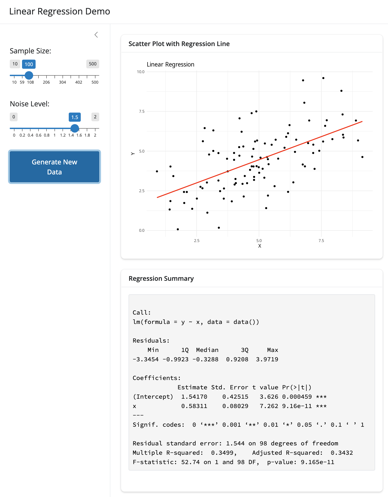
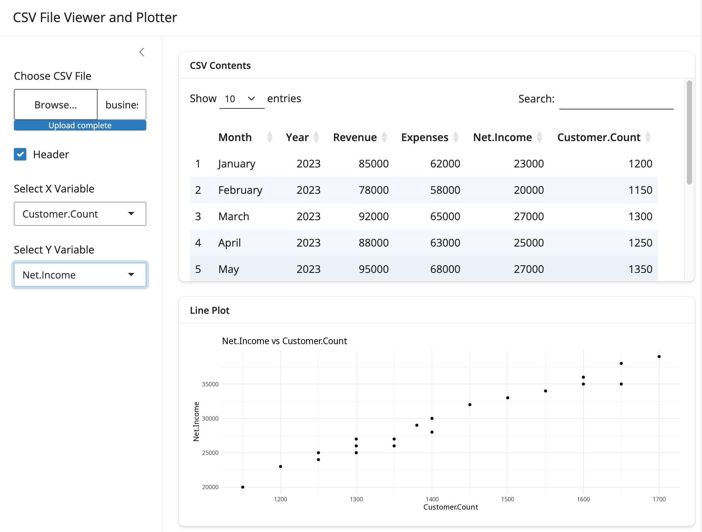
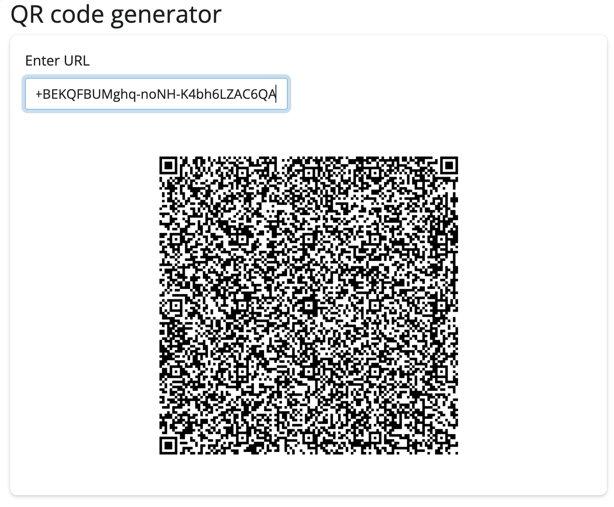
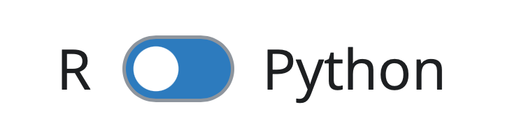

Have you ever had an idea for a great web application with Shiny but felt something holding you back from getting started?
Maybe it's that you don't know where to start, or that you don't know which packages use to build the app, or maybe it's just that you can't muster the energy to get started.
Sometimes you just need a little help to get unstuck.

We're excited to announce a new addition to the Shiny ecosystem that can help: [Shiny Assistant](https://gallery.shinyapps.io/assistant/).

Shiny Assistant is a new AI-powered tool that helps you get things done: you can ask it questions about Shiny, or to create a Shiny application from scratch, or ask it to make changes to an existing application.
You can think of it as a knowledgeable colleague who is always ready to help out with your Shiny projects, in both R and in Python.

Let's have a look at a few practical examples of what Shiny Assistant can do. Suppose you want to build an application to calculate mortgage payments. You can just ask Shiny Assistant to build it for you.

**"Create an application which calculates mortgage payments."**



Great, we have a working application!

Although Shiny Assistant quickly built an application that works, you are still needed in the loop. It is important to verify the code -- you will need to apply your knowledge of the problem domain to check that the application is doing the right thing.

Now that we have something that's working, we can also ask it to make changes to the application.

**"Add a plot which shows the remaining principal on the mortgage."**



Sometimes you know the change that you want to make, and it would be inefficient or complicated to ask Shiny Assistant to make the change for you. In these cases, you can edit the code directly, in the editor panel.

The default values for mortgage amount and interest need a little bit of adjustment to accurately reflect today's economic conditions. Here we'll change the code in the editor panel and re-run the application by clicking on the Play button.



Now if we ask Shiny Assistant to make more changes, it will use the code in the editor panel as the basis for further changes -- no need to copy and paste your modified code into the chat window.

Notice that when we ask it to add another feature, the updated code keeps the changes to the starting values that we made just above.

**"Add an amortization table."**



If you'd like to use this application, here it is [with the code editor](https://shinylive.io/py/editor/#code=NobwRAdghgtgpmAXGKAHVA6VBPMAaMAYwHsIAXOcpMAMwCdiYACAZwAsBLCbJjmVYnTJMAgujxMArhwl1KAEzh1ZcKITIcAbnAA6EPgKFMIk-jygtjqPQcHCYUMqgA2xMs44AjLNhdumFkwuZDb8dkFQEPKBgajyenpoqAD60kwAvFIcWFAA5nDJNM7S8gAUekyVWRhsAEzlYACydrl5cEwAClDY8ORMAMJQzoSSzo6COmAAlHgVVdIYY9jEkmTJLByKnlB05RBVB9UbWzt7h+fVXKirySbwdByEDa6RybAr5JMSkwAyxJGiGAfYSlAAkUy+TE0Q0kcHSABYAAzI5ESGBcdIARhREhYFFQWJRMzmF3m2SuNzuSkeDS4FDkeOSdEcunwTEmIggJiGTAAkuQlHA8UwAEospilACkELZ0OKcIAbBgAKxojGIjCYtFQAAe6VqiNx+PSGsxxP2pLJGApaypDyekxeEGS9JgkN+-32ABUlMxSthVHQWDKJHLYekAMyGpjoiBY7V65XRvFwAlm2YWy2XCDXNZqDSkZKeVZkUgNQhDEZjCjusCDYajcVdHqUELTDOk82khYVuhlEmWns7eTJNiqRS7SbNchsZw8Zu9NtdrPVFZOG4UHVrbR0bYaGANIEzufJVDdReTZfnK+HId9s4ru8jsdQCcNEVwBxcLi5ToPCCEBwZ7OEwADyO5MF6fCsje3bZGuuanq4ZANKg-6AcBSFuJeHYXLBVq9v2maDtkhGjuOSgNCIQJCBwABejgcKQkFQJ4zgwbhWYLAhG6sexDTvLRDEFs6ZB8RxA4HDe5oQhAeiKDQrBKDupQ2hIPFkLiQobKQUyIAOAACcj5locAYPWhADgpTAVg21YFGeLbkKUemSVUTpvECkh9JkNqLJ6nnAi5bmVJE3LOEy4q+TmqzWgKDJrMyFAuUwAD0TDYoiIUxqQZCztgkUUBkARcpIQyFe06WYrU2WuskR55ZY0W5v5ryuilABUGU1cRBzZQ1+WnuerbFaUHnvN5whdQNJ5Je0XWlJiTAANQ5ceBVzVMHUdXVA3BmlEqLSta15bNLJbTtvr1blbCWAAtBlsmknIZCSHQ+wzQVjkXnJxFGao6imeZlZWXAim2VWLKBUJjFlq5vXuQFE0+bwMVkK1zrIyhT0XGFZURXNxV+XSgqMnNKVVci-U3WdRWZHj5WE1VPWkrtN1NajLUee1UxMF11XU+tQ1OcImQQ42FDC4uwW-c9n5QN+EC5EWQyRIQ7SZONXmfAjoU0RowlMc60RicVwAALoJLrTA0IIJ1sKjTDMkrcCLRIdKlGzM77atZr6dbBwkwlxVyF++hKyrYwAfN9u07oAdVGhXAYTymSfVLI0PUHQohAnlShwr4fK9sUfq0wd2ZEnAFAUMVsrgE+v0bDxuOFAGBJAopQgNlpJTjdkyIPbnH1+yYALq2A+x19w3kMP9eTB06E184k9Vynzhzyukz8vSOeT9neKb1mkwfmHP5MAAQqr0eTwXivF9f6s91UAC+snZS9b37HEGAACKtwAMWZPAUogkDbN2SCbKA78-oaUMnIKISgMCblzgcf6JltAYDgNoZyflxb2RxpUay6dvqthcv7UkpCUb4KhlQ7GH84CvXejbSYoIQB0MQBgWoNAX5BCUPbSYdcqgGTgX9BBE4sDIXgQDDQmDsFkLwZWCWcBCFMGsmvZeWFsYUIuPIRSYslH2WhuAkSMtSR7WKno4AfcZyTEttbO+RdI5qw1momg1iwCn0LufK+pdWT2N7tbGgHBcgSF1MVYIGAWCSE8H4MgLBSjBNyBsOicJFrRgVFMVRBxdSSLcKUPaKgz4RxLi47JVRcksEYckHUYxPBwGcA0acjVLzZUqdU7AdSGnvnlvfP8ydl4SnBK0627S1gaHcK7E+vSi79OrsBMCEEoLwBGaSXJuQHhlC9HQWE5TKjZQAMRMAAYIBwwhsB3V1BwSwXTnCWECCMOgCDCDYDaTqDA2ArksCidUhwAArQQhRTmOHpKUSJADvKEBOXQM5oKxgwE8NEJgOoJCoEHjQVhIAdSIDwBgREPDLx7PZA4xhX8bYhKEZUERqxczSMQXQZB4lpEYLMvI3BaMMA0IoKo6yYCm4iRdOJch2U9HFS5QUPlhs4aHKYL-a5LhuhMFIHOJgAYdgqqgdlNVdATxQMse4qxNi8p2KYJKbqGRMiInNpy4gOAzEXG1bq1uHiACagYTWZEdQVKBHjmlsBNalZmWrAxOtNp6kN3rnWuvdWyBeM82zfDHkvYCtYd6kwTaPLxfTfEuLsQEi4MroVnJsm9Z5PASDFBgBAFg2VbZ0BssQECXAmAePHp8WNSaBkpo7WmhKtYs2zJzTfMA5sdFZi9ZA51FbzbFQnT66dGAHCoAaGwnFXCCVgAwHWs5RKGFMP2HO1uVskjFTEMupIqQZBKToDuWSYAX54HANAeA1A5AAEdpCh1bN8sgW58BEFyq2agZy4keE8HoM8UQLB6HvebIAA), and here's just the application [on its own](https://shinylive.io/py/app/#h=0&code=NobwRAdghgtgpmAXGKAHVA6VBPMAaMAYwHsIAXOcpMAMwCdiYACAZwAsBLCbJjmVYnTJMAgujxMArhwl1KAEzh1ZcKITIcAbnAA6EPgKFMIk-jygtjqPQcHCYUMqgA2xMs44AjLNhdumFkwuZDb8dkFQEPKBgajyenpoqAD60kwAvFIcWFAA5nDJNM7S8gAUekyVWRhsAEzlYACydrl5cEwAClDY8ORMAMJQzoSSzo6COmAAlHgVVdIYY9jEkmTJLByKnlB05RBVB9UbWzt7h+fVXKirySbwdByEDa6RybAr5JMSkwAyxJGiGAfYSlAAkUy+TE0Q0kcHSABYAAzI5ESGBcdIARhREhYFFQWJRMzmF3m2SuNzuSkeDS4FDkeOSdEcunwTEmIggJiGTAAkuQlHA8UwAEospilACkELZ0OKcIAbBgAKxojGIjCYtFQAAe6VqiNx+PSGsxxP2pLJGApaypDyekxeEGS9JgkN+-32ABUlMxSthVHQWDKJHLYekAMyGpjoiBY7V65XRvFwAlm2YWy2XCDXNZqDSkZKeVZkUgNQhDEZjCjusCDYajcVdHqUELTDOk82khYVuhlEmWns7eTJNiqRS7SbNchsZw8Zu9NtdrPVFZOG4UHVrbR0bYaGANIEzufJVDdReTZfnK+HId9s4ru8jsdQCcNEVwBxcLi5ToPCCEBwZ7OEwADyO5MF6fCsje3bZGuuanq4ZANKg-6AcBSFuJeHYXLBVq9v2maDtkhGjuOSgNCIQJCBwABejgcKQkFQJ4zgwbhWYLAhG6sexDTvLRDEFs6ZB8RxA4HDe5oQhAeiKDQrBKDupQ2hIPFkLiQobKQUyIAOAACcj5locAYPWhADgpTAVg21YFGeLbkKUemSVUTpvECkh9JkNqLJ6nnAi5bmVJE3LOEy4q+TmqzWgKDJrMyFAuUwAD0TDYoiIUxqQZCztgkUUBkARcpIQyFe06WYrU2WuskR55ZY0W5v5ryuilABUGU1cRBzZQ1+WnuerbFaUHnvN5whdQNJ5Je0XWlJiTAANQ5ceBVzVMHUdXVA3BmlEqLSta15bNLJbTtvr1blbCWAAtBlsmknIZCSHQ+wzQVjkXnJxFGao6imeZlZWXAim2VWLKBUJjFlq5vXuQFE0+bwMVkK1zrIyhT0XGFZURXNxV+XSgqMnNKVVci-U3WdRWZHj5WE1VPWkrtN1NajLUee1UxMF11XU+tQ1OcImQQ42FDC4uwW-c9n5QN+EC5EWQyRIQ7SZONXmfAjoU0RowlMc60RicVwAALoJLrTA0IIJ1sKjTDMkrcCLRIdKlGzM77atZr6dbBwkwlxVyF++hKyrYwAfN9u07oAdVGhXAYTymSfVLI0PUHQohAnlShwr4fK9sUfq0wd2ZEnAFAUMVsrgE+v0bDxuOFAGBJAopQgNlpJTjdkyIPbnH1+yYALq2A+x19w3kMP9eTB06E184k9Vynzhzyukz8vSOeT9neKb1mkwfmHP5MAAQqr0eTwXivF9f6s91UAC+snZS9b37HEGAACKtwAMWZPAUogkDbN2SCbKA78-oaUMnIKISgMCblzgcf6JltAYDgNoZyflxb2RxpUay6dvqthcv7UkpCUb4KhlQ7GH84CvXejbSYoIQB0MQBgWoNAX5BCUPbSYdcqgGTgX9BBE4sDIXgQDDQmDsFkLwZWCWcBCFMGsmvZeWFsYUIuPIRSYslH2WhuAkSMtSR7WKno4AfcZyTEttbO+RdI5qw1momg1iwCn0LufK+pdWT2N7tbGgHBcgSF1MVYIGAWCSE8H4MgLBSjBNyBsOicJFrRgVFMVRBxdSSLcKUPaKgz4RxLi47JVRcksEYckHUYxPBwGcA0acjVLzZUqdU7AdSGnvnlvfP8ydl4SnBK0627S1gaHcK7E+vSi79OrsBMCEEoLwBGaSXJuQHhlC9HQWE5TKjZQAMRMAAYIBwwhsB3V1BwSwXTnCWECCMOgCDCDYDaTqDA2ArksCidUhwAArQQhRTmOHpKUSJADvKEBOXQM5oKxgwE8NEJgOoJCoEHjQVhIAdSIDwBgREPDLx7PZA4xhX8bYhKEZUERqxczSMQXQZB4lpEYLMvI3BaMMA0IoKo6yYCm4iRdOJch2U9HFS5QUPlhs4aHKYL-a5LhuhMFIHOJgAYdgqqgdlNVdATxQMse4qxNi8p2KYJKbqGRMiInNpy4gOAzEXG1bq1uHiACagYTWZEdQVKBHjmlsBNalZmWrAxOtNp6kN3rnWuvdWyBeM82zfDHkvYCtYd6kwTaPLxfTfEuLsQEi4MroVnJsm9Z5PASDFBgBAFg2VbZ0BssQECXAmAePHp8WNSaBkpo7WmhKtYs2zJzTfMA5sdFZi9ZA51FbzbFQnT66dGAHCoAaGwnFXCCVgAwHWs5RKGFMP2HO1uVskjFTEMupIqQZBKToDuWSYAX54HANAeA1A5AAEdpCh1bN8sgW58BEFyq2agZy4keE8HoM8UQLB6HvebIAA).

## Quickly turn ideas into reality

Now that you've seen Shiny Assistant in action, here are some applications that it helped build -- all in under 5 minutes. Some of these are made with R and some are made with Python.

<a href="https://shinylive.io/r/editor/#code=NobwRAdghgtgpmAXGKAHVA6ASmANGAYwHsIAXOMpMAGwEsAjAJykYE8AKAZwAtaJWAlAB0IdJiw4BzSampFSAJmGiGzNu3qcxykQFdaAAgA8AWgOookuAH1OtACZx6LdiIMHStUtTgGAvAZCYAAyfHAsBlhwkoxwnHYkBgAicDBEQbhuBnaOzoz+2Q5OLlnuWkWMAJIQqLqkrpDWqER8pJwZgWAAcrow9HD5RABm5i1knIgdMHwFAIwADLgGMFAAHgUArPOLBgBuUNS6vgEL8wKZEO5ldI5VNXUNEC2ccB1BXc++Prtw1JN4yxmAR2K3WAQALEt9odjgZZktOORUAV5hhZudSgYoARPCQAEJ1UgkBpWCADKDkN5gADiFHJ5AMXTgAHdkhSoB0CNQoPECkF6KQICZUIxaCs2EFlO4MZcDAQWPZXLL3PLGPZrNxwrcGgBleWkcj5AAKclIBmZXm4kWisXitESoTJkouV3MpoA8nVavUgrEYnEEhAmqbJVkZSqFUrXar1ZqoNqglF-XbEjreuLWM7MT9GM5PDAACpwVakT2kb0NP22wO2dMSUOy5Q6CAvRg54xmIa6CA4+0Qdh8b1LIheuoIgN9gQGEBZLL2dkdgyxbGeH4ANQO7C6AFVgsEpYFZURNAMfgBRH5kAf3UgAElJ9LgSxnyoMl1MBkHdVvQearXar7rB+jBPIwMDsBASzwFAlwBBsCL2AUSjuAAxIyRBgQcBj2LQiKivQdR9gYQwYQYqyYqwi4KAYADUBiohsBgAFRkbRS6geBkH0UsX53k8uG+CxyEGGhSQjvQPiIfxLyYvOpBQOwclQBgQzMPA7BgmRSyUQEggHgAvgeWRpI41CLsuvY-OwL6urEACOinsuwAgHu41DgZRAB+WnYQuARKc5BlGUeo53lWE4kMG8jmRQtwmvI1mYvZjnyYFmLSLICUBecWJxBp2kubRmLuFYRAwE0Yz1FONHFQYpXlZwaTyNw7DwKQ3BEIhARBO5HQvAUABiACCwQ6meSzEHI+TdWAsT2JKRWvu47WpDY0wQGKm7VbV3KaBpfJgAAGh0OmdAAmh0njeLCQSOuE+RJtWfYNu4hmziF5bfuFKZBpwdZsDFEBxaKV42VcyUmb8aWvn9MAZq1nVQy5WRvbKWRodUXi0ActAAF6+Ba7XYXAQxQLo1BmkpWTHq2Vlg+4vH3nSzCUrKqP6SIIg8HwrBDeg7D6OObYDMoYD6QAukAA" target="_blank"></a>

<a href="https://shinylive.io/r/editor/#code=NobwRAdghgtgpmAXGKAHVA6ASmANGAYwHsIAXOMpMAGwEsAjAJykYE8AKAZwAtaJWAlAB0IdJiw71OY4aIbM27ACIAVWWIUcA5ltTUipAEyyRAV1oACADwBaC6iha4AfU60AJnHot2IixdJaUmo4CwBeCyEwAGEAZQA1CwAxWhCLeNo4AHc4RgsoCHcLAAV9UnJGKNw-CzdPbzyIuq8fGv8AM1S4AEkIVFNSXzBOkKrImO4iIk5QuMSU0bw2-xXV-ygCAjhUUnCLAl8INeO1qPIAD1IAegJOADcq5ZPTsAvr4hgYKBsZh2Zydw2O5QaimOCcXBvK56KB8R5HZ4nKIYW4PMCyVYCaoI-wEbhwAgAa3oRHOvX6gyi+KgnkqeHGAAk4DTcmMVFgAKoAUSxy3MAHkBhShudnMDGM5zFFeTiLAKhQMhqwxSxJbRpTUZbiWO5DqsCDrnNTaUM5hZoiRyGRONLsatVILSMKosQyBRSDb0Zq7fsdXqVgbGO4jcyTVEADJ8UKlAy25Z6AyO51gBOkDUI2QmCAzRh3XLWOztUwQAiBEjsPgU3AWIgK0jVmacNwkAQWEA1dxQUhQAsWRjM0u0PPsduy-sARwrfQGABIRnAMSt+zSUfcpxS510Z53uw5SNxq8b8xFK7Oj4xFwBfRc1WtO2euq0e3v9wq5VQj5Y7rtQeghdjfuwAhXjeCJ3huorimqL4ULSHLdJ+Y5wJOgHAcsMwhKW5KKlEkEsGMUSxHAmG7AAGukLC0L+izVniRC0FsnB7NA8CcABP5AVitTEQSALMbA4Lsd2nHAAAjAAuiBNS3nWM7KlB5gwW+jDwYhqwTkJUCcehPFYdOlJgPJ+H0oRum7AAmhRjBUX+cBjHRDHgvxrGaZxDZmXARQRCxgmoQIwCGJJNTXtJYGyamSm0jGgyjupyHrrOeGMNWp6kHJKoXssOipq5XFQOCrikNZEBaOw5x7KlM5JdWrAVfp6XisBFgANRPBYThEDAzioPRZBAS1bX7nA8DODAfC0F81D9a1sr+NQv5sYEwShBEDicOQCVpUZyXjHcnopfVSVaoiFjlSeh0ZT6iK1edG7bVJECXiIIg8HwrAAILoOw5jubmuSyGAl7iUAA" target="_blank"></a>

<a href="https://shinylive.io/py/app/#code=NobwRAdghgtgpmAXGKAHVA6VBPMAaMAYwHsIAXOcpMAMwCdiYACAZwAsBLCbJjmVYnTJMAgujxMArhwl1KAEzh1ZcKITIcAbnAA6EPgKFMAjnRKK9BwcJhQyqADbEyDjgCMs2R86ZQWTRzI9ekZeYl5+ayYAIWwKFgBJAHk9PTRUAH1pJgBeKQ4sKABzOAyaB2l5AAo9Jjr8jEIoOmra+vbpDC5USTIMigAPMhqwSToHHXwmSYBRciUmAFUAJQAZSYlHNTg2YgdFOhzJtjJ7FkQAegu4AdhHOEbGSYBKPDb2us7iXp6+72HJqYMuZdGBXu8mM89FCIHpFDRWEptHQqt1ehJvvZ0YiWCwOKRnogIQABORqDTaDAAYSgDkIEPhTBKECUdlKQJBVUJEI641yvAgvwwYwcXJ59Q4CIgPhFRIgHwVTDkZDG8oAcqRdPLFeK6qZ+aYQRgAIrLKnERRVZF40g5ACMEjcxAGGTxAC84PaAAyOwQHHIAVhhipMdAwUHk8gy8jsUCqIuDitMGFsAGs4FUaBwyDkACp0SRwRMK3URIoGsNp0p8YoZrMOBzAvaCI5gNwONSpjZMNydptOQ6TADunAoL1LpbckgReVi8WSYu1Cr4RQwLCg2iqU5oxY+27XcDgqaqXt37VLytVPenqSXTGJmN+JLkEAOWCcQTvjI5Foz3Lv7TbvyzKshQGQ-paZ4SgiQEcP4GosnKIbtJedDyoEGBZkUYx-hOAESjA5Z5BhfBktU24SDQgi2DmADkAAKaoAOK0VBdRYRIUADPyGEsJIbj-Cwi4hlxXQwOwxBDqihFsb4AzhgMcFVLRxA0DQrEXnAKpoUwWG3uk-JiKgVTpFkMiInQyIwmAAC+eDgNA8DUHIxjSHI8DkCwGBkEM+BEKQFBUMghq-noNH-K4bh6LZAC6QA" target="_blank"></a>

## An assistant for Shiny apps

It's useful to think of Shiny Assistant really as an *assistant* -- it's there to help you get things done, and it's fast, and it never gets tired of helping.
If you don't know whether it can do the thing you want, just try asking.
We've been surprised many times by what Shiny Assistant is capable of doing.

All that said, it doesn't always get things right.
Like a human assistant, it's imperfect: it makes mistakes, it has gaps in its knowledge, and sometimes in the course of trying to solve a problem, it gets stuck on the wrong path.

When those things happen, you can use the chat to ask it to fix mistakes.
For example, if there's an error that you don't understand, you can copy and paste the error message into the chat and ask Shiny Assistant to explain and/or fix the problem.

The LLM's training data is at least few months old as of this writing, so it doesn't know the absolute latest features in Shiny or other packages.
If you find that you need a feature that is newer than the training data, then you can "teach" it by pasting documentation or other examples into the chat.

Shiny Assistant can help with both R and Python -- notice the R/Python switch in the upper left.

## Sharing your applications

After you build an application, you can share it with others in a number of ways.

Shiny Assistant build applications using the Shinylive web interface. Running applications with Shinylive has some important differences from a "normal" Shiny deployment, but one important upshot is that a Shinylive application can be easily shared with others.

<svg class="callout-icon" xmlns="http://www.w3.org/2000/svg" width="20" height="20" viewBox="0 0 24 24" fill="none" stroke="currentColor" stroke-width="2" stroke-linecap="round" stroke-linejoin="round"><circle cx="12" cy="12" r="10"/><line x1="12" y1="16" x2="12" y2="12"/><line x1="12" y1="8" x2="12.01" y2="8"/></svg>
What is the difference between Shiny and Shinylive?

<strong>Shiny</strong> is a web application framework for R and
Python. <strong>Shinylive</strong> is a special build of Shiny which
runs R or Python (compiled to WebAssembly) in the web browser, which
means that you don’t need a server running R/Python; you just need a web
server that can serve up static files.

Because R/Python run in the browser for Shinylive, you only need a
“dumb” web server that can serve static files. And it is trivial for the
application to scale to a large number of users.

On the other hand, there are some restrictions on what you can do,
because of browser security sandboxing, and not all add-on packages can
run in the browser. And with Shinylive applications, the code and the
data is sent to the user’s web browser, so you can’t keep the code or
data secret from the user.

To share an application created with Shiny Assistant, you can simply click on the **Share** button and then choose to use the **Editor URL** or the **Application URL**. The Editor URL includes the editor panel, for those times when you want the user to be able to see and edit the code. The Application URL just shows the application, without the editor. (And with the Application URL, you can hide the blue Shiny header by checking the **Hide header** checkbox.)

You can use Shiny Assistant at [gallery.shinyapps.io/assistant/](https://gallery.shinyapps.io/assistant/).

That's all for Shiny Assistant for now, but we'll be talking more in the future about how to get the most out of it!
