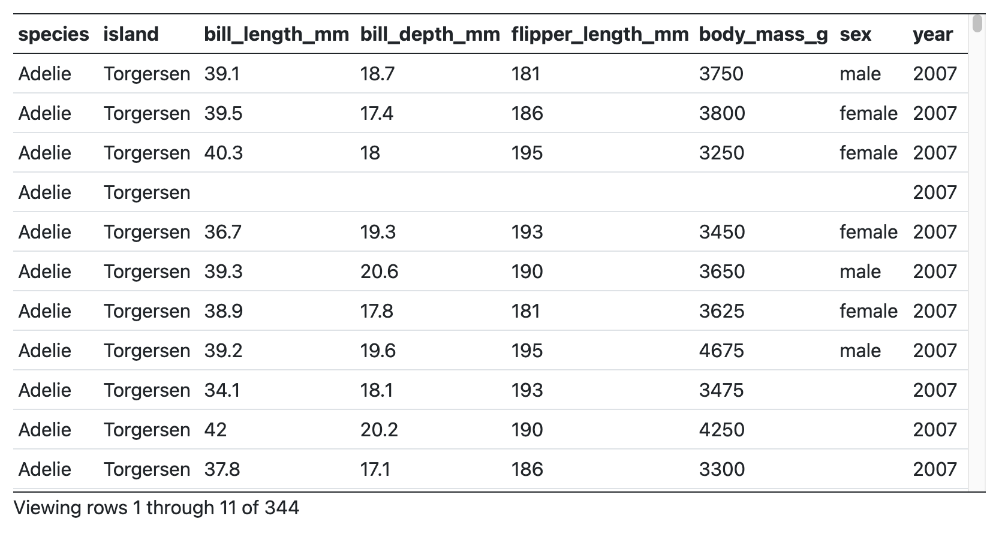
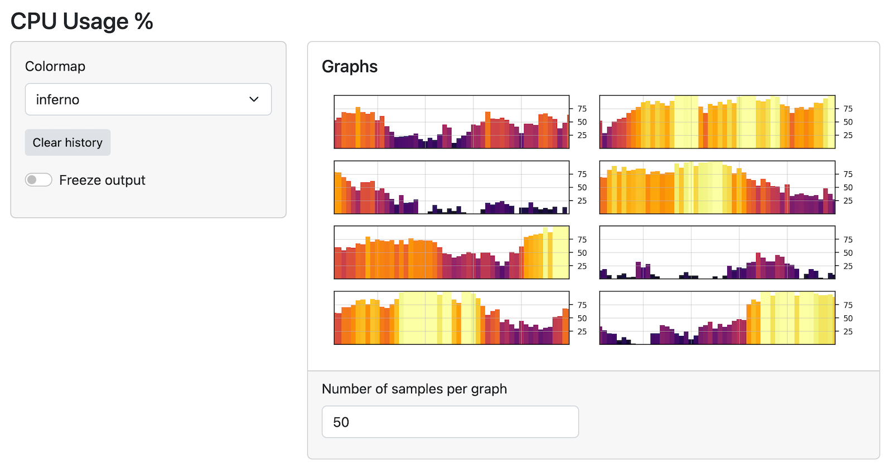
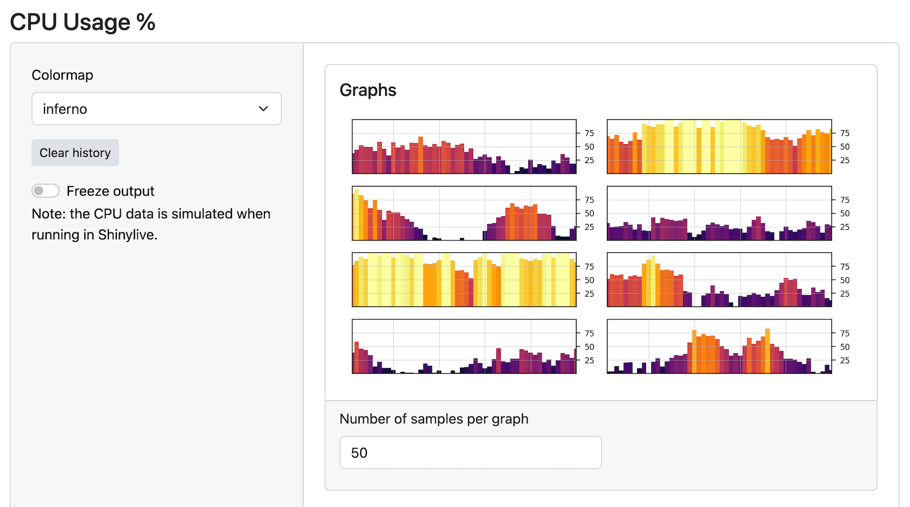

Hello, Shiny for Python users. We have some great new features for you in the latest release!

## Introducing data grid / data table

We've added a new, fast-scrolling data table output.



It can easily handle tables with tens of thousands of rows, and supports sorting by columns -- just click on the column header to sort.

In addition to the grid-style appearance, the data can be displayed with a more traditional table-like appearance.

{fig-alt="Data table with more traditional appearance"}


These tables aren't just for displaying data -- they can also allow you to select rows, use that selection as an input, as shown here:



To use the new tables, put this in your application's UI:

```python
  ui.output_data_frame("mygrid")
```

And in your server function, use `@render.data_frame` and give it a function that returns a `render.DataGrid()`; in turn, that function a Pandas data frame.

```python
  @output
  @render.data_frame
  def mygrid():
    return render.DataGrid(my_df)
```

To get the more traditional table-like styling, return a `render.DataTable()` instead.

- [Try it out with Shinylive](https://shinylive.io/py/examples/#data-frame-grid)
- [API documentation](https://shiny.posit.co/py/api/render.data_frame.html)


## Better-looking sidebars

In addition to the new tables, we've also improved the look of the basic sidebar. Here's what they used to look like:

{fig-alt="App with old sidebar"}


Previously, the sidebar was only as tall as the content in the sidebar, but now they span the full height of the application. Here's what they look like now:

{fig-alt="App with new sidebar"}


You won't have to change any code to get the new look -- your existing code will just work!

[Check out a live example here.](https://shinylive.io/py/examples/#cpu-info)

Enjoy!
