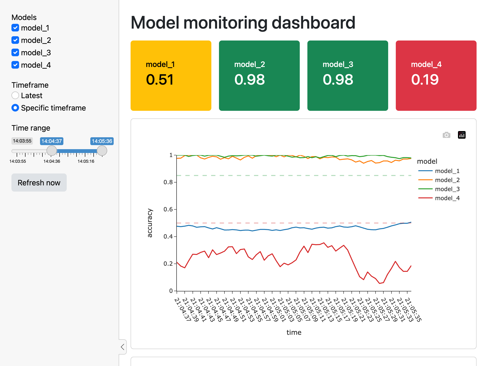
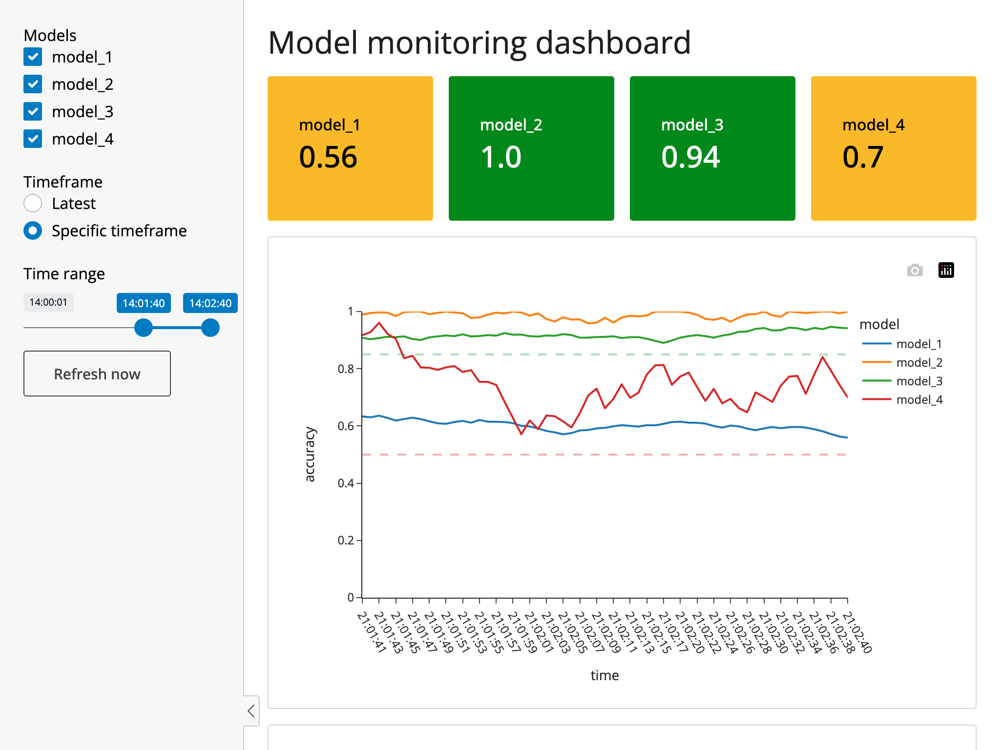
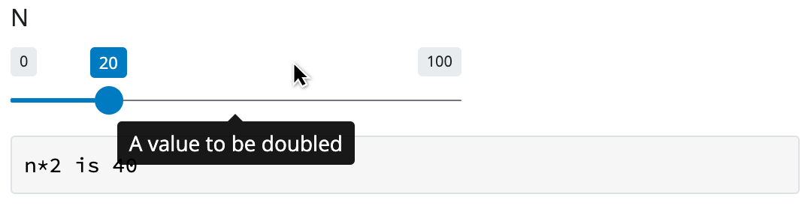
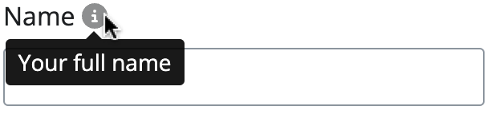

Another Shiny for Python release has arrived! In fact, we released 0.5.0 and then quickly followed it with 0.5.1, which fixes [a sidebar bug](https://github.com/posit-dev/py-shiny/issues/666) we introduced in 0.5.0. Sorry about that!

You can upgrade to Shiny for Python 0.5.1 by running `pip install -U shiny` or `conda install -c conda-forge shiny`.

## Style tweaks

We've tweaked the default Shiny CSS theme to make your apps look cleaner and more modern. In the screenshots below, you'll notice differences in the slider and button, as well as shifts in the default typeface, font weights, and colors.

(The old theme is on the left, and the new theme is on the right.)

<style>
.sshot-caption {
  display: none;
  margin: 1em 0;
  font-size: 1.2em;
}
#after-caption {
  text-align: right;
}
#theme-comparison {
  position: relative;
  padding-bottom: 70%;
  margin-bottom: 3em;
}
#theme-before {
  position: absolute;
  top: 0;
  left: 0;
  width: 80%;
  height: auto;
}
#theme-after {
  position: absolute;
  bottom: 0;
  right: 0;
  width: 80%;
  height: auto;
}
</style>

(old theme)




(new theme)

We've found that tick marks are usually not that helpful on slider inputs, since you get instant feedback above the handle as you drag. If you want them back, you can pass `ticks=True` to [`input_slider()`](https://shiny.posit.co/py/api/ui.input_slider.html).

These theme changes will be available to Shiny for R as well, via a new [bslib](https://rstudio.github.io/bslib/) CRAN release that should drop this week.

## Data table filtering

In case you missed it, [last month we introduced](../shiny-python-0.4.0/) an interactive data table output that's designed to easily scale to tens of thousands of rows. This month, we've added the ability to let viewers filter the data table by column.


Currently, the filter feature must be enabled by passing `filters=True` when creating your `render.DataGrid` or `render.DataTable` object:

``` python
  @output
  @render.data_frame
  def mygrid():
    return render.DataGrid(my_df, filters=True)
```

- [Try it out with Shinylive](https://shinylive.io/py/examples/#data-frame-grid)
- [API documentation](https://shiny.posit.co/py/api/render.DataGrid.html)

## Tooltips

We've added a new tooltip feature, available in `shiny.experimental` namespace. They're useful for providing additional information about an input or output, without taking up any extra space in your app.

``` python
from shiny import ui
import shiny.experimental as x

x.ui.tooltip(
    ui.input_slider("n", "N", 0, 100, 20),
    "A value to be doubled"
)
```



- [Try it out with Shinylive](https://shinylive.io/py/editor/#code=NobwRAdghgtgpmAXGKAHVA6VBPMAaMAYwHsIAXOcpMAMwCdiYACAZwAsBLCbJjmVYnTJMAgujxM6lACZw6EgK4cAOhD4ChrTtwxwAHqjl9KZKABsmUFkz2rVaVAH0lTALxMlWKAHM4jmmZK0gAUqkzhNhieZMTEZmQcqKEQEakeHBhcqApkjixmHLJ0oZDK+ExlAHJlEgAMEgCMtfVMAEy1AJR4YWnhZSJMAG7mCnBMMUwARmPSxAqTZnDSNT3hXavpGHNk2bkUermDcpNQCTAlZAdl6xAddhCqsjSsckfFWTkS27sSLHAsLA4pA6iA2AAFvjlwVIIEUMPsyBsnuMDsEQRtUlIyAo6CkaGUIAAqVq8awgD5kDAQNFMQltAC+ZXu9nQblE6GCDmcHF+rzkdwgYHpAF0gA)
- [API documentation](https://shiny.posit.co/py/api/ExTooltip.html)

Tooltips can be combined with help icons, which are available in the [`faicons`](https://pypi.org/project/faicons/) package. You can add tooltip help icons in input labels by passing a list to the `label` argument of `input_*()` functions:

``` python
import shiny.experimental as x
from faicons import icon_svg

ui.input_text(
    "name",
    label=[
        "Name ",
        x.ui.tooltip(
            icon_svg("circle-info", fill_opacity=0.5),
            "Your full name"
        )
    ],
)
```

\]

- [Try it out with Shinylive](https://shinylive.io/py/editor/#code=NobwRAdghgtgpmAXGKAHVA6VBPMAaMAYwHsIAXOcpMAMwCdiYACAZwAsBLCbJjmVYnTJMAgujxMArhwA6EPgKGtO3DHAAeqOHT6UyUADZMoLJurn1GTGlA4kIphYOF3SAfRYA3AOZy5aVDdpJgBeKQ4sKG84NxoDaQATAAo5JjTwjC5USTI3CnUyFIh0kqYZSFg4crxU0rSDKAAjOAMQ4Fq6kvKAOUqy-A7OtPUMaQwyYmIDMg5UJNcIDx8Uog46QgM4AFouGmJq6w4DAzdiVChCDjJsEIAGDABWAEoJcoBNYkk6a0ljpmh4OUXoMSgBdGrFdJPOTQiD+dChUToJIBIIcCTdUhwJ5gAC+oKAA)

## Talk Python podcast

I had a great time talking with [Michael Kennedy](https://mkennedy.codes/) on the [Talk Python to Me podcast](https://talkpython.fm/episodes/show/424/shiny-for-python) about Shiny for Python. We covered a lot of ground, including who Shiny is designed for, how Shiny differs from Jupyter notebooks, and how it compares to other Python web frameworks. [Check it out!](https://talkpython.fm/episodes/show/424/shiny-for-python)

<https://www.youtube.com/watch?v=YN0hnAmid7A>

------------------------------------------------------------------------

That's it for today! As always, if you have any questions or feedback, please [join us on Discord](https://discord.gg/yMGCamUMnS) or [open an issue on GitHub](https://github.com/posit-dev/py-shiny/issues/new). And if you're enjoying Shiny for Python, please consider [starring us on GitHub](https://github.com/posit-dev/py-shiny) to show your support!
