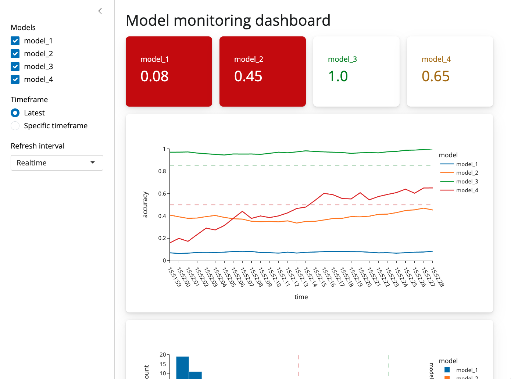

We recently released Shiny for Python 0.6.0, this is a big release so it's a good idea to check out the [changelog](https://github.com/posit-dev/py-shiny/blob/main/CHANGELOG.md) for a full set of new features. This post is going to focus on the four most important changes in 0.6.0.

## Optional `@output`

Up until now every Shiny output needed two decorators, an `@output` decorator and some kind of `@render` decorator.
The reason for this is that you can pass arguments like `id` to `@output` and so having a separate decorator made sense.
Requiring both decorators for every output, however, was a common source of bugs for new users.
For example if you neglected to include the output decorator, or used the decorators in the wrong order, you would get a silent failure.
As a result we've made the `@output` decorator optional, and recommend that you only use it if you need to access one of its arguments.

``` python
def server(input, output, session):
    # @output # <- No longer necessary!
    @render.text
    def txt():
        return f"n*2 is {input.n() * 2}"
```

## New page layouts

A large majority of shiny apps use either a sidebar layout or a navbar layout, and up until this point you've needed to combine a `page_*` and `layout_*` or `navset_*` call to generate that kind of app.
We've added two new functions `ui.page_sidebar` and `ui.page_navbar` to better accomodate these cases, and we've also improved the look and feel of the default applications.
Both `ui.page_navbar` and `ui.page_sidebar` added a `sidebar=` argument which includes a responsive, collapsable sidebar (`ui.sidebar`) on your application across every tab.

The updated layout sidebar (`ui.layout_sidebar()`) no longer needs to include a call to `ui.panel_main()`. It is recommended to put content inside `ui.card()` within the main content of `ui.page_sidebar()`. Please update your calls of `ui.panel_sidebar()` to `ui.sidebar()`.

### Sidebars

#### Old API

``` python
ui.page_fluid(
    ui.layout_sidebar(
        ui.panel_sidebar(
            ui.input_numeric("n", "N", min=0, max=100, value=20),
        ),
        ui.panel_main(
            ui.plot_output("plot"),
        ),
    )
)
```

#### New API

``` python
ui.page_sidebar(
    ui.sidebar(
        ui.input_numeric("n", "N", min=0, max=100, value=20),
    ),
    ui.card(
        ui.plot_output("plot"),
    ),
)
```

In addition to `sidebar`, we have added `ui.page_fillable()` to help users create applications that fill the available space in the window. This is great for applications where the plot should fill the entire contents fo the window. `ui.page_sidebar()` is a wrapper around `ui.page_fillable()`. In addition to the filling layout method, many UI output methods have added `fill=` or `fillable=` parameters to allow for the component to fill the available area (`fill=True`) or to allow for contained components to fill the available content area (`fillable=`). The handshake of `fill=True` and `fillable=True` must occur to achieve a filling layout. Let's take a look at the new layout in action:



## New components

There are a lot of new components in this release, but the two most important ones are `ui.card()` and `ui.value_box()`.
Cards allow you to visually dilineate parts of your application, and group inputs and outputs together.
For example, you might have a card which included a plot and some inputs which filter the data for that particular plot.
Cards also provide sensible spacing which makes your app look less cluttered and easier to read.

Value boxes are for highlighting single numbers or pieces of text.
They are useful for calling out important numbers or pieces of text, and can include showcase icons.
To top it off, value boxes are enhanced with advanced Bootstrap theming capabilities, allowing you to change the color of the box, the icon, and the text.



Both value boxes and cards can be positioned using `ui.layout_column_wrap`.
This function provides a convenient way to display elements in equally spaced columns.
The values boxes in the above example are presented using `ui.layout_column_wrap`.

While you can arrange content with `ui.row()` and `ui.column()`, `ui.layout_column_wrap()` removes a lot of additional boilerplate.
For example if you had three cards which you wanted to lay out on a row, you would do it like this:

``` python
ui.layout_column_wrap(
    ui.card("Card 1 content"),
    ui.card(ui.plot_output("plot2")),
    ui.card(ui.plot_output("plot3")),
    width = 1/3,
)
```

## Many other components

There are too many new components in [this release](https://github.com/posit-dev/py-shiny/blob/v0.6.0/CHANGELOG.md#060---2023-08-08) to blog about, so please check out [the documentation](https://shiny.posit.co/py/api/) to see how they work together.

<div class="callout callout-tip" role="note">
<div class="callout-header">
<svg class="callout-icon" aria-hidden="true" xmlns="http://www.w3.org/2000/svg" width="20" height="20" viewBox="0 0 24 24" fill="none" stroke="currentColor" stroke-width="2" stroke-linecap="round" stroke-linejoin="round"><path d="M9 18h6"/><path d="M10 22h4"/><path d="M12 2a7 7 0 0 0 -4 12.9l0 .1v1h8v-1l0 -.1a7 7 0 0 0 -4 -12.9"/></svg>
<span class="callout-title">… psst!</span>
</div>
<div class="callout-body">

If you're using `shiny.experiemental.ui`, you can now use `shiny.ui` instead. We've moved virtually all of the experimental components into the main `shiny.ui` namespace. 🎉

</div>
</div>

------------------------------------------------------------------------

That's it for today! As always, if you have any questions or feedback, please [join us on Discord](https://discord.gg/yMGCamUMnS) or [open an issue on GitHub](https://github.com/posit-dev/py-shiny/issues/new). And if you're enjoying Shiny for Python, please consider [starring us on GitHub](https://github.com/posit-dev/py-shiny) to show your support!
