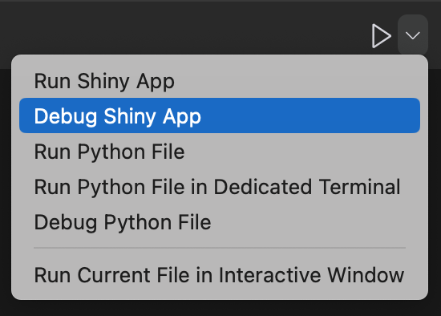

Shiny for Python 0.6.1 is out! You can read the full [changelog](https://github.com/posit-dev/py-shiny/blob/main/CHANGELOG.md) for a complete list of new features.

## Component gallery

As the number of Shiny components grows, it becomes harder to find the component you want. 
We've created a [Shiny Component gallery](https://shiny.posit.co/py/components/) which gives you an interactive example of each component, as well as additional documentation about when and how to use it. 

Currently, this gallery contains mostly inputs and outputs. In the near future, we'll add layouts, navigation, and other types of visual components.

## Templates

Previously, when you called `shiny create`, you would get a basic app without much functionality. 
This is helpful for hello-world examples, but doesn't provide much guidance on how to build a more complicated Shiny application. 
We're now including app templates which you can access through the new `shiny create` command line interface. 
This interface will ask you which template you want to build, and allow you to specify its location. 

We are going to release many more of these, but for the time being, we have covered three of our most common use cases. 
You can access them through the CLI menu, or by passing their name to the `--template` flag.
We've included our current zero-dependency basic app, but have added a Dashboard and Multi-page template.

The Dashboard template shows you how to build a nice-looking single-page dashboard. 
It includes some [cards](https://shiny.posit.co/py/api/ExCard.html#see-also) and [value boxes](https://shiny.posit.co/py/api/ui.value_box.html#see-also) which are populated using a [reactive calculation](https://shiny.posit.co/py/docs/reactive-calculations.html). 
This is a good template to start with if you want to make use of some of the new components which were released in Shiny 0.6.0.

The multi-page app gives you a starting point for a large, production application. 
This app uses `page_navbar` to display several tabs, but the content of those tabs is stored in individual modules.
[Shiny modules](https://shiny.posit.co/py/docs/workflow-modules.html) are a great way to organize large applications because they allow you to break your application apart into simple building blocks which are easier to maintain. 
The application also uses [type annotations](https://blog.logrocket.com/understanding-type-annotation-python/) which improve the development experience, and includes an external CSS file to customize the look and feel of the app. 

## Debugging Shiny Apps

The [Shiny extension for VS Code](https://marketplace.visualstudio.com/items?itemName=Posit.shiny-python) now lets you run your Shiny apps using the VS Code debugger. 
This lets you set breakpoints, debug on error, and step through your application code using VS code. 
To activate it, click the dropdown menu next to the Play button and select "Debug Shiny App". 
To learn more about how to use the VS Code debugger, check out the VS Code [documentation](https://code.visualstudio.com/docs/editor/debugging).

## Shiny Express sneak peek

We've been working hard on Shiny Express, which is a new way to write Shiny apps without explicitly defining a UI object. 
The basic Shiny Express functionality is included in 0.6.1, but you should treat it as experimental for the time being and pin your Shiny version if you use Express.
We'll be releasing additional functionality in our next release, and will have much more to say about it at that point. 
If you're interested in trying it out and giving us feedback, please read [this post](https://wch.github.io/shiny_express_doc/) describing the project.

---

That's it for today! As always, if you have any questions or feedback, please [join us on Discord](https://discord.gg/yMGCamUMnS) or [open an issue on GitHub](https://github.com/posit-dev/py-shiny/issues/new). And if you're enjoying Shiny for Python, please consider [starring us on GitHub](https://github.com/posit-dev/py-shiny) to show your support!
