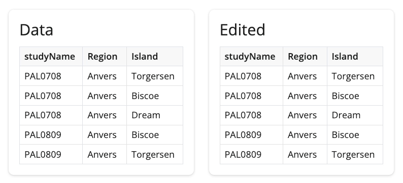
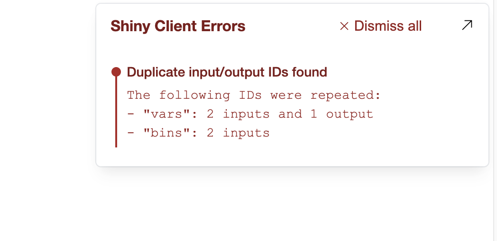
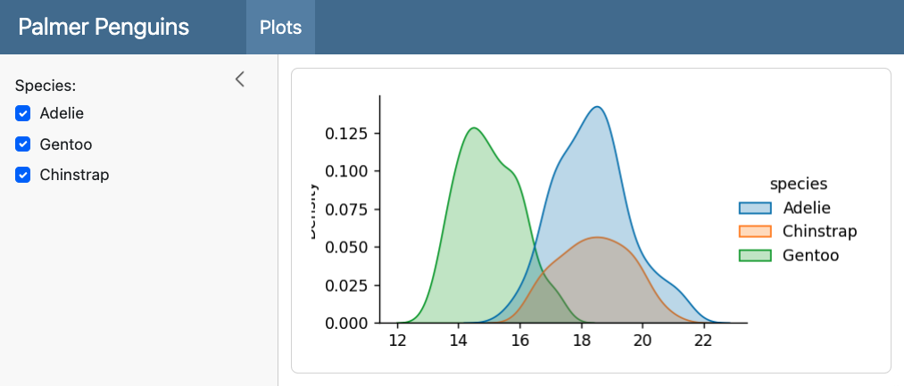
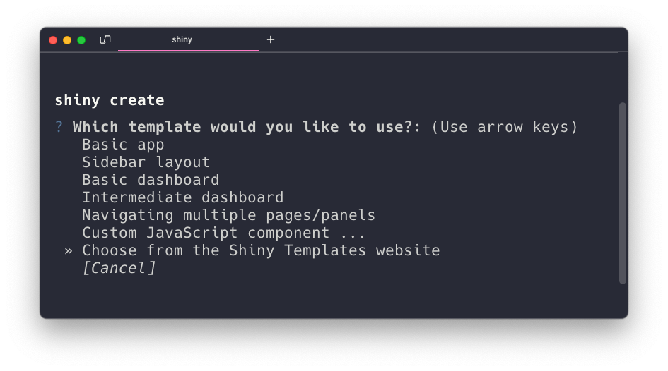

Shiny for Python 0.9.0 is out! This version brings some exciting new features and improvements to the Shiny ecosystem. You can read the full [changelog](https://github.com/posit-dev/py-shiny/blob/main/CHANGELOG.md#090---2024-04-16) for a complete list of changes.

## Editable Data Tables and Data Grids



One of the most exciting new features in this release is the ability to make your [`DataTable`](https://shiny.posit.co/py/api/core/render.DataTable.html) and [`DataGrid`](https://shiny.posit.co/py/api/core/render.DataGrid.html) components editable.
By setting `editable=True` within `DataGrid` or `DataTable`, you can allow users to directly edit the cells in your tables.
This opens up a whole new range of possibilities for interactive data applications!

```python
from shiny.express import render

@render.data_frame
def dt():
    return render.DataGrid(my_data, editable=True)

@render.data_frame
def edited_dt():
    return dt.data_view()
```


## Empowered Data Frame Renderer

You may have noticed in the previous example that we are now calling methods on the `dt` renderer object itself to access the edited data. This is part of a broader effort to empower the renderers with additional methods that make it easier to work with anything related to the renderer.

Typically, we would retrieve this Output related information via the `input` object (e.g. `input.<ID>_<KEY>`). This feels a little magical in that is _just appears_ within the `input` object. There are no hints other than disconnected documentation on what `input` values are available or even what their values represent.

Using `@render.data_frame` decorator, we upgrade your render function into a `Renderer` class instance that has helper methods specific to the renderer. The Shiny Team is currently exploring what methods we can add to empower the data frame renderer. So far, the data frame renderer has been enhanced with these extra methods for you to reactively access computed values:

* `.data()` - Reactive value of the original data frame.
* `.data_view(*, selected:bool = False)` - Reactive value of the data frame with all applied edits, column filters, and column sorting. If `selected=True`, only the selected rows/columns are returned.
<!-- * `.selection_modes()` - Reactive value of the data frame's possible selection modes. -->
* `.input_cell_selection()` - Reactive value of the data frame's selected cells. This returns a dictionary that contains `type` and possibly `rows` and `columns` that contain the selected row and column indices, respectively.
* `.update_cell_selection(selection)` - Method to update the selected cells of the data frame. The `selection` argument should be a dictionary that contains `type` and possibly `rows` and `columns` that contain the selected row and column indices, respectively.
<!-- * `.cell_patches()` - Reactive value of the list of all applied edits to the data frame cells made by the user. -->
* `.set_patch_fn(fn)` - Decorator to set a function that will be called when the user makes an edit to the data frame. The function should accept a single patch dictionary as an argument and return an upgraded value.
<!-- * `.set_patches_fn(fn)` - Decorator to set a function that will be called when the user makes edits to the data frame. The function should accept a list of patch dictionaries as an argument and return a (possibly) upgraded list of patch dictionaries. -->

([Link](https://shiny.posit.co/py/api/core/render.data_frame.html#methods) to data frame renderer helper methods and attributes.)

By adding the helper methods, we gain documentation, typing support, and an explicit way to access the data frame's accessory information.

We're excited about this approach and are looking at ways we can bring it to other outputs. Please let us know what you think!


## Changes to row selection with Data Tables and Data Grids

In addition to editability, we've also made some changes to the way row selection works in these components. The `row_selection` parameter has been deprecated in favor of the new `selection_mode` parameter. You can now use `selection_mode="row"` for single row selection or `selection_mode="rows"` for multiple row selection.

Also note that the way to access which selected rows has changed. Previously, if your table output was named `dt`, then you would access the selected rows with `input.dt_selected_rows()`. As of 0.9.0, you instead should use `dt.input_cell_selection()["rows"]`.

```python
@render.data_frame
def dt():
    return DataGrid(my_data)

@reactive.effect
def _():
  # Old way
  selected_rows = input.dt_selected_rows()

  # New in v0.9.0
  selected_rows = dt.input_cell_selection()["rows"]
```

In case you're wondering, we are planning to add support for other types of selections, like columns and rectangular regions.

**Update:** `.input_row_selection()` and `input.<ID>_selected_rows()` were prematurely removed in `v0.9.0` and will be restored (as deprecated) in the next release.

## Error Console

Shiny for Python 0.9.0 includes an error console that surfaces client-side errors directly in the browser's UI when running applications locally.
The error console also catches common issues, such as duplicated input or output IDs, that can only be caught when the app is running.



The error console is enabled by default when you launch your app with `shiny run` or via the [Shiny VS Code extension](https://marketplace.visualstudio.com/items?itemName=Posit.shiny-python).
The error console is automatically disabled when your app is deployed to a server, but can also be manually disabled with `shiny run --no-dev-mode`.

## Shiny Express in Quarto Dashboards

Shiny Express syntax is now supported within Quarto Dashboards! This makes it even easier to create interactive data dashboards with Shiny and Quarto.

<details>

<summary>Quarto code</summary>

````markdown

````

</details>



## Other Improvements

The `shiny create` CLI command now includes additional templates and an option to open the new [Shiny Templates website](https://shiny.posit.co/py/templates/) where you can find templates to quickly jump start your app.
This makes it easier than ever to get started with Shiny for Python! 🏎️💨



Layout components have received several improvements in this release. The `col_widths` argument of `ui.layout_columns()` now sets the `sm` breakpoint by default, providing better responsiveness on smaller screens. `ui.card()` and `ui.value_box()` now have an `id` argument that allows you to track the full-screen state of these components. You can also now set `min_height` and `max_height` on `ui.value_box()`, `ui.layout_columns()`, and `ui.layout_column_wrap()` to ensure that your layouts always stay within a certain size range.

------------------------------------------------------------------------

We're thrilled to bring you these new features and improvements in Shiny for Python 0.9.0. As always, if you have any questions or feedback, please [join us on Discord](https://discord.gg/yMGCamUMnS) or [open an issue on GitHub](https://github.com/posit-dev/py-shiny/issues/new). Happy Shiny-ing!
