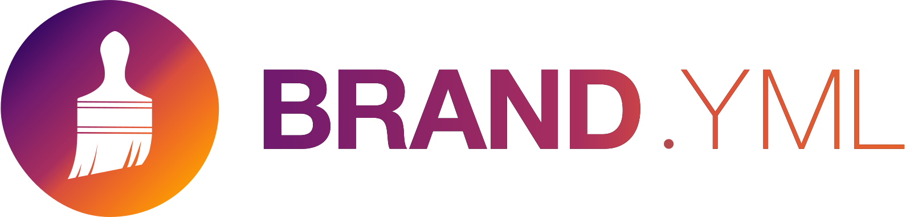

We are bursting to announce that Shiny for Python now supports [brand.yml](https://posit-dev.github.io/brand-yml), a simple, unified theming experience through a single YAML file.

## What is brand.yml?

[brand.yml](https://posit-dev.github.io/brand-yml) simplifies brand management by consolidating your visual identity---colors, typography, and styling---into a single, easy-to-maintain YAML file.

For you: it's a centralized source of truth for your brand or company's visual identity.
For the tools you use: it's simple, structured data to coordinate theming of any output.

Here's an example `_brand.yml` file that includes metadata about the company, its logos, color palette, theme, and the fonts and typographic settings used by the brand.

**\_brand.yml**

``` yaml
meta:
  name: brand.yml
  link: https://posit-dev.github.io/brand-yml

logo: 
  small: brand-yml-icon.svg
  medium: brand-yml-tall.svg
  large: brand-yml-wide.svg

color:
  palette:
    orange: "#FF6F20"
    pink: "#FF3D7F"
  primary: orange
  danger: pink

typography:
  fonts:
    - family: Open Sans
      source: google
  base: Open Sans
```

A core goal of brand.yml is to introduce a common syntax for theming across various data science outputs created with open-source tools.
With brand.yml you won't need to write multiple CSS files to maintain a consistent look across your apps, websites, and presentations.

And because all fields are optional, brand.yml also serves as a simple interface to theming across many outputs.
For example, you could use brand.yml to set the base font to [Roboto](https://fonts.google.com/specimen/Roboto) and use <span style="padding-inline:0.25em; background-color: #f96302; color: white;">orange</span> as the primary accent color.

**A minimal \_brand.yml**

``` yaml
color:
  primary: "#F96302"

typography:
  fonts:
    - family: Roboto
      source: google
  base: Roboto
```

This same file can be used for your Shiny apps as well as your Quarto projects.
We're starting with Posit-sponsored projects like [Shiny](https://shiny.posit.co), [Quarto](https://quarto.org), and [R Markdown](https://rmarkdown.rstudio.com), but we're hoping to see brand.yml adopted more widely in the open-source community.
To encourage this, we've published the [brand-yml Python package](https://posit-dev.github.io/brand-yml/pkg/py), which you can use to integrate brand.yml into your project or other packages.

<div class="callout callout-tip" role="note" aria-label="Tip">
<div class="callout-header">
<span class="callout-title">Tip</span>
</div>
<div class="callout-body">

We know that writing YAML isn't everyone's cup of tea!
If you want to enlist the help of a friendly large language model (LLM), we've written up [a guide to using LLMs to write brand.yml](https://posit-dev.github.io/brand-yml/articles/llm-brand-yml-prompt/).

The article includes a prompt you can copy and use to teach an LLM about the brand.yml syntax, as well as a few tips and follow-up prompts you can use to get the best results.

</div>
</div>

## Getting Started

With Shiny for Python v1.2.0, using brand.yml to theme your Shiny app is straightforward.
To get started, make sure you've installed the latest version of shiny with the `theme` extra:

``` bash
pip install "shiny[theme]"
```

Then, create a `_brand.yml` file in your project directory (either alongside your `app.py` or in a parent folder).
Finally, use the [new `ui.Theme.from_brand()` function](https://shiny.posit.co/py/api/core/ui.Theme.html#shiny.ui.Theme.from_brand) to set your page `theme`.

<div class="panel-tabset" data-tabset-group="shiny-app-mode">
<ul id="tabset-1" class="panel-tabset-tabby">
<li><a data-tabby-default href="#tabset-1-1">Express</a></li>
<li><a href="#tabset-1-2">Core</a></li>
</ul>
<div id="tabset-1-1">

**app.py**

``` python
from shiny.express import input, render, ui

ui.page_opts(theme=ui.Theme.from_brand(__file__))
```

</div>
<div id="tabset-1-2">

**app.py**

``` python
from shiny import ui

app_ui = ui.page_fluid(
    # App UI code...
    theme=ui.Theme.from_brand(__file__)
)
```

</div>
</div>

We've added a [complete branded theming example](https://shinylive.io/py/examples/#branded-theming) to [shinylive.io](https://shinylive.io/py/examples/#branded-theming) that you can run directly in your browser.
Use it to explore brand.yml features or to preview your own company's `_brand.yml` look in Shiny.

## Looking Forward

We're excited to see how the community uses this feature and look forward to your feedback!
You can learn more about brand.yml and its features at the [official brand.yml website](https://posit-dev.github.io/brand-yml).
Or read more about [branded and custom theming in Shiny for Python](https://shiny.posit.co/py/api/core/ui.Theme.html#shiny.ui.Theme.from_brand).

For Python developers, we encourage you to check out the [brand_yml Python package](https://posit-dev.github.io/brand-yml/pkg/py/), which provides an easy-to-use interface for parsing and making use of brand.yml files.

For R and Shiny for R developers, hang tight!
Shiny for R support is next on our roadmap, followed by additional tooling to support reading and using brand.yml files.
