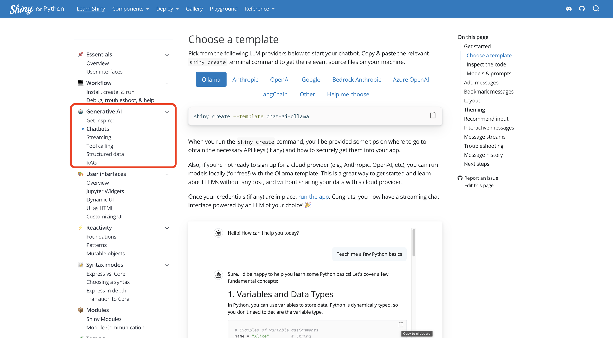
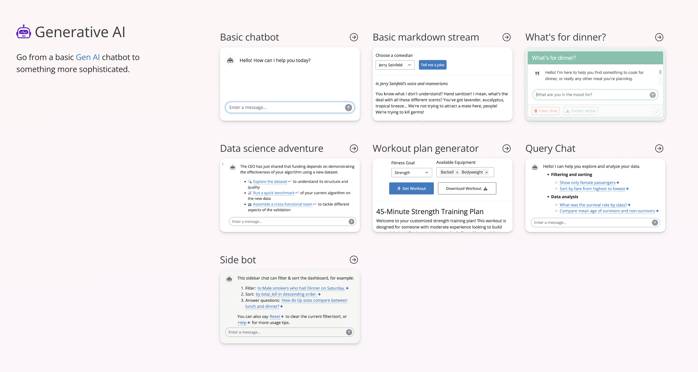

<style>
  .panel-tabset .tab-content, .nav {
    border: none;
  }
  .panel-tabset.nav-centered .nav {
    justify-content: center;
  }
</style>

We're pleased to announce that Shiny `v1.4` is now [available on PyPI](https://pypi.org/project/shiny/)! 🎉

Install it now with `pip install -U shiny`.

To celebrate, let's highlight two big additions from this release: [bookmarking](#bookmarking) and [new Generative AI docs](#genai-docs). A full list of changes is available in the [CHANGELOG](https://github.com/posit-dev/py-shiny/blob/main/CHANGELOG.md#140---2025-04-08).

## Bookmarking 🔖

Shiny now supports bookmarking!
This means you can save the current state of your app and return to it later, or share it with others as a URL.
This is a great way to improve user experience, especially when it's difficult to return to a particular state -- which is often true for [Generative AI apps](#genai-docs).

> **Bookmarking `Chat`**
>
> Bookmarking is crucial for [AI chatbots](https://shiny.posit.co/py/docs/genai-chatbots.html), where returning to a previous conversation is often desired.
> [See here](https://shiny.posit.co/py/docs/genai-chatbots.html#bookmark-messages) to learn how to add bookmarking to your `Chat` app.

Adding bookmark support to an app generally requires some additional effort.
At the very least, Shiny needs to know where and when to save state, and in some more advanced cases, how to save/restore it as well:[^1]

To help you get started, here's a basic example of how to add bookmarking to an app.
Notice how it:

1.  Stores state in the URL (i.e., `bookmark_store="url"`).
    - Server-side storage is also available.
2.  Provides a `ui.input_bookmark_button()` to allow the user to trigger a bookmark.
    - Bookmarks can also be triggered programmatically via `session.bookmark()`.
3.  When a bookmark happens, the URL is updated with the current state of the app (via `session.bookmark.update_query_string()`).
    - Updating the URL is optional, but almost always desirable (alternatively, you could open a modal with the bookmark URL).

<div class="panel-tabset">
<ul id="tabset-1" class="panel-tabset-tabby">
<li><a data-tabby-default href="#tabset-1-1">Express</a></li>
<li><a href="#tabset-1-2">Core</a></li>
</ul>
<div id="tabset-1-1">

``` python
from shiny.express import app_opts, input, render, session, ui

app_opts(bookmark_store="url")

with ui.sidebar():
    ui.input_slider("slider", "Choose a number", value=50, min=0, max=100)
    ui.input_bookmark_button()

@render.text
def slider_value():
    return f"Slider value: {input.slider()}"

@session.bookmark.on_bookmarked
async def _(url: str):
    await session.bookmark.update_query_string(url)
```

</div>
<div id="tabset-1-2">

``` python
from starlette.requests import Request
from shiny import App, Inputs, Outputs, Session, render, ui

def app_ui(request: Request):
    return ui.page_sidebar(
        ui.sidebar(
            ui.input_slider("slider", "Choose a number", value=50, min=0, max=100),
            ui.input_bookmark_button(),
        ),
        ui.output_text("slider_value"),
    )

def server(input: Inputs, output: Outputs, session: Session):
    @render.text
    def slider_value():
        return f"Slider value: {input.slider()}"

    @session.bookmark.on_bookmarked
    async def _(url: str):
        await session.bookmark.update_query_string(url)

app = App(app_ui, server, bookmark_store="url")
```

</div>
</div>

More generally, some of the key things to keep in mind when bookmarking:

- **Where to save**: For basic apps, state can be likely encoded entirely within the URL, in which case setting `bookmark_store="url"` is appropriate. However, if you have state that can't be JSON-encoded or is too large to fit in a URL, use `bookmark_store="server"` instead.
- **When to bookmark**: Since a bookmark is potentially expensive to perform, Shiny won't automatically bookmark for you every time the state changes. Instead, either the user or you (the developer) will need to trigger a bookmark somehow. If bookmarking is a relatively cheap operation in your case, you might consider programmatically triggering a bookmark every time "important" state changes happen. This could be done by calling `session.bookmark()` in a `reactive.effect` that watches the relevant inputs.
- **How to save/restore**: For basic apps, Shiny can automatically figure out how to save and restore it. However, if you have server-side state that can't be fully determined by the UI's input values alone, you'll need to register `on_bookmark` and `on_restore` callbacks to save and restore that server-state. For brevity sake, we won't dig into this topic here, but you can find more information [over here](https://github.com/posit-dev/py-shiny/tree/main/shiny/bookmark).

### Coming soon

Over the coming weeks, be on the lookout for:

- More bookmarking documentation
  - In the meantime, refer to [this README](https://github.com/posit-dev/py-shiny/tree/main/shiny/bookmark) and [the API reference](https://shiny.posit.co/py/api/core/bookmark.Bookmark.html).
- Bookmarking integration into various platforms such as [shinylive](https://shinylive.io/), [Posit Connect](https://posit.co/products/enterprise/connect/), and [Posit Connect Cloud](https://connect.posit.cloud/).

## Generative AI docs 🤖

For a while now, Shiny has had both a `Chat()` and `MarkdownStream()` component for building chatbots and other Generative AI applications.
While this release includes improvements and fixes for these components, the real highlight is the new documentation that accompanies them.
This includes both new articles as well as [templates](#templates).

### New articles

Now, when you visit the "Learn Shiny" portion of the documentation, you'll be met with a new section dedicated to Generative AI in the sidebar.
Here's a screenshot of the new [getting started with chatbots](https://shiny.posit.co/py/docs/genai-chatbots.html) page:

<figure>

<figcaption aria-hidden="true">A screenshot of the <a href="https://shiny.posit.co/py/docs/genai-inspiration.html">new Generative AI docs</a></figcaption>
</figure>

In addition to an article dedicated to chatbots, which there's also a dedicated [article on streaming](https://shiny.posit.co/py/docs/genai-stream.html), which is all about `MarkdownStream()`.
Think of this as your go-to component if you want to leverage generative AI, but don't need a full chat interface.
For example, maybe you want to create an experience like the [workout plan generator template](https://shiny.posit.co/py/templates/workout-plan/) where a set of input controls are used to user information and fill in a prompt.

### New templates

We've also added a new "Generative AI" section to the [templates page](https://shiny.posit.co/py/templates/).
These provide a great starting point for building your own Generative AI application.

<figure>

<figcaption aria-hidden="true">A screenshot of the <a href="https://shiny.posit.co/py/templates/">new Generative AI templates</a></figcaption>
</figure>

### Coming to R soon

Be on the lookout for similar articles and templates making their way to [`shinychat`'s website](https://posit-dev.github.io/shinychat/) soon (i.e., the R equivalent of `Chat`).

## In closing

We're thrilled to bring you these new features and improvements in Shiny `v1.4`. As always, if you have any questions or feedback, please [join us on Discord](https://discord.gg/yMGCamUMnS) or [open an issue on GitHub](https://github.com/posit-dev/py-shiny/issues/new). Happy Shiny-ing!

[^1]: When server-side state can't be fully determined by the UI's input values alone, you'll need to register `on_bookmark` and `on_restore` callbacks to save and restore that server-state.
