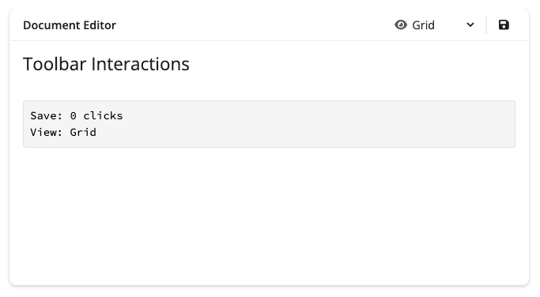
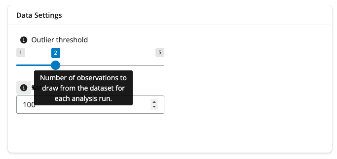
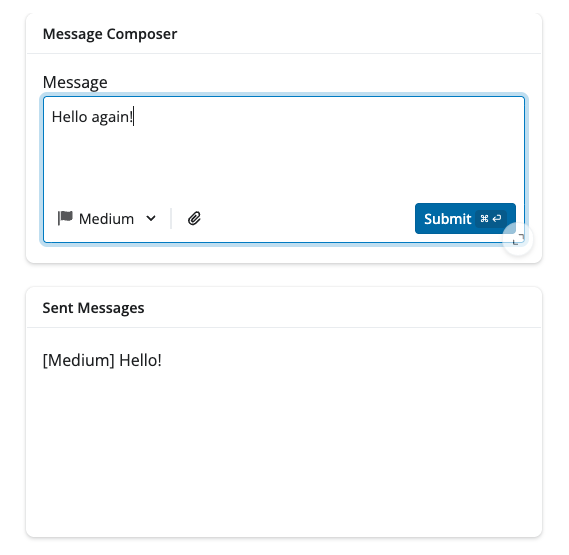
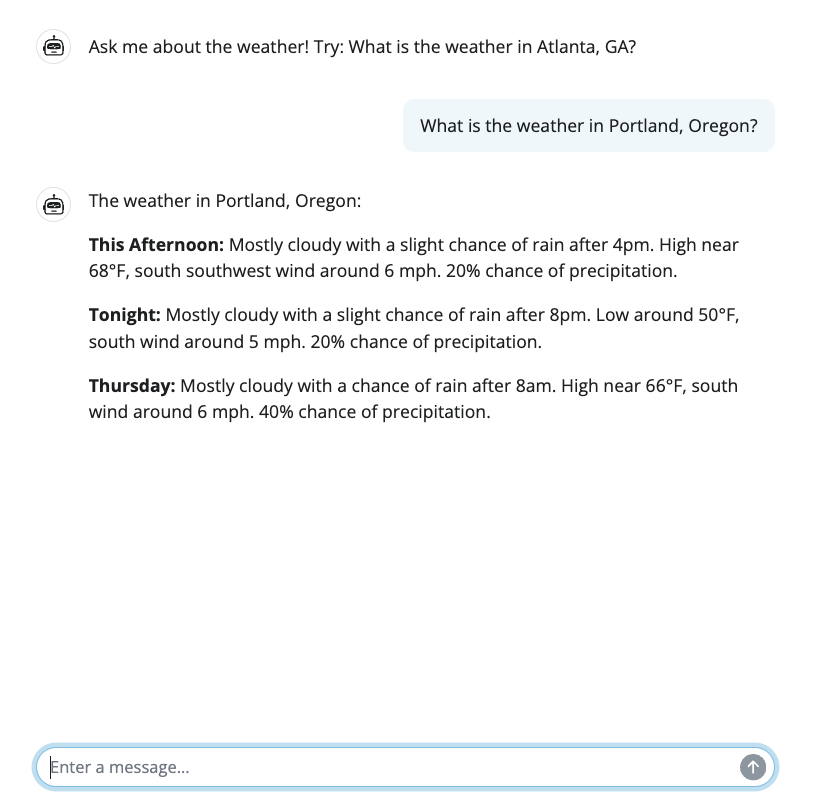
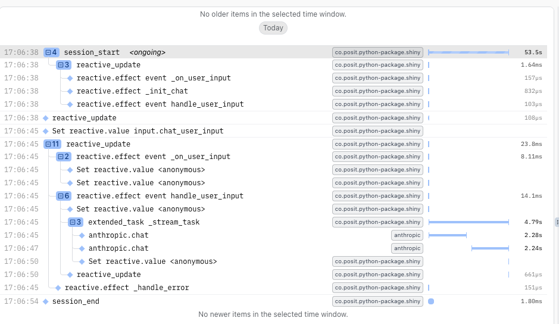

<style>
  .panel-tabset .tab-content, .nav {
    border: none;
  }
  .panel-tabset.nav-centered .nav {
    justify-content: center;
  }
</style>


We're pleased to announce that Shiny for Python `v1.6` is now [available on PyPI](https://pypi.org/project/shiny/)!

Install it now with `pip install -U shiny`.

This release has two big additions: [toolbar components](#toolbars) for building compact, modern UIs, and [OpenTelemetry support](#opentelemetry) for understanding how your apps behave in production. A full list of changes is available in the [CHANGELOG](https://github.com/posit-dev/py-shiny/blob/main/CHANGELOG.md).


## Toolbars {#toolbars}

Toolbars are a new set of compact components designed to fit controls into tight spaces — card headers and footers, input labels, and text areas. They're perfect for dashboards that are running out of room, or for AI chat interfaces where you want to add controls without cluttering the layout.

The core components are:

| Component | Description |
|-----------|-------------|
| `ui.toolbar()` | Container for toolbar inputs |
| `ui.toolbar_input_button()` | A small action button |
| `ui.toolbar_input_select()` | A compact dropdown select |
| `ui.toolbar_divider()` | A visual separator |
| `ui.toolbar_spacer()` | Pushes items to opposite sides |

Each input also has a corresponding `ui.update_toolbar_input_*()` function for updating it dynamically.

### Toolbars in card headers and footers

The most common use case is placing a toolbar in a card header to attach controls directly to a card's content:



```python
from faicons import icon_svg
from shiny.express import input, render, ui

with ui.card(full_screen=True):
    with ui.card_header():
        "Header"
        with ui.toolbar(align="right"):
            ui.toolbar_input_button(
                id="action1",
                label="Refresh",
                icon=icon_svg("arrows-rotate"),
            )
            ui.toolbar_divider()
            ui.toolbar_input_select(
                id="options",
                label="Filter",
                choices=["ABC", "CDE", "EFG"],
            )

    @render.text
    def toolbar_status():
        return f"Button clicks: {input.action1()}, Selected: {input.options()}"
```

### Toolbars in input labels

You can also pass a toolbar as an input's `label` to add an info button for additional information or provide quick actions, like resetting an input value.



```python
from faicons import icon_svg
from shiny.express import ui

with ui.card():
    ui.card_header("Data Settings")
    ui.input_slider(
        "threshold",
        label=ui.toolbar(
            ui.toolbar_input_button(
                "threshold_info",
                label="About this setting",
                icon=icon_svg("circle-info"),
                tooltip="Standard deviations from the mean before a value is flagged as an outlier.",
            ),
            "Outlier threshold",
            align="left",
        ),
        min=1,
        max=5,
        value=2,
        step=0.5,
    )
    ui.input_numeric(
        "sample_size",
        label=ui.toolbar(
            ui.toolbar_input_button(
                "sample_info",
                label="About this setting",
                icon=icon_svg("circle-info"),
                tooltip="Number of observations to draw from the dataset for each analysis run.",
            ),
            "Sample size",
            align="left",
        ),
        value=100,
        min=10,
        max=1000,
        step=10,
    )
```

### Toolbars in text areas

The `input_submit_textarea()` component accepts a `toolbar` parameter directly, making it easy to add contextual controls for AI chat interfaces and message composers:



```python
from faicons import icon_svg
from shiny import reactive
from shiny.express import input, render, ui

ui.page_opts(fillable=False)

messages = reactive.value([])

with ui.card(full_screen=True, height="250px"):
    ui.card_header("Message Composer")
    with ui.card_body():
        ui.input_submit_textarea(
            "message",
            label="Message",
            placeholder="Compose your message...",
            rows=4,
            toolbar=ui.toolbar(
                ui.toolbar_input_select(
                    "priority",
                    label="Priority",
                    choices=["Low", "Medium", "High"],
                    selected="Medium",
                    icon=icon_svg("flag"),
                ),
                ui.toolbar_divider(),
                ui.toolbar_input_button(
                    "attach",
                    label="Attach",
                    icon=icon_svg("paperclip"),
                ),
                align="right",
            ),
        )

with ui.card(full_screen=True, height="250px"):
    ui.card_header("Sent Messages")

    with ui.card_body():
        @render.ui
        def messages_output():
            msg_list = messages.get()
            if not msg_list:
                return ui.p("No messages sent yet.", style="color: #888;")

            return ui.div(
                *[
                    ui.p(
                        f"[{msg['priority']}] {msg['text']}",
                        style="margin: 4px 0;",
                    )
                    for msg in reversed(msg_list)
                ]
            )

@reactive.effect
@reactive.event(input.message)
def _():
    message_text = input.message()
    if message_text and message_text.strip():
        current_messages = list(messages.get())
        current_messages.append(
            {"text": message_text, "priority": input.priority()}
        )
        messages.set(current_messages)
```


Toolbars are available in `py-shiny` and forthcoming in [`bslib`](https://rstudio.github.io/bslib/) for R. For a complete walkthrough with full app examples, see the [Toolbar component page](https://shiny.posit.co/py/components/layout/toolbar/).


## OpenTelemetry {#opentelemetry}

Starting with Shiny `v1.6.0`, [OpenTelemetry](https://opentelemetry.io/) support is built directly into the framework.

OpenTelemetry (OTel) is a vendor-neutral observability standard that lets you collect telemetry data — traces, logs, and metrics — and send it to any compatible backend. For Shiny apps, this means you can finally answer questions like:

- Why is my app slow for certain users?
- Which reactive expressions are taking the most time?
- How long does it take for outputs to render?
- What sequence of events occurs when a user interacts with my app?

### Getting started

The fastest way to get started is with [Pydantic Logfire](https://logfire.pydantic.dev/), which provides zero-configuration OTel setup:

```bash
pip install logfire
logfire auth
```

Then set an environment variable to tell Shiny what level of tracing to collect:

```bash
export SHINY_OTEL_COLLECT=reactivity
```

That's it — no changes to your app code required. Run your app and visit [logfire.pydantic.dev](https://logfire.pydantic.dev/) to see traces.


### OTel is great for GenAI apps

Shiny's OTel integration pairs especially well with Generative AI applications. When a user reports that your chatbot feels slow, traces make it easy to pinpoint whether the delay is in the AI model request, streaming, tool execution, or a downstream reactive calculation.

The image below shows a trace from a weather forecast app powered by a Generative AI model. A single user session is captured in full detail:






::: callout-tip
### Collection levels

`SHINY_OTEL_COLLECT` accepts three levels of detail:

- `"none"` - No Shiny OpenTelemetry tracing
- `"session"` - Track session start and end
- `"reactive_update"` - Track reactive updates (includes `"session"` tracing)
- `"reactivity"` - Trace all reactive expressions (includes `"reactive_update"` tracing)
- `"all"` [Default] - Everything (currently equivalent to "reactivity")
:::

### What gets traced automatically

Shiny automatically creates spans for all of the following — no manual instrumentation needed:

- **Session lifecycle**: When sessions start and end, including HTTP request details
- **Reactive updates**: The entire cascade of reactive calculations triggered by an input change or a new output to be rendered
- **Reactive expressions**: Individual calculations such as `@reactive.calc`, `@reactive.effect`, `@render.*`, and other reactive constructs

### Works with any OTel backend

Logfire is our recommended starting point, but Shiny's OTel integration is fully vendor-neutral. You can send traces to [Jaeger](https://www.jaegertracing.io/), [Zipkin](https://zipkin.io/), [Grafana Cloud](https://grafana.com/products/cloud/), [Langfuse](https://langfuse.com/), or any other OTLP-compatible backend.

For local debugging without a backend, install the OpenTelemetry SDK and use the console exporter:

```bash
pip install "shiny[otel]"
```

Full documentation — including custom spans, database instrumentation, and production considerations — is available in the [OpenTelemetry guide](https://shiny.posit.co/py/docs/opentelemetry.html).

## In closing

We're excited to bring you these new features in Shiny `v1.6`. As always, if you have questions or feedback, [join us on Discord](https://discord.gg/yMGCamUMnS) or [open an issue on GitHub](https://github.com/posit-dev/py-shiny/issues/new). Happy Shiny-ing!
