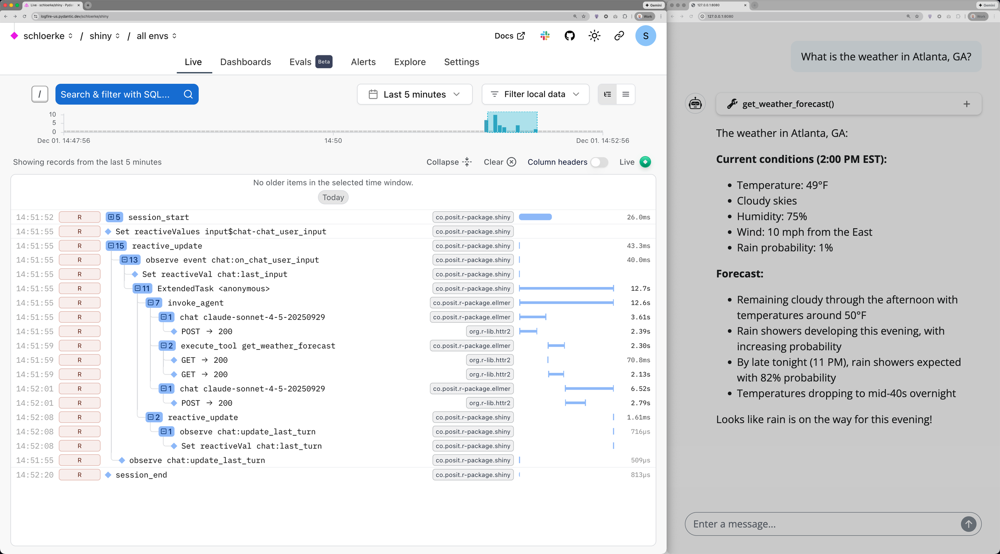
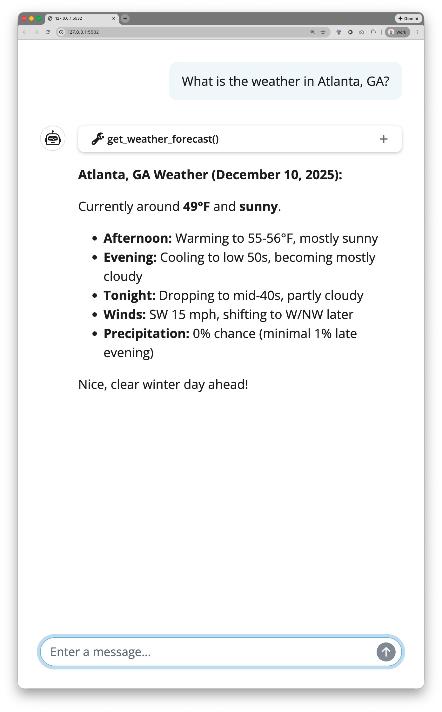
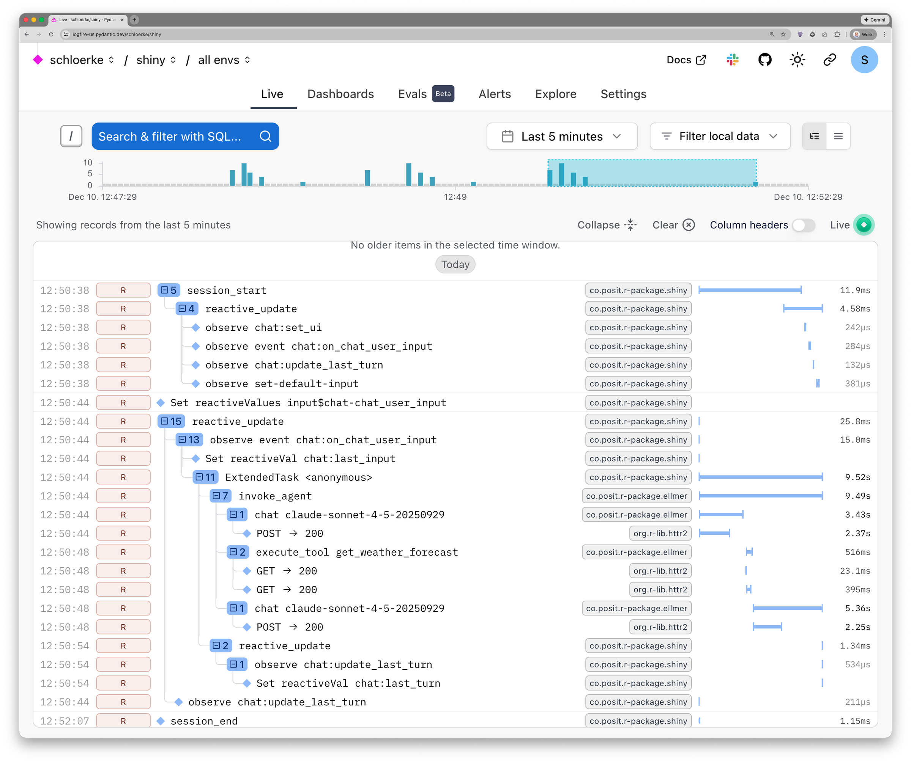

```{=html}
<style>
img { border-radius: 8px; }
</style>
```


We're thrilled to announce the release of Shiny v1.12! This release brings a powerful new feature that we've been working on for months: **built-in OpenTelemetry support**. Whether you're building small apps or deploying production applications at scale, this release will help you lift the veil on understanding your app's execution in production.

::: {.callout-note icon=false collapse=true}

## What is Shiny?

If you're new to Shiny, welcome! [Shiny](https://shiny.posit.co/r/) is an R package that makes it easy to build interactive web applications directly from R. You don't need to be a web developer—if you can write R code, you can create beautiful, interactive dashboards, data explorers, and analytical tools. Shiny handles all the web programming complexity behind the scenes, letting you focus on what you do best: working with data and building analyses.

Since its launch in 2012, Shiny has become the go-to framework for creating data-driven web applications in R, powering everything from internal company dashboards to public-facing data visualization tools. With this latest release, we're making it easier than ever to understand what's happening inside your Shiny apps, especially when they're deployed in production environments.

:::

::: {.callout-note icon=false collapse=true}

## What about Shiny for Python?

OpenTelemetry support is coming to Shiny for Python! The Shiny team is actively working on bringing the same automatic instrumentation capabilities to Python. This will enable Python developers to gain the same level of observability into their Shiny applications.

Stay tuned for future announcements about OpenTelemetry integration in Shiny for Python. In the meantime, you can follow the development on the [Shiny for Python GitHub repository](https://github.com/posit-dev/py-shiny).

:::

## Understanding OpenTelemetry

Before we dive into what's new in Shiny, let's talk about OpenTelemetry—a topic that might sound intimidating but is actually quite straightforward once we cover the basics.

### What is OpenTelemetry?

[**OpenTelemetry**](https://opentelemetry.io/) (aka OTel) describes itself as "high-quality, ubiquitous, and portable telemetry to enable effective observability". In simpler terms, OpenTelemetry is a set of tools, APIs, and SDKs that help you collect and export telemetry data (like traces, logs, and metrics) from your applications. This data provides insights into how your applications are performing and behaving in real-world scenarios.

It captures three key types of data:

1. **Traces**: These show the path of a request through your application. In a Shiny app, a trace might show how a user's input triggered a series of reactive calculations, leading to updated outputs.

2. **Logs**: These are detailed event records that capture what happened at specific moments.

3. **Metrics**: These are numerical measurements over time, like how many users are connected or how long outputs take to render.

These data types were standardized under the OpenTelemetry project, [which is supported by a large community and many companies](https://opentelemetry.io/community/marketing-guidelines/#i-opentelemetry-is-a-joint-effort). The goal is to provide a consistent way to collect and export observability data, making it easier to monitor and troubleshoot applications.


### The OpenTelemetry ecosystem

OpenTelemetry is vendor-neutral, meaning you can send your telemetry data to various local backends like [Jaeger](https://www.jaegertracing.io/), [Zipkin](https://zipkin.io/), [Prometheus](https://prometheus.io/), or cloud-based services like [Grafana Cloud](https://grafana.com/products/cloud/), [Logfire](https://pydantic.dev/logfire), and [Langfuse](https://langfuse.com/). This flexibility means [you're not locked into any particular monitoring solution](https://opentelemetry.io/community/marketing-guidelines/#iii-promote-awareness-of-otel-interoperability-and-modularization).

We've been using [Logfire](https://pydantic.dev/logfire) internally at Posit to help develop OTel integration in many R packages and other applications. Throughout this post, you'll see examples of OTel traces visualized in Logfire.

The image below shows an example trace in Logfire (left) from a Shiny app (right) that uses Generative AI to provide weather forecasts. The trace captures the entire user session, including reactive updates, model calls, and a tool invocation. We will explore this example in more detail later in the post.

{fig-alt="OpenTelemetry trace of chat app with weather tool"}


## OpenTelemetry in Shiny

If you've ever wondered...

- "Why is my app slow for some users when hosted? Which reactive expressions are causing the slowdown?"
- "How long does it take for my plot to render? Is it the data or the plotting code that is taking longer to calculate?"
- "What's the sequence of events leading up to when a user clicks *that* button?"
- "How often are errors occurring in my app, and under what conditions?"

Normally, we can attempt to answer these questions using [`{reactlog}`](https://rstudio.github.io/reactlog/) (a package to replay the recording of a reactive graph) or [`{profvis}`](https://profvis.r-lib.org/) (a package to profile R code in the main R process). However, both of these packages are not built for production use. These debugging tools are only to be used locally as they would be considered a memory leak in production.

OpenTelemetry allows us to record information **at scale** with minimal overhead, helping you answer previously impossible questions about your production environment. OpenTelemetry provides visibility into your app's performance and behavior, helping you identify bottlenecks, debug issues, and optimize user experience—especially crucial when your app is deployed in production with real-world usage.


### Adding OpenTelemetry integration

OTel support is automatically enabled in Shiny once [`{otel}`](https://otel.r-lib.org/) is able to record traces and logs.

To do this, let's get started by installing the latest version of Shiny, `{otel}`, and [`{otelsdk}`](https://otelsdk.r-lib.org):

```r
pak::pak(c("shiny", "otel", "otelsdk"))
```

To enable OpenTelemetry tracing, you need set a few [specific system environment variables](https://otelsdk.r-lib.org/reference/collecting.html) to describe where your recordings are being sent. In the example below, we set them in an `.Renviron` file to point to Logfire.

```{.bash filename=".Renviron"}
# Enable OpenTelemetry by setting Collector environment variables
OTEL_TRACES_EXPORTER=http
OTEL_LOGS_EXPORTER=http
OTEL_LOG_LEVEL=debug
OTEL_METRICS_EXPORTER=http

OTEL_EXPORTER_OTLP_ENDPOINT="https://logfire-us.pydantic.dev"
OTEL_EXPORTER_OTLP_HEADERS="Authorization=<your-write-token>"
```

::: {.callout-tip}
## Editing `.Renviron`

You can edit your app-specific environment variables by calling `usethis::edit_r_environ(scope="project")` from within your Shiny app project directory.
:::


::: {.callout-tip}
## Verifying OTel setup

You'll know your setup is enabled if [`otel::is_tracing_enabled()`](https://otel.r-lib.org/reference/is_tracing_enabled.html) returns `TRUE`.
:::

### OpenTelemetry in action

Below is an example `{shinychat}` app with an `{ellmer}` tool to fetch realtime weather forecasts (via `{weathR}`, which uses `{httr2}`) for a given latitude and longitude. This simple (yet non-trivial) app helps us showcase what sort of information `{shiny}`, `{ellmer}`, and `{httr2}` can surface via OTel.

::: {.callout-note}

## OTel + GenAI

Gaining timing insights into applications that leverage [Generative AI](https://aws.amazon.com/what-is/generative-ai/) (GenAI) is critical to improving user experience. Without OpenTelemetry, if a user stated an app was slow, we would not be able to accurately determine if the slowness was due to the AI model request time, AI model streaming time, tool execution time, or even followup reactive calculations in Shiny.

:::

```{.r filename="app.R"}
library(shiny)

# Create tool that grabs the weather forecast (free) for a given lat/lon
# Inspired from: https://posit-dev.github.io/shinychat/r/articles/tool-ui.html
get_weather_forecast_basic <- ellmer::tool(
  function(lat, lon) {
    weathR::point_tomorrow(lat, lon, short = FALSE)
  },
  name = "get_weather_forecast",
  description = "Get the weather forecast for a location.",
  arguments = list(
    lat = ellmer::type_number("Latitude"),
    lon = ellmer::type_number("Longitude")
  )
)

ui <- bslib::page_fillable(
  shinychat::chat_mod_ui("chat", height = "100%")
)
server <- function(input, output, session) {
  # Set up client within `server` to not _share_ the client for all sessions
  client <- ellmer::chat_claude("Be terse.")
  client$register_tool(get_weather_forecast_basic)

  chat_server <- shinychat::chat_mod_server("chat", client, session)

  # Set chat placeholder on app init
  observe({
    chat_server$update_user_input("What is the weather in Atlanta, GA?")
  }, label = "set-default-input")
}

shinyApp(ui, server)
```

You'll notice that the `app.R` has no OpenTelemetry specific code.

{fig-alt="Chat app with weather tool" height=500}

Here's an example trace from Logfire showing a user session interacting with the chat app and the weather tool:

{fig-alt="OpenTelemetry trace of chat app with weather tool"}

The traces above recorded a single user session where the user asked for the weather in Atlanta, GA and then closed the app. The trace shows:

- The Shiny session lifecycle, including `session_start` and `session_end`
- Many `{shinychat}` `chat` module spans for handling user input and messages
- Reactive updates triggered by changes in the `session`'s input
- An `ExtendedTask` span for the computation of the AI agent response
- 2x `chat claude` spans representing calls to the AI agent model
- A single `get_weather_forecast` tool call being executed, including the HTTP requests made by `{httr2}` to fetch the weather data

The gap between this span's length and its parent's length is how long the results took to stream back to the user or make a decision. For the overall user experience, the total time taken from input to output is represented by the `ExtendedTask` span, 9.5 seconds in this case. Only a half of a second was spent in the tool call (something _we as app authors_ could possibly optimize). The remaining 9 seconds was spent in the model response generation and streaming.

Notice how the spans are nested, showing the relationship between user actions, required reactive calculations, and external API calls. This level of detail helps you understand exactly how your app is performing in production and where any bottlenecks or issues may arise.

::: {.callout-note icon=false collapse=false}

## Packages used in demo

The Shiny app above currently requires the development version of `{ellmer}` to record OpenTelemetry traces. More R packages (mentioned later in this post) will contain native OpenTelemetry support in their upcoming releases.

:::


### What can Shiny record?

Shiny automatically creates OpenTelemetry spans for:

- **Session lifecycle**: When sessions start and end, including HTTP request details
- **Reactive updates**: The entire cascade of reactive calculations triggered by an input change or a new output to be rendered
- **Reactive expressions**: Individual `reactive()`, `observe()`, and `output` calculations; `debounce()` and `throttle()` value updates; `reactiveFileReader()` and `reactivePoll()` updates
- **Extended tasks**: Long-running background computations

Additionally, Shiny logs events for:

- Fatal or unhandled errors (with optional error message sanitization)
- When a `reactiveVal()` is set and
- When a `reactiveValues()` value is set

Every span and log entry provided by Shiny includes the session ID, making it easy to filter and analyze data for specific user sessions.

At the time of this post, no metrics (numerical measurements over time) are automatically recorded for Shiny. However, [`{plumber2}`](https://plumber2.posit.co/) (via [`{reqres}`](https://reqres.data-imaginist.com/)) has added OTel metrics in their latest release: a counter of the number of active requests and histograms for request durations and request/response body sizes.

For more detailed information on configuring and using OpenTelemetry within R, check out the [`{otel}` package documentation](https://otel.r-lib.org/) and how to set up record collection with [`{otelsdk}`](https://otelsdk.r-lib.org/reference/collecting.html).


### Fine-grained control

Automatic tracing is perfect to get started, but you may want more control over what gets traced. Shiny v1.12 gives you that flexibility through the `shiny.otel.collect` option (or `SHINY_OTEL_COLLECT` environment variable). You can set this to control the level of tracing detail:

- `"none"` - No Shiny OpenTelemetry tracing
- `"session"` - Track session start and end
- `"reactive_update"` - Track reactive updates (includes `"session"` tracing)
- `"reactivity"` - Trace all reactive expressions (includes `"reactive_update"` tracing)
- `"all"` - Everything (currently equivalent to "reactivity")

For example:

```r
# Only trace session lifecycle, not every reactive calculation
options(shiny.otel.collect = "session")
```

This is especially useful in production environments where you want observability without overwhelming your telemetry backend with data.

You can also temporarily override the `shiny.otel.collect` option within a specific block of code using the `withOtelCollect()` or `localOtelCollect()` functions. This is helpful when you want to exclude certain parts of your app from being traced. For example, to avoid tracing Shiny reactive expressions within a block:

```r
# Do not trace _Shiny_ reactive expressions within this block
# All other otel spans/logs will still be recorded
withOtelCollect("none", {
  expensive_calculation <- reactive({
    # Start a custom span for this calculation
    otel::start_local_active_span("my custom span", tracer = "my_tracer")
    Sys.sleep(2)  # Simulate a long calculation
    rnorm(1e6)
  })
  output$plot <- renderPlot({
    hist(expensive_calculation())
  })
})
```

## In summary

Whether you're developing apps locally or managing production deployments, OpenTelemetry support in Shiny now gives you visibility into your applications:

- **Developers** can debug complex reactive flows
- **Performance engineers** can identify and eliminate bottlenecks
- **Data scientists** can understand how users interact with their applications

We're excited to see how the community uses this powerful new capability. Try it out, and let us know what you think!

While OpenTelemetry support is the star of this release, Shiny v1.12 includes several other nice improvements. For a complete list of changes, check out the NEWS entries for [Shiny v1.12.0](https://shiny.posit.co/r/reference/shiny/1.12.0/upgrade.html) and [Shiny v1.12.1](https://shiny.posit.co/r/reference/shiny/1.12.1/upgrade.html).

## Learn more

For more details on OpenTelemetry in Shiny, check out our [dedicated article on OpenTelemetry + Shiny](https://shiny.posit.co/r/articles/improve/opentelemetry/) article.

## What's next?

We have big plans for OpenTelemetry in Shiny and the broader R ecosystem. Existing and upcoming enhancements include:

* [`{mirai}`](https://mirai.r-lib.org/) v2.5.0
* [`{promises}`](https://rstudio.github.io/promises/) v1.5.0
* [`{plumber2}`](https://plumber2.posit.co/) (via [`{fiery}`](https://fiery.data-imaginist.com/) v1.4.0, [`{reqres}`](https://reqres.data-imaginist.com/) v1.1.0, and [`{routr}`](https://routr.data-imaginist.com/) v1.1.0)
* [`{httr2}`](https://httr2.r-lib.org/) v1.2.2
* [`{knitr}`](https://yihui.org/knitr/) (`yihui/knitr`)
* [`{ellmer}`](https://ellmer.tidyverse.org/) ([`tidyverse/ellmer#526`](https://github.com/tidyverse/ellmer/pull/526))
* [`{DBI}`](https://dbi.r-dbi.org/) ([`r-dbi/dbi#551`](https://github.com/r-dbi/DBI/pull/551))
* [`{testthat}`](https://testthat.r-lib.org/) ([`r-lib/testthat#2282`](https://github.com/r-lib/testthat/pull/2282))

In addition, the Shiny Team's focus will be shifting to add OpenTelemetry integration to Shiny for Python. Be sure to be on the lookout for the future announcement!

## Acknowledgements

A big thank you to all [the folks/everyone] who [helped make this release happen/contributed to this release]:

[&#x0040;andriygm](https://github.com/andriygm), [&#x0040;BajczA475](https://github.com/BajczA475), [&#x0040;bedantaguru](https://github.com/bedantaguru), [&#x0040;billdenney](https://github.com/billdenney), [&#x0040;chendaniely](https://github.com/chendaniely), [&#x0040;Copilot](https://github.com/Copilot), [&#x0040;cpsievert](https://github.com/cpsievert), [&#x0040;csgillespie](https://github.com/csgillespie), [&#x0040;deadbytesus](https://github.com/deadbytesus), [&#x0040;dempsey-CMAR](https://github.com/dempsey-CMAR), [&#x0040;dleopold](https://github.com/dleopold), [&#x0040;federiva](https://github.com/federiva), [&#x0040;federivaFirebird](https://github.com/federivaFirebird), [&#x0040;fzenoni](https://github.com/fzenoni), [&#x0040;gadenbuie](https://github.com/gadenbuie), [&#x0040;gsmolinski](https://github.com/gsmolinski), [&#x0040;ismirsehregal](https://github.com/ismirsehregal), [&#x0040;janxkoci](https://github.com/janxkoci), [&#x0040;JohnADawson](https://github.com/JohnADawson), [&#x0040;karangattu](https://github.com/karangattu), [&#x0040;marcozanotti](https://github.com/marcozanotti), [&#x0040;Mkranj](https://github.com/Mkranj), [&#x0040;mm225022](https://github.com/mm225022), [&#x0040;mmuurr](https://github.com/mmuurr), [&#x0040;nicholasdavies](https://github.com/nicholasdavies), [&#x0040;r2evans](https://github.com/r2evans), [&#x0040;schloerke](https://github.com/schloerke), [&#x0040;shikokuchuo](https://github.com/shikokuchuo), [&#x0040;simon-smart88](https://github.com/simon-smart88), [&#x0040;vedhav](https://github.com/vedhav), and [&#x0040;wch](https://github.com/wch).

---

*Have questions or feedback? Join the conversation on the [Shiny Community forum](https://community.rstudio.com/c/shiny) or [GitHub](https://github.com/rstudio/shiny).*
