<style>
img { border-radius: 8px; }
.link-shinylive {
  position: absolute;
  bottom: 0;
  right: 0.5em;
  background-color: unset;
}
</style>
<script>
document.addEventListener("DOMContentLoaded", function() {
  // Add shinylive links to code blocks
  document.querySelectorAll("[data-shinylive]").forEach(function(el) {
    const pre = el.querySelector("pre");
    const link = document.createElement("a");
    link.classList.add("link-shinylive");
    link.target = "_blank";
    link.rel = "noopener noreferrer";
    link.href = el.dataset.shinylive;
    link.innerHTML = `<i></i> Run on shinylive`;
    pre.appendChild(link);
  });
});
</script>

The Shiny team is pleased to announce another round of updates for 13 different R packages,
including [shiny](https://shiny.rstudio.com/) and [bslib](https://rstudio.github.io/bslib/).
There are too many improvements to cover in a single post, but we'd like to highlight some of the more notable additions.
For a detailed list of changes, be sure to check out the [release notes](#release-notes) section of this post.

[bslib](https://rstudio.github.io/bslib/) brings modern Bootstrap versions and new user layouts and inputs to [Shiny](https://shiny.rstudio.com/), the web framework for data scientists.
Install the latest versions of shiny and bslib from CRAN with:

``` r
install.packages(c("shiny", "bslib"))
```

In this post, we'll cover three main topics: the [new shiny look](#new-shiny-look), [what's new in shinylive](#shinylive-updates) and a long-awaited [update to selectize.js in shiny](#selectize-js).

## A shiny new look

In our [last post](../../../blog/shiny/bslib-tooltips/#towards-a-new-shiny-theme), we previewed a new look for `bslib`-powered UIs, which is designed with dashboards in mind.
This release of `bslib` adds more polish to this new "preset" theme and makes it the default for `bslib` powered UIs.

To use the new layouts, simply create an app using any `page_*()` function in bslib for the UI.
Here's a very simple template you can use to get started.
Notice that we've used [shinylive](https://posit-dev.github.io/r-shinylive/) to make this example interactive -- the entire app is running in your browser, no server required!
You can even edit the app right here in this post and see the changes live when you press the <i></i> play button.
We'll talk more about shinylive [later in this post](#shinylive-updates).

``` shinylive-r
#| standalone: true
#| components: [editor, viewer]
#| viewerHeight: 400
#| layout: vertical
library(shiny)
library(bslib)

ui <- page_sidebar(
  title = "My dashboard",
  sidebar = sidebar(
    title = "Settings",
    sliderInput("n", "Observations", 1, 100, 50, ticks = FALSE),
    sliderInput("bins", "Bins", 1, 10, 5, step = 1, ticks = FALSE),
  ),
  plotOutput("plot")
)

server <- function(input, output, session) {
  output$plot <- renderPlot({
    hist(rnorm(input$n), breaks = input$bins, col = "#007bc2")
  })
}

shinyApp(ui, server)
```

We're calling this new look the shiny "preset" theme, because it's a great place to start building your own theme.
Remember, you can always customize the preset by passing additional arguments to `bs_theme()`.
You can even switch back to the default `preset = "bootstrap"` look by using the following `theme` value in your `page_*()` function[^1]:

``` r
# use default Bootstrap styles
theme = bs_theme(preset = "bootstrap")
```

The new shiny preset is designed with dashboards in mind.
Here's a more complete example using a full dashboard app ([source](https://github.com/rstudio/bslib/tree/main/inst/examples/flights), [demo](https://bslib.shinyapps.io/flights)) for exploring [flight data from Chicago](https://github.com/cpsievert/chiflights22).
Toggle between the new and old look to see what's changed with this release.

<div class="panel-tabset">
<ul id="tabset-1" class="panel-tabset-tabby">
<li><a data-tabby-default href="#tabset-1-1">New</a></li>
<li><a href="#tabset-1-2">Old</a></li>
</ul>
<div id="tabset-1-1">

<figure>
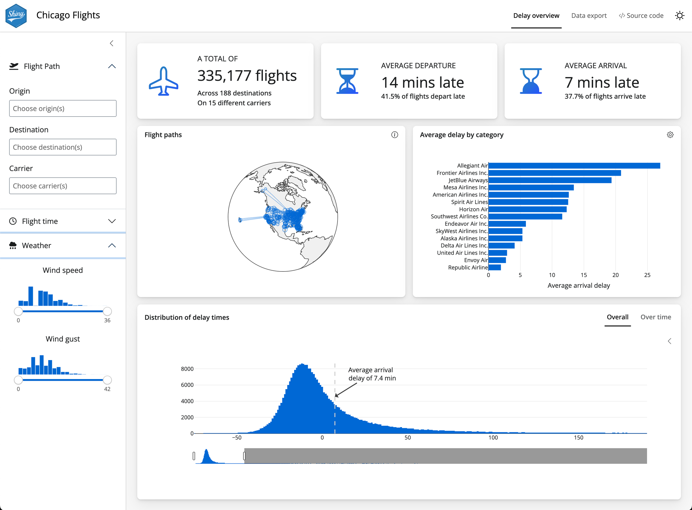
<figcaption aria-hidden="true">Flights dashboard with the new styles, featuring a white navbar and white sidebar framing the dashboard area. Cards are also entirely white on a light gray background, with subtle depth created by drop shadows under the cards. Blue accents are found throughout the dashboard in plots and icons.</figcaption>
</figure>

</div>
<div id="tabset-1-2">

<figure>
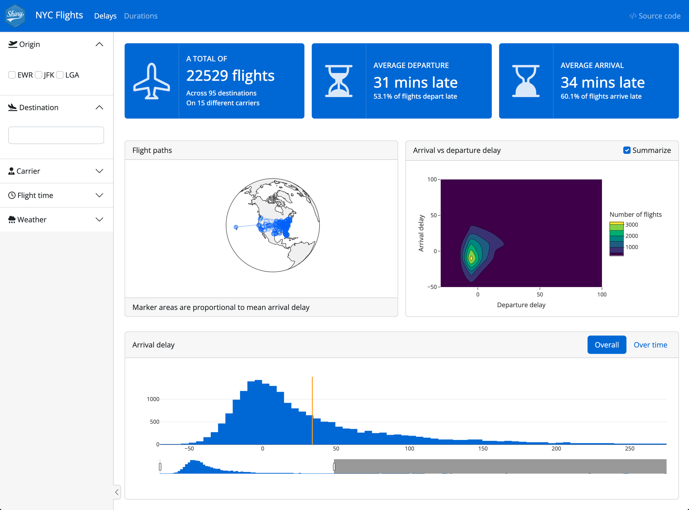
<figcaption aria-hidden="true">Flights dashboard with the old styles, features solid blue navbar and solid blue value boxes. The sidebar and card headers and footers all have a light gray background.</figcaption>
</figure>

</div>
</div>

The rest of this section will explore a few highlights of the new default look, including:

- New [page-level styling](#page-styling)
- [Dark mode support](#dark-mode)
- Improved [`value_box()` styling](#value-box-styling)
- [Refreshed Shiny UI](#refreshed-shiny-ui) (inputs, modals, notifications, and more)

<div class="callout callout-note" role="note" aria-label="Note">
<div class="callout-header">
<span class="callout-title">Quarto and PyShiny dashboards</span>
</div>
<div class="callout-body">

Dashboards are coming to Quarto!

The new [Quarto dashboard](https://quarto.org/docs/dashboards/) format, as well as newer [PyShiny](https://shiny.posit.co/py/) components, are built on the same foundation as `bslib`.
Thus, the concepts you'll learn while building dashboards with `bslib` should also largely apply there as well.

</div>
</div>

### Page-level styling

As we noted above, the new shiny preset is design with dashboards in mind, but it will make any shiny app look great.
The new default look is designed to be light and minimal, with a white navbar and white sidebar framing the dashboard area.
Cards are also entirely white, with subtle depth created by drop shadows under the cards.
Value boxes provide colorful accents, as will the plots you add to showcase your data.

Here's an example taken straight from the [getting started guide](https://rstudio.github.io/bslib/articles/dashboards/index.html) for `{bslib}` dashboards.

<div class="panel-tabset">
<ul id="tabset-2" class="panel-tabset-tabby">
<li><a data-tabby-default href="#tabset-2-1">New</a></li>
<li><a href="#tabset-2-2">Old</a></li>
</ul>
<div id="tabset-2-1">

<figure>
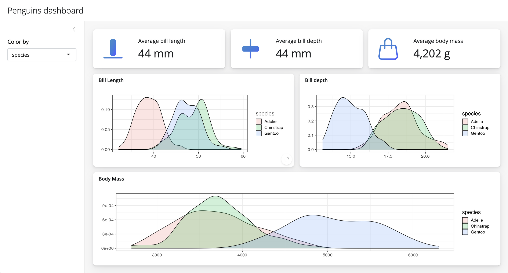
<figcaption aria-hidden="true">New page_sidebar() styling featuring a light, minimal look with a white title bar, white sidebar and white cards and value boxes. The cards and value boxes have subtle shadows on a light gray background. Value boxes icons are blue with a subtle gradient</figcaption>
</figure>

</div>
<div id="tabset-2-2">

<figure>
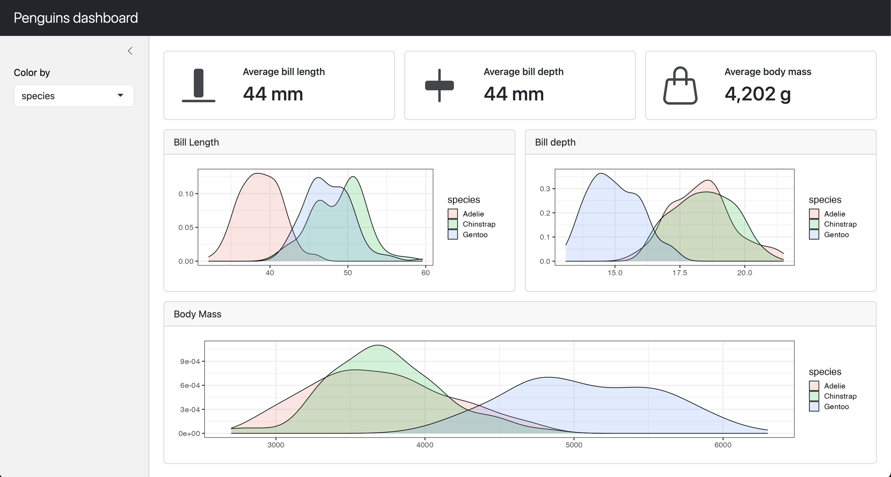
<figcaption aria-hidden="true">Old page_sidebar() styling with a dark title bar. Sidebars and card headers and footers have a light gray background. Cards and value boxes do not have shadows and value box icons are solid dark gray.</figcaption>
</figure>

</div>
</div>

To achieve the full dashboard effect, though, you have opt into the light gray background by adding `class = "bslib-page-dashboard"` to your `page_sidebar()` or the `nav_panel()` items in your `page_navbar()`.
This class enables a few additional features, namely adding a soft gray background to the main content area under cards and value boxes that help them stand out.
You can also add the `class` directly to `page_fillable()` or `page()` to get the same effect in apps with custom layouts.

<div class="panel-tabset">
<ul id="tabset-3" class="panel-tabset-tabby">
<li><a data-tabby-default href="#tabset-3-1">page_sidebar()</a></li>
<li><a href="#tabset-3-2">page_navbar()</a></li>
<li><a href="#tabset-3-3">page_fillable()</a></li>
</ul>
<div id="tabset-3-1">

``` r
library(shiny)
library(bslib)

ui <- page_sidebar(
  title = "My Dashboard",
  class = "bslib-page-dashboard",
  sidebar = sidebar(
    title = "Settings",
    # ... sidebar inputs ...
  ),
  # ... dashboard content ...
)
```

</div>
<div id="tabset-3-2">

``` r
library(shiny)
library(bslib)

ui <- page_navbar(
  title = "My Dashboard",
  nav_panel(
    title = "Page 1",
    class = "bslib-page-dashboard",
    # ... dashboard content ...
  ),
  nav_panel("About", "Regular content")
)
```

</div>
<div id="tabset-3-3">

``` r
library(shiny)
library(bslib)

ui <- page_fillable(
  title = "My Dashboard",
  class = "bslib-page-dashboard",
  # ... custom layout and dashboard content ...
)
```

</div>
</div>

### Built-in dark mode support ☀️ 🌙

This release of bslib brings built-in dark mode support to any Shiny app that uses `bs_theme()`, thanks to Bootstrap 5.3's new [client-side color mode feature](https://getbootstrap.com/docs/5.3/customize/color-modes/)!
To enable dark mode in your app, add `input_dark_mode()` somewhere in your UI.
In the example below, we've [put in the navbar](https://github.com/rstudio/bslib/blob/f574b9f0/inst/examples/flights/app.R#L231-L233).

<div class="panel-tabset">
<ul id="tabset-4" class="panel-tabset-tabby">
<li><a data-tabby-default href="#tabset-4-1">Dark</a></li>
<li><a href="#tabset-4-2">Light</a></li>
</ul>
<div id="tabset-4-1">

<figure>
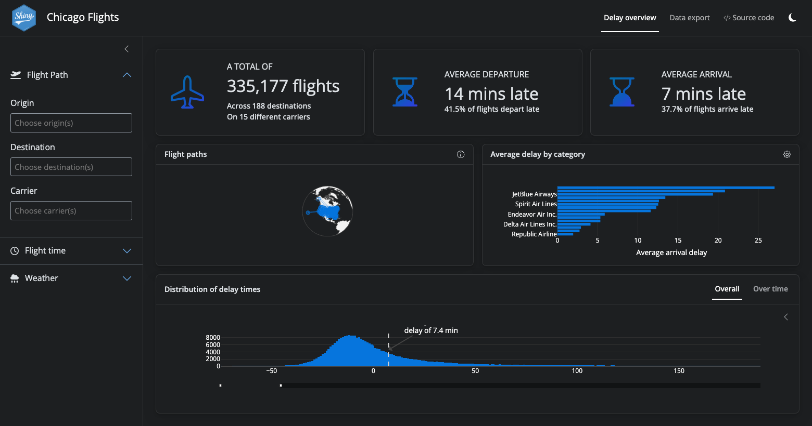
<figcaption aria-hidden="true">Flights dashboard in dark mode. All white areas are now a deep dark gray. The blue accents remain.</figcaption>
</figure>

</div>
<div id="tabset-4-2">

<figure>
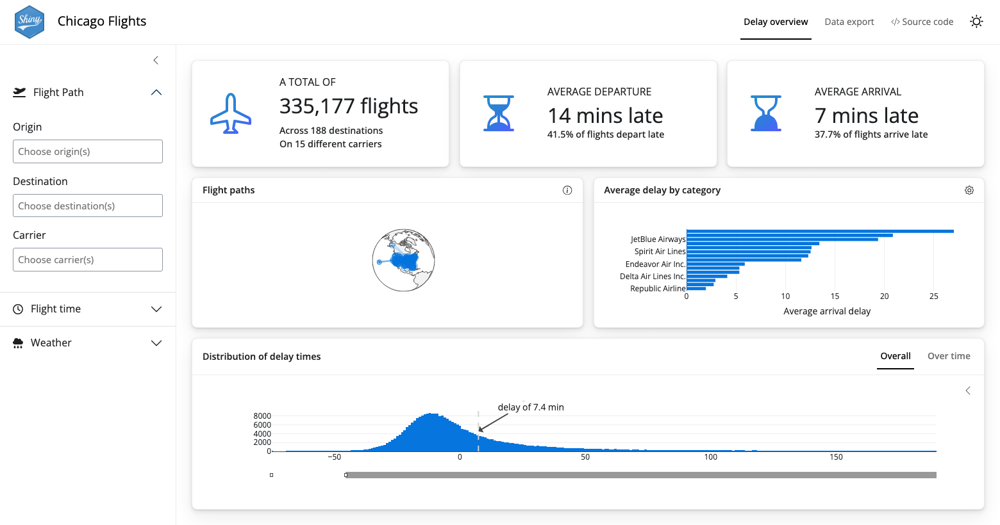
<figcaption aria-hidden="true">Flights dashboard in light mode as previously described.</figcaption>
</figure>

</div>
</div>

For the best results, make sure you have the latest version of [shiny](https://shiny.rstudio.com/).
Dark mode works with nearly any Bootstrap theme created with `bs_theme()`, including the new shiny preset, but it tends to work best when the theme is designed around light mode first.
For matching plots and widgets to the current color mode, you can use [thematic](https://rstudio.github.io/thematic/) to automatically style plots or `shiny::getCurrentOutputInfo()` to manually set the colors of your R outputs.

By default, the color mode is picked from the user's system settings -- i.e. choosing dark mode if their system is also in dark mode -- but you can choose the initial color mode via the `mode` argument.
If you give `input_dark_mode()` an `id`, it reports the current color mode as either `"light"` or `"dark"`.

``` r
library(shiny)
library(bslib)

ui <- page_navbar(
  title = "Dashboard",
  nav_spacer(), # push nav items to the right
  nav_panel("Page 1", "Dashboard content"),
  nav_item(
    input_dark_mode(id = "dark_mode", mode = "light")
  )
)

server <- function(input, output, server) {
  observeEvent(input$dark_mode, {
    if (input$dark_mode == "dark") {
      showNotification("Welcome to the dark side!")
    }
  })
}

shinyApp(ui, server)
```

### Value box styling

The new default look includes improved styling for `value_box()` outputs, which are commonly used in dashboards.
We're also excited to announce a new [Build-a-Box app](https://bslib.shinyapps.io/build-a-box) to help build and explore value boxes themes and options in a live Shiny app.

Use the tabs below to learn more about several new features and themes supported by `value_box()`.

<div class="panel-tabset">
<ul id="tabset-5" class="panel-tabset-tabby">
<li><a data-tabby-default href="#tabset-5-1">Text</a></li>
<li><a href="#tabset-5-2">Icons</a></li>
<li><a href="#tabset-5-3">Gradient</a></li>
</ul>
<div id="tabset-5-1">
<div class="column-page-inset overflow-auto">
  <div  style="height: 200px; min-width: 800px">
    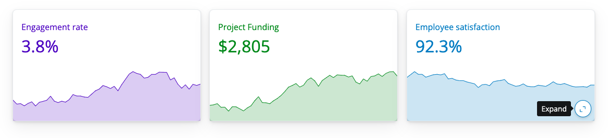
  </div>
</div>

##### Showcase Bottom with Text-Color Theme

The new `showcase_layout = "bottom"` option is perfect for sparkline-style plots that fill the value box width and expand into full screen plots when the user clicks the *expand* button (enabled by `full_screen = TRUE`).
See the [Expandable sparklines](https://rstudio.github.io/bslib/articles/value-boxes/index.html#expandable-sparklines) section of the [value box article](https://rstudio.github.io/bslib/articles/value-boxes/index.html) for an example of how to create these plots with [plotly](https://plotly.com/r/) and bslib.

This example also highlights the `text-{color}` value box themes that set the color of the text to a [Bootstrap color](https://getbootstrap.com/docs/5.3/customize/color/#all-colors).

``` r
layout_columns(
  value_box(
    title = "Engagement rate",
    value = "3.8%",
    theme = "text-indigo",
    showcase = plotOutput("plot_engagement"),
    showcase_layout = "bottom",
    full_screen = TRUE
  ),
  value_box(
    title = "Project Funding",
    value = "$2,805",
    theme = "text-success",
    showcase = plotOutput("plot_funding"),
    showcase_layout = "bottom",
    full_screen = TRUE
  ),
  value_box(
    title = "Employee satisfaction",
    value = "92.3%",
    theme = "text-blue",
    showcase = plotOutput("plot_satisfaction"),
    showcase_layout = "bottom",
    full_screen = TRUE
  )
)
```

</div>
<div id="tabset-5-2">
<div class="column-page-inset overflow-auto">
  <div  style="height: 200px; min-width: 800px">
    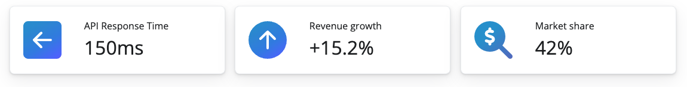
  </div>
</div>

##### Showcase Left Center with Gradient Icons

This example uses the default value box styles in the new shiny preset.
Icons receive a subtle gradient and are placed to the left of the value box content thanks to the default `showcase_layout = "left center"`.

``` r
layout_columns(
  value_box(
    title = "API Response Time",
    value = "150ms",
    showcase = bsicons::bs_icon("arrow-left-square-fill")
  ),
  value_box(
    title = "Revenue growth",
    value = "+15.2%",
    showcase = bsicons::bs_icon("arrow-up-circle-fill")
  ),
  value_box(
    title = "Market share",
    value = "42%",
    showcase = fontawesome::fa_i("magnifying-glass-dollar")
  )
)
```

</div>
<div id="tabset-5-3">
<div class="column-page-inset overflow-auto">
  <div  style="height: 200px; min-width: 800px">
    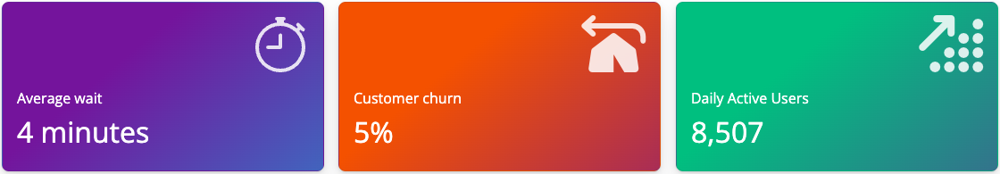
  </div>
</div>

##### Showcase Top Right with Gradient Backgrounds

This example uses `theme = "bg-gradient-{from}-{to}"` for value boxes with vibrant gradient backgrounds.
You can use any of the [Bootstrap color names](https://getbootstrap.com/docs/5.3/customize/color/#all-colors) for the `from` or `to` colors.
`showcase_layout = "top right"` places the icon in the top right corner of the value box.

``` r
layout_columns(
  value_box(
    title = "Average wait",
    value = "4 minutes",
    theme = "bg-gradient-purple-cyan",
    showcase = bsicons::bs_icon("stopwatch"),
    showcase_layout = "top right"
  ),
  value_box(
    title = "Customer churn",
    value = "5%",
    theme = "bg-gradient-orange-indigo",
    showcase = fontawesome::fa_i("tent-arrow-turn-left"),
    showcase_layout = "top right"
  ),
  value_box(
    title = "Daily Active Users",
    value = "8,507",
    theme = "bg-gradient-teal-purple",
    showcase = fontawesome::fa_i("arrow-up-right-dots"),
    showcase_layout = "top right"
  )
)
```

</div>
</div>

### Refreshed Shiny UI

The new default look includes a refreshed Shiny UI, which includes new styling for inputs, modals, notifications, and more.

<div class="panel-tabset">
<ul id="tabset-6" class="panel-tabset-tabby">
<li><a data-tabby-default href="#tabset-6-1">Inputs</a></li>
<li><a href="#tabset-6-2">Notifications</a></li>
<li><a href="#tabset-6-3">Progress Bars</a></li>
<li><a href="#tabset-6-4">Modals</a></li>
</ul>
<div id="tabset-6-1">

<figure>
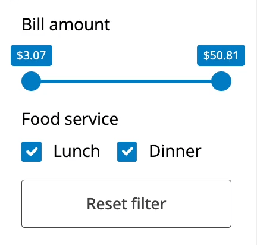
<figcaption aria-hidden="true">New inputs styles, in particular a minimal slider input.</figcaption>
</figure>

</div>
<div id="tabset-6-2">

<figure>

<figcaption aria-hidden="true">New notification styles for default, message, warning and error notifications. Notifications have shadows and have a large amount of padding around the edges compared with Shiny’s default design.</figcaption>
</figure>

</div>
<div id="tabset-6-3">

<figure>

<figcaption aria-hidden="true">New progress bar notification styles, which are similar to notifications.</figcaption>
</figure>

</div>
<div id="tabset-6-4">

<figure>
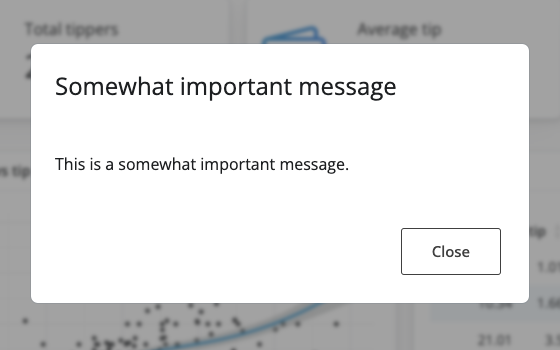
<figcaption aria-hidden="true">An example modal with the new shiny preset style. The modal is minimal with additional padding and the backdrop has a soft blur effect.</figcaption>
</figure>

</div>
</div>

## Shinylive updates

Thanks to the exceptional work by George Stagg on [webR](https://docs.r-wasm.org/webr/latest/) in collaboration with the Shiny team, [shinylive](https://posit-dev.github.io/r-shinylive/) can now run Shiny applications entirely in a web browser, without the need for a separate server running R!

While sharing a traditional Shiny app requires you to deploy the app to a server, such as [shinyapps.io](https://shinyapps.io), shinylive allows you to share your app by simply sharing a URL or by embedding the shinylive app in a Quarto webpage.
The app runs entirely in the browser, directly on the user's device.

We're please to announce several venues for writing and sharing Shiny apps via shinylive:

1.  **[shinylive.io/r](https://shinylive.io/r) contains a gallery of example Shiny apps** that you can run in your browser.
    You can also use [shinylive.io/r/editor](https://shinylive.io/r/editor) as an online playground to write and share your own apps.

2.  **The [shinylive R package](https://posit-dev.github.io/r-shinylive) is now on CRAN!**
    This package helps you turn an existing Shiny app into a ready-to-share shinylive app.

3.  **The [shinylive Quarto extension](https://quarto-ext.github.io/shinylive/) now supports both R and Python Shiny apps** -- even on the same page!
    With the `shinylive-r` and `shinylive-python` code cells, you can embed Shiny apps directly in Quarto web documents.
    This is perfect for blog posts, like this one!
    See [the example](#new-shiny-look) near the start of this post.

[webR](https://docs.r-wasm.org/webr/latest/) and [shinylive](https://posit-dev.github.io/r-shinylive/) are under active development, so expect ongoing updates and improvements.
Currently, shinylive apps download packages from webR's CRAN-like repository at run time, which adds a delay to the initial startup time.
In the future, we hope to make this faster and to allow package installation from more sources.
We're also really excited that [R-universe now builds WASM binaries](https://ropensci.org/blog/2023/11/17/runiverse-wasm/) for R packages!

## Selectize.js update

Shiny's `selectInput()` and `selectizeInput()` functions create dropdown menus that allow users to select one or more items from a list.
These inputs are powered by the [selectize.js](https://selectize.github.io/selectize.js/) library, and shiny 1.8.0 upgrades selectize.js from version 0.12.4 to 0.15.2.

This upgrade resolved [a number of outstanding bugs and issues](https://github.com/rstudio/shiny/issues?q=is:issue+is:closed+selectize+sort:updated-desc+) with `selectizeInput()` (as well as introducing some new ones that we had to squash before release).
Most users won't notice a difference in the select inputs -- now they'll just work *better* -- but if you do notice a change in behavior, please let use know by [filing an issue](https://github.com/rstudio/shiny/issues).

Power users will find even more selectize.js [options](https://selectize.dev/docs/usage) now available, including more [plugins](https://selectize.dev/docs/demos/plugins).
We highly recommend trying both the [`clear_button`](https://selectize.dev/docs/plugins/clear-button) and [`remove_button`](https://selectize.dev/docs/plugins/remove-button) plugins to give users a clear visual cue for removing options:

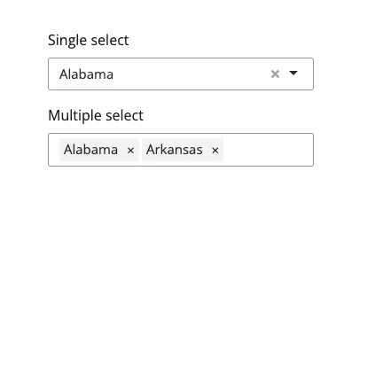

``` r
library(shiny)
library(bslib)

ui <- page_fixed(
    selectizeInput(
        "single", "Single select", state.name,
        options = list(plugins = "clear_button")
    ),
    selectizeInput(
        "multiple", "Multiple select", state.name,
        multiple = TRUE,
        options = list(plugins = "remove_button")
    )
)

server <- function(input, output, session) {

}

shinyApp(ui, server)
```

## Release notes

This post doesn't cover all of the changes and updates that happened in the Shiny universe in this release cycle.
To learn more about specific changes in each package, dive into the release notes linked below!

**Big shout out to everyone involved!** 💙
We'd want to extend a huge thank you to everyone who contributed pull requests, bug reports and feature requests.
Your contributions make Shiny brilliant!

#### bslib [v0.6.0](https://rstudio.github.io/bslib/news/index.html#bslib-060)

[@antoine4ucsd](https://github.com/antoine4ucsd), [@awcm0n](https://github.com/awcm0n), [@barnesparker](https://github.com/barnesparker), [@cpsievert](https://github.com/cpsievert), [@ctrlxctrlc](https://github.com/ctrlxctrlc), [@daattali](https://github.com/daattali), [@DavZim](https://github.com/DavZim), [@durraniu](https://github.com/durraniu), [@gadenbuie](https://github.com/gadenbuie), [@gsmolinski](https://github.com/gsmolinski), [@jcheng5](https://github.com/jcheng5), [@jmbarbone](https://github.com/jmbarbone), [@JohnCoene](https://github.com/JohnCoene), [@kelly-sovacool](https://github.com/kelly-sovacool), [@lmullany](https://github.com/lmullany), [@m-austen](https://github.com/m-austen), [@MayaGans](https://github.com/MayaGans), [@mhanf](https://github.com/mhanf), [@ncullen93](https://github.com/ncullen93), [@ngoodkindGSI](https://github.com/ngoodkindGSI), [@oude-gao](https://github.com/oude-gao), [@schloerke](https://github.com/schloerke), [@scrapeable](https://github.com/scrapeable), [@tuge98](https://github.com/tuge98), and [@wch](https://github.com/wch).

#### bsicons [v0.1.2](https://rstudio.github.io/bsicons/news/index.html#bsicons-012)

[@cpsievert](https://github.com/cpsievert).

#### crosstalk [v1.2.1](https://cran.r-project.org/web/packages/crosstalk/news/news.html)

[@cpsievert](https://github.com/cpsievert), [@ctedja](https://github.com/ctedja), [@daattali](https://github.com/daattali), [@danielludolf](https://github.com/danielludolf), [@DataStrategist](https://github.com/DataStrategist), [@dmresearch15](https://github.com/dmresearch15), [@gadenbuie](https://github.com/gadenbuie), [@helgasoft](https://github.com/helgasoft), [@hlydecker](https://github.com/hlydecker), [@JacobBraslaw22](https://github.com/JacobBraslaw22), [@jcheng5](https://github.com/jcheng5), [@jonathanmburns](https://github.com/jonathanmburns), [@jonspring](https://github.com/jonspring), [@LDSamson](https://github.com/LDSamson), [@MichaelChirico](https://github.com/MichaelChirico), [@mmfc](https://github.com/mmfc), [@novotny1akub](https://github.com/novotny1akub), [@oobd](https://github.com/oobd), [@pfh](https://github.com/pfh), [@schloerke](https://github.com/schloerke), [@tbrittoborges](https://github.com/tbrittoborges), [@ThierryO](https://github.com/ThierryO), [@tomsing1](https://github.com/tomsing1), [@ulyngs](https://github.com/ulyngs), [@warnes](https://github.com/warnes), [@yb2125](https://github.com/yb2125), and [@yogat3ch](https://github.com/yogat3ch).

#### histoslider [v0.1.1](https://cran.r-project.org/web/packages/histoslider/news/news.html)

[@cpsievert](https://github.com/cpsievert).

#### htmltools [v0.5.7](https://rstudio.github.io/htmltools/news/index.html#htmltools-057)

[@bjcarothers](https://github.com/bjcarothers), [@cpsievert](https://github.com/cpsievert), [@gadenbuie](https://github.com/gadenbuie), [@HenningLorenzen-ext-bayer](https://github.com/HenningLorenzen-ext-bayer), [@mgirlich](https://github.com/mgirlich), and [@stla](https://github.com/stla).

#### htmlwidgets [v1.6.3](https://cran.r-project.org/web/packages/htmlwidgets/news/news.html)

[@barracuda156](https://github.com/barracuda156), [@cpsievert](https://github.com/cpsievert), [@DavisVaughan](https://github.com/DavisVaughan), [@dmurdoch](https://github.com/dmurdoch), [@gadenbuie](https://github.com/gadenbuie), [@pietrodito](https://github.com/pietrodito), and [@yihui](https://github.com/yihui).

#### httpuv [v1.6.12](https://cran.r-project.org/web/packages/httpuv/news/news.html)

[@Camilo-Mora](https://github.com/Camilo-Mora), [@gadenbuie](https://github.com/gadenbuie), [@jcheng5](https://github.com/jcheng5), [@jeroen](https://github.com/jeroen), [@nealrichardson](https://github.com/nealrichardson), and [@wfulp](https://github.com/wfulp).

#### leaflet.providers [v2.0.0](https://cran.r-project.org/web/packages/leaflet.providers/news/news.html)

[@gadenbuie](https://github.com/gadenbuie), [@schloerke](https://github.com/schloerke), and [@SimonGoring](https://github.com/SimonGoring).

#### leaflet [v2.2.1](https://cran.r-project.org/web/packages/leaflet/news/news.html)

[@barracuda156](https://github.com/barracuda156), [@Bryan1qr](https://github.com/Bryan1qr), [@gadenbuie](https://github.com/gadenbuie), [@gtalavera](https://github.com/gtalavera), [@jmelichar](https://github.com/jmelichar), [@mjdzr](https://github.com/mjdzr), and [@PietrH](https://github.com/PietrH).

#### learnr [v0.11.4](https://rstudio.github.io/learnr/news/index.html#learnr-0115)

[@davidkane9](https://github.com/davidkane9), [@gadenbuie](https://github.com/gadenbuie), [@jimjam-slam](https://github.com/jimjam-slam), [@katieravenwood](https://github.com/katieravenwood), and [@NaturallyAsh](https://github.com/NaturallyAsh).

#### plotly [v4.10.3](https://cran.r-project.org/web/packages/plotly/news/news.html)

[@AdroMine](https://github.com/AdroMine), [@AlexisDerumigny](https://github.com/AlexisDerumigny), [@Apompetti-Cori](https://github.com/Apompetti-Cori), [@cashfields](https://github.com/cashfields), [@cpsievert](https://github.com/cpsievert), [@CristianRiccio](https://github.com/CristianRiccio), [@davidhodge931](https://github.com/davidhodge931), [@DrMattG](https://github.com/DrMattG), [@geejaytee](https://github.com/geejaytee), [@jacole3](https://github.com/jacole3), [@jrbarber37](https://github.com/jrbarber37), [@lennartraman](https://github.com/lennartraman), [@LouisLeNezet](https://github.com/LouisLeNezet), [@MichalLauer](https://github.com/MichalLauer), [@mjdzr](https://github.com/mjdzr), [@mumbarkar](https://github.com/mumbarkar), [@Obsidian-user](https://github.com/Obsidian-user), [@olivroy](https://github.com/olivroy), [@OverLordGoldDragon](https://github.com/OverLordGoldDragon), [@rsbivand](https://github.com/rsbivand), [@stephanmg](https://github.com/stephanmg), [@stla](https://github.com/stla), [@TheAnalyticalEdge](https://github.com/TheAnalyticalEdge), [@ThierryO](https://github.com/ThierryO), [@tomasnobrega](https://github.com/tomasnobrega), [@tvedebrink](https://github.com/tvedebrink), [@uriahf](https://github.com/uriahf), [@whitejf](https://github.com/whitejf), [@wholmes105](https://github.com/wholmes105), [@wmay](https://github.com/wmay), [@yogat3ch](https://github.com/yogat3ch), and [@zeehio](https://github.com/zeehio).

#### shiny [v1.8.0](https://shiny.posit.co/r/reference/shiny/1.8.0/upgrade.html)

[@avsdev-cw](https://github.com/avsdev-cw), [@bathyscapher](https://github.com/bathyscapher), [@chlebowa](https://github.com/chlebowa), [@cpsievert](https://github.com/cpsievert), [@deining](https://github.com/deining), [@flachboard](https://github.com/flachboard), [@gadenbuie](https://github.com/gadenbuie), [@jcheng5](https://github.com/jcheng5), [@karangattu](https://github.com/karangattu), [@nstrayer](https://github.com/nstrayer), [@wbakerrobinson](https://github.com/wbakerrobinson), and [@wch](https://github.com/wch).

#### shinyvalidate [v0.1.3](https://rstudio.github.io/shinyvalidate/news/index.html#shinyvalidate-013)

[@BajczA475](https://github.com/BajczA475), [@bhogan-mitre](https://github.com/bhogan-mitre), [@chlebowa](https://github.com/chlebowa), [@cleber-n-borges](https://github.com/cleber-n-borges), [@cpsievert](https://github.com/cpsievert), [@dependabot\[bot\]](https://github.com/dependabot%5Bbot%5D), [@DivadNojnarg](https://github.com/DivadNojnarg), [@doncqueurs](https://github.com/doncqueurs), [@Sebastian-T-T](https://github.com/Sebastian-T-T), [@stefanoborini](https://github.com/stefanoborini), [@stephenwilliams22](https://github.com/stephenwilliams22), [@Teebusch](https://github.com/Teebusch), and [@Wezz0234](https://github.com/Wezz0234).

#### thematic [0.1.4](https://rstudio.github.io/thematic/news/index.html#thematic-014)

[@AlbertRapp](https://github.com/AlbertRapp), [@cpsievert](https://github.com/cpsievert), and [@jfulponi](https://github.com/jfulponi).

[^1]: `bs_theme()` still supports [Bootswatch](https://bootswatch.com/) presets too, like `preset = "flatly"`.
