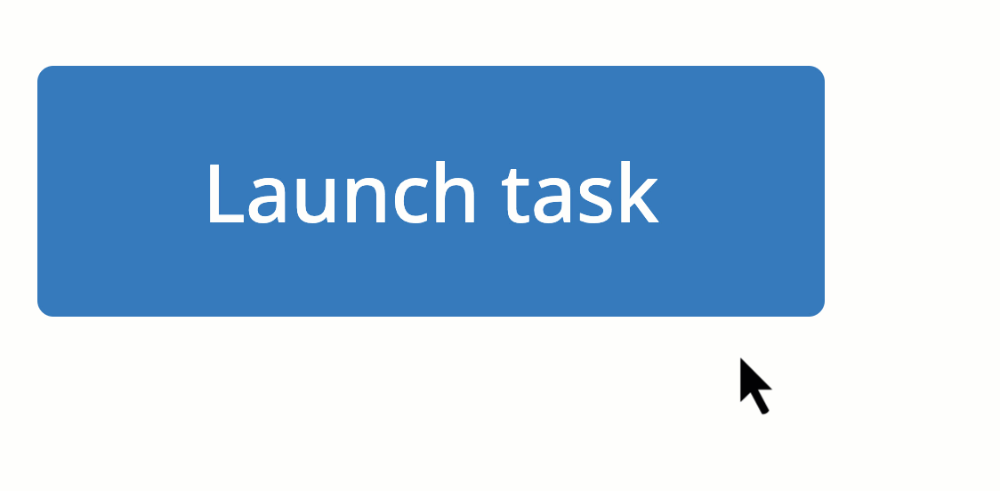
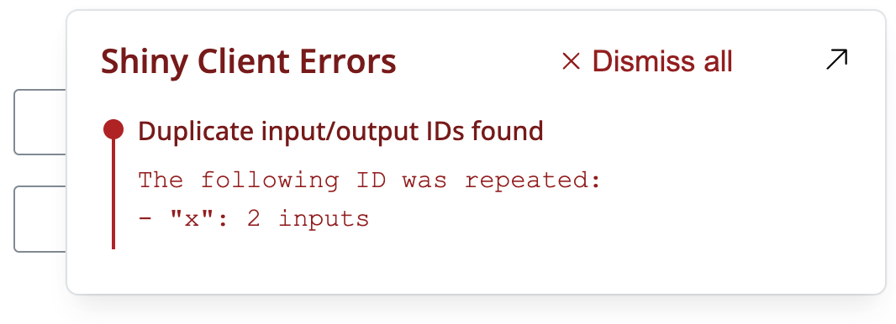
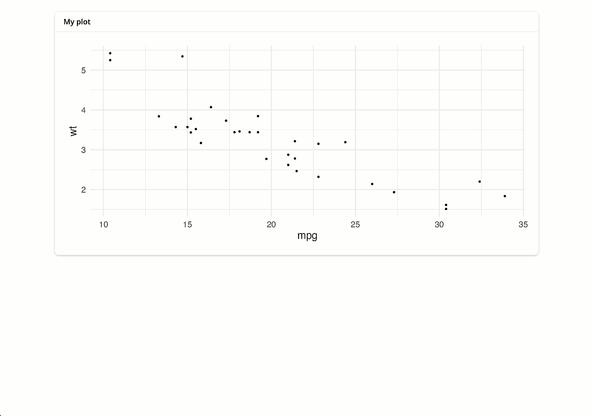

<style>
img { border-radius: 8px; }
</style>

The Shiny team is delighted to announce another round of updates for 9 different R packages.
In this post, we'll introduce three notable things: [non-blocking operations](#nonblocking), a [JavaScript error dialog](#js-errors) and many [bslib improvements](#bslib).
For a detailed list of changes, be sure to check out the [release notes](#release-notes) section of this post.

Although 9 packages received updates, the focus of this post is on `{shiny}` and `{bslib}`, which you can install with the following command:

``` r
install.packages(c("shiny", "bslib"))
```

## Non-blocking operations

The biggest new feature in this release is the ability to run **truly non-blocking operations** in Shiny via `ExtendedTask`.

### The promise of async programming

For years, we've promoted asynchronous programming with the `{promises}` package as a way to improve the performance of large Shiny apps.
`{promises}` can be used to prevent operations in one user session from blocking operations in another user's session, helping scale your app to multiple concurrent users supported by a single R process.

However, `{promises}` alone won't prevent an operation in one session from blocking other operations in that same session.

### Introducing ExtendedTask

We're introducing `ExtendedTask` as a new way to manage long-running operations that won't block within or across sessions, meaning that a user can launch an `ExtendedTask` and still interact with the app while it's running.

Additionally, we've found that `ExtendedTask` provides an elegant way to manage async operations.
Within the task, you'll use `{promises}` to create the async operation, but in the rest of your app you can use `ExtendedTask` methods to start the task or react to results when they arrive.

As a result, `ExtendedTask` is now our recommended starting point for non-blocking tasks in Shiny.
We'd love to show you a full example right now, but for the sake of space in this blog post we'll urge you to visit the [Non-blocking operations article](https://shiny.posit.co/r/articles/improve/nonblocking), also on this blog, for a complete introduction.

### A new task button

As a companion to `ExtendedTask`, we've created `bslib::input_task_button()`, a special button that displays visual feedback when a task is in progress.
As it turns out, `input_task_button()` provides a nice experience for any long-running task, not just `ExtendedTask`.
Think of it like an `actionButton()` that, when clicked, shows a busy indicator (and prevents further clicks) up until the next time the server is idle.
Here's an example of it in action in a basic Shiny app:

``` r
library(shiny)
library(bslib)

ui <- page_fixed(
  input_task_button("launch_task", "Launch task"),
  textOutput("result")
)

server <- function(input, output) {

  output$result <- renderText({
    req(input$launch_task)     # require a button press to launch

    Sys.sleep(3)               # simulate expensive operation
    paste("Number of clicks:", input$launch_task)
  })

}

shinyApp(ui, server)
```

<figure>

<figcaption aria-hidden="true">The task button showing a busy indication while the result is still processing</figcaption>
</figure>

<br>

## JS error dialog

Another exciting new feature is Shiny's JavaScript error dialog, which makes critical client-side errors more discoverable.
To use the error dialog, turn on Shiny's developer features by calling `shiny::devmode()` before running your app locally[^1].

In addition to the dialog, we've also started throwing more errors in situations where behavior is undefined, such as when two inputs (or outputs) have the same ID.
For example:

``` r
library(shiny)
library(bslib)

ui <- page_fixed(
  textInput("x", NULL),
  textInput("x", NULL)
)

shinyApp(ui, \(...) {})
```

<figure>

<figcaption aria-hidden="true">The error dialog displaying the duplicate IDs error</figcaption>
</figure>

## bslib improvements

In addition to the new `input_task_button()`, `bslib` received many [improvements and fixes in this release](https://rstudio.github.io/bslib/news/index.html#bslib-070).
Most of these improvements are focused on `sidebar()`s, `cards()`s, `layout_columns()`s, and the default `bs_theme()`.

To highlight a new feature, `card()` now reports its `full_screen` state to the server, which can be useful for various things like providing more context in a full-screen view.
Just give the card an `id` and read `input${id}_full_screen` in the server, replacing `{id}` with the actual `id` value of your card.

<figure>

<figcaption aria-hidden="true">An expandable card that shows some additional text when it goes full screen.</figcaption>
</figure>

<details class="code-fold">
<summary>Code</summary>

``` r
library(shiny)
library(bslib)
library(ggplot2)

ui <- page_fixed(
  card(
    full_screen = TRUE,
    id = "my_card",
    card_header("My plot"),
    # fill ensures the plot fills when full_screen
    uiOutput("visual", fill = TRUE)
  )
)

server <- function(input, output, session) {

  output$visual <- renderUI({
    plot <- plotOutput("plot")

    if (isTRUE(input$my_card_full_screen)) {
      # In full screen mode, show the plot plus some additional text
      layout_columns(
        plot,
        lorem::ipsum(2),
        col_widths = c(8, 4)
      )
    } else {
      # otherwise, just show the plot
      plot
    }
  })

  output$plot <- renderPlot({
    ggplot(mtcars, aes(mpg, wt)) +
      geom_point() +
      theme_minimal(base_size = 20)
  })

}

shinyApp(ui, server)
```

</details>

## Release notes

This post doesn't cover all of the changes and updates that happened in the Shiny universe in this release cycle.
To learn more about specific changes in each package, dive into the release notes linked below!

**Big shout out to everyone involved!** 💙
We'd want to extend a huge thank you to everyone who contributed pull requests, bug reports and feature requests.
Your contributions make Shiny brilliant!

#### bslib [v0.7.0](https://rstudio.github.io/bslib/news/index.html#bslib-070)

[@benubah](https://github.com/benubah), [@CIOData](https://github.com/CIOData), [@clementlefevre](https://github.com/clementlefevre), [@cpsievert](https://github.com/cpsievert), [@Damonsoul](https://github.com/Damonsoul), [@davemcg](https://github.com/davemcg), [@davos-i](https://github.com/davos-i), [@gadenbuie](https://github.com/gadenbuie), [@howardbaek](https://github.com/howardbaek), [@ideusoes](https://github.com/ideusoes), [@jcheng5](https://github.com/jcheng5), [@kalimu](https://github.com/kalimu), [@lukebandy](https://github.com/lukebandy), [@malcolmbarrett](https://github.com/malcolmbarrett), [@Milko-B](https://github.com/Milko-B), [@ocstringham](https://github.com/ocstringham), [@rickhelmus](https://github.com/rickhelmus), [@royfrancis](https://github.com/royfrancis), [@stla](https://github.com/stla), [@tai-mi](https://github.com/tai-mi), [@tanho63](https://github.com/tanho63), [@toxintoxin](https://github.com/toxintoxin), [@TymekDev](https://github.com/TymekDev), [@udurraniAtPresage](https://github.com/udurraniAtPresage), [@WickM](https://github.com/WickM), [@wish1832](https://github.com/wish1832), and [@zross](https://github.com/zross).

#### htmltools [v0.5.8](https://rstudio.github.io/htmltools/news/index.html#htmltools-058)

[@cpsievert](https://github.com/cpsievert), [@Emanuel-1986](https://github.com/Emanuel-1986), [@gadenbuie](https://github.com/gadenbuie), [@olivroy](https://github.com/olivroy), [@romainfrancois](https://github.com/romainfrancois), and [@russHyde](https://github.com/russHyde).

#### httpuv [v1.6.12](https://cran.r-project.org/web/packages/httpuv/news/news.html)

[@cpsievert](https://github.com/cpsievert), [@gadenbuie](https://github.com/gadenbuie), and [@nunotexbsd](https://github.com/nunotexbsd).

#### leaflet [v2.2.2](https://cran.r-project.org/web/packages/leaflet/news/news.html)

[@ainefairbrother](https://github.com/ainefairbrother), [@amegbor](https://github.com/amegbor), [@asitemade4u](https://github.com/asitemade4u), [@bmaitner](https://github.com/bmaitner), [@cderv](https://github.com/cderv), [@cpsievert](https://github.com/cpsievert), [@gadenbuie](https://github.com/gadenbuie), [@jebyrnes](https://github.com/jebyrnes), [@mkoohafkan](https://github.com/mkoohafkan), [@olivroy](https://github.com/olivroy), [@olyerickson](https://github.com/olyerickson), [@SpeckledJim2](https://github.com/SpeckledJim2), and [@yoelii](https://github.com/yoelii).

#### plotly [v4.10.4](https://cran.r-project.org/web/packages/plotly/news/news.html)

[@AdroMine](https://github.com/AdroMine), [@AlexisDerumigny](https://github.com/AlexisDerumigny), [@aloboa](https://github.com/aloboa), [@aniskara](https://github.com/aniskara), [@Balaika](https://github.com/Balaika), [@baranovskypd](https://github.com/baranovskypd), [@brennanfalcy](https://github.com/brennanfalcy), [@Brishan200](https://github.com/Brishan200), [@byandell](https://github.com/byandell), [@cpsievert](https://github.com/cpsievert), [@dgrignol](https://github.com/dgrignol), [@dvg-p4](https://github.com/dvg-p4), [@FunctionalUrology](https://github.com/FunctionalUrology), [@jeffandcyrus](https://github.com/jeffandcyrus), [@Jensxy](https://github.com/Jensxy), [@JinTonique](https://github.com/JinTonique), [@KarlKaise](https://github.com/KarlKaise), [@KatChampion](https://github.com/KatChampion), [@lukelockley](https://github.com/lukelockley), [@meldarionqeusse](https://github.com/meldarionqeusse), [@morrisseyj](https://github.com/morrisseyj), [@mot12341234](https://github.com/mot12341234), [@msgoussi](https://github.com/msgoussi), [@nlooije](https://github.com/nlooije), [@noamross](https://github.com/noamross), [@olivroy](https://github.com/olivroy), [@OverLordGoldDragon](https://github.com/OverLordGoldDragon), [@peter-atkinson](https://github.com/peter-atkinson), [@salim-b](https://github.com/salim-b), [@syeddans](https://github.com/syeddans), [@TheAnalyticalEdge](https://github.com/TheAnalyticalEdge), [@tomasnobrega](https://github.com/tomasnobrega), and [@TopBottomTau](https://github.com/TopBottomTau).

#### plumber [v1.2.2](https://www.rplumber.io/news/index.html)

[@alexverse](https://github.com/alexverse), [@apalacio9502](https://github.com/apalacio9502), [@apriandito](https://github.com/apriandito), [@ArcadeAntics](https://github.com/ArcadeAntics), [@aronatkins](https://github.com/aronatkins), [@BioTimHaley](https://github.com/BioTimHaley), [@ColinFay](https://github.com/ColinFay), [@cpsievert](https://github.com/cpsievert), [@edavidaja](https://github.com/edavidaja), [@enriquecaballero](https://github.com/enriquecaballero), [@ex0ticOne](https://github.com/ex0ticOne), [@feodosiikraft](https://github.com/feodosiikraft), [@fmalk](https://github.com/fmalk), [@GraphZal](https://github.com/GraphZal), [@hedsnz](https://github.com/hedsnz), [@howardbaek](https://github.com/howardbaek), [@ihamod](https://github.com/ihamod), [@jangorecki](https://github.com/jangorecki), [@jasonheffner](https://github.com/jasonheffner), [@jonthegeek](https://github.com/jonthegeek), [@jpdugo](https://github.com/jpdugo), [@jwebbsoma](https://github.com/jwebbsoma), [@king-of-poppk](https://github.com/king-of-poppk), [@m-muecke](https://github.com/m-muecke), [@meztez](https://github.com/meztez), [@MJSchut](https://github.com/MJSchut), [@mmuurr](https://github.com/mmuurr), [@pietervosnl](https://github.com/pietervosnl), [@pinduzera](https://github.com/pinduzera), [@r2evans](https://github.com/r2evans), [@schloerke](https://github.com/schloerke), [@sdgd165](https://github.com/sdgd165), [@slodge](https://github.com/slodge), [@slodge-work](https://github.com/slodge-work), [@statasaurus](https://github.com/statasaurus), [@timeddilation](https://github.com/timeddilation), [@tylerlittlefield](https://github.com/tylerlittlefield), and [@wikithink](https://github.com/wikithink).

#### sass [v0.4.9](https://rstudio.github.io/sass/news/index.html)

[@cpsievert](https://github.com/cpsievert), [@jeroen](https://github.com/jeroen), and [@yulric](https://github.com/yulric).

#### shiny [v1.8.1](https://shiny.posit.co/r/reference/shiny/1.8.1/upgrade.html)

[@apalacio9502](https://github.com/apalacio9502), [@Arthfael](https://github.com/Arthfael), [@avoidaway](https://github.com/avoidaway), [@bioinformzhang](https://github.com/bioinformzhang), [@chendaniely](https://github.com/chendaniely), [@cpsievert](https://github.com/cpsievert), [@Daishoulu](https://github.com/Daishoulu), [@davidmacro](https://github.com/davidmacro), [@etbrand](https://github.com/etbrand), [@gadenbuie](https://github.com/gadenbuie), [@gunawebs](https://github.com/gunawebs), [@hadley](https://github.com/hadley), [@HugoGit39](https://github.com/HugoGit39), [@ismirsehregal](https://github.com/ismirsehregal), [@jcheng5](https://github.com/jcheng5), [@JohnCoene](https://github.com/JohnCoene), [@jsendak](https://github.com/jsendak), [@laresbernardo](https://github.com/laresbernardo), [@MartinBaumga](https://github.com/MartinBaumga), [@nstrayer](https://github.com/nstrayer), [@olivroy](https://github.com/olivroy), [@Roleren](https://github.com/Roleren), [@RSchwinn](https://github.com/RSchwinn), [@saleforecast1](https://github.com/saleforecast1), [@sharitian](https://github.com/sharitian), [@skaltman](https://github.com/skaltman), [@stla](https://github.com/stla), [@trafficonese](https://github.com/trafficonese), [@TymekDev](https://github.com/TymekDev), [@ugurdar](https://github.com/ugurdar), and [@wch](https://github.com/wch).

#### thematic [v0.1.5](https://rstudio.github.io/thematic/news/index.html#thematic-015)

[@cpsievert](https://github.com/cpsievert), and [@teunbrand](https://github.com/teunbrand).

[^1]: Read more about [shiny devmode in our docs](https://shiny.posit.co/r/reference/shiny/latest/devmode.html). If you'd like to turn on dev mode for all of your local interactive session, you can add the following snippet your `.Rprofile` either in your home directory or your project directory (use `usethis::edit_r_profile()` to open either):

        if (interactive() && requireNamespace("shiny", quietly = TRUE)) {
          shiny::devmode()
        }
