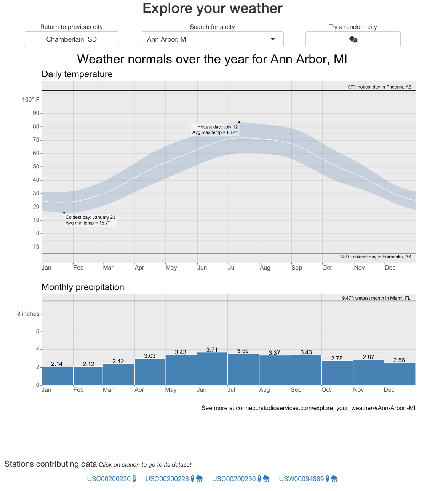
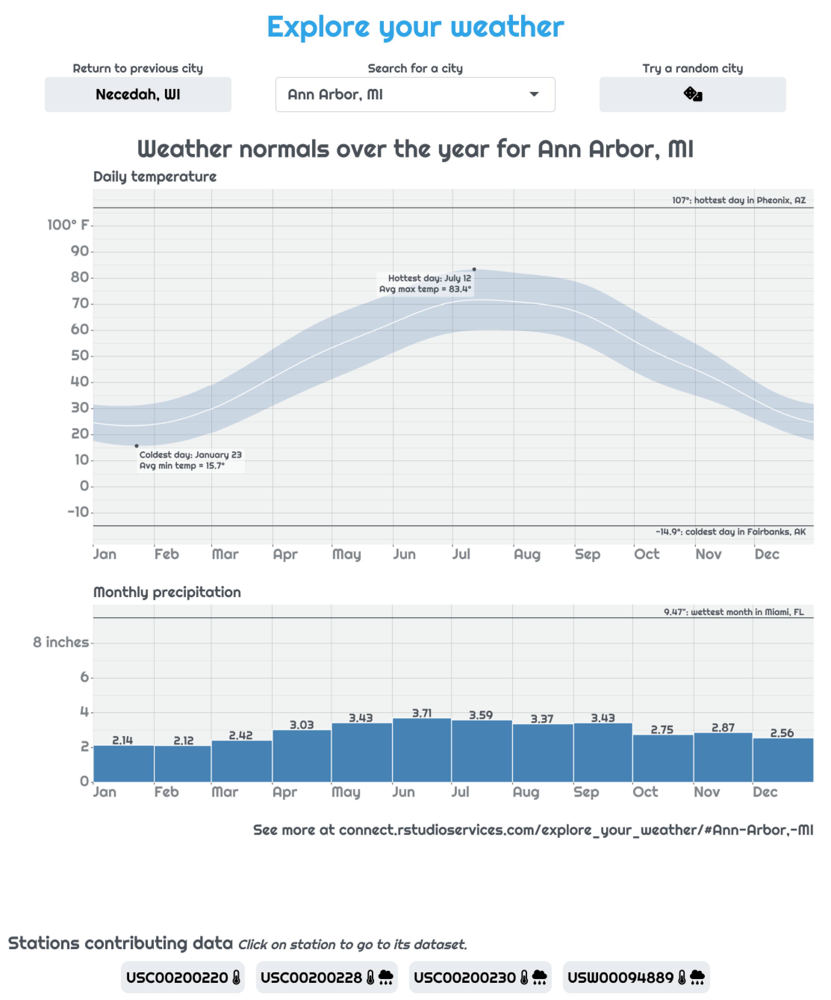
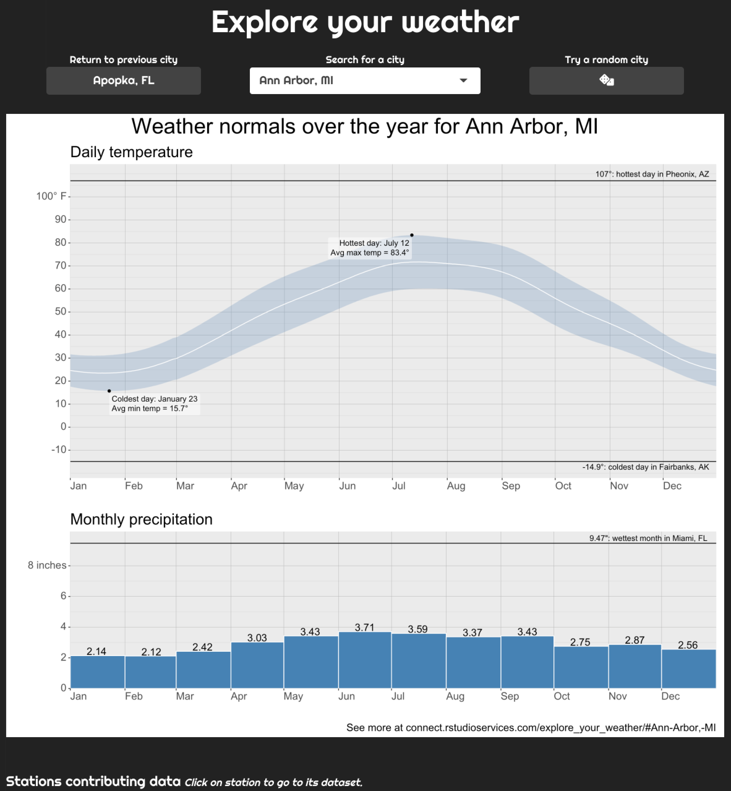
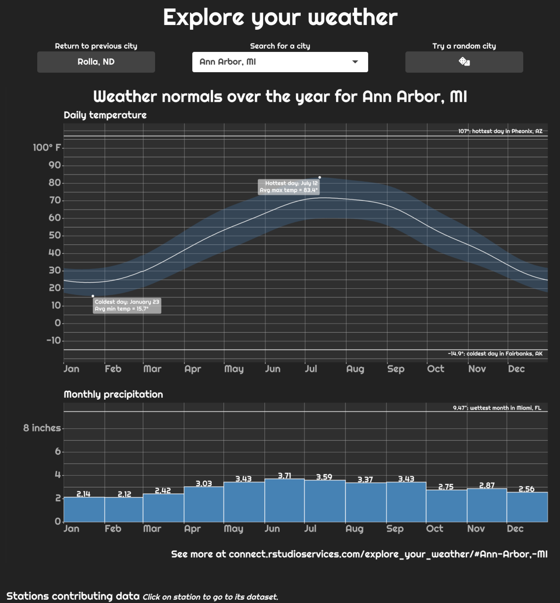
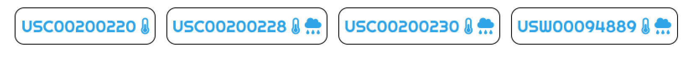
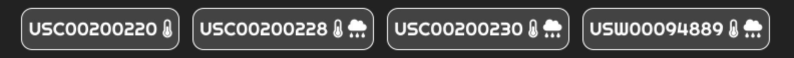
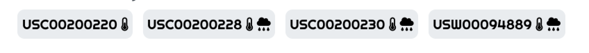
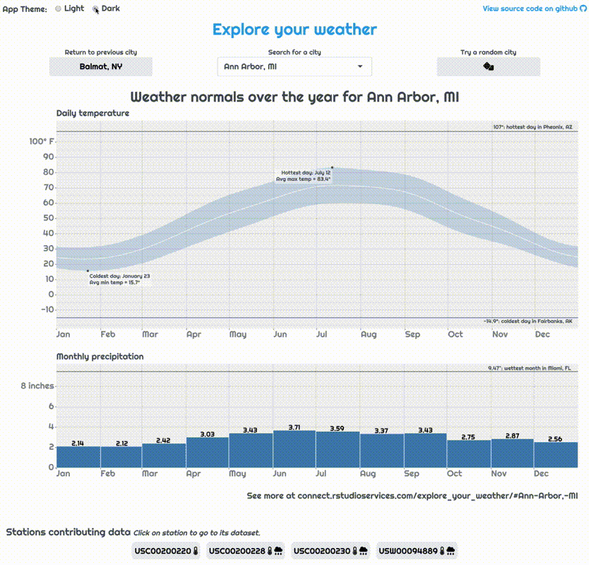

## Weather App

The code and results in this post come from the [weather lookup app.](https://connect.posit.it/explore_your_weather/) Here we will just briefly cover the relevant parts of the app, for a more complete intro check out the [accompanying post](/blog/shiny/weather-lookup-about/) introducing it.


*Screenshot of the [weather lookup app.](https://connect.posit.it/explore_your_weather/)*

## Why theme your app?

We've come a long way from the early days of the web, where pages all looked relatively the same and customizing your website was almost impossible. Almost any user-interface you can dream up can be constructed with modern HTML, CSS, and Javascript. A well-designed and aesthetically pleasing app is a more memorable experience and helps the user know time and care was put into building it.

    
    <p>With default bootstrap theme </p>

    
    <p>With 'cerulean' theme</p>

## Using bslib to set main theme of app with bootswatch

Unfortunately, while modern CSS and HTML allow you to create beautiful designs, flexibility comes with complexity. As a Shiny developer, it's a lot to ask to not only build a useful app functionality but also wrestle with the CSS to make that app look the way you want it. The new package `bslib` abstracts away this complexity and makes getting a beautiful app up and running just a few lines of R code.

All we need to do to transform our app, as seen above, is create a theme object with `bs_theme()` and pass that to the `theme` argument in our UI function. While we're at it, we can also use a custom font from [Google Fonts.](https://fonts.google.com/specimen/Alegreya) I'm partial to "Righteous."

**app.R**

``` r
library(bslib)
library(showtext) # Needed for custom font support
# Setup the bslib theme object
my_theme <- bs_theme(bootswatch = "cerulean",
                     base_font = font_google("Righteous"))

ui <- fluidPage(
  # Pass that theme object to UI function
  theme = my_theme,
  ...
)
...
```

*One thing to note is that if you want the custom fonts to work, you'll need to have the `showtext` package installed. One deployment servers that automatically determine the packages needed for your app this means you'll need to include `library(showtext)` within your app to let the server know to install it when building your app's bundle.*

## Using thematic to style your plots like your app

While `bslib` makes styling the HTML of your app super easy, what about plots included in your app? In the weather app, we use `ggplot2` to build the main plot. There are many customization options to style your `ggplot`, but the process is very different from styling HTML using CSS.

This is where `bslib`'s sister package, `thematic`, comes to the rescue. The purpose of `thematic` is to automatically style your plots (both `base` and `ggplot2`) to match their context. That context may be your current RStudio theme, an RMarkdown document, or a Shiny app.

All that's needed to enable this themeing is adding `thematic_shiny()` to our app... *Note that we're using the theme "darkly" here so difference is more obvious.*

**app.R**

``` r
library(bslib)
library(showtext)
library(thematic)
# Setup the bslib theme object
my_theme <- bs_theme(bootswatch = "darkly",
                     base_font = font_google("Righteous"))

# Let thematic know to update the fonts, too
thematic_shiny(font = "auto")

ui <- fluidPage(
  # Pass that theme object to UI function
  theme = my_theme,
  ...
)
...
```

    
    <p>Default plot appearance with 'darkly' theme</p>

    
    <p>Plot after thematic</p>

Just like that, our plot matches the theme of our app. Note the use of `font = "auto"` in `thematic_shiny()`; this is important if you want to use the same fonts in your plot as on your page. (If you've ever done this manually, you know how much work this just saved us.)

## Using bslib theming variables on custom elements

`bslib` builds its custom themes using the `sass` CSS-preprocessing library thanks to the `sass` R package. `sass` is designed to make building large-scale app styles easier by giving CSS things like variables that can be shared between styles, such as the color of a button. These variables make it easy to make large-scale changes to your app's theme by updating a variable, like `background-color`, without having to find and update every instance of a hard-coded hex color.

Another powerful side-effect of `bslib`'s use of `sass` variables is you can use those variables to ensure any bespoke you write elements match the rest of the app's theme. (See the [Custom Components article](https://rstudio.github.io/bslib/articles/bslib.html#custom) for more on this.) In our app, we will do this to make the style of the current station info bubbles reflect match our current bootswatch theme.



To do this, we write Sass rules for the station bubbles that reference relevant Bootstrap Sass [theming variables](https://rstudio.github.io/bslib/articles/bs4-variables.html).

**styles.scss**

``` scss
...
/* Make station bubble cards respect the colors of the theme */
.station_bubble {
  border: $border-width solid $border-color;
  background: $secondary;
}
/* Make station bubble cards respect the colors of the theme */
.station_bubble > a {
  @extend .bg-secondary;
}
...
```

The `@extend .bg-secondary` line tells Sass to essentially copy and paste the styles from the `bg-secondary` class into our links. This allows the colors of the text inside our station bubbles to match the text inside buttons.

This styles file can then be appended to our `bslib` theme object we built before using the `bs_add_rules()` function.

**app.R**

``` r
...
# Setup the bslib theme object with extra custom styles
my_theme <- bs_theme(bootswatch = "darkly",
                     base_font = font_google("Righteous")) %>%
  bs_add_rules(sass::sass_file("styles.scss"))
...
```

Now, `bslib` will use `sass` to automatically process your styles and convert them to the appropriate CSS. Again, we're using the "darkly" theme here, so this difference is more pronounced.



If we go back to the "cerulean" theme, we can see that the station bubbles change again to match:



Since the `"darkly"` theme customized its colors using the styling variables `$white, $secondary` (among others), our station bubbles automatically get updated to match. This is way nicer than manually going through and changing the styles anytime you decide you want a new theme. *(There are a lot of theming variables available, to see them all check out the [list of theming variables](https://rstudio.github.io/bslib/articles/bs4-variables.html) on the bslib site.)*

This auto-magic updating of styling is crucial when we start using one of `bslib`'s more exciting features: updating a running app's theme.

## Setting up a dark-mode option with dynamic theming

Our app's custom styles already make it look bespoke and interesting. However, what if we wanted to let our users choose what theme they desire so they can have a "personalized" app? This functionality is made relatively easy thanks to the new function in Shiny: [`session$setCurrentTheme()`.](https://shiny.posit.co/r/reference/shiny/latest/session.html) This function essentially lets you swap out whatever theme you want, just like you would pass the `theme` argument in your ui function, except now, you can do it in real-time. We can use this to add a "dark-mode" toggle to flip our app between light (`"cerulean"`) and dark (`"darkly"`) modes.

All we have to do is create a theme toggle with the `radioButtons` input and pass the current choice to `session$setCurrentTheme()` within an observer...

**app.R**

``` r

ui <- fluidPage(
  theme = my_theme,
  ...
  radioButtons("current_theme", "App Theme:", c("Light" = "cerulean", "Dark" = "darkly")),
  ...
  ),
  ...
)
...

server <- function(input, output, session){
  ...
  observe({
    # Make sure theme is kept current with desired
    session$setCurrentTheme(
      bs_theme_update(my_theme, bootswatch = input$current_theme)
    )
  })
}
...
```

Now, once the user selects a different value for the theme, our observer automatically updates the theme for us.



While this is a simple example, there are many potential paths one could take with dynamic theming. For instance, the app could change based on the current weather to a "cold" or "hot" theme, or a dashboard could set its entire style to an "alert" mode if some event needing attention occurred in the data being displayed.

### A note on caching and dynamic themeing

If you read the companion article to this on using caching in our app, you know the main plot is cached. We need to add the current theme to the cache key; otherwise, a plot for a city originally rendered in light mode may be given even though the current viewer is in dark mode. To do this, we can add info on the plot's style, provided by `getCurrentOutputInfo()$fg()` to the cache key.

**app.R**

``` r
... %>% 
  bindCache(input$city, getCurrentOutputInfo()$fg(), ...)
```

[This additional cache key term](https://github.com/rstudio/shiny_app_stories/blob/master/weather_lookup/app.R#L221) means that, for any city, two plots can be cached: one for the light mode and another for the dark mode. For best performance you'll want to make sure you're on the latest version of Shiny by installing from github with `remotes::install_github("rstudio/shiny")`.
