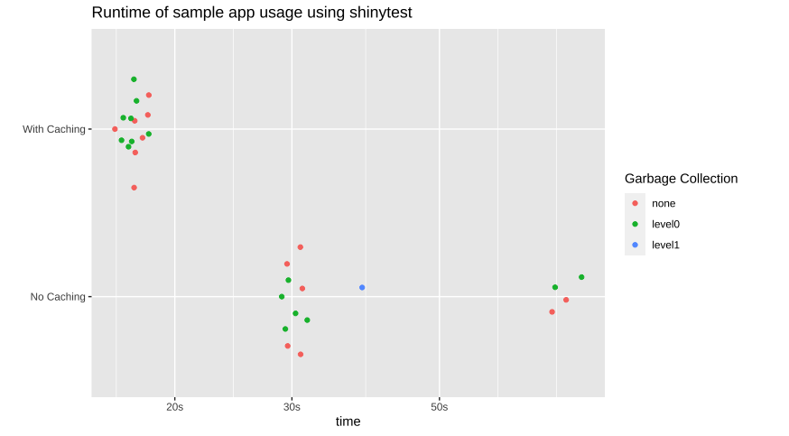

Here we demonstrate the use of the new [`bindCache()`](https://shiny.posit.co/r/reference/shiny/latest/bindCache.html) function in Shiny to greatly speed up a Shiny app that parses NOAA weather station data for 12,636 locations around the United States. We will demonstrate the addition of `bindCache()` to existing reactive expressions, explaining where and why it should be used along with some potential gotchas of doing so.

To learn more about using caching in Shiny, see the [caching article](https://shiny.posit.co/articles/caching.html) and the reference documentation for [`bindCache()`](https://shiny.posit.co/r/reference/shiny/latest/bindCache.html).

## Weather App

The code and results in this post come from the [weather lookup app.](https://connect.posit.it/explore_your_weather/) Here we will just briefly cover the relevant parts of the app, for a more complete intro check out the [accompanying post](/blog/shiny/weather-lookup-about/) introducing it.

:::{.column-page-inset .lightbox}


_Screenshot of the [weather lookup app.](https://connect.posit.it/explore_your_weather/)_
:::

## Performance

Without caching enabled, the weather lookup app is still interesting and potentially useful, but it can be a bit slow.

<video width="100%" controls="controls" style = "margin: 0 auto; display: block;">
<source src="no_caching_performance.mp4" type="video/mp4">
</video>

_Performance of app without caching. Lots of waiting around._


This is because for every requested city, the app performs an expensive query data. Anytime you're relying on an API, let alone a public one, not on your server's network, you're going to have a bottleneck in the responsiveness of your app. In the weather app this is compounded by the fact that for any given city we need to do separate queries for every station present.

_Note: Due to [service interuptions for all NOAA data servers,](https://twitter.com/NWS/status/1376904462611140608) the live-version of the app uses a pair of local dataframes containing all the station data. You can see the full code on [github](https://github.com/rstudio/shiny_app_stories/blob/master/weather_lookup/app.R#L100-L161)_

```r
# Code inside city_data() reactive responsible for running a query for every station in a city
city_data <- reactive({
  ...
  # Not every station has both temperature and precipitation data. To deal
  # with this, loop through all stations in a city try to extract whatever
  # data is present. If a city has a lot of stations, like Fairbanks, AK,
  # this this can take a while
  incProgress(1/4, detail = "Downloading data from all found stations")
  stations <- stations %>%
    mutate(url = build_station_url(station),
           data = map(url, possibly(readr::read_file)))
  ...
})
```

Even after the queries are finished, there's the additional work needing to be done with cleaning and averaging of all the data.

Along with the time the `city_data()` reactive takes, plot output is a complicated mashup of non-trivial ggplots combined with the [`patchwork` package.](https://patchwork.data-imaginist.com/)

All of these reactive computations add up to an interactive experience of less-than-light-speed. While using progress messages to alert the user to what's happening can help, ideally we could just make the app faster...


## Adding caching

A convenient fact about our app is that it will always look the same when a given city is selected. This means we can use __caching__ to pull up the results for a city by simply remembering the output of our reactive the last time the city was seen.

As of Shiny 1.6, adding caching to any reactive is as easy as piping the reactive to the function [`bindCache()`](https://shiny.posit.co/r/reference/shiny/latest/bindCache.html). You tell [`bindCache()`](https://shiny.posit.co/r/reference/shiny/latest/bindCache.html) what the important input variable is that determines the output of the reactive and Shiny will automatically setup a cache store and your app will ([most likely](#when-to-not-use-caching)) see large speed improvements.

To take advantage of caching we will add it in three separate places in the app: our `city_data` reactive and the results plot `output$weather_plot`.


```r
server <- function(input, output, session) {
  ...
  city_data <- reactive({...}) %>%
    bindCache(input$city)

  output$weather_plot <- renderPlot({...}) %>%
    bindCache(input$city)
  ...
}
```


The combination of [`renderPlot()`](https://shiny.posit.co/r/reference/shiny/latest/renderPlot.html) and [`bindCache()`](https://shiny.posit.co/r/reference/shiny/latest/bindCache.html) operates just like the function [`renderCachedPlot()`](https://shiny.posit.co/r/reference/shiny/latest/renderCachedPlot.html) that was introduced in Shiny 1.2, however now _any_ reactive variable can be cached (in fact, [`renderCachedPlot()`](https://shiny.posit.co/r/reference/shiny/latest/renderCachedPlot.html) now uses [`bindCache()`](https://shiny.posit.co/r/reference/shiny/latest/bindCache.html) under-the-hood.)

## Performance with caching

So how much of a benefit do we get from adding those three [`bindCache()`](https://shiny.posit.co/r/reference/shiny/latest/bindCache.html) calls to our code? We can investigate this in two ways: a "real world" side-by-side test and a more formal scripted test scenario.

### Side-by-side comparison

A great place to see the benefits of caching in our app is with the "previous city" button. Because this button is provided and the concept of comparing two cities is appealing, once a given city is looked up by a user it automatically becomes much more likely to be requested again.

<video width="100%" controls="controls" style = "margin: 0 auto; display: block;">
<source src="speed_comparison.mp4" type="video/mp4">

</video>

_Speed comparison of toggling back and forth between a cached and non-cached app. The cached app changes the city almost instantly with no loading needed._


The act of retrieving and displaying the previous city is almost instant, compared to the non-cached app. Caching is perfect for these scenarios.

### Using `shinytest` to compare app speed

We can be a bit more objective with this comparison by using [`shinytest`](https://rstudio.github.io/shinytest/). We can record a typical use of the app and then replay the usage on the app with and without caching. We can wrap this test in a function and use the [`bench`](https://bench.r-lib.org/) package to compare the runtimes over multiple sessions.

```r
run_usage_test <- function(app_dir){
  app <- ShinyDriver$new(app_dir, seed = 42)
  # Using a seed because the app randomly chooses city in rnd_city button and
  # initial back button

  app$snapshotInit("mytest")
  app$setInputs(city = "Minneapolis, MN")
  app$setInputs(city = "Houston, TX")
  app$setInputs(prev_city = "click")
  app$setInputs(prev_city = "click")
  app$setInputs(prev_city = "click")
  app$setInputs(city = "New York, NY")
  app$setInputs(prev_city = "click")
  app$setInputs(prev_city = "click")
}

# Compare runtimes
bench::mark(run_usage_test("cached_app/"),
            run_usage_test("uncached_app/"),
            iterations = 15,
            check = FALSE)
```

:::{.column-page-inset .lightbox}


_App runtimes of 15 separate sessions for both cached and non-cached versions of the weather app._
:::

It's important to note that the most time-consuming aspect of these tests is actually starting the `shinytest` instance, so the difference in usable speed is even greater than seen here.


## A note on cache scope

It's possible to change the scope of your caching (i.e. who/what can read from the cache) using the `cache` argument in [`bindCache()`](https://shiny.posit.co/r/reference/shiny/latest/bindCache.html).

### App-level caching

The default cache scope is `"app"`. This scoping allows cached reactive to be shared between different sessions of the app.

```r
# By default, cached values of my_reactive() are available to all users of app
my_reactive <- reactive({...}) %>%
    bindCache(input$key)

# Equivalent to
my_reactive <- reactive({...}) %>%
    bindCache(input$key, cache = "app")
```

One benefit of app-level scope for our app is that large cities such as New York or Los Angeles are likely going to be viewed a lot. Once these cities are requested by the first user the app will be much faster for a large portion of the userbase. The nice thing is you don't need to try and predict what will be popular, the cache does it for you.

### Session-level caching

For most situations app-level caching the best option, however if you have potentially sensitive data being stored within your reactives the `session` option may be better.

```r
# Cached values of my_reactive() are only shared within the same app session
my_reactive <- reactive({...}) %>%
    bindCache(input$key, cache = "session")
```

This gives each app usage "session" its own cache, so there's no danger of information leaking between users.


#### Diving deeper

For a more through explanation of options for scoping and other setting such as size of cache see the [Cache scoping section](https://shiny.posit.co/articles/caching.html#cache-scoping) of the documentation.

## When to _not_ use caching

Caching in your shiny apps is one of the easiest and most dramatic ways of making performance increases, however, it can sometimes be overkill or even make your app slower. A good rule of thumb is to reach for caching when your reactive:

1. Takes a while to calculate
2. Will likely be needed again
3. The inputs (or cache-keys) are simple.

For instance, caching a reactive that does a fast operation like building a string from basic inputs will likely yield little to no improvement because the time spent hashing the inputs into a key and searching for the result in the cache may take longer than simply re-building the value.

A good example of this is the station info panel in the weather lookup app.

```r
output$station_info <- renderUI({
  # Let the user know what stations went into the plot they're seeing and
  # allow them to explore the data directly
  pmap(
    city_data()$station_info,
     function(url, station, had_temp, had_prcp, ...){
       div(class = "station_bubble",
        a(href = url, target = "_blank",
          station,
          if(had_temp) icon('thermometer-half'),
          if(had_prcp) icon('cloud-rain')
        )
      )
   })
})
```
:::{.column-page-inset .lightbox}


_Example station info for Ann Arbor, MI._
:::

This reactive just builds a few divs that show info about the stations within the current city. The runtime here is almost zero so caching will add no benefit.

*****

To learn more about using caching in Shiny, see the [caching article](https://shiny.posit.co/articles/caching.html) and the reference documentation for [`bindCache()`](https://shiny.posit.co/r/reference/shiny/latest/bindCache.html).
