We're excited to announce [shinychat v0.5.0 for R](https://posit-dev.github.io/shinychat/r/) and [shinychat v0.7.1 for Python](https://posit-dev.github.io/shinychat/py/).
This release brings the pieces of a complete chat application together around the conversation itself.

shinychat is a toolkit for building complete, conversation-centered chat applications with Shiny.
The R package pairs with [ellmer](https://ellmer.tidyverse.org/), and the Python package pairs with [chatlas](https://posit-dev.github.io/chatlas/).
Install the latest releases from CRAN or PyPI:

::: {.panel-tabset group="language"}
### R

``` r
install.packages("shinychat")
```

### Python

``` bash
pip install -U shinychat
```
:::

We cover a lot in this post, and there's even more in the releases.
See the [R release notes](https://github.com/posit-dev/shinychat/blob/main/pkg-r/NEWS.md) and the [Python changelog](https://github.com/posit-dev/shinychat/blob/main/pkg-py/CHANGELOG.md) for the complete list of changes.

If you are upgrading an existing shinychat app, two changes matter.
In R, `chat_mod_ui()` and `chat_mod_server()` are soft-deprecated.
In both languages, startup messages no longer seed a conversation when history is enabled.
We cover both in [a few changes for existing apps](#a-few-changes-for-existing-apps) at the end of this post.

## Build a chat application



A useful chat application needs more than a text box and a streaming response.
Your users need a way to return to an earlier conversation, start a new one, correct a question, compare answers, inspect sources, and see what the model is doing when it calls a tool.
They may also need to upload a file, open a preview, or move between the chat and the rest of the application.

shinychat gives you sensible starting points for building that experience.
Pair it with [ellmer](https://ellmer.tidyverse.org/) in R or [chatlas](https://posit-dev.github.io/chatlas/) in Python, and you can get a working chat app running with little setup.
The chat application model has three layers:

1.  `page_chat()` gives you a full-window chat app with space for navigation, history, tools, and supporting content.
2.  `chat_ui()` lets you place chat wherever it fits best in your application.
3.  `chat_server()` for R or `Chat(client=...)` for Python connects your app to an `ellmer` or `chatlas` client and enables the integrated chat features.

When you want a fully custom experience or need a model client other than ellmer or chatlas, the lower-level pieces are still available for you to assemble yourself.

## Start with `page_chat()`

When chat is the center of your application, use `page_chat()`.
It gives your users a full-window experience with a [chat home](#create-a-chat-app), [navigation pages](#put-the-pieces-together), [sidebars](#put-the-pieces-together), [toolbars](#put-controls-where-they-belong), [conversation history](#return-to-earlier-conversations), and an [artifact drawer](#show-results-beside-the-chat).
Users can move to a settings or sources page while their conversation keeps working and streaming.
The [Get started](https://posit-dev.github.io/shinychat/r/articles/get-started.html) guide for R and the [Page chat](https://posit-dev.github.io/shinychat/py/page-chat.html) guide for Python walk through the full layout.

### Create a chat app

Here is the same starting point in both languages:

::: {.panel-tabset group="language"}
### R

``` r
library(shiny)
library(shinychat)

ui <- page_chat(title = "Assistant", id = "chat")

server <- function(input, output, session) {
  client <- ellmer::chat_openai(
    system_prompt = "You are a helpful assistant."
  )

  chat_server("chat", client)
}

shinyApp(ui, server)
```

### Python

``` python
from chatlas import ChatAnthropic
from shinychat.express import Chat, page_chat

client = ChatAnthropic(system_prompt="You are a helpful assistant.")
chat = Chat(id="chat", client=client)

page_chat(title="Assistant", id="chat")
```
:::

These small examples give you a working chat app backed by a real model.
In R, `chat_server()` connects the app to an `ellmer::Chat` object.
In Python, `Chat(client=...)` connects it to a `chatlas` client.
If you're new to LLM apps with Shiny, [Build Your First LLM App with Shiny](/blog/2025-09-15_shiny-side-of-llms-part-3/) walks through the process from the beginning.

The same setup works for multi-user applications.
For local development in R, pass a client to `chat_app()` and get a personal chat UI in one call.
In Python, `Chat(client=client).app()` does the same.

### Welcome users

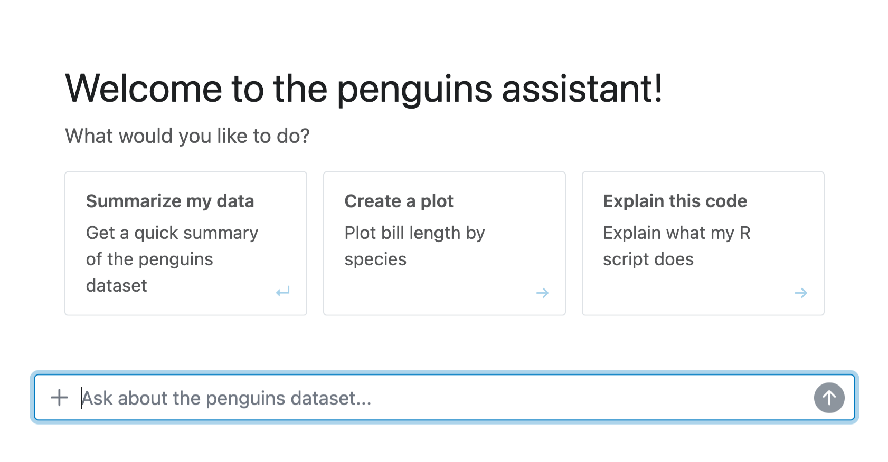{fig-alt="A new chat with a short welcome message and a grid of three suggestion cards beneath it."}

A blank chat can be intimidating, especially when users are not sure what the application can do.
Add a greeting to explain the application, set expectations, and give users a useful first step before they write their first message.
By default, greetings disappear when the user starts chatting.
Wrap the greeting in `chat_greeting(persistent = TRUE)` to keep it visible at the top of the conversation history.

Suggestions make the greeting actionable.
Users can click a suggestion to fill the input, ready to edit before sending.

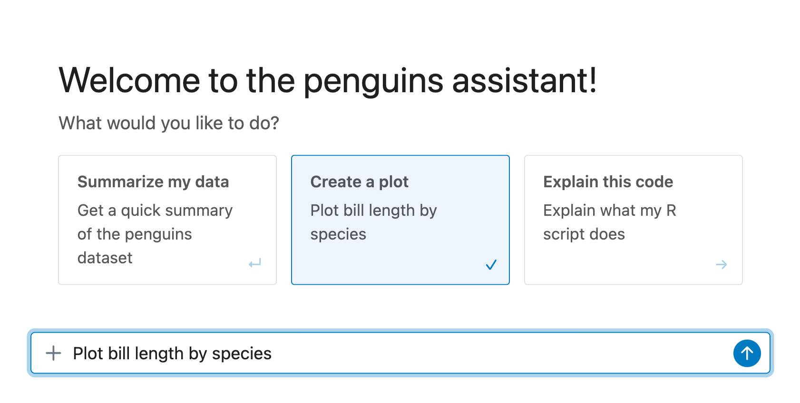{fig-alt="Clicking a suggestion card fills the chat input with the suggested prompt, ready to edit before sending."}

When the suggestion should send without further editing, add the `submit` class and the click sends the prompt right away.

When you present suggestions as a list, shinychat turns them into a grid of cards with optional headings and descriptions.
The cards support keyboard navigation, so users can choose a suggested action without reaching for the mouse.

Here is the Markdown for a greeting with suggestion cards:

``` markdown
## Welcome!

What would you like to do?

* <span class="suggestion submit">Summarize my data</span>
* <span class="suggestion">Create a plot</span>
* <span class="suggestion">Explain this code</span>
```

The `suggestion` class makes the text clickable.
Add a `title` attribute to give a suggestion card a heading.

Suggestions can also appear later in a conversation, so the model can offer useful next steps instead of leaving users to guess what to ask next.
For model-generated suggestions, add instructions like these to your system prompt:

``` text
When you suggest next steps, format each suggestion as a Markdown list item.
Wrap the suggested text in <span class="suggestion">...</span>.
Add the submit class when the suggestion should be sent immediately.
```

You can also generate the greeting when the chat becomes visible, which is useful when the welcome message should reflect the user's context or come from the model.
A generated greeting is a natural place to introduce an application built around a particular dataset, workflow, or set of supported tasks.
The chat calls your `greeting` function when it needs its first message and passes it a fresh client based on the main client:

::: {.panel-tabset group="language"}
### R

``` r
ui <- page_chat("Assistant", id = "chat")

server <- function(input, output, session) {
  client <- ellmer::chat_openai(
    system_prompt = "You are a helpful assistant."
  )

  generate_greeting <- function(client) {
    stream <- client$stream_async(
      "Write a short, friendly welcome message."
    )
    chat_greeting(stream)
  }

  chat_server("chat", client, greeting = generate_greeting)
}
```

### Python

``` python
from chatlas import ChatAnthropic
from shinychat import chat_greeting
from shinychat.express import Chat, page_chat

client = ChatAnthropic(
    system_prompt="You are a helpful assistant."
)


def generate_greeting(client):
    return chat_greeting(
        client.stream_async(
            "Write a short, friendly welcome message."
        )
    )


chat = Chat(id="chat", client=client, greeting=generate_greeting)

page_chat("Assistant", id="chat")
```
:::



Creating the client in `server()` gives each user session its own conversation.
The greeting prompt and its response aren't persisted in the main chat history, so the model starts fresh with the user's first message.

## Return to earlier conversations

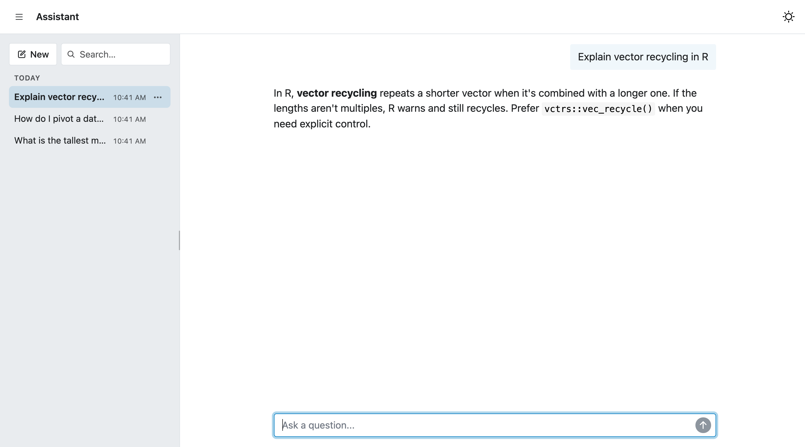{fig-alt="The conversation history drawer open beside the chat, listing several named conversations under Today with a search field and a New conversation button."}

The biggest change in this release is the conversation history system.
When you use `chat_server()` in R or `Chat(client=...)` in Python, your app can give users several saved conversations instead of one growing transcript.

### Save conversations

The history drawer lets users:

- Start a new conversation.
- Switch between saved conversations.
- Search conversations.
- Rename a conversation.
- Delete a conversation.
- Return to the conversation that was active when they last opened the app.

shinychat generates a short title once the conversation has enough content.
Users can replace that title, and title generation never overwrites a manual rename.

::: {.panel-tabset}
### Rename

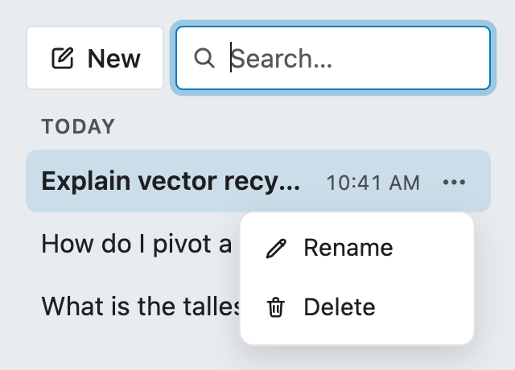{fig-alt="The menu on a saved conversation with options to rename and delete it."}

### Search

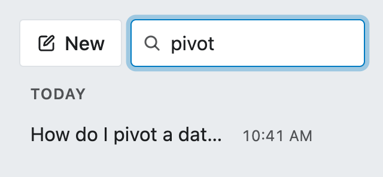{fig-alt="Typing in the history drawer search field narrows the conversation list to matching titles."}
:::

Use `history_options()` in R or `HistoryOptions` in Python to configure:

- `restore_mode`, which controls which conversation opens when a user returns to the app:
  - `"browser"` is the default. It returns that browser to its most recent conversation without changing the URL.
  - `"url"` puts the active conversation ID in the address bar, so users can bookmark or share a specific conversation.
  - `"bookmark"` restores the conversation with the rest of the app state when your app uses Shiny server bookmarking.
- `store`, which controls where shinychat saves conversations. Use `"memory"` for local development or tests, or `"file"` to save them on disk.
- `title`, which controls automatically generated conversation titles.

For example, this configuration stores conversations on disk and puts the active conversation ID in the URL:

::: {.panel-tabset group="language"}
### R

``` r
history <- history_options(
  restore_mode = "url",
  store = "file"
)

chat_server("chat", client, history = history)
```

### Python

``` python
from shinychat import Chat
from shinychat.types import HistoryOptions

history = HistoryOptions(
    restore_mode="url",
    store="file",
)

chat = Chat("chat", client=client, history=history)
```
:::

On Posit Connect, conversation history is included with the platform and is enabled automatically when you provide a model client.
The default configuration uses Connect's [persistent storage](https://docs.posit.co/connect/user/structuring-content/#persistent-storage-on-posit-connect) and scopes conversations to the authenticated user.
That gives every user a private conversation history without an additional history service or per-user setup.

In every restore mode, shinychat keeps the transcript in its configured store instead of putting the full conversation in the URL.

### Edit a message and compare answers



Editing a message now creates a new conversation **branch**.
When a user edits and resends an earlier message, shinychat forks the conversation at that point.
The original question and the rest of the conversation that follows stay on their branch.
The edited question starts a new branch, and users move between the two answers with the branch controls in the message.

::: {.panel-tabset}
### Branch 1
{fig-alt="The original conversation with an assistant response showing a 1 / 2 sibling navigation control."}

### Branch 2
{fig-alt="The same conversation after editing a message, with the new branch's response selected and the sibling navigation control showing 2 / 2."}
:::

Branches help when a prompt is almost right or when a model takes an unhelpful direction, and they make comparing answers easy without starting over.
And they are part of the saved conversation, so users return to their place in the conversation after a reload.

## Add content and controls

When chat is part of a larger application, your users still need access to filters, settings, sources, and results.
`page_chat()` gives you a place to put those alongside the conversation: a drawer for results, toolbars for controls, and offcanvas panels for settings you would rather keep off screen.

### Show results beside the chat

The artifact drawer gives your users a second region next to the conversation.
Use it for a source preview, a rendered report, a table, a plot, or another piece of Shiny UI.
Your app can update the drawer as the conversation changes, so users can inspect a result without leaving the chat.

That separation fits applications where the conversation asks for something and the drawer shows the result.
A user can keep the conversation visible while inspecting a generated chart or document.

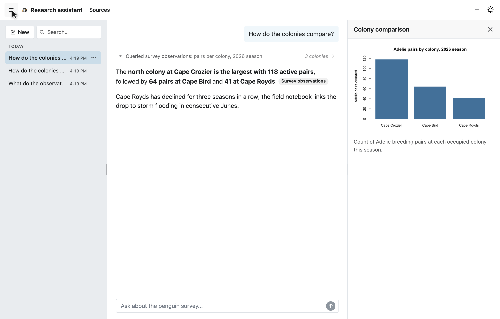{fig-alt="The research assistant app with the Research assistant and Sources navigation pages in the header, the conversation in the main region, and the artifact drawer open beside the chat showing a bar chart of penguin counts."}

Declare the drawer with the `drawer` argument of `page_chat()`:

::: {.panel-tabset group="language"}
### R

``` r
ui <- page_chat(
  "Research assistant",
  id = "chat",
  drawer = chat_drawer(
    tags$p("Select a result to inspect it here."),
    title = "Latest result",
    open = FALSE
  )
)
```

### Python

``` python
from shiny import ui
from shinychat import chat_drawer
from shinychat.express import page_chat

page_chat(
    "Research assistant",
    id="chat",
    drawer=chat_drawer(
        ui.p("Select a result to inspect it here."),
        title="Latest result",
        open=False,
    ),
)
```
:::

Inside `chat_drawer()`, the first argument is the content users see until your application fills the drawer with a result.
`title` names the region, and `open = FALSE` starts the drawer closed.

From the server, `chat_drawer_update()` fills the drawer with new content and `chat_drawer_show()` opens it, so a response with a result worth inspecting can bring the drawer up beside the conversation.
`chat_drawer_hide()` and `chat_drawer_toggle()` round out the controls, and the drawer content can be any Shiny UI, including live outputs:

::: {.panel-tabset group="language"}
### R

``` r
server <- function(input, output, session) {
  chat_server("chat", client)

  observeEvent(input$chat_user_input, {
    chat_drawer_update(
      "chat",
      drawer_plot,
      title = "Penguin counts"
    )
    chat_drawer_show("chat")
  })
}
```

### Python

``` python
from shiny import reactive
from shinychat import Chat

chat = Chat("chat")


@reactive.effect
async def _show_result():
    await chat.drawer.update(drawer_plot, title="Penguin counts")
    await chat.drawer.show()
```
:::

The video earlier in this post shows the pair in action: the research assistant's second response updates the drawer and opens it beside the conversation.

The toolbars and navigation pages in the screenshot come later in this section.
We assemble the complete application in code at the end.

### Put controls where they belong

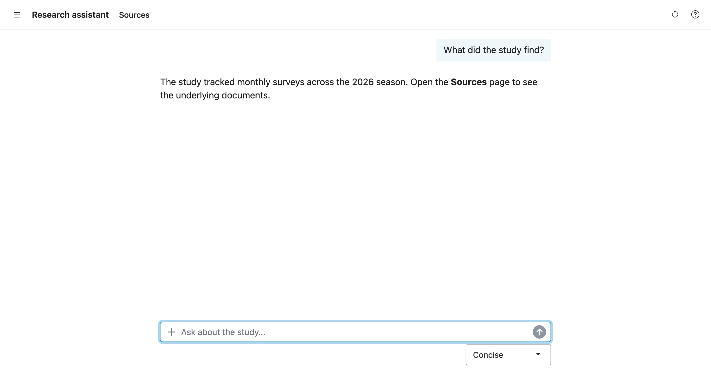{fig-alt="The research assistant home page with an active conversation. The page-scoped toolbar with a Clear conversation button and the global Help and Answer settings buttons sit in the header next to the navigation, and a toolbar with a response style selector sits below the chat input."}

Controls in a chat application have different scopes.
A button that clears the conversation belongs on the chat page.
A help button belongs on every page.
`page_chat()` gives each scope its own toolbar argument, built on the [toolbars](/blog/2026-05-26_introducing-toolbars/) that bslib and Shiny shipped earlier this year.

`toolbar` holds controls scoped to the home page, where the conversation lives.
They appear with the navigation controls in the header.
`toolbar_global` holds controls that stay on every page, after the page-scoped toolbar.
By default, it contains the dark-mode toggle.
Pass `NULL` in R or `None` in Python to remove the global toolbar, including the dark-mode toggle.

::: {.panel-tabset group="language"}
### R

``` r
ui <- page_chat(
  "Research assistant",
  id = "chat",
  toolbar = bslib::toolbar(
    bslib::toolbar_input_button(
      "clear_chat",
      "Clear conversation",
      icon = bsicons::bs_icon("arrow-counterclockwise")
    )
  ),
  toolbar_global = bslib::toolbar(
    bslib::toolbar_input_button(
      "help",
      "Help",
      icon = bsicons::bs_icon("question-circle")
    )
  )
)
```

### Python

``` python
page_chat(
    "Research assistant",
    id="chat",
    toolbar=ui.toolbar(
        ui.toolbar_input_button(
            id="clear_chat",
            label="Clear conversation",
            icon=icon_svg("arrow-counterclockwise"),
        )
    ),
    toolbar_global=ui.toolbar(
        ui.toolbar_input_button(
            id="help",
            label="Help",
            icon=icon_svg("question-circle"),
        )
    ),
)
```
:::

The buttons in these toolbars use `toolbar_input_button()`, a compact button designed for small spaces like headers, card headers, and footers.
When you give it an icon, it shows the icon alone and uses the label as its tooltip.

Users see the **Clear conversation** button while they chat and the **Help** button on every page, next to the dark-mode toggle.

The page-scoped toolbar follows the active page.
When you add a secondary page, its `chat_nav_panel()` supplies a `toolbar` that replaces the page-scoped toolbar while the user is on that page.
The global toolbar stays where it is.

::: {.panel-tabset group="language"}
### R

``` r
chat_nav_panel(
  "Sources",
  tags$p("Sources selected during this session appear here."),
  toolbar = bslib::toolbar(
    bslib::toolbar_input_button(
      "refresh_sources",
      "Refresh",
      icon = bsicons::bs_icon("arrow-repeat")
    )
  )
)
```

### Python

``` python
chat_nav_panel(
    "Sources",
    ui.p("Sources selected during this session appear here."),
    toolbar=ui.toolbar(
        ui.toolbar_input_button(
            id="refresh_sources",
            label="Refresh",
            icon=icon_svg("arrow-repeat"),
        )
    ),
)
```
:::

On the Sources page, the page-scoped toolbar shows the **Refresh** button instead, while **Help** and the dark-mode toggle remain.

Controls that act on the message itself get a third spot.
`toolbar_input` places a toolbar directly below the chat input, independent of the navigation toolbars.
Explore it in the [shinychat for R](https://posit-dev.github.io/shinychat/r/) or [shinychat for Python](https://posit-dev.github.io/shinychat/py/) documentation.

### Keep secondary content out of the way

`page_chat()` uses [offcanvas panels](/blog/2026-08-04_shiny-r-1-14-python-1-7/) to keep secondary content available without taking over the screen.
A toolbar button is also a natural trigger for an [offcanvas panel](/blog/2026-08-04_shiny-r-1-14-python-1-7/).
Here, a button in the global toolbar opens an **Answer settings** panel from any page, without leaving the conversation:

::: {.panel-tabset group="language"}
### R

``` r
ui <- page_chat(
  "Research assistant",
  id = "chat",
  toolbar_global = bslib::toolbar(
    bslib::toolbar_input_button(
      "show_settings",
      "Answer settings",
      icon = bsicons::bs_icon("gear")
    )
  )
)

server <- function(input, output, session) {
  observeEvent(input$show_settings, {
    bslib::show_offcanvas(
      bslib::offcanvas(
        title = "Answer settings",
        id = "answer_settings",
        placement = "right",
        sliderInput("length", "Target length", 100, 1000, 400),
        checkboxInput("citations", "Request citations", TRUE)
      ),
      session = session
    )
  })
}
```

### Python

``` python
from faicons import icon_svg
from shiny import reactive, ui
from shinychat.express import page_chat

page_chat(
    "Research assistant",
    id="chat",
    toolbar_global=ui.toolbar(
        ui.toolbar_input_button(
            id="show_settings",
            label="Answer settings",
            icon=icon_svg("gear"),
        )
    ),
)


@reactive.effect
@reactive.event(input.show_settings)
def open_answer_settings():
    ui.show_offcanvas(
        ui.offcanvas(
            title="Answer settings",
            id="answer_settings",
            placement="right",
            ui.input_slider("length", "Target length", 100, 1000, 400),
            ui.input_checkbox("citations", "Request citations", True),
        )
    )
```
:::

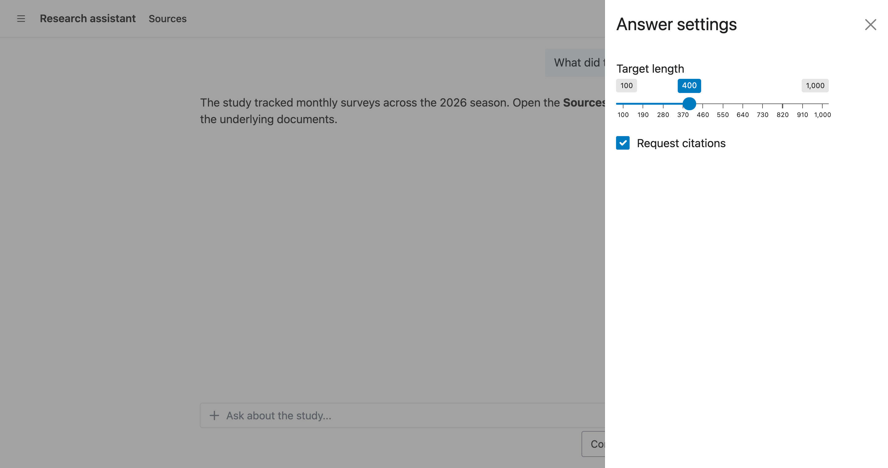{fig-alt="The research assistant app with the Answer settings offcanvas open along the right edge, showing a target length slider and a citations checkbox beside the conversation."}

### Put the pieces together

Add navigation pages with `chat_nav_panel()` or the corresponding Shiny navigation helpers.
Add a sidebar for filters or other controls.
On a narrow screen, users can find the same controls in the application menu.

You can compose these regions directly in `page_chat()`.
This is the same research assistant from the screenshots throughout this section, with the toolbars, the navigation pages, and the drawer all in one call:

::: {.panel-tabset group="language"}
### R

``` r
ui <- page_chat(
  "Research assistant",
  id = "chat",
  toolbar = bslib::toolbar(
    bslib::toolbar_input_button(
      "clear_chat",
      "Clear conversation",
      icon = bsicons::bs_icon("arrow-counterclockwise")
    )
  ),
  toolbar_global = bslib::toolbar(
    bslib::toolbar_input_button(
      "help",
      "Help",
      icon = bsicons::bs_icon("question-circle")
    )
  ),
  pages_navbar = list(
    chat_nav_panel(
      "Sources",
      tags$p("Sources selected during this session appear here."),
      toolbar = bslib::toolbar(
        bslib::toolbar_input_button(
          "refresh_sources",
          "Refresh",
          icon = bsicons::bs_icon("arrow-repeat")
        )
      )
    )
  ),
  drawer = chat_drawer(
    tags$p("Select a result to inspect it here."),
    title = "Latest result",
    open = FALSE
  )
)
```

### Python

``` python
from shiny import ui
from shinychat import chat_drawer, chat_nav_panel
from shinychat.express import page_chat

page_chat(
    "Research assistant",
    id="chat",
    toolbar=ui.toolbar(
        ui.toolbar_input_button(
            id="clear_chat",
            label="Clear conversation",
            icon=icon_svg("arrow-counterclockwise"),
        )
    ),
    toolbar_global=ui.toolbar(
        ui.toolbar_input_button(
            id="help",
            label="Help",
            icon=icon_svg("question-circle"),
        )
    ),
    pages_navbar=[
        chat_nav_panel(
            "Sources",
            ui.p("Sources selected during this session appear here."),
            toolbar=ui.toolbar(
                ui.toolbar_input_button(
                    id="refresh_sources",
                    label="Refresh",
                    icon=icon_svg("arrow-repeat"),
                )
            ),
        )
    ],
    drawer=chat_drawer(
        ui.p("Select a result to inspect it here."),
        title="Latest result",
        open=False,
    ),
)
```
:::

Users see the **Clear conversation** button while they chat, the **Help** button on every page, a **Sources** page with its own **Refresh** toolbar, and a **Latest result** drawer beside the conversation.

## Show how the model reached an answer

Your users can now follow more than the final answer.
A response can include ordinary text, thinking content, web activity, citations, tool calls, tool results, and custom UI.
shinychat presents each part in a way that helps users understand the answer and what produced it.

### Keep tool calls readable

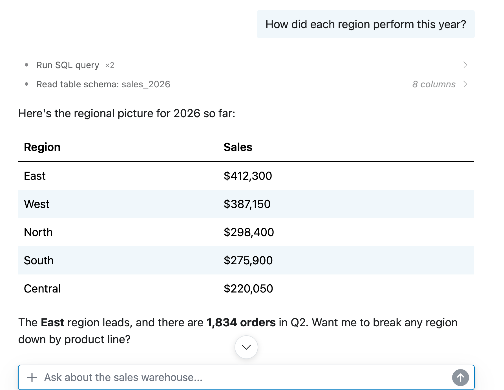{fig-alt="A sales assistant conversation where two SQL queries and a schema read appear as compact activity rows above the answer."}

Tool calls now appear as compact activity rows instead of taking over the conversation, a refinement of the [tool-call cards shinychat introduced last year](/blog/2025-11-20_shinychat-tool-ui/).
shinychat groups related calls into a single row.
Users can expand a group, open an individual call, and inspect the request and result when they need more detail.

Each call can show a short title, a label such as a file name or query, and a value preview such as a row count.
Users can see the activity while the tool runs and inspect the result after it finishes.

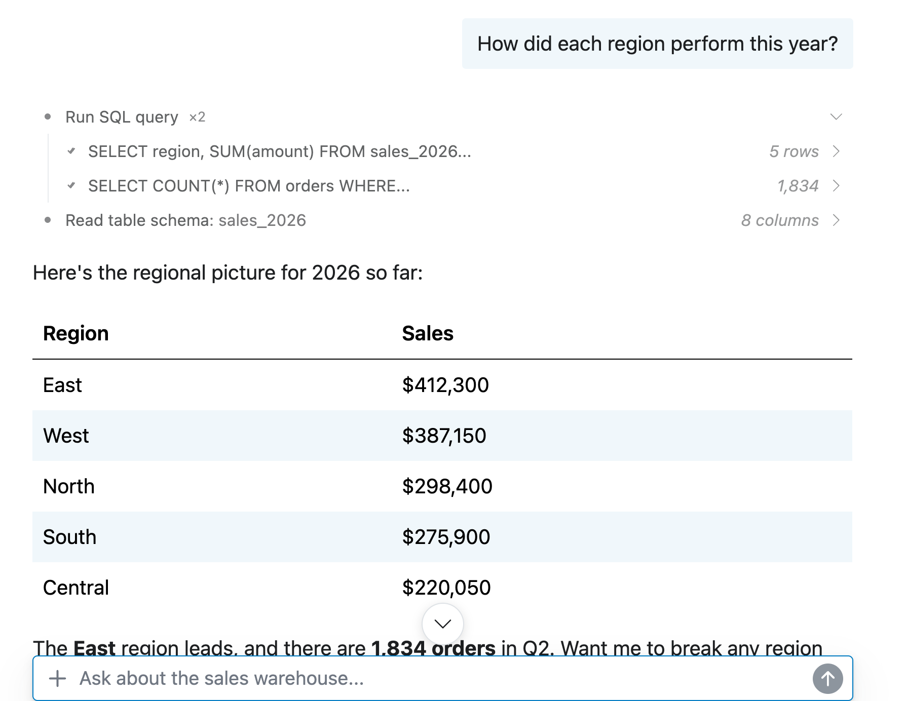{fig-alt="The grouped tool-call row expanded to show the two SQL queries with row count and result previews."}

Opening an individual call shows the request and the result in a card:

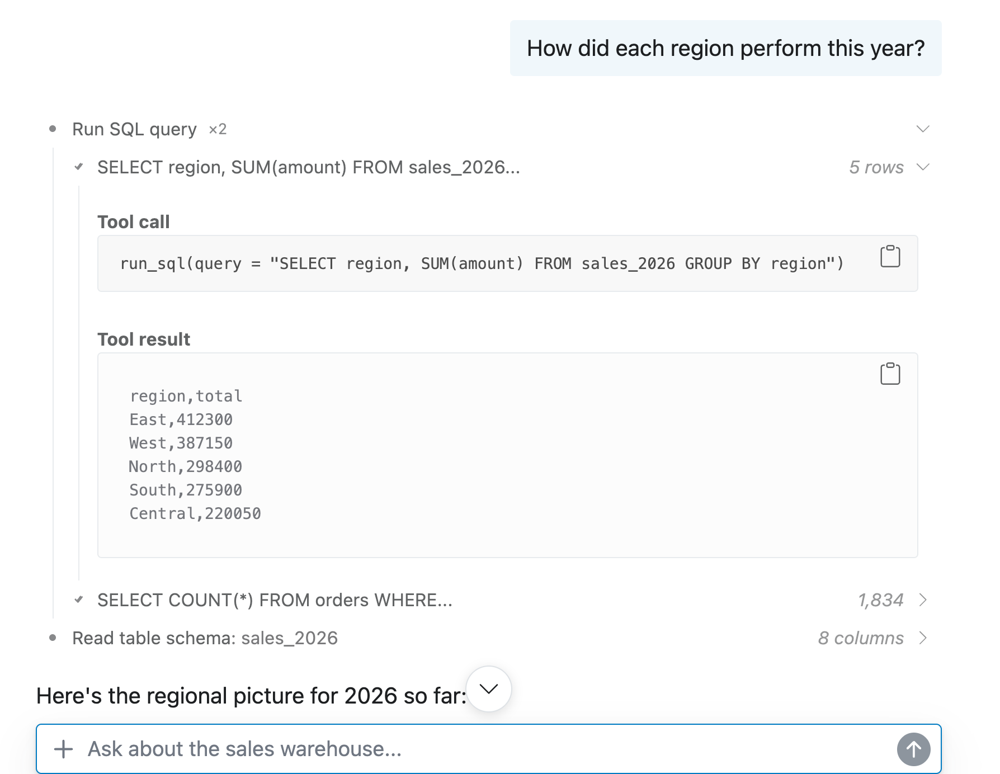{fig-alt="The SQL query expanded to a card showing the full tool call arguments and the query result as a small table."}

Configure grouping with `tool_grouping` when your application needs a different amount of detail.

For example, use `"all"` to show one activity row for a complete tool-calling loop, or use `"none"` to show every call separately:

::: {.panel-tabset group="language"}
### R

``` r
ui <- page_chat(
  "Assistant",
  id = "chat",
  tool_grouping = "all"
)
```

### Python

``` python
page_chat(
    "Assistant",
    id="chat",
    tool_grouping="all",
)
```
:::

Grouping keeps the answer readable, and the request and result stay one click away.
To learn how to register tools and customize their display, see [Tool UI in shinychat for R](https://posit-dev.github.io/shinychat/r/articles/tool-ui.html), [Tools in Shiny for Python](https://shiny.posit.co/py/docs/genai-tools.html), [tool/function calling in ellmer](https://ellmer.tidyverse.org/articles/tool-calling.html), or [tool calling in chatlas](https://posit-dev.github.io/chatlas/get-started/tools.html).

### Show citations for web search and fetch

Give a Claude client web search and web fetch tools, and shinychat shows the sources with the answer:

``` r
library(ellmer)

client <- chat_anthropic()
client$register_tool(claude_tool_web_search())
client$register_tool(claude_tool_web_fetch())
```

When `chat_server()` uses this client, users can open a citation beside the claim it supports or browse the message-wide Sources summary.
If Claude provides grounded spans, shinychat connects each citation to the answer text it supports.

Custom retrieval applications, like the RAG systems you can build with [raghilda](/blog/2026-04-14_rag-with-raghilda/), can use the same citation UI.
Write a `<shiny-aside>` tag into an assistant message to attach a source to a claim.

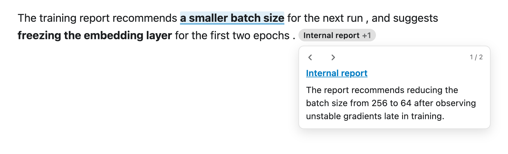{fig-alt="An assistant response where each cited claim is underlined and a pill reading Internal report +1 marks the message's sources, with the citation popover open just below the pill showing the source name, a link, the supporting passage, and controls to move between the message's two citations."}

### Stream responses and show thinking

With a model client, shinychat streams responses and shows supported thinking content in a collapsible panel.

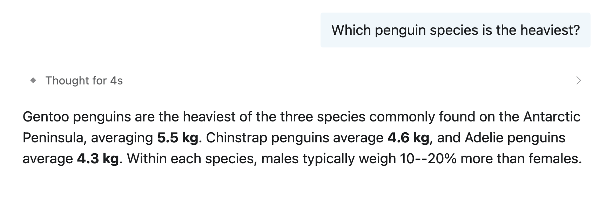{fig-alt="An assistant response with a collapsed panel reading Thought for 4s between the user's question and the answer."}

Users can cancel a slow response with the stop button or the Escape key, and the partial response stays in the conversation.

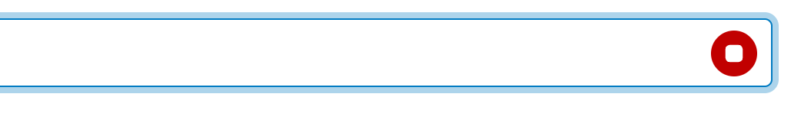{fig-alt="While a response streams in, the send button at the right of the chat input becomes a red stop button."}

## Add files and shortcuts

### Attach files

Your users can send images, PDFs, and text files through a file picker, drag and drop, or paste.
With `chat_server()` in R or `Chat(client=...)` in Python, attachments are enabled by default, and the uploaded files reach the model alongside the user's message.

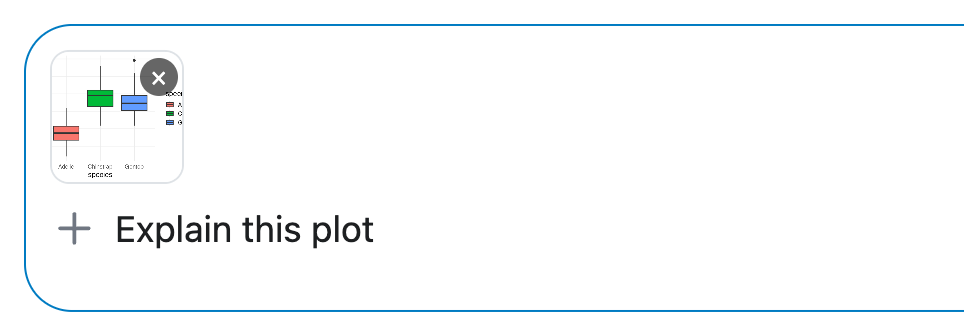{fig-alt="A plot attached to the chat input as a thumbnail chip above the prompt Explain this plot, with the attach button at the left of the input."}

### Add slash commands

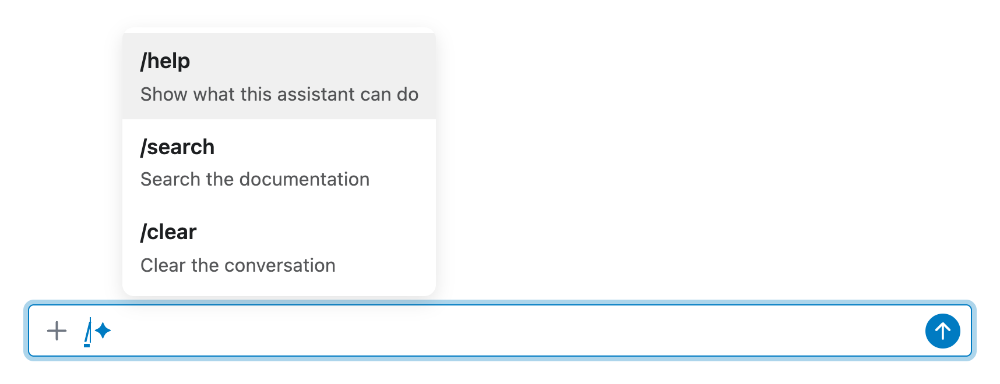{fig-alt="The slash command palette open above the chat input, listing /help, /search, and /clear with short descriptions."}

Your users can type `/` to open a command palette.
A command can expand the user's text into a richer prompt, perform an action without calling the model, or run entirely in the browser.

For example, `/search shiny modules` can retrieve documentation and send a larger prompt to the model.
A `/clear` command can clear the active conversation without involving the model.
A client-side command can open a modal, clear the input, or trigger another browser action without a server round-trip.

Register commands on the object returned by `chat_server()` in R or on the `Chat` object in Python.
When users return to a saved conversation, they still see the command they entered.

For example, add a `/help` command that displays guidance without sending anything to the model:

::: {.panel-tabset group="language"}
### R
``` r
chat <- chat_server("chat", client)

chat$slash_command("help", "Show help", function() {
  showModal(
    modalDialog(
      "Try `/search topic` to search the documentation.",
      title = "Help",
      easyClose = TRUE
    )
  )
}, echo = FALSE)
```

### Python
``` python
chat = Chat("chat", client=client)

@chat.slash_command("help", "Show help", echo=False)
def _():
    m = ui.modal(
      "Try `/search topic` to search the documentation.",
      title="Help"
    )
    ui.modal_show(m)
```
:::

When a user chooses `/help`, the command opens a modal with the guidance and sends nothing to the model.

## Use shinychat in R and Python

Whichever language you use, you can give users the same conversation-centered experience:

| Application need | R | Python |
|------------------------|------------------------|------------------------|
| Full-window chat application | `page_chat()` | `page_chat()` |
| Embedded chat | `chat_ui()` | `chat_ui()` |
| Connect a model client | `chat_server()` | `Chat(client=...)` |
| Model client | `ellmer::Chat` | `chatlas` client |
| Conversation settings | `history_options()` | `HistoryOptions` |
| Standalone helper | `chat_app()` | `shinychat.page_chat()` |

You can focus on the application you want to build while `ellmer` or `chatlas` handles model requests and tools.
shinychat gives that model a conversation interface with history, rich responses, and the controls your users need.
And for a ready-made chat-with-your-data application, take a look at [querychat](/blog/2026-06-17_querychat-ggsql/).

## A few changes for existing apps

Existing `chat_ui()` applications remain supported.
Use `chat_ui()` when you want chat to share a page with other top-level content.
Use `page_chat()` when you want the conversation to fill the application.
Use `page_chat()` as the outermost page container. Nesting it inside another page layout breaks the full-window layout and history experience.

In R, `chat_mod_ui()` and `chat_mod_server()` are soft-deprecated in favor of pairing `chat_ui()` and `chat_server()` by ID.
In both languages, startup messages are no longer the right way to seed a conversation when history is enabled.
Use a greeting or append messages through the chat object instead.

The release also protects users from unsafe model-authored Markdown, shows an error when a response fails before streaming starts, and preserves tool results, citations, attachments, and other rich content when users return to a conversation.

With `page_chat()`, `chat_server()` or `Chat(client=...)`, and the history options, you can now give your users a complete chat application: saved conversations they can return to, messages they can edit into new branches, greetings and suggestions to start from, and responses with visible tool calls, citations, and thinking.

Read the [shinychat for R documentation](https://posit-dev.github.io/shinychat/r/) or the [shinychat for Python documentation](https://posit-dev.github.io/shinychat/py/) to explore the examples.
For the complete list of changes, see the [R release notes](https://github.com/posit-dev/shinychat/blob/main/pkg-r/NEWS.md) and the [Python changelog](https://github.com/posit-dev/shinychat/blob/main/pkg-py/CHANGELOG.md).

## Acknowledgements

We thank everyone who contributed to these releases, for opening issues,
submitting pull requests, and providing feedback:
[&#x0040;bastianolea](https://github.com/bastianolea),
[&#x0040;bianchenhao](https://github.com/bianchenhao),
[&#x0040;christophsax](https://github.com/christophsax),
[&#x0040;cpsievert](https://github.com/cpsievert),
[&#x0040;crissthiandi](https://github.com/crissthiandi),
[&#x0040;elnelson575](https://github.com/elnelson575),
[&#x0040;gadenbuie](https://github.com/gadenbuie),
[&#x0040;Harshit28j](https://github.com/Harshit28j),
[&#x0040;JamesHWade](https://github.com/JamesHWade),
[&#x0040;jcheng5](https://github.com/jcheng5),
[&#x0040;jlxAtNovozymes](https://github.com/jlxAtNovozymes),
[&#x0040;jnhyeon](https://github.com/jnhyeon),
[&#x0040;jose-c-milliman](https://github.com/jose-c-milliman),
[&#x0040;kaipingyang](https://github.com/kaipingyang),
[&#x0040;lucasrod16](https://github.com/lucasrod16),
[&#x0040;markmcd](https://github.com/markmcd),
[&#x0040;nbenn](https://github.com/nbenn),
[&#x0040;parmsam](https://github.com/parmsam),
[&#x0040;schloerke](https://github.com/schloerke),
[&#x0040;shea-parkes](https://github.com/shea-parkes),
[&#x0040;simonpcouch](https://github.com/simonpcouch),
[&#x0040;slupczynskim](https://github.com/slupczynskim),
[&#x0040;thisisnic](https://github.com/thisisnic),
[&#x0040;wlandau](https://github.com/wlandau), and
[&#x0040;xx02al](https://github.com/xx02al).
