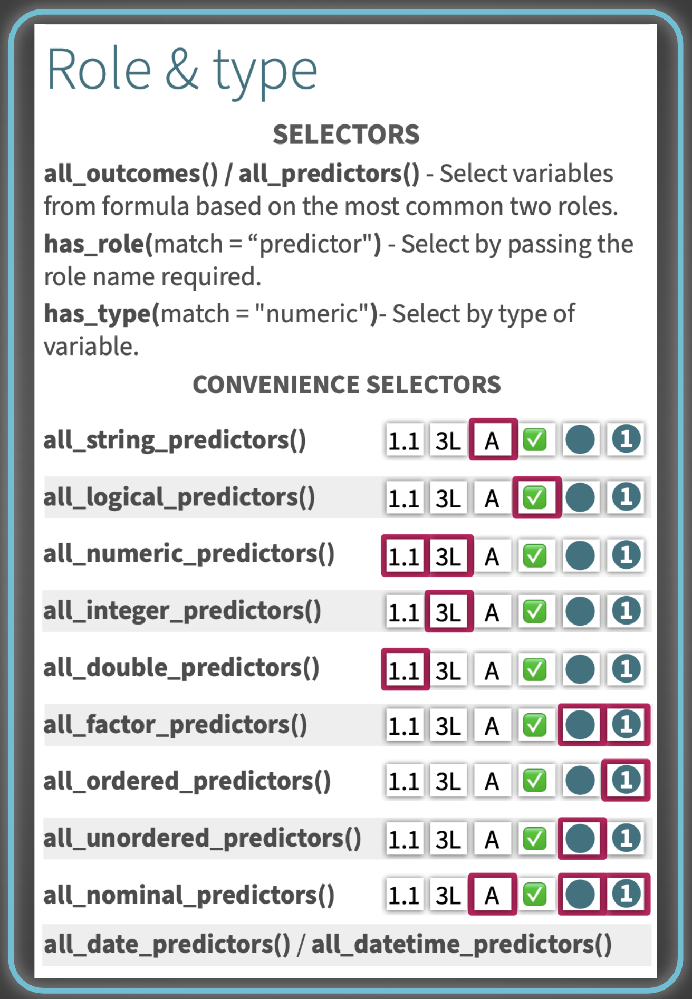
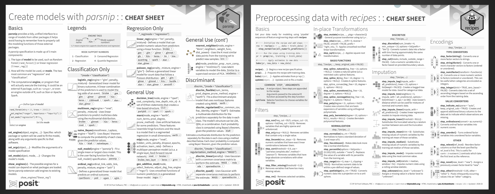

After almost 8 years, Tidymodels finally has its first cheatsheets, and not just one, but two! The [first one](/resources/cheatsheets/ml-preprocessing-data/), covering data preprocessing with `recipes`, was released a couple of months ago. Today, we are delighted to announce [a second cheatsheet](/resources/cheatsheets/ml-create-models/), this time focusing on modeling with `parsnip`.

In this post we'll walk through what each cheatsheet covers, starting with the newest one.

## Create Models with **parsnip**

The cheatsheet is organized into three main parts: an introduction to parsnip's basics, a catalog of all models available through the package, and a hands-on operations reference for fitting and inspecting models. The basics section introduces how parsnip provides a single, unified interface for defining and fitting models, regardless of the underlying package powering them.

### Model catalog

The largest section of the cheatsheet catalogs all models available through parsnip, grouped by use case:

- **Classification only:** models for binary and multiclass prediction. It also includes probability-based classification using Bayes' theorem and models for ordinal responses.
- **Regression only:** models for predicting continuous numeric outcomes, from standard linear regression to generalized linear models for count data.
- **General use:** a versatile mix of model types that work for both classification and regression, including decision trees, nearest neighbors, neural networks, and spline-based approaches.
- **Discriminant analysis:** models that estimate the distribution of predictors separately for each class and use Bayes' theorem to assign probabilities, available in linear, quadratic, flexible, and regularized variants.
- **Ensemble methods:** models that combine many individual learners into a stronger prediction, including random forests, gradient boosting, bagged trees, and Bayesian additive regression trees.
- **Support Vector Machines:** models that find an optimal boundary between classes, or fit a robust regression, using linear, polynomial, or radial kernel functions.
- **Feature rules:** models that extract simple, human-readable rules from tree ensembles and use them as the basis for prediction.
- **Survival models:** models for time-to-event data, covering both proportional hazards and fully parametric approaches.


One design choice in particular makes this section much easier to navigate: **pills**. Each model's compatible engines and supported modes are shown as small, visually distinct tags, so you can see at a glance which mode a given engine supports, without having to read through the description text. Each mode is encoded in the pill with a number: Classification (1), Regression (2), Censored Regression (3), and Quantile Regression (4). A legend mapping each number to its mode is available at the top of page one.

---



And true to the R cheatsheet tradition, individual models or groups of related models are paired with **small illustrations**, thoughtfully designed for visual impact to aid recall. Each one attempts to accurately represent the function or functions it accompanies, making them a genuine navigation aid rather than decoration, especially when you have a vague memory of "that tree-based ensemble that used Bayesian analysis" and need to scan quickly.

### Operations

The last section covers the practical workflow of fitting and using a model. Each function is paired with a **quick runnable example**, and the examples build on each other starting from the two lines of code right below the section title, making it easy to follow the full workflow from model specification to results.

## Preprocessing Data with **recipes**

After a quick Basics section covering the core workflow, the vast majority of the cheatsheet is dedicated to `step_*()` functions, the building blocks of any recipe, before finishing with role and type management.

### Step catalog

The steps are organized into groups based on what they do, each listed with its arguments and a short description:

- **Filters:** steps for removing variables that are sparse, zero-variance, linearly dependent, highly correlated, or missing too many values
- **In-place Transformations:** basis functions (splines, polynomials), discretization, and normalization steps
- **Imputation:** steps for filling in missing values, ranging from simple statistical substitution to model-based approaches
- **Encodings:** type converters (e.g. factor to string, numeric to factor), value converters, and other factor-handling steps
- **Dummy Variables:** one-hot and binary encoding, text pattern matching, and conversion helpers
- **Multivariate Transformations:** signal extraction (PCA, ICA, PLS, and friends) and centroid-based distance measures
- **Date & Time:** steps for converting date and datetime columns into usable numeric or factor features
- **Row operations:** sampling, shuffling, slicing, and removing rows with missing values
- **Other:** interaction terms, renaming, rolling window statistics, geographic distances, and ratios

As with the parsnip cheatsheet, each group of steps is paired with **small, thoughtfully designed illustrations** to help you visually locate a step family when scanning.

### Role & type


The last section focuses on the selection and management of variable roles and types within the recipe. The selection side covers ways to target variables by their role (outcome, predictor, or any custom role) as well as by their type (numeric, factor, logical, and so on), including a handy set of convenience selectors for the most common combinations. The management side shows how to add, update, and remove roles, showing you how to gain fine-grained control over how each variable participates in the recipe.

---



## Final Thoughts

A lot of care went into ensuring both cheatsheets hold up when printed, particularly in black and white. We know that many folks print cheatsheets to keep at their desk for quick reference, and we wanted to make sure they remain fully usable in that medium. That meant making sure font sizes and weights stay legible on paper, that the illustrations remain perceptible without color, and that contrast levels are strong enough that no text ends up too pale to read or too heavy to parse. Accessibility in print mattered to us just as much as clarity on screen.

