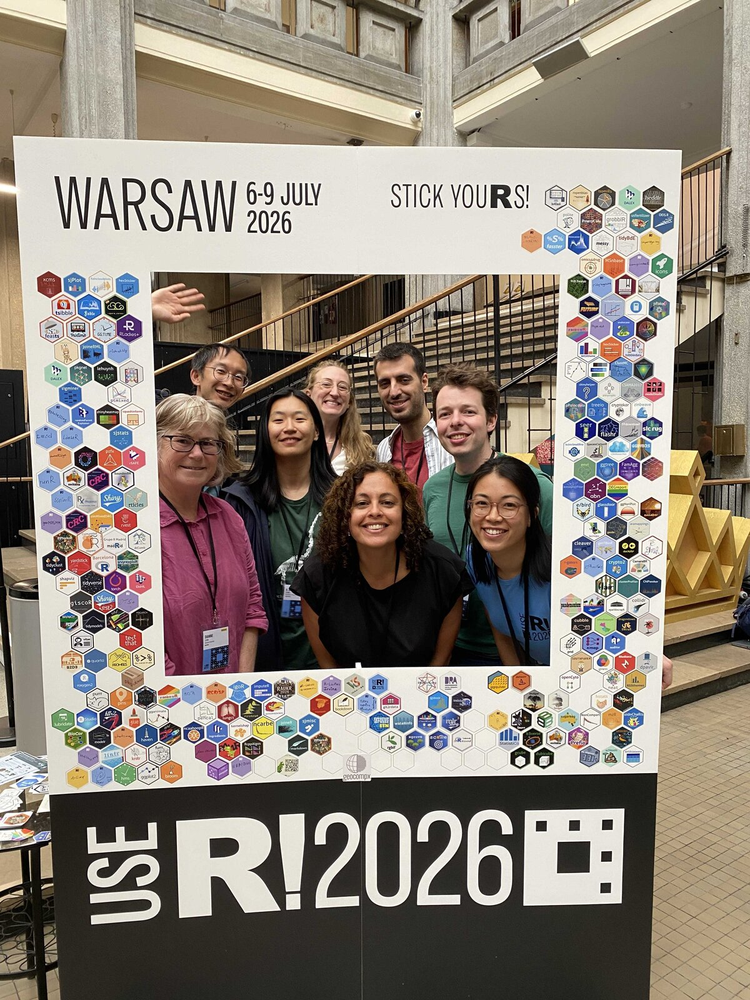

Although the title of this post starts with "CRDTs" (for maximal alliterative effect), it is in fact the other two (community and contributing back) which are way more important to me. Sometimes it takes a conference, a substantial chunk of time away from the desk, to step back and re-calibrate our perspectives: to really appreciate the sheer breadth of _good work_ taking place within the community.

And this community is ours. From joining my very first useR! online in 2022, through to Salzburg in 2024 - SatRdays London in between, the very first R Project Sprint in Warwick (UK) in 2023, the R Dev Days organized by Heather Turner and Ella Kaye since, and of course posit::conf(2024) Seattle and posit::conf(2025) Atlanta... I may not have been part of this community for the most number of years, but I've certainly appreciated its warmth and openness.

And so coming back to a European useR! was exciting.

## Distributing state: CRDTs for real-time collaboration

The R community knows how to distribute compute - my talks to date have mainly been centred around this: my creation {[mirai](https://mirai.r-lib.org/)} is an async framework that brings high-performance parallel and distributed computing to R. This lets you send tasks just as easily to a Slurm cluster as to processes on your own machine.

My talk this time was going to be about something different, but complementary: distributing state. A CRDT, or Conflict-free Replicated Data Type, is a data structure that facilitates collaboration by having a property called strong eventual consistency. Without going into the details, this allows it to always merge conflict-free, and is the technology behind many collaborative text editors. Automerge, a particular CRDT implementation, is what we're using in Quarto 2 to make it collaborative out-of-the-box.

In my talk, I showed a Shiny app in an R session editing a document on one of our Quarto collaborative sync servers. It used the {[automerge](https://posit-dev.github.io/automerge-r/)} and {[autosync](https://posit-dev.github.io/autosync/)} packages, which we created to let R manipulate these structures and sync them over the network - on a par with reference implementations in JavaScript and Rust. Automerge was created by Ink and Switch, an independent research lab for local-first software, and we're glad to provide a link between the two communities.

## Distributing compute: mirai and mori in the wild

Apart from talking a lot about CRDTs and the three killer features of Quarto 2 (orders of magnitude faster, collaborative editing built-in with live preview, editable in the preview and source views), I also got pulled aside by people in the hallways to talk about {[mirai](https://mirai.r-lib.org/)} and {[mori](https://shikokuchuo.net/mori/)}.

Some of these were people working in the life sciences industry, using these packages for serious scientific research and innovation. This has always been a sector that I've had immense respect for - from my earliest collaboration with Will Landau (Eli Lilly & Co.). Open source software is often regarded as 'high-leverage' in terms of how often and widely it's used, and when deployed in such high-impact settings, the end goals can be especially motivating.

It's been extremely gratifying to see that {[mirai](https://mirai.r-lib.org/)} has percolated throughout the community consciousness. Considering that I was only introducing the package at useR! 2024 in Salzburg, it was nice to be able to introduce _myself_ to people this time simply as "the author of mirai". By 2027, I'm hoping I'll be able to do the same with mori!

## The best part: the people

Given that only a few of my colleagues could make it to useR! this year, I was slightly apprehensive going in. This fear was dispelled at the very first reception event, where I met so many people from past R Dev Days, amongst them Tina Roszos, who simply beamed at me from across the room! R Core also turned out in force and it was nice to meet Peter Dalgaard and Robert Gentleman for the first time, as well as saying hello again to Luke Tierney, Uwe Ligges and everyone who came.

It's always great to catch up with familiar faces - Gergely Daróczi (maintainer of R's Weblate platform), members of the mlr group (Martin Binder, Marc Becker, Maximilian Mücke), and many others. However, many of my best conversations were with people I was meeting for the first time. For some, this was their first useR! despite being part of the R community for many years.

It was especially nice to be welcomed by entire groups of people, for example the [NUMBATs](https://numbat.space) headed by Prof. Dianne Cook, who was also the opening keynote speaker of the conference. I got to be an honorary NUMBAT for one photo:

## Contributing back: R Dev Day

R Dev Day followed the conference on the Friday. Thanks again to Heather Turner and Ella Kaye for tirelessly organising these. They are great opportunities to contribute back to R's source code itself. I do believe that these events have played an important role in fostering and sustaining our community.

I worked closely with Tymek (Tymoteusz Makowski) on two C-level I/O bugs. Tymek was the only person brave enough to tackle these. This proved to be a fruitful collaboration as we'd posted a patch by the end of the day ([PR #19101](https://bugs.r-project.org/show_bug.cgi?id=19101)). This patch has since been accepted into the R source, without modification! This has been the most productive I've been during a one-day event thus far.

Special thanks to Mitchell O'Hara-Wild for supplying the main blog photograph, which was taken at the Dev Day.

## Looking ahead

There are many people I've not mentioned by name - that's just to prevent this entire post from being a name-drop. I've enjoyed speaking to every one of you. There is so much talent out there, and I can't wait to catch up again to find out what you've all been working on!

See you next at [posit::conf(2026)](https://conf.posit.co/2026/) Houston!
