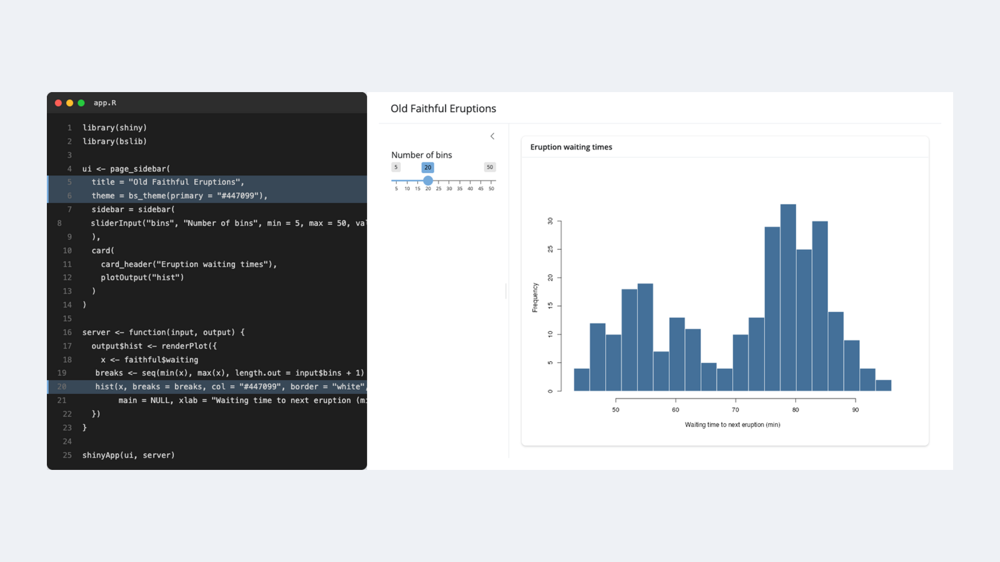
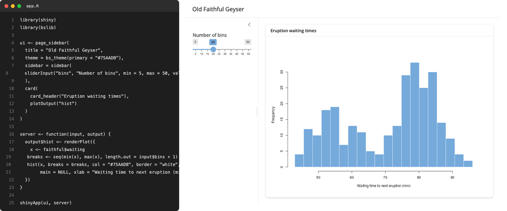

If you've ever saved a file in your Shiny app and watched the browser refresh on its own, you may have already used [watcher](https://watcher.r-lib.org) without knowing it.

watcher is a lightweight R package that watches files and directories for changes and reacts in the background. It shipped quietly last year as the engine behind Shiny's auto-reload, and until now that is mostly where it lived. watcher 0.2.0 is on CRAN, and we're taking this opportunity to introduce it as a general-purpose filesystem watcher for R developers to use.

Install it from CRAN:

```r
install.packages("watcher")
```

## The engine behind Shiny auto-reload



The inner loop of building a Shiny app is edit, save, switch to the browser, reload. Auto-reload removes the friction of the last two steps: you save, and the app reloads itself.

The easiest way to turn it on is Shiny's [Developer Mode](https://shiny.posit.co/r/reference/shiny/latest/devmode.html), which flips on a handful of developer-friendly options for the session – auto-reload among them, alongside unminified JavaScript and full stack traces. Call `devmode()` once and run your app as usual:

```r
shiny::devmode()
shiny::runApp("app.R")
```

Now every time you save a file in the app directory, the running app reloads to match:



*Editing `app.R` on the left; the app on the right reloads on each save. No manual refresh or restart.*

Under the hood, Developer Mode sets `shiny.autoreload = TRUE` (you can set that option directly if you'd rather not switch on the rest of Developer Mode), which hands your app directory to watcher and starts it watching in the background. The instant you save a file, watcher's callback fires and Shiny pushes a reload to the browser.

Previously Shiny did this by polling: every few hundred milliseconds it re-listed the directory and compared modification times. That works, but the cost scales with the size of your project and the reload only ever happens on the next tick. watcher instead subscribes to the operating system's own filesystem-change notifications, so the reload fires on the save itself, and an idle app does no work at all.

For version 0.2.0, we've simplified how the package installs from source. This means we can have it power auto-reload by default: the next release of Shiny will require watcher outright, so it's installed alongside Shiny with nothing to install by hand. (Shiny 1.14.0 uses watcher when it's present and falls back to polling otherwise – so for now it's worth installing watcher yourself).

## watcher, the package

This same machinery is available directly, outside of Shiny. `watcher()` returns an [R6](https://r6.r-lib.org) object that you can start and stop:

```r
library(watcher)

dir.create("data")

w <- watcher(
  path = "data",
  callback = \(paths) cat("changed:", paths, "\n"),
  latency = 0.5
)
w$start()
```

From now on, any change under `data/` calls your function back with the paths that changed:

```r
file.create("data/report.csv")
#> changed: /home/you/project/data/report.csv
```

Three arguments to `watcher()` cover most needs:

- **`path`** – a file, a directory (watched recursively), or a vector of paths. Defaults to the working directory.
- **`callback`** – a function taking one argument: a character vector of the paths that changed. The default, `NULL`, simply writes the changed paths to `stdout`.
- **`latency`** – seconds to debounce events before reporting them. Defaults to 1.

```r
w$stop()
```

The returned object also has `$stop()`, `$is_running()` and `$get_path()` alongside `$start()`.

watcher runs on a background thread, but your callback runs on R's main thread, scheduled through [later](https://later.r-lib.org). It fires when R is idle at the top level, whenever you call `later::run_now()`, or automatically inside an event loop such as Shiny's. This is what lets it slot easily into Shiny or plumber without blocking the session.


## Put it to work

watcher is deliberately small and general. Anything you want to happen when a file changes, you can wire to it:

- rebuild a report or re-render a document when its source or data changes
- reprocess a directory as new files land in it
- re-run tests or reload package code while you develop
- reload configuration without restarting a long-running service

The shape is always the same – give `watcher()` a path and a function:

```r
library(watcher)

rebuild <- function(paths) {
  message(format(Sys.time()), ": ", length(paths), " file(s) changed")
  # ... your render / test / reload step here ...
}

w <- watcher("data", rebuild, latency = 1)
w$start()
```

The callback receives the paths that changed, so you can act on exactly what triggered it. File created, updated, removed and renamed events are monitored, for individual files or whole directory trees.

From here:

- [watcher package site](https://watcher.r-lib.org) – reference and examples.
- [r-lib/watcher](https://github.com/r-lib/watcher) – source, issues, and feedback.
- For Shiny, enable Developer Mode with `shiny::devmode()` (or set `options(shiny.autoreload = TRUE)` directly).

## Acknowledgments

watcher builds on [libfswatch](https://github.com/emcrisostomo/fswatch) by Enrico M. Crisostomo and Alan Dipert. This is a mature C++ filesystem-monitoring library, which uses the native, event-driven notification API on each platform.

Thanks go to Garrick Aden-Buie for wiring watcher into Shiny's auto-reload, and to everyone who has contributed issues, fixes, and feedback.

Questions and ideas are very welcome on GitHub: [r-lib/watcher](https://github.com/r-lib/watcher/issues).
