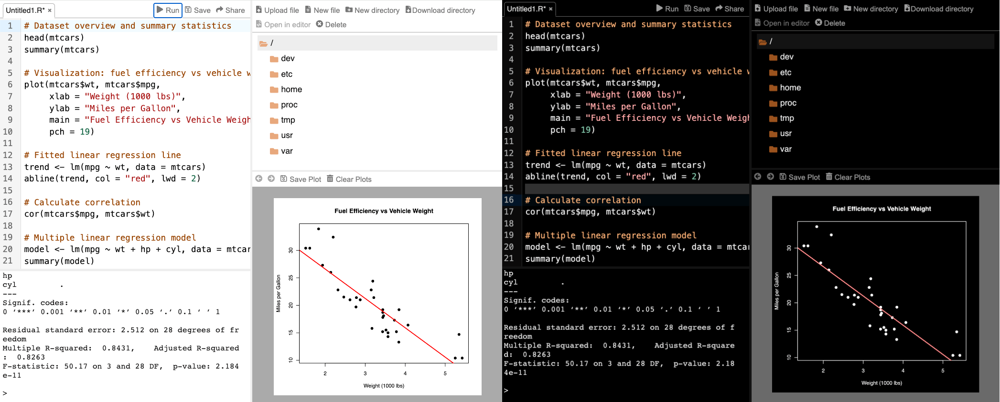

<link rel="stylesheet" href="https://cdnjs.cloudflare.com/ajax/libs/codemirror/6.65.7/codemirror.min.css">
<style>
  .webr-run-button {
    background-color: #F7F7F7;
    border: 1px solid #EEE;
    padding: 0.1em 0.5em;
    border-top-left-radius: 5px;
    border-top-right-radius: 5px;
    cursor: pointer;
    font-size: 0.9em;
  }
  .webr-run-button:hover {
    background-color: #EEE;
  }
  .webr-run-button:active {
    background-color: #DDD;
  }
  .webr-run-button:disabled {
    background-color: #DDD;
    cursor: not-allowed;
    transform: none;
  }
  .webr-code-output pre {
    margin-top: 0;
    border-top-left-radius: 0;
    border-top-right-radius: 0;
  }
</style>
<script src="https://cdnjs.cloudflare.com/ajax/libs/codemirror/6.65.7/codemirror.min.js"></script>
<script src="https://cdnjs.cloudflare.com/ajax/libs/codemirror/6.65.7/mode/r/r.js"></script>
<script type="module">
  import { WebR } from 'https://webr.r-wasm.org/latest/webr.mjs';
  globalThis.webRIndex = 0;
  globalThis.webREditorCode = [];
  globalThis.webR = new WebR();
  globalThis.webRPlotWidth = 640;
  globalThis.webRPlotHeight = 400;
  await globalThis.webR.init();
  await webR.evalRVoid("webr::shim_install()");
  await webR.evalRVoid("webr::global_prompt_install()", { withHandlers: false });
  globalThis.webRCodeShelter = await new globalThis.webR.Shelter();
  document.querySelectorAll(".webr-run-button").forEach((btn) => {
    btn.innerText = 'Run code';
    btn.disabled = false;
  });
</script>

We're delighted to announce the release of webR 0.6.0. WebR brings R to the web browser using WebAssembly, powering [Quarto Live](https://r-wasm.github.io/quarto-live/), [Shinylive](https://shinylive.io/r/examples/), and other interactive R experiences.

As a reminder of what webR can do, here is an interactive code editor running R in the browser. Try it out!

<script type="module">
 globalThis.webREditorCode.push(`model <- lm(body_mass ~ bill_len, penguins)
summary(model)

boxplot(
  penguins$body_mass ~ penguins$species,
  xlab = 'Species',
  ylab = 'Body Mass (g)',
  col = c('#06a', '#f80', '#085')
)`)
</script>
<div><button class="webr-run-button" disabled type="button">Loading webR...</button></div>
<div class="webr-editor"></div>
<div class="webr-code-output"><pre style="visibility: hidden"></pre></div>
<script type="module">
  const runButton = document.getElementsByClassName('webr-run-button')[globalThis.webRIndex];
  const editorDiv = document.getElementsByClassName('webr-editor')[globalThis.webRIndex];
  const outputDiv = document.getElementsByClassName('webr-code-output')[globalThis.webRIndex];
  const codeValue = globalThis.webREditorCode[globalThis.webRIndex];
  globalThis.webRIndex++;
  const editor = CodeMirror((elt) => {
    elt.style.border = '1px solid #eee';
    elt.style.height = 'auto';
    editorDiv.append(elt);
  },{
    value: codeValue,
    lineNumbers: true,
    mode: 'r',
    theme: 'light default',
    viewportMargin: Infinity,
  });
  runButton.onclick = async () => {
    runButton.disabled = true;
    let canvas = undefined;
    await webR.init();
    await webR.evalRVoid(`webr::canvas(width = ${globalThis.webRPlotWidth}, height = ${globalThis.webRPlotHeight})`);
    const result = await webRCodeShelter.captureR(editor.getValue(), {
      withAutoprint: true,
      captureStreams: true,
      captureConditions: false,
      captureGraphics: false,
      env: {},
    });
    try {
      await webR.evalRVoid("dev.off()");
      const out = result.output.filter(
        evt => evt.type == 'stdout' || evt.type == 'stderr'
      ).map((evt) => evt.data).join('\n');
      outputDiv.innerHTML = '';
      const pre = document.createElement("pre");
      if (/\S/.test(out)) {
        const code = document.createElement("code");
        code.innerText = out;
        pre.appendChild(code);
      } else {
        pre.style.visibility = 'hidden';
      }
      outputDiv.appendChild(pre);
      const msgs = await webR.flush();
      msgs.forEach(msg => {
        if (msg.type === 'canvas'){
          if (msg.data.event === 'canvasImage') {
            canvas.getContext('2d').drawImage(msg.data.image, 0, 0);
          } else if (msg.data.event === 'canvasNewPage') {
            canvas = document.createElement('canvas');
            canvas.setAttribute('width', 2 * globalThis.webRPlotWidth);
            canvas.setAttribute('height', 2 * globalThis.webRPlotHeight);
            canvas.style.width="640px";
            canvas.style.display="block";
            canvas.style.margin="auto";
            const p = document.createElement("p");
            p.appendChild(canvas);
            outputDiv.appendChild(p);
          }
        }
      });
    } finally {
      webRCodeShelter.purge();
      runButton.disabled = false;
    }
  }
</script>

It's been almost a year since I've written a blog post about webR, and so this post highlights some key features and improvements over the last few releases. For a full list of changes, see the recent [release notes on GitHub](https://github.com/r-wasm/webr/releases).

## Updates to R, Emscripten, and LLVM

We've updated the version of R on which webR is based to version 4.6.0, ensuring we have all the latest improvements and bug fixes from the R core team. For example, the new `%notin%` operator can now be used:

<script type="module">
 globalThis.webREditorCode.push("sessionInfo()[[1]]$version.string\n4 %notin% 1:10\n4 %notin% c(1, 2, 3)")
</script>
<div><button class="webr-run-button" disabled type="button">Loading webR...</button></div>
<div class="webr-editor"></div>
<div class="webr-code-output"><pre style="visibility: hidden"></pre></div>
<script type="module">
  const runButton = document.getElementsByClassName('webr-run-button')[globalThis.webRIndex];
  const editorDiv = document.getElementsByClassName('webr-editor')[globalThis.webRIndex];
  const outputDiv = document.getElementsByClassName('webr-code-output')[globalThis.webRIndex];
  const codeValue = globalThis.webREditorCode[globalThis.webRIndex];
  globalThis.webRIndex++;
  const editor = CodeMirror((elt) => {
    elt.style.border = '1px solid #eee';
    elt.style.height = 'auto';
    editorDiv.append(elt);
  },{
    value: codeValue,
    lineNumbers: true,
    mode: 'r',
    theme: 'light default',
    viewportMargin: Infinity,
  });
  runButton.onclick = async () => {
    runButton.disabled = true;
    let canvas = undefined;
    await webR.init();
    await webR.evalRVoid(`webr::canvas(width = ${globalThis.webRPlotWidth}, height = ${globalThis.webRPlotHeight})`);
    const result = await webRCodeShelter.captureR(editor.getValue(), {
      withAutoprint: true,
      captureStreams: true,
      captureConditions: false,
      captureGraphics: false,
      env: {},
    });
    try {
      await webR.evalRVoid("dev.off()");
      const out = result.output.filter(
        evt => evt.type == 'stdout' || evt.type == 'stderr'
      ).map((evt) => evt.data).join('\n');
      outputDiv.innerHTML = '';
      const pre = document.createElement("pre");
      if (/\S/.test(out)) {
        const code = document.createElement("code");
        code.innerText = out;
        pre.appendChild(code);
      } else {
        pre.style.visibility = 'hidden';
      }
      outputDiv.appendChild(pre);
      const msgs = await webR.flush();
      msgs.forEach(msg => {
        if (msg.type === 'canvas'){
          if (msg.data.event === 'canvasImage') {
            canvas.getContext('2d').drawImage(msg.data.image, 0, 0);
          } else if (msg.data.event === 'canvasNewPage') {
            canvas = document.createElement('canvas');
            canvas.setAttribute('width', 2 * globalThis.webRPlotWidth);
            canvas.setAttribute('height', 2 * globalThis.webRPlotHeight);
            canvas.style.width="640px";
            canvas.style.display="block";
            canvas.style.margin="auto";
            const p = document.createElement("p");
            p.appendChild(canvas);
            outputDiv.appendChild(p);
          }
        }
      });
    } finally {
      webRCodeShelter.purge();
      runButton.disabled = false;
    }
  }
</script>

Under the hood, we've also upgraded [Emscripten](https://emscripten.org) to version 5.0.7. Emscripten serves as the crucial layer between the web browser and R's source code, playing a role similar to an operating system. We've also updated the version of LLVM we use to compile Fortran sources to 21.1.8.

### Improvements to Fortran on WebAssembly

The R source code contains a surprising amount of Fortran code (the bulk of which written in F77-style), even today. For webR, we rely on a forked version of LLVM Flang with custom patches to add support for emitting WebAssembly. I won't go into the deep technical details here, but I have [written about it before](https://gws.phd/posts/fortran_wasm/) if you are interested.

For a long time, dynamic array operations introduced in more modern Fortran standards were not supported by our fork. This meant that some packages which use these Fortran features would not work in webR, crashing with a dense and largely unhelpful runtime error message:

``` fortran
program p
  integer :: a(5) = [1, 2, 3, 4, 5]
  print *, sum(a)
end program
```

    $ ./previous/flang -c arr.f90 -o arr.o
    $ emcc arr.o libFortranRuntime.a -o arr.js
    $ node arr.js
      fatal Fortran runtime error(...reduction-templates.h(90)): Internal error:
      RUNTIME_CHECK(TypeCode(CAT, KIND) == x.type() || ...) failed

However, thanks to a [hint originating from a community member](https://github.com/r-wasm/flang-wasm/issues/9), we've now added a workaround for the underlying compiler problem, and R packages which rely on these Fortran features should now work in webR without crashing:

    $ ./latest/flang -c arr.f90 -o arr.o
    $ emcc arr.o libFortranRuntime.a -o arr.js
    $ node arr.js
      15

## Additional system libraries

We've also added or updated the following system libraries compiled to WebAssembly, which are now available for use by R packages in webR:

- cacert.pem 2026-05-14
- fontconfig v2.15.0
- libpoppler v24.12.0
- libsodium v1.0.22
- libtiff v4.7.1
- libuv v1.44.2
- openssl v3.5.1

## Async/await in `webr::eval_js()`

One of the biggest issues when working with webR's JavaScript API is that we must block the worker thread running the WebAssembly R process. This is required to make sure we can wait and take input from the user, both at the top-level and in functions like `readline()` or `browser()`. Previously, this meant that only synchronous JavaScript code could be run from R via `webr::eval_js()`, and JavaScript features like `Promise`, `async` or `await` were not available.

By proxying the JavaScript code to the main thread, we've added support for running asynchronous JavaScript code in `webr::eval_js()`. You can now use `await = TRUE` to wait for a `Promise` to resolve before returning a value to R:

``` r
webr::eval_js("new Promise((res) => res(1729))")
```

    [1] 1729

Or equivalently, you can use `await` inside an `async` JavaScript function:

``` r
webr::eval_js(r"{
  (async () => {
    await new Promise(r => setTimeout(r, 500));
    return 87539319;
  })();
}", await = TRUE)
```

    [1] 87539319

## Using curl under WebAssembly

Using similar techniques, we have also added support for proxying WebSocket traffic via the main thread. This, combined with some [other work for libcurl in WebAssembly](https://jeroen.github.io/notes/webassembly-curl/), means we can now use the curl and httr2 R packages in webR.

<script type="module">
 globalThis.webREditorCode.push(`# Load the R package
library(httr2)

# Create a request
req <- request("https://r-project.org")
req`)
</script>
<div><button class="webr-run-button" disabled type="button">Loading webR...</button></div>
<div class="webr-editor"></div>
<div class="webr-code-output"><pre style="visibility: hidden"></pre></div>
<script type="module">
  const runButton = document.getElementsByClassName('webr-run-button')[globalThis.webRIndex];
  const editorDiv = document.getElementsByClassName('webr-editor')[globalThis.webRIndex];
  const outputDiv = document.getElementsByClassName('webr-code-output')[globalThis.webRIndex];
  const codeValue = globalThis.webREditorCode[globalThis.webRIndex];
  globalThis.webRIndex++;
  const editor = CodeMirror((elt) => {
    elt.style.border = '1px solid #eee';
    elt.style.height = 'auto';
    editorDiv.append(elt);
  },{
    value: codeValue,
    lineNumbers: true,
    mode: 'r',
    theme: 'light default',
    viewportMargin: Infinity,
  });
  runButton.onclick = async () => {
    runButton.disabled = true;
    let canvas = undefined;
    await webR.init();
    await webR.evalRVoid(`webr::canvas(width = ${globalThis.webRPlotWidth}, height = ${globalThis.webRPlotHeight})`);
    const result = await webRCodeShelter.captureR(editor.getValue(), {
      withAutoprint: true,
      captureStreams: true,
      captureConditions: false,
      captureGraphics: false,
      env: {},
    });
    try {
      await webR.evalRVoid("dev.off()");
      const out = result.output.filter(
        evt => evt.type == 'stdout' || evt.type == 'stderr'
      ).map((evt) => evt.data).join('\n');
      outputDiv.innerHTML = '';
      const pre = document.createElement("pre");
      if (/\S/.test(out)) {
        const code = document.createElement("code");
        code.innerText = out;
        pre.appendChild(code);
      } else {
        pre.style.visibility = 'hidden';
      }
      outputDiv.appendChild(pre);
      const msgs = await webR.flush();
      msgs.forEach(msg => {
        if (msg.type === 'canvas'){
          if (msg.data.event === 'canvasImage') {
            canvas.getContext('2d').drawImage(msg.data.image, 0, 0);
          } else if (msg.data.event === 'canvasNewPage') {
            canvas = document.createElement('canvas');
            canvas.setAttribute('width', 2 * globalThis.webRPlotWidth);
            canvas.setAttribute('height', 2 * globalThis.webRPlotHeight);
            canvas.style.width="640px";
            canvas.style.display="block";
            canvas.style.margin="auto";
            const p = document.createElement("p");
            p.appendChild(canvas);
            outputDiv.appendChild(p);
          }
        }
      });
    } finally {
      webRCodeShelter.purge();
      runButton.disabled = false;
    }
  }
</script>

Try out a [full example R script using httr2 in the webR app](https://webr.r-wasm.org/latest/#code=eJxdjzFuwkAQRfs9xQoaWwpeQYmiNGlTREipV4M9sU3s3c3MWAiJjhNwBzpukDr3IstipIhq%2Fteb%2FzVzPJwc9Hj%2BcNJKh9W8WJ0CSPNjGt%2Bj2eLaDoxk%2FvMKBH4vU%2F3modLSoF7pAOUX1KhaxwJdV4yes0kjQotJrrp2TUC7LPlcqal%2BJQRBDZrwe0AWFad%2Bnt1tigZeGkOzQH6DpRSe6lgVF675d6RPT326YMw8RSEDudbVqZeDd4zqKsZmG26pLOr8BvYvadOW3gk6sbILmD2w%2BJUMbCvkckR%2Fegdw2w%3D%3D).

## Dark mode for the webR app

Speaking of the webR app, if your system is set to dark mode the webR app will now automatically switch to a dark theme. This feature was contributed by an attendee of [Tidyverse Developer Day 2025](https://tidyverse.org/tags/tidyverse-dev-day/). Thanks, Kyle!

<figure>

<figcaption aria-hidden="true">The webR app in light and dark.</figcaption>
</figure>

## Acknowledgements

And, as always, a huge thank you to everyone else who has contributed to webR, either by submitting bug reports, contributing code, or just sharing feedback.

[@AABoyles](https://github.com/AABoyles), [@ai-petri](https://github.com/ai-petri), [@brendanhcullen](https://github.com/brendanhcullen), [@bryce-carson](https://github.com/bryce-carson), [@chizapoth](https://github.com/chizapoth), [@coatless](https://github.com/coatless), [@daniel-woodie](https://github.com/daniel-woodie), [@dipterix](https://github.com/dipterix), [@dusadrian](https://github.com/dusadrian), [@georgestagg](https://github.com/georgestagg), [@goebbe](https://github.com/goebbe), [@HenrikBengtsson](https://github.com/HenrikBengtsson), [@jeroen](https://github.com/jeroen), [@jgf5013](https://github.com/jgf5013), [@jmbo1190](https://github.com/jmbo1190), [@JosiahParry](https://github.com/JosiahParry), [@khusmann](https://github.com/khusmann), [@kyleGrealis](https://github.com/kyleGrealis), [@laderast](https://github.com/laderast), [@lpmi-13](https://github.com/lpmi-13), [@pepijn-devries](https://github.com/pepijn-devries), [@seanbirchall](https://github.com/seanbirchall), [@szcf-weiya](https://github.com/szcf-weiya), [@timelyportfolio](https://github.com/timelyportfolio), [@tulaydixon](https://github.com/tulaydixon), [@WardBrian](https://github.com/WardBrian), and [@WillemSleegers](https://github.com/WillemSleegers).
