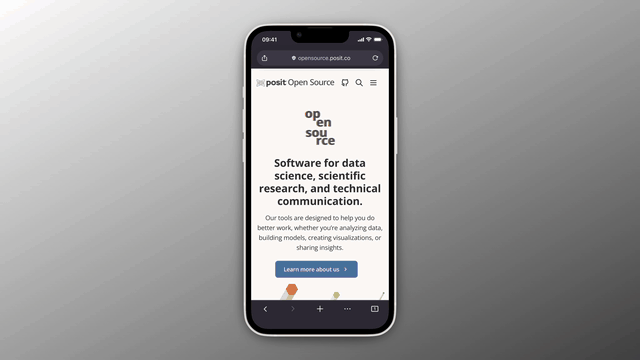
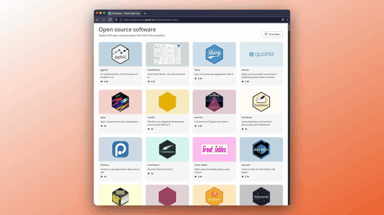

For over 15 years, Posit has been building wonderful open source software and content. Over the years, that wealth of knowledge expanded across hundreds of package sites, dozens of blogs, and multiple YouTube channels. While this rapid, creative growth was wonderful, it also created a practical problem: it became difficult for you to keep up with it all.

Today, we are changing that. I am very excited to announce the Posit Open Source website, [opensource.posit.co](http://opensource.posit.co). I am incredibly proud of the team that built it.

This new central hub connects you to our open source software, blog posts, videos, events, and cheatsheets. We built the site on three core principles: Curate, Connect, and Contribute.

## Curate

It starts with bringing our content together. [Charlotte Wickham](https://opensource.posit.co/people/charlotte-wickham/) took over 900 posts that were originally scattered across a dozen different blogs and moved them all into one single open source blog. We also gathered over 1,600 videos that were scattered across multiple YouTube channels. Now, you can find all of this content curated and easily accessible in one place.

## Connect

Our software remains front and center. Every package now gets its own profile featuring a short description, links to the repository, a list of contributors, and related resources.

We also made our video content more useful. With the help of Wes McKinney, we built a video transcription pipeline using [Whisper](https://openai.com/index/whisper/) and [Claude](https://claude.ai/). So far we have transcribed 1,600 videos, which is roughly 800 hours of footage. You can now click any text in the transcript to jump right to that exact moment in the video.

Connecting this ecosystem also requires a clear voice. [Isabella Velasquez](https://opensource.posit.co/people/isabella-vel%C3%A1squez/) writes the copy to ensure our story resonates with the community.

Furthermore, the content on the site is heavily interconnected. Events link to talks, talks link to people, and people link to software. These connections, combined with a site-wide search, help you navigate the ecosystem easily. [Greg Swinehart](https://opensource.posit.co/people/greg-swinehart/) led the design to ensure the entire experience is accessible and on-brand.

## Contribute

The new website is open source because we want the community to contribute. If you have any feedback or suggestions, please open an issue on our [GitHub repository](https://github.com/posit-dev/open-source-website).

Everyone who has contributed to Posit Open Source deserves a profile on the website. If you want to add or update your profile, we encourage you to submit a Pull Request.

Head over to [opensource.posit.co](http://opensource.posit.co) to explore the new site. I hope you like it.
