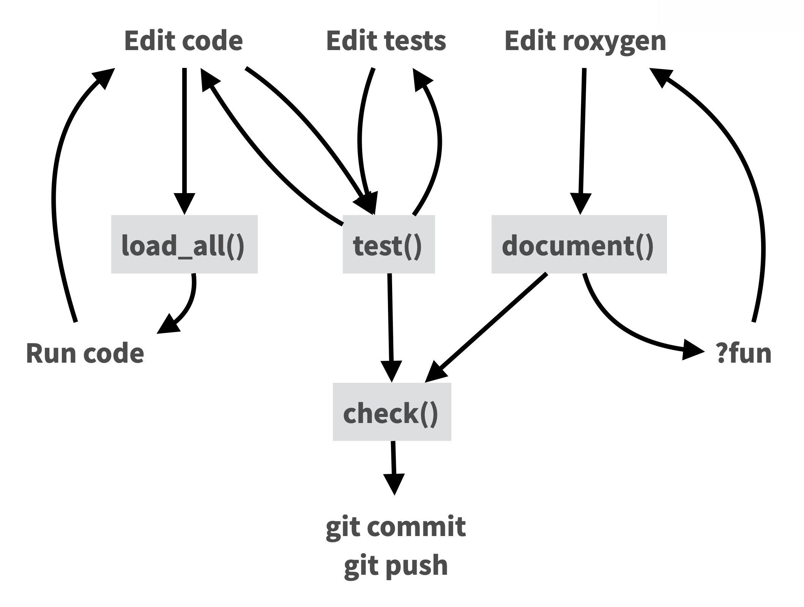
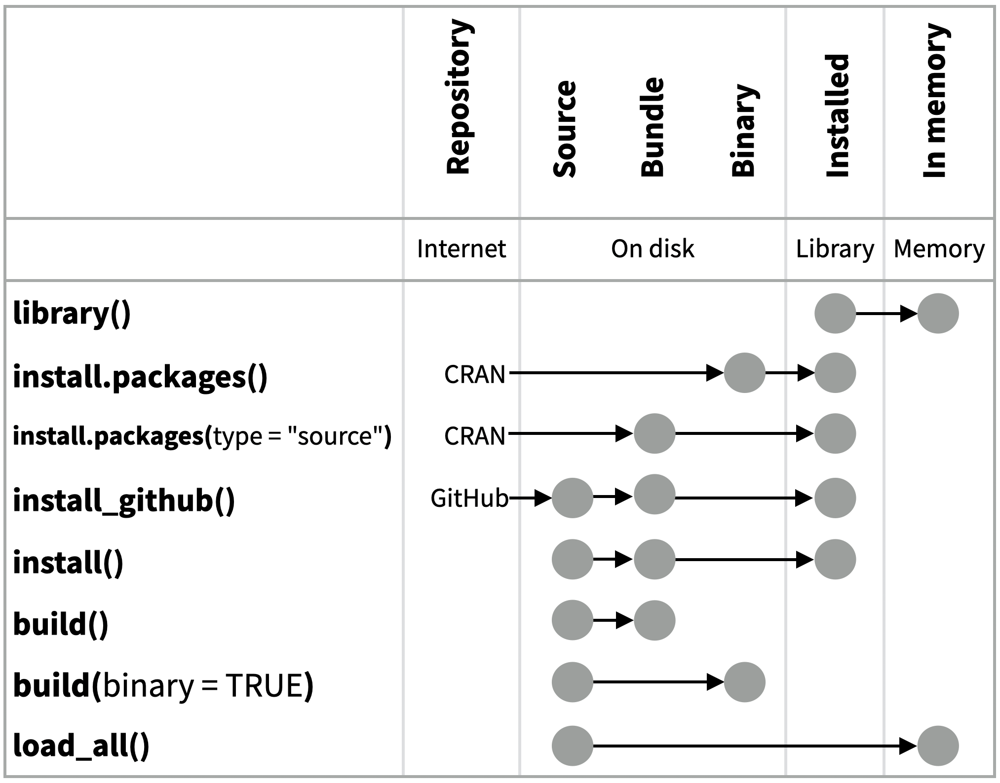

Visit [r-pkgs.org](https://r-pkgs.org) to learn more about writing and publishing packages for R.

```r
library(devtools)
library(testthat)
library(roxygen2)
```

## Package Structure

A package is a convention for organizing files into directories, and creates a shareable, installable collection of functions, sample data, and documentation.
This cheatsheet shows you how to work with the 7 most common parts of an R package:

-   R/: Write R code for your package
-   DESCRIPTION: Set up metadata and organize package functions
-   NAMESPACE
-   tests/: Verify your code is correct
-   man/
-   vignettes/: Document your code and write tutorials and how-tos
-   data/: Include data sets in your package

There are multiple packages useful to package development, including `usethis` which handily automates many of the more repetitive tasks.
Load and install `devtools` which wraps together several of these packages to access everything in one step.

## Getting Started

Once per machine:

-   Get set up with `use_devtools()` so devtools is always loaded in interactive R sessions.

    
    ```r
    if (interactive()) {
      require("devtools", quietly = TRUE)
      # automatically attaches usethis
    }
    ```

-   `create_github_token()`: Set up GitHub credentials.

-   `git_vaccinate()`: Ignores common special files.

Once per package:

-   `create_package()`: Create a project with package scaffolding.

-   `use_git()`: Activate git.

-   `use_github()`: Connect to GitHub.

-   `use_github_action()`: Set up automated package checks.

Having problems with git?
Get a situation report with `git_sitrep()`.

## Workflow

<div class="cell">
<div class="cell-output-display">
<p>

</p>
<details>
<summary>Long description of flowchart</summary>

<ol class="nested-counter-list">
  <li>Edit code
    <ol>
      <li>forward to load_all()</li>
      <li>forward to test()</li>
    </ol>
  <li>load_all()
    <ol>
      <li>forward to Run code</li>
    </ol>
  </li>
  <li>Run code
    <ol>
      <li>back to Edit code</li>
    </ol>
  </li>
  <li>Edit tests
    <ol>
      <li>forward to test()</li>
    </ol>
  </li>
  <li>test()
    <ol>
      <li>forward to check()</li>
      <li>back to Edit tests</li>
      <li>back to Edit code</li>
    </ol>
  </li>
  <li>Edit roxygen
    <ol>
      <li>forward to document()</li>
    </ol>
  </li>
  <li>document()
    <ol>
      <li>forward to check()</li>
      <li>forward to "?fun"</li>
    </ol>
  </li>
  <li>?fun
    <ol>
      <li>back to Edit roxygen</li>
    </ol>
  </li>
  <li>check()
    <ol>
      <li>forward to git commit & git push</li>
    </ol>
  </li>
  <li>git commit</li>
  <li>git push</li>
</ol>

</details>
</div>
</div>

### Key steps in the workflow (with keyboard shortcuts)

-   **`load_all()`** (Ctrl/Cmd + Shift + L): Load code
-   **`test()`** (Ctrl/Cmd + Shift + T): Run tests
-   **`document()`** (Ctrl/Cmd + Shift + D): Rebuild docs and NAMESPACE
-   **`check()`** (Ctrl/Cmd + Shift + E): Check complete package

## R/

All of the R code in your package goes in `R/`.
A package with just an `R/` directory is still a very useful package.

-   Create a new package project with `create_package("path/to/name")`.

-   Create R files with `use_r("file-name")`.

-   Follow the tidyverse style guide at [style.tidyverse.org](https://style.tidyverse.org "Tidyverse style guide")

-   Automatically format your code with `use_air()`, which configures your project to use [Air](https://posit-dev.github.io/air/), a fast R code formatter.

-   Put your cursor on a function and press `F2` to go to its definition

-   Find a function or file with the keyboard shortcut `Ctrl+.`

## DESCRIPTION

The DESCRIPTION file describes your package, sets up how your package will work with other packages, and applies a license.

-   Pick a license with `use_mit_license()`, `use_gpl3_license()`, `use_proprietary_license()`.

-   Add packages that you need with `use_package()`.

**Import** packages that your package requires to work.
R will install them when it installs your package.
Add with `use_package(pkgname, type = "imports")`

**Suggest** packages that developers of your package need.
Users can install or not, as they like.
Add with `use_package(pkgname, type = "suggests")`

## NAMESPACE

The `NAMESPACE` file helps you make your packages self-contained: it won't interfere with other packages, and other packages won't interfere with it.

-   Export functions for users by placing `@export` in their roxygen comments.

-   Use objects from other packages with `package::object` or `@importFrom package object` (recommended) or `@import package` (use with caution).

-   Call `document()` to generate `NAMESPACE` and `load_all()` to reload.

| DESCRIPTION                  | NAMESPACE                       |
|------------------------------|---------------------------------|
| Makes **packages** available | Makes **functions** available   |
| Mandatory                    | Optional (can use `::` instead) |
| `use_package()`              | `use_import_from()`             |

: Table comparing features/purpose of DESCRIPTION (left column) vs NAMESPACE (right column)

<!-- Page 2 -->

## man/

The documentation will become the help pages in your package.

-   Document each function with a roxygen block above its definition in R/.
    In RStudio, **Code \> Insert Roxygen Skeleton** (Keyboard shortcut: Mac `Shift+Option+Cmd+R`, Windows/Linux `Shift+Alt+Ctrl+R`) helps.

-   Document each data set with an roxygen block above the name of the data set in quotes.

-   Document the package with `use_package_doc()`.

-   Build documentation in man/ from Roxygen blocks with `document()`.

### roxygen2

The **roxygen2** package lets you write documentation inline in your .R files with shorthand syntax.

-   Add roxygen documentation as comments beginning with `#'`.

-   Place an roxygen `@` tag (right) after `#'` to supply a specific section of documentation.

-   Untagged paragraphs will be used to generate a title, description, and details section (in that order).

```r
#' Add together two numbers
#'
#' @param x A number.
#' @param y A number.
#' @returns The sum of `x` and `y`
#' @export
#' @examples
#' add(1, 1)
add <- function(x, y) {
  x + y
}
```

#### Common roxygen Tags:

-   `@examples`
-   `@export`
-   `@param`
-   `@returns`

Also:

-   `@description`
-   `@examplesif`
-   `@family`
-   `@inheritParams`
-   `@rdname`
-   `@seealso`

## vignettes/

-   Create a vignette that is included with your package with `use_vignette()`.
-   Create an article that only appears on the website with `use_article()`.
-   Write the body of your vignettes in R Markdown or include a `.qmd` extension in the name (e.g. `use_vignette("intro.qmd")`) to write it in Quarto instead.

## Websites with pkgdown

-   Use GitHub and `use_pkgdown_github_pages()` to set up pkgdown and configure an automated workflow using GitHub Actions and Pages.
-   If you're not using GitHub, call `use_pkgdown()` to configure pkgdown. Then build locally with `pkgdown::build_site()`.

## README.Rmd + NEWS.md

-   Create a README and NEWS markdown files with `use_readme_rmd()` and `use_news_md()`.

## tests/

-   Create a test file with `use_test()`.
-   Write tests with `test_that()` and `expect_()`.
-   Run all tests with `test()` and run tests for current file with `test_active_file()`.
-   See coverage of all files with `test_coverage()` and see coverage of current file with `test_coverage_active_file()`.

| Expect statement    | Tests                                  |
|---------------------|----------------------------------------|
| `expect_equal()`    | Is equal? (within numerical tolerance) |
| `expect_error()`    | Throws specified error?                |
| `expect_snapshot()` | Output is unchanged?                   |

: Table of expect functions and what each one tests

```r
test_that("Math works", {
  expect_equal(1 + 1, 2)
  expect_equal(1 + 2, 3)
  expect_equal(1 + 3, 4)
})
```

## data/

-   Record how a data set was prepared as an R script and save that script to `data-raw/` with `use_data_raw()`.
-   Save a prepared data object to `data/` with `use_data()`.

## Package States

The contents of a package can be stored on disk as a:

-   **source** - a directory with sub-directories (as shown in Package Structure)
-   **bundle** - a single compressed file (.tar.gz)
-   **binary** - a single compressed file optimized for a specific OS

Packages exist in those states locally or remotely, e.g. on CRAN or on GitHub.

From those states, a package can be installed into an R **library** and then loaded into **memory** for use during an R session.

{fig-alt='A diagram describing the functions that move a package between different states. The description below describes this in detail.
' width=1013}

<!-- this description does the job of the diagram for screen readers -->

Use the functions below to move between these states:

-   `library()`: Installed in Library to loaded in Memory.
-   `install.packages()`: Binary from CRAN repository to installed in Library.
-   `install.packages(type = "source")`: Source code from CRAN repository to Bundle, to installed in Library.
-   `pak::pak("owner/repo")`: Source code from GitHub (or other remotes) repository to bundle to installed in Library.
-   `install()`: Local source code to bundle to installed in Library.
-   `build()`: Local source to Bundle.
-   `build(binary = TRUE)`: Local source to Binary.
-   `load_all()`: Local source to loaded in Memory.

------------------------------------------------------------------------

CC BY SA Posit Software, PBC • [info\@posit.co](mailto:info@posit.co) • [posit.co](https://posit.co)

Learn more at [r-pkgs.org](https://r-pkgs.org).

Updated: 2026-08.

```r
packageVersion("devtools")
```

```
[1] '2.5.2'
```

```r
packageVersion("usethis")
```

```
[1] '3.2.1'
```

```r
packageVersion("testthat")
```

```
[1] '3.3.2'
```

```r
packageVersion("roxygen2")
```

```
[1] '8.0.0'
```

------------------------------------------------------------------------
