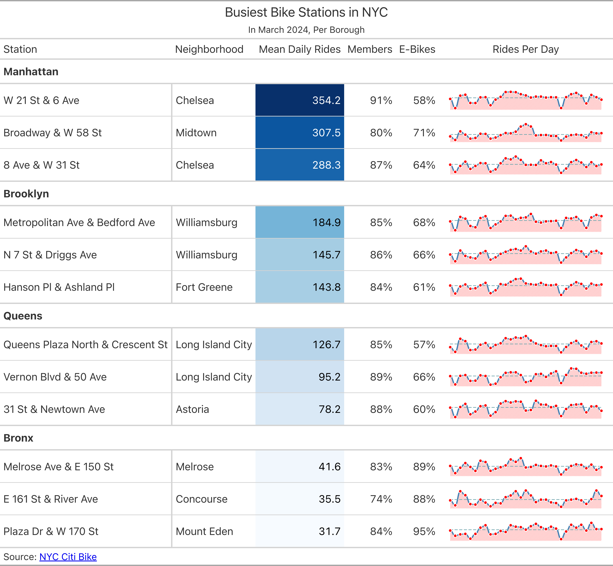
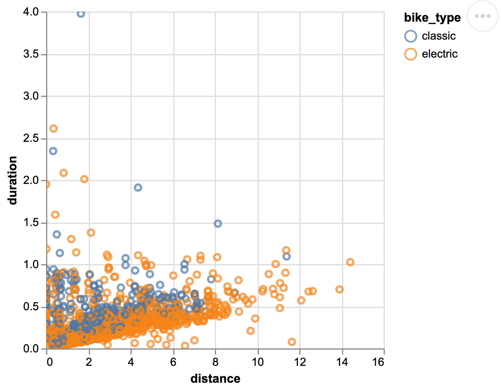
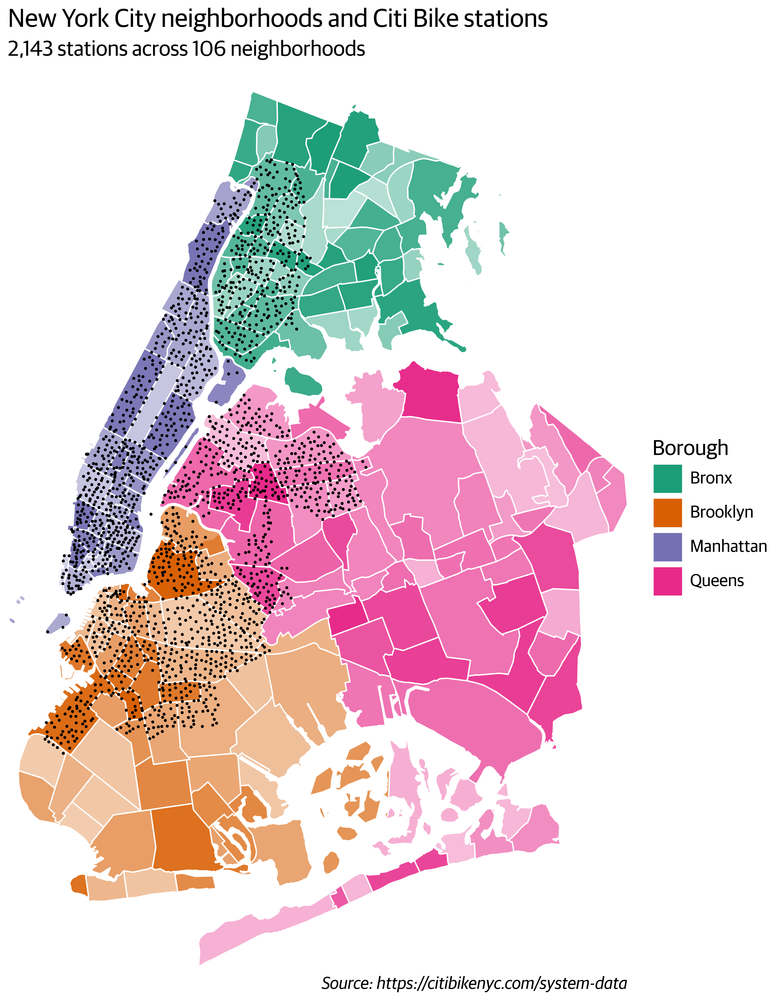
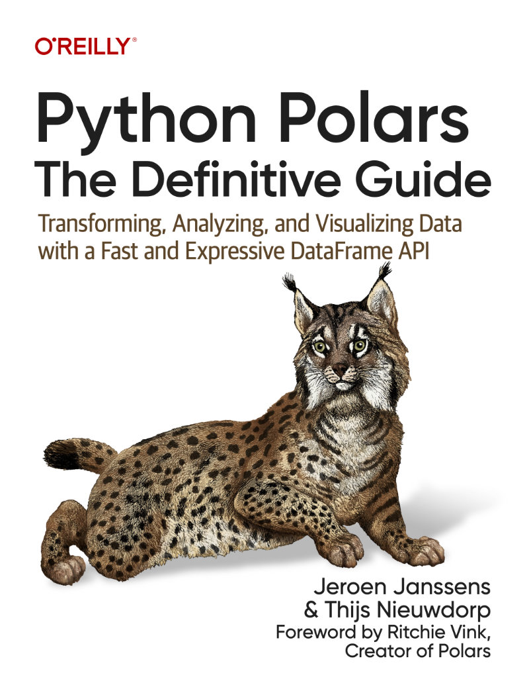

[Polars](https://pola.rs) is a library for transforming, analyzing, and visualizing data with a fast
and expressive DataFrame API.
It was first released by Ritchie Vink in 2020.

Install Polars with all of its optional dependencies from the terminal:

```bash
uv pip install "polars[all]"
```

Import Polars in Python, and confirm which versions of Polars and its
dependencies you have installed:

```python
import polars as pl

pl.show_versions()
```

Polars queries typically read data, transform it, and write the result back out.
A complete query is often a single chain of method calls:

```python
fruit = pl.read_csv("fruit.csv")

fruit.filter(
    (pl.col("weight") > 1000) & pl.col("is_round")
).write_parquet("fruit.parquet")
```

Throughout this cheatsheet, `df` is a `DataFrame`, `lf` is a `LazyFrame`, `o` is a
second DataFrame to combine with `df`, and `e` stands for any expression.
So `e.abs()` means "call `.abs()` on an expression", as in `pl.col("x").abs()`.

## Data Structures

Polars stores all of its data in either a Series or a DataFrame.

| Structure | Description |
|-----------|-------------|
| `Series` | One-dimensional. Holds a sequence of values of the same data type. |
| `DataFrame` | Two-dimensional. Has rows and columns. One or more Series, all of the same length. |
| `LazyFrame` | Resembles a DataFrame but holds no data. A blueprint for generating a DataFrame. |

Unlike pandas, Polars DataFrames do not have a row index, and the API favors
immutability and method chaining over in-place modifications.

-   Create a Series by passing a name and a sequence of values:

    ```python
    series = pl.Series("sales", [150.00, 300.00, 250.00])
    ```

-   Create a DataFrame from a dictionary of columns, where each value is a Series
    or a plain Python sequence.
    You can also use any of the `pl.read_*()` functions to create one from a file:

    ```python
    df = pl.DataFrame({
        "sales": series,
        "id": [41, 42, 43]
    })
    ```

-   Because there is no row index, add one explicitly as a column when you need it:

    ```python
    df.with_row_index("id")
    ```

-   Turn a DataFrame into a LazyFrame.
    Alternatively, start from a LazyFrame directly with any of the `pl.scan_*()`
    functions:

    ```python
    lf = df.lazy()
    ```

## Eager and Lazy APIs

The eager API executes immediately, whereas the lazy API builds an optimized query
plan first.
The optimizer automatically applies predicate pushdown (filtering as early as
possible) and projection pushdown (dropping columns that are never used).

You move between the two representations with `.lazy()` and `.collect()`: `.lazy()`
turns a DataFrame into a LazyFrame, and `.collect()` executes a LazyFrame and gives
you a DataFrame back.

-   Turn a DataFrame into a LazyFrame, and execute a LazyFrame to get a DataFrame:

    ```python
    lf = df.lazy()
    df = lf.collect()
    ```

-   Use the streaming engine to process data out-of-core, so that datasets larger
    than memory can still be handled:

    ```python
    lf.collect(engine="streaming")
    ```

-   Print the optimized query plan as text, or visualize it as a graph, to see what
    the optimizer decided to do:

    ```python
    lf.explain()
    lf.show_graph()
    ```

-   Execute the query and return per-node timings, which tells you where the time
    actually goes:

    ```python
    lf.profile()
    ```

## Data Types

Polars implements most of the Apache Arrow memory specification, which is an
efficient columnar format for flat and hierarchical data.

| Group | Type | Notes |
|-------|------|-------|
| | `DataType` | Base class |
| Numeric | `Decimal` | 128 bits, precision, scale |
| | `Float32` | Ranges ±3.4×10³⁸ |
| | `Float64` | Ranges ±1.8×10³⁰⁸ |
| | `Int8` | Ranges ±128 |
| | `Int16` | Ranges ±32,768 |
| | `Int32` | Ranges ±2.1×10⁹ |
| | `Int64` | Ranges ±9.2×10¹⁸ |
| | `UInt8` | Ranges 0–255 |
| | `UInt16` | Ranges 0–65,535 |
| | `UInt32` | Ranges 0–4.3×10⁹ |
| | `UInt64` | Ranges 0–1.8×10¹⁹ |
| Temporal | `Date` | Days since Unix epoch |
| | `Datetime` | Microseconds since epoch |
| | `Duration` | Time duration / delta |
| | `Time` | Time of day |
| Nested | `Array` | Fixed-length sequence |
| | `List` | Variable-length sequence |
| | `Struct` | Multiple fields with names |
| String | `String` | UTF-8 text, variable length |
| | `Categorical` | Dict of Strings |
| | `Enum` | Fixed dict of Strings |
| Other | `Boolean` | True / False |
| | `Binary` | Raw bytes |
| | `Null` | Represents Null / None |

### Inspecting Types

-   Get a dictionary of column names and data types, or just the list of data types:

    ```python
    df.schema
    df.dtypes
    ```

-   Print one row per column, including data types, which is useful for wide
    DataFrames where printing the DataFrame itself is unreadable:

    ```python
    df.glimpse()
    ```

-   Compute per-column summary statistics, including the number of nulls:

    ```python
    df.describe()
    ```

-   Report the in-memory size of the DataFrame in the unit you ask for:

    ```python
    df.estimated_size("mb")
    ```

### Casting

-   Cast a column to another data type.
    By default the cast is strict, so a value that does not fit raises an error:

    ```python
    df.select(pl.col("id").cast(pl.UInt64))
    ```

-   Pass `strict=False` to cast without raising.
    Values that overflow the target type become nulls instead:

    ```python
    df.select(pl.col("id").cast(pl.Int8, strict=False))
    ```

## Reading and Writing Data

Polars has four families of input and output functions, and which one you want
depends on whether you are working eagerly or lazily:

-   `read_*()` reads data into a DataFrame.
-   `scan_*()` creates a LazyFrame, deferring the actual reading until you collect.
-   `write_*()` writes a DataFrame to disk or to cloud storage.
-   `sink_*()` streams data to disk or to cloud storage without holding it all in
    memory.

Not every format supports all four operations:

| Format | `read` | `scan` | `write` | `sink` |
|--------|:------:|:------:|:-------:|:------:|
| Avro | ✓ | | ✓ | |
| Clipboard | ✓ | | ✓ | |
| CSV | ✓ | ✓ | ✓ | ✓ |
| Database | ✓ | | ✓ | |
| Delta Lake | ✓ | ✓ | ✓ | ✓ |
| Excel / ODS | ✓ | | ✓ | |
| Iceberg | | ✓ | ✓ | ✓ |
| IPC / Feather | ✓ | ✓ | ✓ | ✓ |
| JSON | ✓ | | ✓ | |
| NDJSON | ✓ | ✓ | ✓ | ✓ |
| Parquet | ✓ | ✓ | ✓ | ✓ |
| PyArrow Dataset | | ✓ | | |

Keyword arguments that many of these functions accept include
`schema_overrides`, `n_rows`, `row_index_name`, `storage_options`, and
`compression`.

-   Scan files in cloud storage by passing a URI with a glob pattern, and use
    `storage_options` to supply credentials and region settings:

    ```python
    pl.scan_parquet(
        "s3://bucket/*.parquet",
        storage_options={"aws_region": "us-east-2"}
    )
    ```

-   Stream a query straight to a partitioned Parquet dataset, writing one directory
    per distinct value of the key column:

    ```python
    lf.sink_parquet(pl.PartitionBy("out/", key="x"))
    ```

## Transforming Data

### Selecting Columns

Keep columns based on their name, data type, or position.

-   Select columns by name:

    ```python
    df.select("a", "b")
    ```

-   Select the result of an expression, so that you can transform columns on their
    way out:

    ```python
    df.select(pl.col("x") * 2)
    ```

-   Give the result of an expression a name by using a keyword argument, which
    produces a new column:

    ```python
    df.select(doubled=pl.col("x") * 2)
    ```

-   Select columns whose names match a regular expression.
    The pattern must start with `^` and end with `$`:

    ```python
    df.select(pl.col("^.*_color$"))
    ```

-   Select every column:

    ```python
    df.select(pl.all())
    ```

Use column selectors for more flexibility.
They can be combined using the set operators `|`, `&`, `-`, `^`, and `~`.

-   Import the selectors module, then select columns by data type or by name
    pattern.
    See also `cs.string()`, `cs.contains()`, and `cs.first()`:

    ```python
    import polars.selectors as cs

    df.select(cs.numeric())
    df.select(cs.starts_with("val"))
    ```

-   Drop columns instead of keeping them.
    Pass `strict=False` so that names which do not exist are ignored rather than
    raising an error:

    ```python
    df.drop("a", "y", strict=False)
    ```

### Creating Columns

New columns are added to the right of the existing ones.

-   Add a new column computed from an expression, naming it with a keyword
    argument:

    ```python
    df.with_columns(new=pl.col("a") + 1)
    ```

-   Replace an existing column by producing an expression with the same name.
    Here, nulls in column `a` are replaced with zeros:

    ```python
    df.with_columns(pl.col("a").fill_null(0))
    ```

-   Add a column with the same literal value in every row:

    ```python
    df.with_columns(ones=pl.lit(1))
    ```

-   Add a column of row indices.
    Use `offset` to start counting somewhere other than zero:

    ```python
    df.with_row_index(name="id", offset=1)
    ```

### Filtering Rows

Keep rows according to the values in one or more columns or expressions.

-   Filter on an existing boolean column by passing its name:

    ```python
    df.filter("valid")
    ```

-   Filter with a single expression:

    ```python
    df.filter(pl.col("x") > 5)
    ```

-   Pass multiple expressions to combine them with a logical AND.
    You can also write the AND explicitly with `&`, in which case each comparison
    needs its own parentheses:

    ```python
    df.filter(pl.col("valid"), pl.col("x") > 5)
    df.filter(pl.col("valid") & (pl.col("x") > 5))
    ```

-   Use `|` for a logical OR:

    ```python
    df.filter(pl.col("valid") | (pl.col("x") > 5))
    ```

-   Filter with keyword-argument constraints, which is shorthand for testing
    equality and combining the results with AND:

    ```python
    df.filter(valid=True, x=5)
    ```

-   Keep only rows without any missing values, or restrict the check to specific
    columns:

    ```python
    df.drop_nulls()
    df.drop_nulls("x")
    ```

-   Remove duplicate rows.
    Use `subset` to decide which columns define a duplicate, and `keep` to choose
    which of the duplicates survives:

    ```python
    df.unique(subset=["x"], keep="first")
    ```

### Slicing and Sampling Rows

Keep rows based on their position.

-   Keep the first rows, or the last rows.
    Both default to five:

    ```python
    df.head()
    df.tail(10)
    ```

-   Keep a contiguous slice by giving an offset and a length.
    This keeps the third row through the seventh:

    ```python
    df.slice(2, 5)
    ```

-   Keep every *n*th row:

    ```python
    df.gather_every(2)
    ```

-   Take a random sample of rows.
    Use `with_replacement=True` to allow the same row to be drawn more than once,
    or `fraction` to sample a proportion instead of a fixed number:

    ```python
    df.sample(10)
    df.sample(10, with_replacement=True)
    df.sample(fraction=0.2)
    ```

### Sorting Rows

Reorder rows according to the values in one or more columns or expressions.

-   Sort by a single column, ascending by default, or by multiple columns in
    sequence:

    ```python
    df.sort("x")
    df.sort("x", "y")
    ```

-   Move nulls to the end rather than the beginning:

    ```python
    df.sort("x", nulls_last=True)
    ```

-   Reverse the order.
    When sorting by several columns, pass a list of booleans to set the direction
    per column:

    ```python
    df.sort("x", descending=True)
    df.sort("x", "y", descending=[False, True])
    ```

-   Sort by the result of an expression rather than by a column, such as a computed
    ratio or the length of a list:

    ```python
    df.sort(pl.col("x") / pl.col("y"))
    df.sort(pl.col("l").list.len())
    ```

-   Keep only the *k* largest or smallest rows according to a column, which is
    cheaper than sorting everything and then slicing:

    ```python
    df.top_k(5, by="score")
    df.bottom_k(5, by="score")
    ```

### Reshaping

Go from wide to long and back again.

-   Make a DataFrame longer by turning the values of one or more columns into rows,
    keeping `index` columns as identifiers:

    ```python
    df.unpivot(on=["c"], index="id")
    ```

-   Make a DataFrame wider by turning the values of a column into new columns.
    If the combination of `on` and `index` is not unique, supply an
    `aggregate_function` to decide how to combine the collisions:

    ```python
    df.pivot(on="c", index="id", values="x")
    df.pivot(on="c", index="id", values="x", aggregate_function="sum")
    ```

-   Expand a list column so that each element gets its own row, repeating the other
    columns:

    ```python
    df.explode("l")
    ```

-   Expand a struct column so that each field becomes its own column:

    ```python
    df.unnest("s")
    ```

-   Swap rows and columns.
    Use `include_header=True` to keep the original column names as a column:

    ```python
    df.transpose(include_header=True)
    ```

-   Split a DataFrame into a list of smaller DataFrames, one per distinct value of
    the given column:

    ```python
    df.partition_by("group")
    ```

### Summarizing and Aggregating

Split. Apply. Combine.

-   Split a DataFrame into groups by one or more columns.
    This gives you a `GroupBy` object that you then aggregate:

    ```python
    dfg = df.group_by("x")
    dfg = df.group_by("x", "y")
    ```

-   Apply a ready-made summary to every group.
    Count the rows per group, take the first rows of each group, or compute the
    mean of every column per group:

    ```python
    dfg.len()
    dfg.head(2)
    dfg.mean()
    ```

-   Apply your own function to each group when no built-in aggregation fits:

    ```python
    dfg.map_groups(...)
    ```

-   Use `agg()` for full control over the aggregation.
    Passing an expression without an aggregating method collects the values into a
    list, and naming the result with a keyword argument gives the new column a
    sensible name:

    ```python
    dfg.agg(...)
    dfg.agg(pl.col("y"))
    dfg.agg(avg=pl.col("y").mean())
    ```

-   Use a window expression with `over()` to add an aggregation as a new column on
    the original DataFrame, without collapsing the rows:

    ```python
    df.with_columns(avg=pl.col("y").mean().over("x"))
    ```

-   Group by a time value or an index instead of by a category.
    `group_by_dynamic()` creates windows of a fixed duration, and `group_by` adds
    a regular grouping on top:

    ```python
    df.group_by_dynamic("timestamp", every="1h", group_by="store")
    ```

-   Use `rolling()` for a window that moves with every row rather than in fixed
    steps.
    This computes a seven-day rolling sum of sales per store:

    ```python
    df.rolling(index_column="date", period="7d", group_by="store").agg(
        pl.col("sales").sum()
    )
    ```

-   Create the rows that are missing from a regular time series, so that every
    interval is represented:

    ```python
    df.upsample(
        time_column="date", every="1d", group_by="store", maintain_order=True
    )
    ```

-   Aggregate across columns rather than down them.
    The horizontal functions combine several columns within each row:

    ```python
    df.select(pl.sum_horizontal(cs.numeric()))
    df.select(pl.any_horizontal(cs.boolean()))
    ```

### Joining and Concatenating

Combine multiple DataFrames into one.

-   Join two DataFrames on a shared key.
    The default is an inner join, which keeps only the rows that match on both
    sides:

    ```python
    df.join(o, on="key")
    ```

-   Use `how` to choose a different join strategy.
    A left join keeps every row of `df`:

    ```python
    df.join(o, on="key", how="left")
    ```

-   When the key has a different name in each DataFrame, name both sides
    explicitly:

    ```python
    df.join(o, left_on="a", right_on="b")
    ```

-   A full outer join keeps all rows from both sides.
    Add `coalesce=True` to merge the two key columns into one:

    ```python
    df.join(o, on="key", how="full", coalesce=True)
    ```

-   Filtering joins return columns from `df` only, and use `o` purely as a filter.
    A semi join keeps the rows of `df` that have a match, and an anti join keeps
    the rows that do not:

    ```python
    df.join(o, on="key", how="semi")
    df.join(o, on="key", how="anti")
    ```

-   A cross join produces the Cartesian product of both DataFrames and therefore
    needs no key:

    ```python
    df.join(o, how="cross")
    ```

-   Join on the nearest match rather than an exact one, which is the usual way to
    line up two time series.
    Use `by` to match exactly on some columns first:

    ```python
    df.join_asof(o, on="ts", by="i")
    ```

-   Join on an arbitrary predicate for inequality or other non-equi joins:

    ```python
    df.join_where(o, pl.col("a") >= pl.col("b"))
    ```

Common keyword arguments for `df.join()` are `left_on`, `right_on`, `coalesce`,
`join_nulls`, `suffix`, and `validate`, where `validate` accepts `"m:m"`, `"m:1"`,
`"1:m"`, and `"1:1"`.

-   Stack DataFrames on top of each other, which requires matching columns:

    ```python
    pl.concat([df, o])
    ```

-   Place DataFrames side by side instead, or take the union of their columns and
    fill in the gaps with nulls:

    ```python
    pl.concat([df, o], how="horizontal")
    pl.concat([df, o], how="diagonal")
    ```

-   Use a relaxed strategy to coerce mismatched data types instead of raising an
    error:

    ```python
    pl.concat([df, o], how="vertical_relaxed")
    ```

-   Update the values in `df` with the non-null values from another DataFrame,
    matching rows on a key:

    ```python
    df.update(o, on="id", how="left")
    ```

## Expressions

> **Definition of an expression**
>
> An expression is a tree of operations that describe how to construct one or more
> Series.
>
> -   **Series**: Same-type array; column or standalone
> -   **Tree of operations**: Single, linear, or branched
> -   **Describe**: Passive recipe; needs function to execute
> -   **Construct**: Output may be internal, not a new column
> -   **One or more**: One expression can make multiple Series

### Beginning Expressions

Every expression starts from a column, from all columns, or from a literal value.

-   Build an expression based on an existing column, on all columns, or on a
    literal value.
    Note that `pl.col("*")` and `pl.all()` are equivalent:

    ```python
    pl.col("name")
    pl.col("*")
    pl.all()
    pl.lit("ok")
    ```

-   Generate a range of integers, where the stop value is exclusive.
    This produces `[0, 1, 2, 3, 4]`:

    ```python
    pl.arange(0, 5)
    ```

-   Generate a range of dates.
    The singular form produces one range, while the plural form produces a column
    of ranges, one per row.
    Integers, times, and datetimes have their own `*_range()` and `*_ranges()`
    functions:

    ```python
    pl.date_range(...)
    pl.date_ranges(...)
    ```

### Combining Expressions with Arithmetic

You can perform arithmetic with both expressions and plain Python values.
Every operator has an equivalent method, which is handy when you prefer to keep a
chain of method calls unbroken.

| Operator | Method | Description |
|----------|--------|-------------|
| `+` | `e.add(...)` | Addition |
| `-` | `e.sub(...)` | Subtraction |
| `*` | `e.mul(...)` | Multiplication |
| `/` | `e.truediv(...)` | Division |
| `//` | `e.floordiv(...)` | Floor division |
| `**` | `e.pow(...)` | Power |
| `%` | `e.mod(...)` | Modulus |
| N/A | `e.dot(...)` | Dot product |

### Combining Expressions by Comparing

Unlike in Python, you cannot chain multiple comparisons.
Write `(pl.col("x") > 0) & (pl.col("x") < 10)` rather than `0 < pl.col("x") < 10`.

| Operator | Method | Description |
|----------|--------|-------------|
| `<` | `e.lt(...)` | Less than |
| `<=` | `e.le(...)` | Less than or equal to |
| `==` | `e.eq(...)` | Equal |
| `>=` | `e.ge(...)` | Greater than or equal to |
| `>` | `e.gt(...)` | Greater than |
| `!=` | `e.ne(...)` | Not equal |

### Combining Expressions with Boolean Logic

Note that `and`, `or`, and `not` are reserved keywords in Python, hence the
underscores in the method names.

| Operator | Method | Description |
|----------|--------|-------------|
| `&` | `e.and_(...)` | Logical AND |
| `\|` | `e.or_(...)` | Logical OR |
| `~` | `e.not_()` | Logical NOT |
| `^` | `e.xor(...)` | Logical XOR |

### Conditional Expression

Chain `when()` and `then()` to build a conditional expression, and close it with
`otherwise()`.
Conditions are evaluated in order and the first match wins, so put the most
specific condition first:

```python
df.with_columns(
    pl.when(pl.col("age") < 18).then(pl.lit("minor"))
      .when(pl.col("age") < 65).then(pl.lit("adult"))
      .otherwise(pl.lit("senior"))
      .alias("group")
)
```

### Math, Trigonometry, and Rounding

-   `e.abs()`, `e.sign()`, `e.exp()`: absolute value, sign, and exponential.
-   `e.cbrt()`, `e.sqrt()`: cube root and square root.
-   `e.log(...)`, `e.log10()`, `e.log1p()`: logarithms.
-   `e.cos()`, `e.sin()`, `e.tan()`: trigonometric functions.
-   `e.cosh()`, `e.sinh()`, `e.tanh()`: hyperbolic functions.
-   `e.arccos()`, `e.arcsin()`, `e.arctan()`: inverse trigonometric functions.
-   `e.arccosh()`, `e.arcsinh()`, `e.arctanh()`: inverse hyperbolic functions.
-   `e.degrees()`, `e.radians()`: convert between radians and degrees.
-   `e.ceil()`, `e.floor()`, `e.round(...)`: rounding.
-   `e.clip(...)`, `e.cut(...)`, `e.qcut(...)`: clip values to a range, or bin them
    into intervals of your choosing or into quantiles.

### Missing Values and Shapes

In Polars, `null` means missing, whereas `NaN` is a float that results from
undefined math such as `0 / 0`.
The two are handled by separate methods.

-   `e.fill_nan(...)`, `e.fill_null(...)`: fill missing values.
-   `e.is_finite()`, `e.is_infinite()`: check for finite and infinite values.
-   `e.is_nan()`, `e.is_not_nan()`: check for NaN.
-   `e.is_null()`, `e.is_not_null()`: check for null.
-   `e.drop_nans()`, `e.drop_nulls()`: drop missing values.
-   `e.flatten()`, `e.reshape(...)`: reshape a list or column.
-   `e.explode()`, `e.implode()`: turn a list into rows, or gather rows into a list.

### Shifts, Cumulative, and Rolling

-   `e.backward_fill(...)`, `e.forward_fill(...)`: fill nulls from the next or the
    previous value.
-   `e.interpolate(...)`, `e.shift(...)`: interpolate between known values, or move
    values up or down.
-   `e.cum_count(...)`, `e.cum_sum(...)`: cumulative count and sum.
-   `e.cum_max(...)`, `e.cum_min(...)`: cumulative maximum and minimum.
-   `e.diff(...)`, `e.pct_change(...)`: difference and percentage change between
    rows.
-   `e.ewm_mean(...)`, `e.ewm_std(...)`, `e.ewm_var(...)`: exponentially weighted
    moving statistics.
-   `e.rolling_max(...)`, `e.rolling_min(...)`: rolling maximum and minimum.
-   `e.rolling_mean(...)`, `e.rolling_median(...)`: rolling mean and median.
-   `e.rolling_std(...)`, `e.rolling_var(...)`: rolling standard deviation and
    variance.
-   `e.rolling_map(...)`: apply your own function over a rolling window.

### Sorting, Ranking, and Boolean

-   `e.sort(...)`, `e.sort_by(...)`: sort a column by its own values, or by the
    values of other columns.
-   `e.arg_sort(...)`: return the row indices that would sort the column.
-   `e.shuffle(...)`, `e.reverse()`: shuffle values randomly, or reverse their
    order.
-   `e.rank(...)`: assign ranks to the data.
-   `e.is_duplicated()`, `e.is_unique()`: mark which values are duplicated and
    which are unique.
-   `e.is_first_distinct()`, `e.is_last_distinct()`: mark the first or the last
    occurrence of each distinct value.

### Summaries and Statistics

-   `e.all(...)`, `e.any(...)`: true if all or any of the values are true.
-   `e.max()`, `e.min()`, `e.mean()`: maximum, minimum, and mean.
-   `e.nan_max()`, `e.nan_min()`: maximum and minimum that propagate NaN.
-   `e.median()`, `e.std()`, `e.var(...)`: median, standard deviation, and variance.
-   `e.entropy(...)`, `e.kurtosis(...)`, `e.skew(...)`: distribution statistics.
-   `e.product()`, `e.quantile(...)`, `e.sum()`: product, quantile, and sum.
-   `e.arg_max()`, `e.arg_min()`: index of the maximum and minimum value.
-   `e.first()`, `e.last()`, `e.get(...)`: get a value by position.
-   `e.mode()`: the most frequently occurring values.

### Counting, Unique, and Selection

-   `e.len()`: count all rows, including nulls.
-   `e.count()`: count only the non-null values.
-   `e.null_count()`: count the null values.
-   `e.n_unique()`, `e.approx_n_unique()`: number of unique values, exactly or
    approximately.
-   `e.arg_unique()`, `e.unique(...)`: indices of the unique values, or the unique
    values themselves.
-   `e.unique_counts()`, `e.value_counts(...)`: how often each unique value occurs.
-   `e.head(...)`, `e.tail(...)`, `e.limit(...)`: select rows from the start or the
    end.
-   `e.bottom_k(...)`, `e.top_k(...)`: the *k* smallest or largest values.
-   `e.gather(...)`, `e.gather_every(...)`: take values by index, or take every
    *n*th value.
-   `e.sample(...)`, `e.slice(...)`: sample or slice within an expression.
-   `e.arg_true()`: the indices where the value is true.
-   `e.replace(...)`: replace values using a dictionary.
-   `e.search_sorted(...)`: find the insertion index in a sorted column.

### Arrays and Lists

Arrays have a fixed length; lists do not.
Array methods live under the `arr` namespace and list methods under `list`.

-   Cast a column to an array of a fixed length, then use the array namespace:

    ```python
    e.cast(pl.Array(pl.Int8, 3))
    e.arr.max()
    e.arr.sort()
    ```

-   Combine several columns into a single list column:

    ```python
    pl.list("a", "b")
    ```

-   Work with the contents of a list column: get the length of each list, get an
    element by index, sort the elements within each list, join them into a single
    string, or test whether a value is present:

    ```python
    e.list.len()
    e.list.get(0)
    e.list.sort()
    e.list.join("-")
    e.list.contains(5)
    ```

### Categoricals and Enums

Categoricals infer their categories from the data and sort lexically, whereas Enums
are fixed up front and sort in declaration order.

-   Cast a String column to a Categorical, or to an Enum with an exact set of
    allowed values:

    ```python
    e.cast(pl.Categorical)
    e.cast(pl.Enum(["Good", "Bad"]))
    ```

-   Retrieve the categories that a Categorical column ended up with:

    ```python
    e.cat.get_categories()
    ```

### Dates, Datetimes, Times, and Durations

Dates track days, whereas Datetimes track microseconds.
Methods for working with them live under the `dt` namespace.

-   Construct a Date, a Datetime, or a Duration from their components:

    ```python
    pl.date(2026, 12, 31)
    pl.datetime(2026, 6, 30, 23, 59, 0)
    pl.duration(days=1)
    ```

-   Extract a single component, such as the month:

    ```python
    e.dt.month()
    ```

-   Replace individual time units, leaving the rest untouched:

    ```python
    e.dt.replace(...)
    ```

-   Format a datetime as a string using a format specification:

    ```python
    e.dt.strftime(...)
    ```

-   Convert a datetime to another time zone:

    ```python
    e.dt.convert_time_zone("UTC")
    ```

-   Express a duration as a number of seconds:

    ```python
    e.dt.total_seconds()
    ```

### Strings

Strings are UTF-8, so lengths and slices count characters, not bytes.
String methods live under the `str` namespace.

-   `e.str.contains(...)`: check whether each value matches a regular expression.
-   `e.str.split(...)`: split each value by a separator into a list.
-   `e.str.to_uppercase()`: make each value all-caps.
-   `e.str.to_datetime()`: parse each value into a Datetime.
-   `e.str.extract(r"(\d+)")`: extract the first regular expression capture group.
-   `e.str.strip_chars(...)`: trim whitespace, or other characters you specify, from
    both ends.

### Structs

A struct groups multiple columns into a single row element.
Struct methods live under the `struct` namespace.

-   Combine columns into a Struct, then extract a single field back out:

    ```python
    pl.struct("a", "b")
    e.struct.field(...)
    ```

-   Rename the fields of a Struct, or add and adjust fields:

    ```python
    e.struct.rename_fields(...)
    e.struct.with_fields(...)
    ```

### Binaries

Use the `bin` namespace for raw byte data and for base64 and hexadecimal
conversions.

-   Decode a base64 string, or encode bytes as a hexadecimal string:

    ```python
    e.bin.base64_decode()
    e.bin.hex_encode()
    ```

### Output Names

Control the final column names of your expressions with the `name` namespace.

-   Add a prefix to the existing name, or lowercase it:

    ```python
    e.name.prefix(...)
    e.name.to_lowercase()
    ```

### Meta

Introspection methods, primarily used when writing plugins, live under the `meta`
namespace.

-   `e.meta.output_name()`: get the name the expression will output.
-   `e.meta.is_regex()`: check whether the expression is a regular expression.
-   `e.meta.has_multiple_outputs()`: check whether the expression produces multiple
    outputs.

## Styling Data

Use [Great Tables](https://posit-dev.github.io/great-tables/) to turn a DataFrame
into a presentation-ready table.
Start from `GT(df)` and chain the methods that set up the stub and header, format
the values, and add color:

```python
from great_tables import GT

(
    GT(df)
    .tab_stub(rowname_col="...")
    .cols_label(...)
    .tab_header(title="...")
    .fmt_number(...)
    .fmt_nanoplot(...)
    .data_color(columns="...", palette="...")
)
```



## Visualizing Data

The built-in plotting methods use Altair under the hood, and are available from the
`plot` namespace:

```python
df.plot.scatter(x="...", y="...", color="...")
```



Many other packages can work with Polars DataFrames directly, including
[Plotnine](https://plotnine.org/), Plotly, hvPlot, Seaborn, and Matplotlib.
For anything that cannot, convert to pandas first with `df.to_pandas()`.

```python
from plotnine import *

ggplot(df, aes(x="", y="", color="")) + geom_point()
```



## Polars Cloud

Execute a query on a cluster of instances in your own environment.
Describe the compute you want with a `ComputeContext`, then run a LazyFrame
remotely against it:

```python
import polars_cloud as pc

ctx = pc.ComputeContext(
    workspace="workspace_name",
    cpus=4,
    memory=16,
    cluster_size=32
)

lf.remote(ctx).execute().await_result()
```

## Book

<a href="https://polarsguide.com" style="float: right; margin-left: 1.5rem; margin-bottom: 1rem; margin-top: 0;"></a>
This cheatsheet is based on the book *Python Polars: The Definitive Guide* by
Jeroen Janssens and Thijs Nieuwdorp, published by O'Reilly.
The book is available in both print and ebook formats at your favorite bookstore.
Visit [polarsguide.com](https://polarsguide.com) for details.
