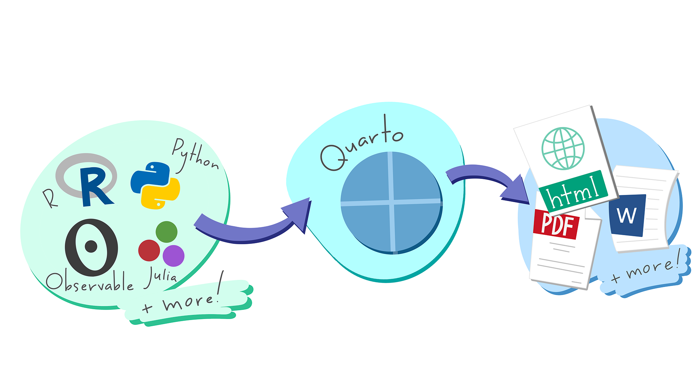
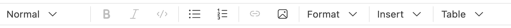
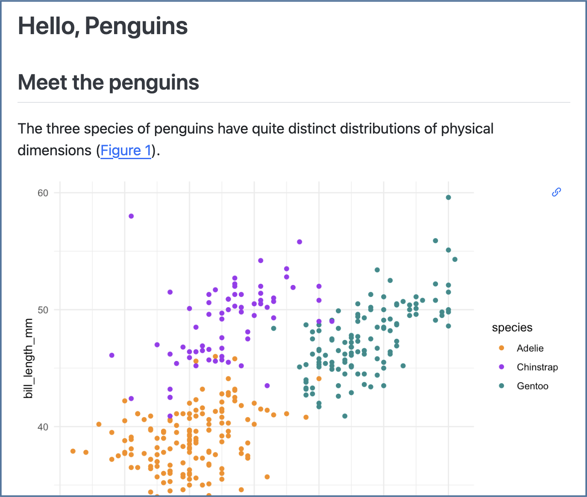

<br><br>

## Overview

[^1]

[^1]: Artwork from "Hello, Quarto" keynote by Julia Lowndes and Mine Çetinkaya-Rundel, presented at RStudio Conference 2022. Illustrated by [Allison Horst](https://allisonhorst.com/allison-horst).

- **Author**: Write and code in plain text. Author documents as .qmd files, or Jupyter notebooks. Write in a rich Markdown syntax.

- **Render**: Generate documents, presentations and more. Produce HTML, PDF, MS Word, reveal.js, MS Powerpoint, Beamer, websites, blogs, books...

- **Share**: Share your work with the world. Quickly deploy to Posit Connect Cloud, GitHub Pages, Netlify, or Posit Connect.

### Get Quarto

Get Quarto from: <https://quarto.org/docs/download/>

Or, use version **bundled with [RStudio](https://posit.co/products/open-source/rstudio/) or [Positron](https://positron.posit.co).**

### Get Started

<https://quarto.org/docs/get-started>

## Author

### Source File: hello.qmd

````markdown
---
title: "Hello, Penguins"
format: html
execute:
  echo: false
---

## Meet the penguins

The `penguins` data contains size measurements for
penguins from three islands in the Palmer Archipelago,
Antarctica.

The three species of penguins have quite distinct
distributions of physical dimensions (@fig-penguins).

```{{r}}
#| label: fig-penguins
#| fig-cap: "Dimensions of penguins across three species."
#| warning: false
library(tidyverse, quietly = TRUE)
library(palmerpenguins)
penguins |>
  ggplot(aes(x = flipper_length_mm, y = bill_length_mm)) +
  geom_point(aes(color = species)) +
  scale_color_manual(
    values = c("darkorange", "purple", "cyan4")) +
  theme_minimal()
```
````

### Highlights in the source file

- Set format(s) and options. Use YAML Syntax.

  ```markdown
  ---
  title: "Hello, Penguins"
  format: html
  execute:
    echo: false
  ---
  ```

- `## Write with **Markdown**`

  **RStudio**: Help \> Markdown Quick Reference

  RStudio, Positron and VS Code: Use the **Visual Editor**

  ```markdown
  ## Meet the penguins

  The `penguins` data contains size measurements for
  penguins from three islands in the Palmer Archipelago,
  Antarctica.

  The three species of penguins have quite distinct
  distributions of physical dimensions (@fig-penguins).
  ```

- Include code. R, Python, Julia, Observable, or any language with a Jupyter kernel.

  ````markdown
  ```{{r}}
  #| label: fig-penguins
  #| fig-cap: "Dimensions of penguins across three species."
  #| warning: false
  library(tidyverse, quietly = TRUE)
  library(palmerpenguins)
  penguins |>
    ggplot(aes(x = flipper_length_mm, y = bill_length_mm)) +
    geom_point(aes(color = species)) +
    scale_color_manual(
      values = c("darkorange", "purple", "cyan4")) +
    theme_minimal()
  ```
  ````

### Use a tool with a rich authoring experience

[RStudio](https://posit.co/products/open-source/rstudio/),\
[Positron](https://positron.posit.co) with bundled [Quarto extension](https://open-vsx.org/extension/quarto/quarto), or\
[Visual Studio Code](https://code.visualstudio.com/) + [Quarto extension](https://marketplace.visualstudio.com/items?itemName=quarto.quarto)

- **Run** code cells as you write

- **Render** with a button or keyboard shortcut

- Edit Quarto documents with a **Visual Editor**

  

  - Apply formatting in Visual Editor. Saved as Markdown in source.

  - Insert elements like code cells, cross references, and more.

### Or any text editor

Quarto documents (.qmd) can be edited in any tool that edits text.

## Render

**Save,** then render to **preview** the document output.

```bash {filename="Terminal"}
quarto preview hello.qmd
```

RStudio: Use **Render** button 

Positron and VS Code: Use **Preview** button 

The resulting HTML/PDF/MS Word/etc. document will be created and saved in the same directory as the source .qmd file.

### Rendered output: hello.html



### Highlights in the rendered output

- Features for scientific publishing. Cross references, citations, equations, and more.

- Output integrated into document. Control how output appears with special comments in your code.

### Behind the Scenes

When you render a document, Quarto:

1.  Runs the code and embeds results and text into an .md file with:
    - **Knitr**, if any `{r}` cells, or
    - **Jupyter**, if any other cells.
2.  Converts the .md file into the output format with Pandoc.

## Publish

```bash {filename="Terminal"}
quarto publish {venue} hello.qmd
```

`{venue}`: posit-connect-cloud, connect, 
gh-pages, netlify, confluence

- [**Posit Connect Cloud**](https://connect.posit.cloud/) Free publishing service for Quarto content.

- [**Posit Connect**](https://posit.co/products/enterprise/connect/) Org-hosted, control access, schedule updates.\

RStudio: Use **Publish** button \
Positron and VS Code: Use [Posit Publisher extension](https://open-vsx.org/extension/posit/publisher).

## Quarto Projects

### Create websites, books and more

A directory of Quarto documents + a configuration file (`_quarto.yml`)

See examples at: <https://quarto.org/docs/gallery/>

Get started from the command line:

```bash {filename="Terminal"}
quarto create project {type}
```

`{type}`: default, website, blog, book, confluence, manuscript

RStudio: Use **File** \> **New Project**\
Positron and VS Code: Use **Quarto: Create Project** command

## Include Code

### Code Cells

Code cells start with ```` ```{language} ````, and end with ```` ``` ````.

RStudio, Positron & VS Code: Use **Insert Code Chunk/Cell**.

```r
#| label: chunk-id
```

```python
#| label: chunk-id
```

Other languages: `{julia}`, `{ojs}`

Add code cell options with `#|` comments.

Cell options control [**execution**](#execution), [figures](#figures), [tables](#tables), layout and more. See them all at: <https://quarto.org/docs/reference/cells/>

### Execution Options {#execution}

<table>
<tr>
<th>

Option

</th>
<th>

Default

</th>
<th>

Effects

</th>
</tr>
<tr>
<td>

`echo`

</td>
<td>

`true`

</td>
<td>

`false`: hide code in output\
`fenced`: include code cell syntax

</td>
</tr>
<tr>
<td>

`eval`

</td>
<td>

`true`

</td>
<td>

`false`: don't run code

</td>
</tr>
<tr>
<td>

`include`

</td>
<td>

`true`

</td>
<td>

`false`: don't include code or results

</td>
</tr>
<tr>
<td>

`output`

</td>
<td>

`true`

</td>
<td>

`false`: don't include results\
`asis`: treat results as raw markdown

</td>
</tr>
<tr>
<td>

`warning`

</td>
<td>

`true`

</td>
<td>

`false`: don't include warnings in output

</td>
</tr>
<tr>
<td>

`error`

</td>
<td>

`false`

</td>
<td>

`true`: include error in output and continue with render

</td>
</tr>
</table>

Set execution options at the **cell level**:

```r
#| echo: false
```

```python
#| echo: false
```

Set options in code cells with `#|` comments and YAML syntax: `key: value`.

Or globally in the YAML header with the **execute** option:

```yaml
---
execute:
  echo: false
---
```

### Inline Code

Use computed values directly in text sections. Code is evaluated at render and results appear as text.

#### Knitr

Value is `` `r 2 + 2` ``.

#### Jupyter

Value is `` `{python} 2 + 2` ``.

#### Output

Value is 4.

## Set Formats and Options

### Set Format Options

```yaml
---
title: "My Document"
format:
  html:
    code-fold: true
    toc: true
---
```

- Indent format 2 spaces
- Indent options 4 spaces

### Multiple Formats

```yaml
---
title: "My Document"
toc: true
format:
  html:
    code-fold: true
  pdf: default
---
```

- Top-level options (e.g. `toc`) apply to all formats

Common values for `format`: html, pdf[^2], docx, odt, rtf, gfm, pptx, revealjs, beamer [^3]

[^2]: PDFs and Beamer slides require LaTeX, use:

    ```bash {filename="Terminal"}
    quarto install tinytex
    ```

[^3]: PDFs and Beamer slides require LaTeX, use:

    ```bash {filename="Terminal"}
    quarto install tinytex
    ```

Render **all** formats:

```bash {filename="Terminal"}
quarto render hello.qmd
```

Render a **specific** format:

```bash {filename="Terminal"}
quarto render hello.qmd --to pdf
```

### Output Options Table

<div id="yrdsakvvel" style="padding-left:0px;padding-right:0px;padding-top:10px;padding-bottom:10px;overflow-x:auto;overflow-y:auto;width:auto;height:auto;">
<style>#yrdsakvvel table {
  font-family: system-ui, 'Segoe UI', Roboto, Helvetica, Arial, sans-serif, 'Apple Color Emoji', 'Segoe UI Emoji', 'Segoe UI Symbol', 'Noto Color Emoji';
  -webkit-font-smoothing: antialiased;
  -moz-osx-font-smoothing: grayscale;
}

#yrdsakvvel thead, #yrdsakvvel tbody, #yrdsakvvel tfoot, #yrdsakvvel tr, #yrdsakvvel td, #yrdsakvvel th {
  border-style: none;
}

#yrdsakvvel p {
  margin: 0;
  padding: 0;
}

#yrdsakvvel .gt_table {
  display: table;
  border-collapse: collapse;
  line-height: normal;
  margin-left: auto;
  margin-right: auto;
  color: #333333;
  font-size: 16px;
  font-weight: normal;
  font-style: normal;
  background-color: #FFFFFF;
  width: auto;
  border-top-style: solid;
  border-top-width: 3px;
  border-top-color: #D5D5D5;
  border-right-style: solid;
  border-right-width: 3px;
  border-right-color: #D5D5D5;
  border-bottom-style: solid;
  border-bottom-width: 3px;
  border-bottom-color: #D5D5D5;
  border-left-style: solid;
  border-left-width: 3px;
  border-left-color: #D5D5D5;
}

#yrdsakvvel .gt_caption {
  padding-top: 4px;
  padding-bottom: 4px;
}

#yrdsakvvel .gt_title {
  color: #333333;
  font-size: 125%;
  font-weight: initial;
  padding-top: 4px;
  padding-bottom: 4px;
  padding-left: 5px;
  padding-right: 5px;
  border-bottom-color: #FFFFFF;
  border-bottom-width: 0;
}

#yrdsakvvel .gt_subtitle {
  color: #333333;
  font-size: 85%;
  font-weight: initial;
  padding-top: 3px;
  padding-bottom: 5px;
  padding-left: 5px;
  padding-right: 5px;
  border-top-color: #FFFFFF;
  border-top-width: 0;
}

#yrdsakvvel .gt_heading {
  background-color: #FFFFFF;
  text-align: center;
  border-bottom-color: #FFFFFF;
  border-left-style: none;
  border-left-width: 1px;
  border-left-color: #D3D3D3;
  border-right-style: none;
  border-right-width: 1px;
  border-right-color: #D3D3D3;
}

#yrdsakvvel .gt_bottom_border {
  border-bottom-style: solid;
  border-bottom-width: 2px;
  border-bottom-color: #D5D5D5;
}

#yrdsakvvel .gt_col_headings {
  border-top-style: solid;
  border-top-width: 2px;
  border-top-color: #D5D5D5;
  border-bottom-style: solid;
  border-bottom-width: 2px;
  border-bottom-color: #D5D5D5;
  border-left-style: none;
  border-left-width: 1px;
  border-left-color: #D3D3D3;
  border-right-style: none;
  border-right-width: 1px;
  border-right-color: #D3D3D3;
}

#yrdsakvvel .gt_col_heading {
  color: #FFFFFF;
  background-color: #004D80;
  font-size: 100%;
  font-weight: normal;
  text-transform: inherit;
  border-left-style: none;
  border-left-width: 1px;
  border-left-color: #D3D3D3;
  border-right-style: none;
  border-right-width: 1px;
  border-right-color: #D3D3D3;
  vertical-align: bottom;
  padding-top: 5px;
  padding-bottom: 6px;
  padding-left: 5px;
  padding-right: 5px;
  overflow-x: hidden;
}

#yrdsakvvel .gt_column_spanner_outer {
  color: #FFFFFF;
  background-color: #004D80;
  font-size: 100%;
  font-weight: normal;
  text-transform: inherit;
  padding-top: 0;
  padding-bottom: 0;
  padding-left: 4px;
  padding-right: 4px;
}

#yrdsakvvel .gt_column_spanner_outer:first-child {
  padding-left: 0;
}

#yrdsakvvel .gt_column_spanner_outer:last-child {
  padding-right: 0;
}

#yrdsakvvel .gt_column_spanner {
  border-bottom-style: solid;
  border-bottom-width: 2px;
  border-bottom-color: #D5D5D5;
  vertical-align: bottom;
  padding-top: 5px;
  padding-bottom: 5px;
  overflow-x: hidden;
  display: inline-block;
  width: 100%;
}

#yrdsakvvel .gt_spanner_row {
  border-bottom-style: hidden;
}

#yrdsakvvel .gt_group_heading {
  padding-top: 8px;
  padding-bottom: 8px;
  padding-left: 5px;
  padding-right: 5px;
  color: #333333;
  background-color: #FFFFFF;
  font-size: 100%;
  font-weight: initial;
  text-transform: inherit;
  border-top-style: solid;
  border-top-width: 2px;
  border-top-color: #D5D5D5;
  border-bottom-style: solid;
  border-bottom-width: 2px;
  border-bottom-color: #D5D5D5;
  border-left-style: none;
  border-left-width: 1px;
  border-left-color: #D3D3D3;
  border-right-style: none;
  border-right-width: 1px;
  border-right-color: #D3D3D3;
  vertical-align: middle;
  text-align: left;
}

#yrdsakvvel .gt_empty_group_heading {
  padding: 0.5px;
  color: #333333;
  background-color: #FFFFFF;
  font-size: 100%;
  font-weight: initial;
  border-top-style: solid;
  border-top-width: 2px;
  border-top-color: #D5D5D5;
  border-bottom-style: solid;
  border-bottom-width: 2px;
  border-bottom-color: #D5D5D5;
  vertical-align: middle;
}

#yrdsakvvel .gt_from_md > :first-child {
  margin-top: 0;
}

#yrdsakvvel .gt_from_md > :last-child {
  margin-bottom: 0;
}

#yrdsakvvel .gt_row {
  padding-top: 8px;
  padding-bottom: 8px;
  padding-left: 5px;
  padding-right: 5px;
  margin: 10px;
  border-top-style: solid;
  border-top-width: 1px;
  border-top-color: #D5D5D5;
  border-left-style: solid;
  border-left-width: 1px;
  border-left-color: #D5D5D5;
  border-right-style: solid;
  border-right-width: 1px;
  border-right-color: #D5D5D5;
  vertical-align: middle;
  overflow-x: hidden;
}

#yrdsakvvel .gt_stub {
  color: #FFFFFF;
  background-color: #929292;
  font-size: 100%;
  font-weight: initial;
  text-transform: inherit;
  border-right-style: solid;
  border-right-width: 2px;
  border-right-color: #D5D5D5;
  padding-left: 5px;
  padding-right: 5px;
}

#yrdsakvvel .gt_stub_row_group {
  color: #333333;
  background-color: #FFFFFF;
  font-size: 100%;
  font-weight: initial;
  text-transform: inherit;
  border-right-style: solid;
  border-right-width: 2px;
  border-right-color: #D3D3D3;
  padding-left: 5px;
  padding-right: 5px;
  vertical-align: top;
}

#yrdsakvvel .gt_row_group_first td {
  border-top-width: 2px;
}

#yrdsakvvel .gt_row_group_first th {
  border-top-width: 2px;
}

#yrdsakvvel .gt_summary_row {
  color: #FFFFFF;
  background-color: #5F5F5F;
  text-transform: inherit;
  padding-top: 8px;
  padding-bottom: 8px;
  padding-left: 5px;
  padding-right: 5px;
}

#yrdsakvvel .gt_first_summary_row {
  border-top-style: solid;
  border-top-color: #D5D5D5;
}

#yrdsakvvel .gt_first_summary_row.thick {
  border-top-width: 2px;
}

#yrdsakvvel .gt_last_summary_row {
  padding-top: 8px;
  padding-bottom: 8px;
  padding-left: 5px;
  padding-right: 5px;
  border-bottom-style: solid;
  border-bottom-width: 2px;
  border-bottom-color: #D5D5D5;
}

#yrdsakvvel .gt_grand_summary_row {
  color: #FFFFFF;
  background-color: #929292;
  text-transform: inherit;
  padding-top: 8px;
  padding-bottom: 8px;
  padding-left: 5px;
  padding-right: 5px;
}

#yrdsakvvel .gt_first_grand_summary_row {
  padding-top: 8px;
  padding-bottom: 8px;
  padding-left: 5px;
  padding-right: 5px;
  border-top-style: double;
  border-top-width: 6px;
  border-top-color: #D5D5D5;
}

#yrdsakvvel .gt_last_grand_summary_row_top {
  padding-top: 8px;
  padding-bottom: 8px;
  padding-left: 5px;
  padding-right: 5px;
  border-bottom-style: double;
  border-bottom-width: 6px;
  border-bottom-color: #D5D5D5;
}

#yrdsakvvel .gt_striped {
  background-color: #F4F4F4;
}

#yrdsakvvel .gt_table_body {
  border-top-style: solid;
  border-top-width: 2px;
  border-top-color: #D5D5D5;
  border-bottom-style: solid;
  border-bottom-width: 2px;
  border-bottom-color: #D5D5D5;
}

#yrdsakvvel .gt_footnotes {
  color: #333333;
  background-color: #FFFFFF;
  border-bottom-style: none;
  border-bottom-width: 2px;
  border-bottom-color: #D3D3D3;
  border-left-style: none;
  border-left-width: 2px;
  border-left-color: #D3D3D3;
  border-right-style: none;
  border-right-width: 2px;
  border-right-color: #D3D3D3;
}

#yrdsakvvel .gt_footnote {
  margin: 0px;
  font-size: 90%;
  padding-top: 4px;
  padding-bottom: 4px;
  padding-left: 5px;
  padding-right: 5px;
}

#yrdsakvvel .gt_sourcenotes {
  color: #333333;
  background-color: #FFFFFF;
  border-bottom-style: none;
  border-bottom-width: 2px;
  border-bottom-color: #D3D3D3;
  border-left-style: none;
  border-left-width: 2px;
  border-left-color: #D3D3D3;
  border-right-style: none;
  border-right-width: 2px;
  border-right-color: #D3D3D3;
}

#yrdsakvvel .gt_sourcenote {
  font-size: 90%;
  padding-top: 4px;
  padding-bottom: 4px;
  padding-left: 5px;
  padding-right: 5px;
}

#yrdsakvvel .gt_left {
  text-align: left;
}

#yrdsakvvel .gt_center {
  text-align: center;
}

#yrdsakvvel .gt_right {
  text-align: right;
  font-variant-numeric: tabular-nums;
}

#yrdsakvvel .gt_font_normal {
  font-weight: normal;
}

#yrdsakvvel .gt_font_bold {
  font-weight: bold;
}

#yrdsakvvel .gt_font_italic {
  font-style: italic;
}

#yrdsakvvel .gt_super {
  font-size: 65%;
}

#yrdsakvvel .gt_footnote_marks {
  font-size: 75%;
  vertical-align: 0.4em;
  position: initial;
}

#yrdsakvvel .gt_asterisk {
  font-size: 100%;
  vertical-align: 0;
}

#yrdsakvvel .gt_indent_1 {
  text-indent: 5px;
}

#yrdsakvvel .gt_indent_2 {
  text-indent: 10px;
}

#yrdsakvvel .gt_indent_3 {
  text-indent: 15px;
}

#yrdsakvvel .gt_indent_4 {
  text-indent: 20px;
}

#yrdsakvvel .gt_indent_5 {
  text-indent: 25px;
}

#yrdsakvvel .katex-display {
  display: inline-flex !important;
  margin-bottom: 0.75em !important;
}

#yrdsakvvel div.Reactable > div.rt-table > div.rt-thead > div.rt-tr.rt-tr-group-header > div.rt-th-group:after {
  height: 0px !important;
}
</style>
<table class="gt_table" data-quarto-disable-processing="false" data-quarto-bootstrap="false">
  <thead>
    <tr class="gt_col_headings">
      <th class="gt_col_heading gt_columns_bottom_border gt_left" rowspan="1" colspan="1" scope="col" id="Option">Option</th>
      <th class="gt_col_heading gt_columns_bottom_border gt_left" rowspan="1" colspan="1" scope="col" id="html/revealjs">html/revealjs</th>
      <th class="gt_col_heading gt_columns_bottom_border gt_left" rowspan="1" colspan="1" scope="col" id="pdf/beamer">pdf/beamer</th>
      <th class="gt_col_heading gt_columns_bottom_border gt_left" rowspan="1" colspan="1" scope="col" id="docx/pptx">docx/pptx</th>
      <th class="gt_col_heading gt_columns_bottom_border gt_left" rowspan="1" colspan="1" scope="col" id="Description">Description</th>
      <th class="gt_col_heading gt_columns_bottom_border gt_left" rowspan="1" colspan="1" scope="col" id="cell-level?">cell level?</th>
    </tr>
  </thead>
  <tbody class="gt_table_body">
    <tr class="gt_group_heading_row">
      <th colspan="6" class="gt_group_heading" scope="colgroup" id="Navigation">Navigation</th>
    </tr>
    <tr class="gt_row_group_first"><td headers="Navigation  Option" class="gt_row gt_left" style="font-weight: bold; background-color: #F2F2F2;">toc</td>
<td headers="Navigation  html/revealjs" class="gt_row gt_left" style="background-color: #F2F2F2;">X</td>
<td headers="Navigation  pdf/beamer" class="gt_row gt_left" style="background-color: #F2F2F2;">X</td>
<td headers="Navigation  docx/pptx" class="gt_row gt_left" style="background-color: #F2F2F2;">X</td>
<td headers="Navigation  Description" class="gt_row gt_left" style="background-color: #F2F2F2;"><span data-qmd-base64="QWRkIGEgdGFibGUgb2YgY29udGVudHMgKHRydWUgb3IgZmFsc2Up"><span class='gt_from_md'>Add a table of contents (true or false)</span></span></td>
<td headers="Navigation  cell level?" class="gt_row gt_left" style="background-color: #F2F2F2;"><br /></td></tr>
    <tr><td headers="Navigation  Option" class="gt_row gt_left" style="font-weight: bold; background-color: #F2F2F2;">toc-depth</td>
<td headers="Navigation  html/revealjs" class="gt_row gt_left" style="background-color: #F2F2F2;">X</td>
<td headers="Navigation  pdf/beamer" class="gt_row gt_left" style="background-color: #F2F2F2;">X</td>
<td headers="Navigation  docx/pptx" class="gt_row gt_left" style="background-color: #F2F2F2;">X</td>
<td headers="Navigation  Description" class="gt_row gt_left" style="background-color: #F2F2F2;"><span data-qmd-base64="TG93ZXN0IGxldmVsIG9mIGhlYWRpbmdzIHRvIGFkZCB0byB0YWJsZSBvZiBjb250ZW50cyAoZS5nLiAyLCAzKQ=="><span class='gt_from_md'>Lowest level of headings to add to table of contents (e.g. 2, 3)</span></span></td>
<td headers="Navigation  cell level?" class="gt_row gt_left" style="background-color: #F2F2F2;"><br /></td></tr>
    <tr><td headers="Navigation  Option" class="gt_row gt_left" style="font-weight: bold; background-color: #F2F2F2;">anchor-sections</td>
<td headers="Navigation  html/revealjs" class="gt_row gt_left" style="background-color: #F2F2F2;">X</td>
<td headers="Navigation  pdf/beamer" class="gt_row gt_left" style="background-color: #F2F2F2;"><br /></td>
<td headers="Navigation  docx/pptx" class="gt_row gt_left" style="background-color: #F2F2F2;"><br /></td>
<td headers="Navigation  Description" class="gt_row gt_left" style="background-color: #F2F2F2;"><span data-qmd-base64="U2hvdyBzZWN0aW9uIGFuY2hvcnMgb24gbW91c2UgaG92ZXIgKHRydWUgb3IgZmFsc2Up"><span class='gt_from_md'>Show section anchors on mouse hover (true or false)</span></span></td>
<td headers="Navigation  cell level?" class="gt_row gt_left" style="background-color: #F2F2F2;"><br /></td></tr>
    <tr class="gt_group_heading_row">
      <th colspan="6" class="gt_group_heading" scope="colgroup" id="Style">Style</th>
    </tr>
    <tr class="gt_row_group_first"><td headers="Style  Option" class="gt_row gt_left" style="font-weight: bold;">highlight-style</td>
<td headers="Style  html/revealjs" class="gt_row gt_left">X</td>
<td headers="Style  pdf/beamer" class="gt_row gt_left">X</td>
<td headers="Style  docx/pptx" class="gt_row gt_left">X</td>
<td headers="Style  Description" class="gt_row gt_left"><span data-qmd-base64="U3ludGF4IGhpZ2hsaWdodGluZyB0aGVtZSAoZS5nLiBhcnJvdywgcHlnbWVudHMsIGthdGUsIHplbmJ1cm4p"><span class='gt_from_md'>Syntax highlighting theme (e.g. arrow, pygments, kate, zenburn)</span></span></td>
<td headers="Style  cell level?" class="gt_row gt_left"><br /></td></tr>
    <tr><td headers="Style  Option" class="gt_row gt_left" style="font-weight: bold;">mainfont, monofont</td>
<td headers="Style  html/revealjs" class="gt_row gt_left">X</td>
<td headers="Style  pdf/beamer" class="gt_row gt_left">X</td>
<td headers="Style  docx/pptx" class="gt_row gt_left"><br /></td>
<td headers="Style  Description" class="gt_row gt_left"><span data-qmd-base64="Rm9udCBuYW1lLiBIVE1MOiBzZXRzIENTUyBgZm9udC1mYW1pbHlgOyBMYVRlWDogdmlhIGZvbnRzcGVjIHBhY2thZ2U="><span class='gt_from_md'>Font name. HTML: sets CSS <code>font-family</code>; LaTeX: via fontspec package</span></span></td>
<td headers="Style  cell level?" class="gt_row gt_left"><br /></td></tr>
    <tr><td headers="Style  Option" class="gt_row gt_left" style="font-weight: bold;">theme</td>
<td headers="Style  html/revealjs" class="gt_row gt_left">X</td>
<td headers="Style  pdf/beamer" class="gt_row gt_left"><br /></td>
<td headers="Style  docx/pptx" class="gt_row gt_left"><br /></td>
<td headers="Style  Description" class="gt_row gt_left"><span data-qmd-base64="Qm9vdHN3YXRjaCB0aGVtZSBuYW1lIChlLmcuIGNvc21vLCBkYXJrbHksIHNvbGFyIGV0Yy4p"><span class='gt_from_md'>Bootswatch theme name (e.g. cosmo, darkly, solar etc.)</span></span></td>
<td headers="Style  cell level?" class="gt_row gt_left"><br /></td></tr>
    <tr><td headers="Style  Option" class="gt_row gt_left" style="font-weight: bold;">css</td>
<td headers="Style  html/revealjs" class="gt_row gt_left">X</td>
<td headers="Style  pdf/beamer" class="gt_row gt_left"><br /></td>
<td headers="Style  docx/pptx" class="gt_row gt_left"><br /></td>
<td headers="Style  Description" class="gt_row gt_left"><span data-qmd-base64="Q1NTIG9yIFNDU1MgZmlsZSB0byB1c2UgdG8gc3R5bGUgdGhlIGRvY3VtZW50IChlLmcuICJzdHlsZS5jc3MiKQ=="><span class='gt_from_md'>CSS or SCSS file to use to style the document (e.g. “style.css”)</span></span></td>
<td headers="Style  cell level?" class="gt_row gt_left"><br /></td></tr>
    <tr><td headers="Style  Option" class="gt_row gt_left" style="font-weight: bold;">reference-doc</td>
<td headers="Style  html/revealjs" class="gt_row gt_left"><br /></td>
<td headers="Style  pdf/beamer" class="gt_row gt_left"><br /></td>
<td headers="Style  docx/pptx" class="gt_row gt_left">X</td>
<td headers="Style  Description" class="gt_row gt_left"><span data-qmd-base64="ZG9jeC9wcHR4IGZpbGUgY29udGFpbmluZyB0ZW1wbGF0ZSBzdHlsZXMgKGUuZy4gZmlsZS5kb2N4LCBmaWxlLnBwdHgp"><span class='gt_from_md'>docx/pptx file containing template styles (e.g. file.docx, file.pptx)</span></span></td>
<td headers="Style  cell level?" class="gt_row gt_left"><br /></td></tr>
    <tr class="gt_group_heading_row">
      <th colspan="6" class="gt_group_heading" scope="colgroup" id="NA">NA</th>
    </tr>
    <tr class="gt_row_group_first"><td headers="NA  Option" class="gt_row gt_left" style="font-weight: bold; background-color: #F2F2F2;">include-in-header</td>
<td headers="NA  html/revealjs" class="gt_row gt_left" style="background-color: #F2F2F2;">X</td>
<td headers="NA  pdf/beamer" class="gt_row gt_left" style="background-color: #F2F2F2;">X</td>
<td headers="NA  docx/pptx" class="gt_row gt_left" style="background-color: #F2F2F2;"><br /></td>
<td headers="NA  Description" class="gt_row gt_left" style="background-color: #F2F2F2;"><span data-qmd-base64="RmlsZXMgb2YgY29udGVudCB0byBpbmNsdWRlIGluIGhlYWRlciBvZiBvdXRwdXQgZG9jdW1lbnQsIGFsc28gKippbmNsdWRlLWJlZm9yZS1ib2R5KiosICoqaW5jbHVkZS1hZnRlci1ib2R5Kio="><span class='gt_from_md'>Files of content to include in header of output document, also <strong>include-before-body</strong>, <strong>include-after-body</strong></span></span></td>
<td headers="NA  cell level?" class="gt_row gt_left" style="background-color: #F2F2F2;"><br /></td></tr>
    <tr><td headers="NA  Option" class="gt_row gt_left" style="font-weight: bold; background-color: #F2F2F2;">keep-md</td>
<td headers="NA  html/revealjs" class="gt_row gt_left" style="background-color: #F2F2F2;">X</td>
<td headers="NA  pdf/beamer" class="gt_row gt_left" style="background-color: #F2F2F2;">X</td>
<td headers="NA  docx/pptx" class="gt_row gt_left" style="background-color: #F2F2F2;">X</td>
<td headers="NA  Description" class="gt_row gt_left" style="background-color: #F2F2F2;"><span data-qmd-base64="S2VlcCBpbnRlcm1lZGlhdGUgZmlsZXMgKHRydWUgb3IgZmFsc2UpLCBhbHNvICoqa2VlcC10ZXgqKiwgKiprZWVwLWlweW5iKio="><span class='gt_from_md'>Keep intermediate files (true or false), also <strong>keep-tex</strong>, <strong>keep-ipynb</strong></span></span></td>
<td headers="NA  cell level?" class="gt_row gt_left" style="background-color: #F2F2F2;"><br /></td></tr>
    <tr class="gt_group_heading_row">
      <th colspan="6" class="gt_group_heading" scope="colgroup" id="LaTeX">LaTeX</th>
    </tr>
    <tr class="gt_row_group_first"><td headers="LaTeX  Option" class="gt_row gt_left" style="font-weight: bold;">documentclass</td>
<td headers="LaTeX  html/revealjs" class="gt_row gt_left"><br /></td>
<td headers="LaTeX  pdf/beamer" class="gt_row gt_left">X</td>
<td headers="LaTeX  docx/pptx" class="gt_row gt_left"><br /></td>
<td headers="LaTeX  Description" class="gt_row gt_left"><span data-qmd-base64="TGFUZVggZG9jdW1lbnQgY2xhc3MsIHNldCBkb2N1bWVudCBvcHRpb25zIHdpdGggKipjbGFzc29wdGlvbioq"><span class='gt_from_md'>LaTeX document class, set document options with <strong>classoption</strong></span></span></td>
<td headers="LaTeX  cell level?" class="gt_row gt_left"><br /></td></tr>
    <tr><td headers="LaTeX  Option" class="gt_row gt_left" style="font-weight: bold;">pdf-engine</td>
<td headers="LaTeX  html/revealjs" class="gt_row gt_left"><br /></td>
<td headers="LaTeX  pdf/beamer" class="gt_row gt_left">X</td>
<td headers="LaTeX  docx/pptx" class="gt_row gt_left"><br /></td>
<td headers="LaTeX  Description" class="gt_row gt_left"><span data-qmd-base64="TGFUZVggZW5naW5lIHRvIHByb2R1Y2UgUERGIG91dHB1dCAoeGVsYXRleCwgcGRmbGF0ZXgsIGx1YWxhdGV4KQ=="><span class='gt_from_md'>LaTeX engine to produce PDF output (xelatex, pdflatex, lualatex)</span></span></td>
<td headers="LaTeX  cell level?" class="gt_row gt_left"><br /></td></tr>
    <tr><td headers="LaTeX  Option" class="gt_row gt_left" style="font-weight: bold;">cite-method</td>
<td headers="LaTeX  html/revealjs" class="gt_row gt_left"><br /></td>
<td headers="LaTeX  pdf/beamer" class="gt_row gt_left">X</td>
<td headers="LaTeX  docx/pptx" class="gt_row gt_left"><br /></td>
<td headers="LaTeX  Description" class="gt_row gt_left"><span data-qmd-base64="TWV0aG9kIHVzZWQgdG8gZm9ybWF0IGNpdGF0aW9ucyAoY2l0ZXByb2MsIG5hdGJpYiwgYmlibGF0ZXgp"><span class='gt_from_md'>Method used to format citations (citeproc, natbib, biblatex)</span></span></td>
<td headers="LaTeX  cell level?" class="gt_row gt_left"><br /></td></tr>
    <tr class="gt_group_heading_row">
      <th colspan="6" class="gt_group_heading" scope="colgroup" id="Code">Code</th>
    </tr>
    <tr class="gt_row_group_first"><td headers="Code  Option" class="gt_row gt_left" style="font-weight: bold; background-color: #F2F2F2;">code-fold</td>
<td headers="Code  html/revealjs" class="gt_row gt_left" style="background-color: #F2F2F2;">X</td>
<td headers="Code  pdf/beamer" class="gt_row gt_left" style="background-color: #F2F2F2;"><br /></td>
<td headers="Code  docx/pptx" class="gt_row gt_left" style="background-color: #F2F2F2;"><br /></td>
<td headers="Code  Description" class="gt_row gt_left" style="background-color: #F2F2F2;"><span data-qmd-base64="TGV0IHJlYWRlcnMgdG9nZ2xlIHRoZSBkaXNwbGF5IG9mIFIgY29kZSAoZmFsc2UsIHRydWUsIG9yIHNob3cp"><span class='gt_from_md'>Let readers toggle the display of R code (false, true, or show)</span></span></td>
<td headers="Code  cell level?" class="gt_row gt_left" style="background-color: #F2F2F2;">X</td></tr>
    <tr><td headers="Code  Option" class="gt_row gt_left" style="font-weight: bold; background-color: #F2F2F2;">code-tools</td>
<td headers="Code  html/revealjs" class="gt_row gt_left" style="background-color: #F2F2F2;">X</td>
<td headers="Code  pdf/beamer" class="gt_row gt_left" style="background-color: #F2F2F2;"><br /></td>
<td headers="Code  docx/pptx" class="gt_row gt_left" style="background-color: #F2F2F2;"><br /></td>
<td headers="Code  Description" class="gt_row gt_left" style="background-color: #F2F2F2;"><span data-qmd-base64="QWRkIG1lbnUgZm9yIGhpZGluZywgc2hvd2luZywgYW5kIGRvd25sb2FkaW5nIGNvZGUgKHRydWUgb3IgZmFsc2Up"><span class='gt_from_md'>Add menu for hiding, showing, and downloading code (true or false)</span></span></td>
<td headers="Code  cell level?" class="gt_row gt_left" style="background-color: #F2F2F2;"><br /></td></tr>
    <tr><td headers="Code  Option" class="gt_row gt_left" style="font-weight: bold; background-color: #F2F2F2;">code-overflow</td>
<td headers="Code  html/revealjs" class="gt_row gt_left" style="background-color: #F2F2F2;">X</td>
<td headers="Code  pdf/beamer" class="gt_row gt_left" style="background-color: #F2F2F2;"><br /></td>
<td headers="Code  docx/pptx" class="gt_row gt_left" style="background-color: #F2F2F2;"><br /></td>
<td headers="Code  Description" class="gt_row gt_left" style="background-color: #F2F2F2;"><span data-qmd-base64="RGlzcGxheSBvZiB3aWRlIGNvZGUgKHNjcm9sbCwgb3Igd3JhcCk="><span class='gt_from_md'>Display of wide code (scroll, or wrap)</span></span></td>
<td headers="Code  cell level?" class="gt_row gt_left" style="background-color: #F2F2F2;">X</td></tr>
    <tr class="gt_group_heading_row">
      <th colspan="6" class="gt_group_heading" scope="colgroup" id="Figures">Figures</th>
    </tr>
    <tr class="gt_row_group_first"><td headers="Figures  Option" class="gt_row gt_left" style="font-weight: bold;">fig-align</td>
<td headers="Figures  html/revealjs" class="gt_row gt_left">X</td>
<td headers="Figures  pdf/beamer" class="gt_row gt_left">X</td>
<td headers="Figures  docx/pptx" class="gt_row gt_left">docx only</td>
<td headers="Figures  Description" class="gt_row gt_left"><span data-qmd-base64="QWxpZ25tZW50IG9mIGZpZ3VyZXMgKGRlZmF1bHQsIGxlZnQsIHJpZ2h0LCBjZW50ZXIp"><span class='gt_from_md'>Alignment of figures (default, left, right, center)</span></span></td>
<td headers="Figures  cell level?" class="gt_row gt_left">X</td></tr>
    <tr><td headers="Figures  Option" class="gt_row gt_left" style="font-weight: bold;">fig-width, fig-height</td>
<td headers="Figures  html/revealjs" class="gt_row gt_left">X</td>
<td headers="Figures  pdf/beamer" class="gt_row gt_left">X</td>
<td headers="Figures  docx/pptx" class="gt_row gt_left">X</td>
<td headers="Figures  Description" class="gt_row gt_left"><span data-qmd-base64="RGVmYXVsdCB3aWR0aCBhbmQgaGVpZ2h0IGZvciBmaWd1cmVzIGluIGluY2hlcw=="><span class='gt_from_md'>Default width and height for figures in inches</span></span></td>
<td headers="Figures  cell level?" class="gt_row gt_left">Knitr only</td></tr>
    <tr><td headers="Figures  Option" class="gt_row gt_left" style="font-weight: bold;">fig-format</td>
<td headers="Figures  html/revealjs" class="gt_row gt_left">X</td>
<td headers="Figures  pdf/beamer" class="gt_row gt_left">X</td>
<td headers="Figures  docx/pptx" class="gt_row gt_left">X</td>
<td headers="Figures  Description" class="gt_row gt_left"><span data-qmd-base64="Rm9ybWF0IGZvciBNYXRwbG90bGliIG9yIFIgZmlndXJlcyAocmV0aW5hLCBwbmcsIGpwZWcsIHN2Zywgb3IgcGRmKQ=="><span class='gt_from_md'>Format for Matplotlib or R figures (retina, png, jpeg, svg, or pdf)</span></span></td>
<td headers="Figures  cell level?" class="gt_row gt_left"><br /></td></tr>
  </tbody>
  
</table>
</div>

Visit <https://quarto.org/docs/reference/> to see all options by format

## Add Content

### Figures {#figures}

#### Markdown

```markdown
{#fig-LABEL fig-alt="ALT"}
```

#### Computation

```python
#| label: fig-LABEL
#| fig-cap: CAP
#| fig-alt: ALT
{{ plot code here }}
```

Or `{r}`

### Tables {#tables}

#### Markdown

```markdown
|object | radius|
|:------|------:|
|Sun    | 696000|
|Earth  |   6371|

: CAPTION {#tbl-LABEL}
```

#### Computation

Output a markdown table or an HTML table from your code.

##### Knitr

Use `knitr::kable()` to produce markdown:

```r
#| label: tbl-LABEL
#| tbl-cap: CAPTION

knitr::kable(head(cars))
```

Also see the R packages: gt, flextable, kableExtra.

##### Jupyter

Add `Markdown()` to Markdown output:

```python
#| label: tbl-LABEL
#| tbl-cap: CAPTION
import pandas as pd, tabulate
from IPython.display import Markdown
df = pd.DataFrame({"A": [1, 2],
                   "B": [1, 2]})
Markdown(df.to_markdown(index=False))
```

### Cross References

1.  **Add labels:**

    - **Code cell:** add option `label: prefix-LABEL`
    - **Markdown:** add attribute `#prefix-LABEL`

2.  **Add references:** `@prefix-LABEL`, e.g.

    ```markdown
    You can see in @fig-scatterplot, that...
    ```

| `prefix` | Renders    |
|----------|------------|
| `fig-`   | Figure 1   |
| `tbl-`   | Table 1    |
| `eq-`    | Equation 1 |
| `sec-`   | Section 1  |

### Citations

1.  Add bibliography **file** to the YAML header:

    ```yaml
    ---
    bibliography: references.bib
    ---
    ```

2.  Add citations: `[@citation]`, or `@citation`

RStudio, Positron & VS Code: Use **Insert Citations** dialog in the Visual Editor. Build your bibliography file from your Zotero library, DOI, Crossref, DataCite, or PubMed.

### Callouts

```markdown
::: {.callout-tip}
## Title

Text
:::
```

Instead of `tip` use one of: `note`, `caution`, `warning`, or `important`:

<div class="callout callout-tip" role="note" aria-label="Tip">
<div class="callout-header"><span class="callout-title">tip</span></div>
<div class="callout-body">

</div>
</div>

<div class="callout callout-note" role="note" aria-label="Note">
<div class="callout-header"><span class="callout-title">note</span></div>
<div class="callout-body">

</div>
</div>

<div class="callout callout-caution" role="note" aria-label="Caution">
<div class="callout-header"><span class="callout-title">caution</span></div>
<div class="callout-body">

</div>
</div>

<div class="callout callout-warning" role="note" aria-label="Warning">
<div class="callout-header"><span class="callout-title">warning</span></div>
<div class="callout-body">

</div>
</div>

<div class="callout callout-important" role="note" aria-label="Important">
<div class="callout-header"><span class="callout-title">important</span></div>
<div class="callout-body">

</div>
</div>

### Shortcodes

```markdown

```

```markdown

```

```markdown

```

------------------------------------------------------------------------

CC BY SA Posit Software, PBC • [info\@posit.co](mailto:info@posit.co) • [posit.co](https://posit.co)

Learn more at [quarto.org](https://quarto.org).

Quarto 1.7

Updated: 2026-08.

------------------------------------------------------------------------
