## Documents and Apps

Open Shiny, Quarto, R Markdown, knitr, Sweave, LaTeX, .Rd files and more in Source Pane.

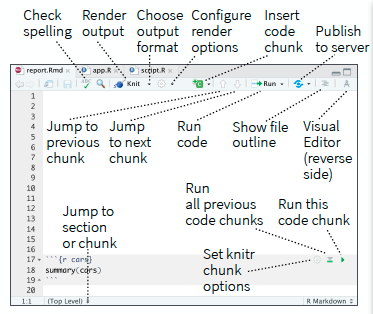

Expand to read about the features in the RStudio Source Pane

### Features within the RStudio Source Pane

-   Check spelling
-   Render output
-   Choose output format
-   Configure render options
-   Insert code chunk
-   Publish to server
-   Jump to previous chunk
-   Jump to next chunk
-   Run code
-   Show file outline
-   Visual Editor (reverse side)
-   Jump to section or chunk
-   Run this and all previous code chunks
-   Run this code chunk
-   Set knitr chunk options

Access markdown guide at **Help \> Markdown Quick Reference**.

See below for more on [Visual Editor](#visual-editor).

## Source Editor

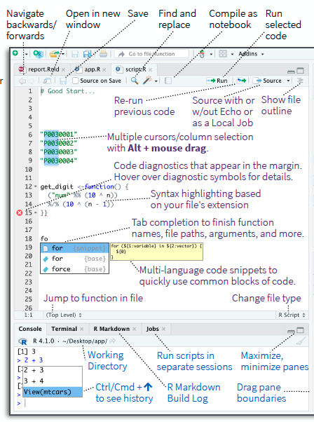

Expand to read about the features in the Source Editor

### Features within the Source Editor

-   Navigate backwards/forwards
-   Open in new window
-   Save
-   Find and replace
-   Compile as notebook
-   Run selected code
-   Re-run previous code
-   Source with or without Echo or as a Local Job
-   Show file outline
-   Multiple cursors/column selection with Alt + mouse drag.
-   Code diagnostics that appear in the margin. Hover over diagnostic symbols for details.
-   Syntax highlighting based on your file's extension
-   Tab completion to finish function names, file paths, arguments, and more.
-   Multi-language code snippets to quickly use common blocks of code.
-   Jump to function in file
-   Change file type
-   Working Directory
-   Run scripts in separate sessions
-   Maximize, minimize panes
-   <kbd>Ctrl/Cmd + ↑</kbd> to see history
-   R Markdown Build Log
-   Drag pane boundaries

## Tab Panes

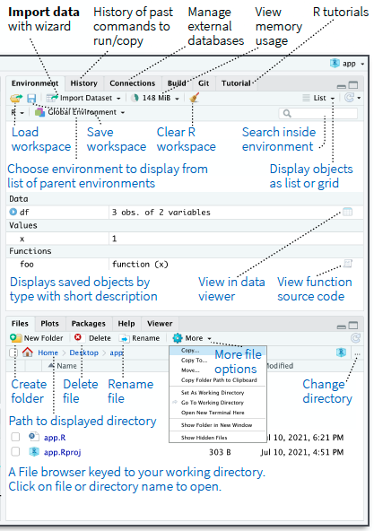

Expand to read about the features in the Tab Panes

### Features within the Tab Panes

-   **Import data** with wizard
-   History of past commands to run/copy
-   Manage external databases
-   View memory usage
-   R tutorials
-   Load workspace
-   Save workspace
-   Clear R workspace
-   Search inside environment
-   Choose environment to display from list of parent environments
-   Display objects as list or grid
-   Displays saved objects by type with short description
-   View in data viewer
-   View function source code
-   Create folder
-   Path to displayed directory
-   Delete file
-   Rename file
-   More file options
-   Change directory
-   A File browser keyed to your working directory. Click on file or directory name to open.

## Version Control

Turn on at **Tools \> Project Options \> Git/SVN**

<ul class="inline">

<li>A - Added</li>

<li>D - Deleted</li>

<li>M - Modified</li>

<li>R - Renamed</li>

<li>?
- Untracked</li>

</ul>

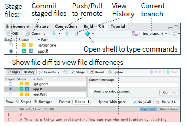

Expand to read about the features in the version control view

### Features within the version control view

-   Stage files
-   Commit staged files
-   Push/Pull to remote
-   View History
-   Current branch
-   Show file diff to view file differences

## Package Development

Create a new package with **File \> New Project \> New Directory \> R Package**

Enable roxygen documentation with **Tools \> Project Options \> Build Tools**

Roxygen guide at **Help \> Roxygen Quick Reference**

See package information in the **Build Tab**

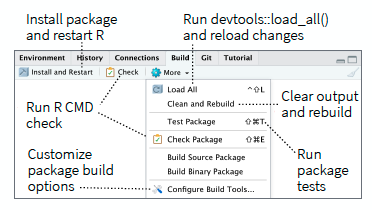

Expand to read about the features in the Build Tab

### Features within the Build Tab

-   Install package and restart R
-   Run devtools::load_all() and reload changes
-   Run R CMD check
-   Clear output and rebuild
-   Customize package build options
-   Run package tests

RStudio opens plots in a dedicated **Plots** pane

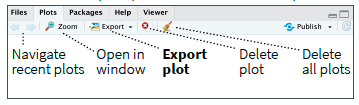

Expand to read about the features in the Plots

### Features within the Plots pane

-   Navigate recent plots
-   Open in window
-   Export plot
-   Delete plot
-   Delete all plots

GUI **Package** manager lists every installed package

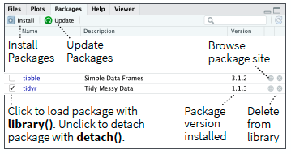

Expand to read about the features in the Package manager

### Features within the Package manager

-   Install Packages
-   Update Packages
-   Browse package site
-   Click to load package with `library()`. Unclick to detach package with `detach()`.
-   Package version installed
-   Delete from library

RStudio opens documentation in a dedicated **Help** pane

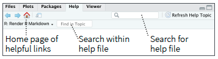

Expand to read about the features in the Help pane

### Features within the Help pane

-   Home page of helpful links
-   Search within help file
-   Search for help file

**Viewer** pane displays HTML content, such as Shiny apps, R Markdown reports, and interactive visualizations

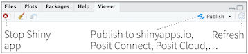

Expand to read about the features in the Viewer pane

### Features within the Viewer pane

-   Stop Shiny apps
-   Publish to shinyapps.io, Posit Connect, Posit Cloud, ...
-   Refresh

`View(<data>)` opens spreadsheet like view of data set

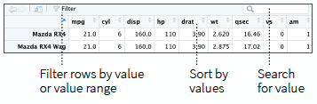

Expand to read about the features in the data set spreadsheet

### Features within the data set spreadsheet

-   Filter rows by value or value range
-   Sort by values
-   Search for value

## Debug Mode

Use `debug()`, `browser()`, or a breakpoint and execute your code to open the debugger mode.

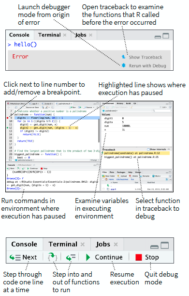

Expand to read about the features in the debug console

### Features within the debug console

-   Launch debugger mode from origin of error
-   Open traceback to examine the functions that R called before the error occurred
-   Click next to line number to add/remove a breakpoint.
-   Highlighted line shows where execution has paused
-   Run commands in environment where execution has paused
-   Examine variables in executing environment
-   Select function in traceback to debug
-   Step through code one line at a time
-   Step into and out of functions to run
-   Resume execution
-   Quit debug mode

## Keyboard Shortcuts

View the Keyboard Shortcut Quick Reference with **Tools \> Keyboard Shortcuts** or <kbd>Alt/Option + Shift + K</kbd>

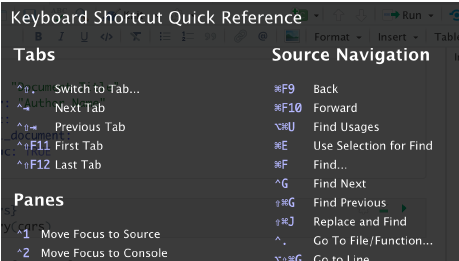

Search for keyboard shortcuts with **Tools \> Show Command Palette** or <kbd>Ctrl/Cmd + Shift + P</kbd>.

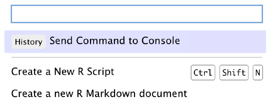

## Visual Editor

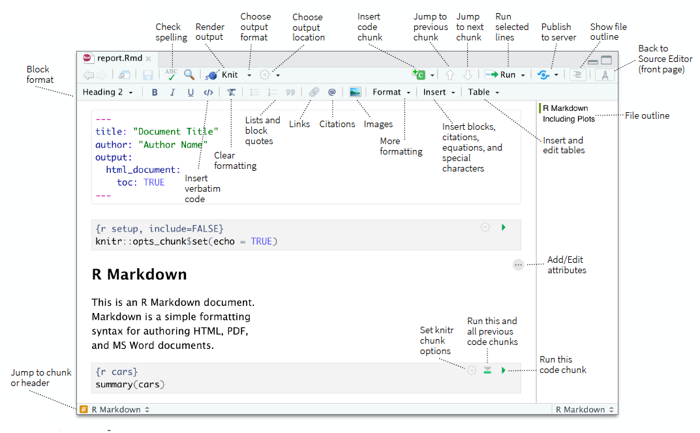

Expand to read about the features in the Visual Editor

### Features within the Visual Editor

-   Check spelling
-   Render output
-   Choose output format
-   Choose output location
-   Insert code chunk
-   Jump to previous chunk
-   Jump to next chunk
-   Run selected lines
-   Publish to server
-   Show file outline
-   Block format
-   Back to Source Editor (front page)
-   Insert verbatim code
-   Clear formatting
-   Lists and block quotes
-   Links
-   Citations
-   Images
-   More formatting
-   Insert blocks, citations, equations, and special characters
-   Insert and edit tables
-   File outline
-   Add/Edit attributes
-   Jump to chunk or header
-   Set knitr chunk options
-   Run this and all previous code chunks
-   Run this code chunk

## Posit Workbench

### Why Posit Workbench?

Extend the open source server with a commercial license, support, and more:

-   open and run multiple R sessions at once
-   tune your resources to improve performance
-   administrative tools for managing user sessions
-   collaborate real-time with others in shared projects
-   switch easily from one version of R to a different version
-   integrate with your authentication, authorization, and audit practices
-   work in the RStudio IDE, JupyterLab, Jupyter Notebooks, or VS Code

Download a free [45 day evaluation](https://posit.co/products/enterprise/workbench/).

## Share Projects

**File \> New Project**

RStudio saves the call history, workspace, and working directory associated with a project.
It reloads each when you re-open a project.

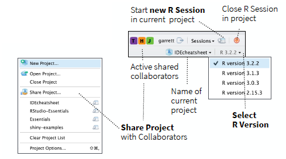

Expand to read about the features in the Share Project

### Features within the Share Project

-   Start **new R Session** in current project
-   Close R Session in project
-   Active shared collaborators
-   Name of current project
-   **Share Project** with Collaborators
-   **Select R Version**

## Run Remote Jobs

Run R on remote clusters (Kubernetes/Slurm) via the Job Launcher

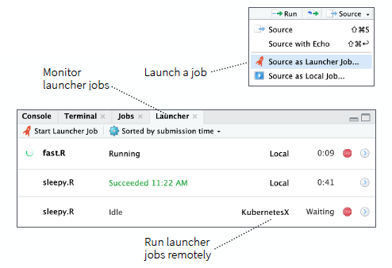

Expand to read about the features in the Job Launcher

### Features within the Job Launcher

-   Launch a job
-   Monitor launcher jobs
-   Run launcher jobs remotely

------------------------------------------------------------------------

CC BY SA Posit Software, PBC • [info\@posit.co](mailto:info@posit.co) • [posit.co](https://posit.co)

Learn more at [docs.posit.co/ide/user](https://docs.posit.co/ide/user/).

Updated: 2026-08.

RStudio IDE 2024.04.1+748.

------------------------------------------------------------------------
